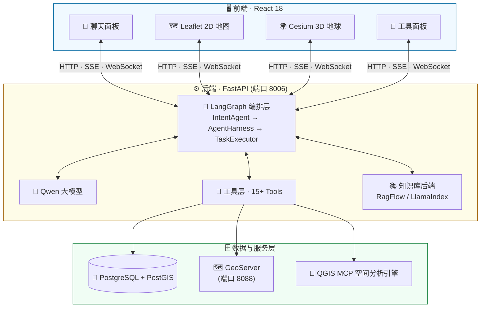
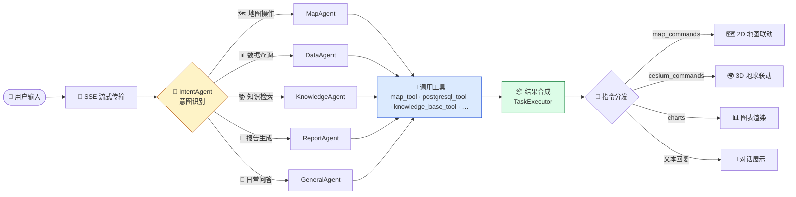

<div align="center">

# 🌊 豫水智能一张图

### Map Assistant v1 · 水利勘测与河道采砂监管 AI 智能地图助手

<p>
  <b>「 对话即操作 」</b> —— 大语言模型 × 空间分析 × 遥感变化检测 × 知识库问答，一句话驱动地图，一张图管好采砂。
</p>

---

[]()
[]()
[]()
[]()
[]()
[]()
[]()
[]()
[]()


</div>

---

## ✨ 核心亮点

| 亮点 | 一句话解释 |
|:----:|------------|
| 🧠 **多 Agent 智能编排** | LangGraph 驱动，自动识别意图、分派任务，还会自动选择合适的工具 |
| 🗣️ **对话即操作** | 说一句"缩放到童庙可采区"，地图自己动，不用手点 |
| 🛰️ **遥感 + AI 识别** | SAM/SAM3 分割模型自动识别河道侵占、双时相影像变化 |
| 📄 **一键出报告** | RTK 测点、无人机影像、监测数据自动汇总，直接生成 Word 监测报告 |
| 📚 **水利专业大脑** | 内置水利标准规范知识库，行业问题随问随答 |
| 🌍 **2D/3D 双引擎** | Leaflet 二维看平面，Cesium 三维看地形，一键切换 |

---

## 🎯 核心能力

| 模块 | 说明 |
|------|------|
| 💬 **智能对话** | 基于 LangGraph 编排的多 Agent 协作，自动识别用户意图并分派到对应执行器 |
| 🗺️ **2D/3D 地图** | Leaflet 二维地图 + Cesium 三维地球，支持矢量图层、高分影像、无人机航飞叠加 |
| 📖 **知识库问答** | 接入水利标准规范、政策文件、采砂管理规程，支持 RagFlow / LlamaIndex 双后端 |
| 📐 **空间分析** | 坐标转换、缓冲区分析、叠加分析、红线/采区空间参考查询（QGIS MCP 集成） |
| 🗃️ **数据库查询** | 直连 PostgreSQL + PostGIS，自然语言转 SQL 查询采砂监测数据 |
| 📄 **采砂报告生成** | 自动整合 RTK 测点、无人机影像、监测数据，一键输出 Word 报告 |
| 🛰️ **遥感变化检测** | 集成 SAM/SAM3 分割模型，支持双时相影像变化识别 |
| 🧩 **切片管理** | MVT 矢量切片、3D Tiles、无人机 MBTiles 的发布与管理 |
| 📊 **图表可视化** | 对话式生成柱状图、饼图、折线图，直观展示监测统计 |

---

## 🏗️ 技术架构



### 关键依赖

- **Python**: FastAPI, LangGraph/LangChain, Qwen-Agent, LlamaIndex, GDAL/rasterio, SAM3
- **前端**: React 18, Leaflet, Cesium, ECharts, Ant Design
- **数据库**: PostgreSQL + PostGIS（业务数据）, SQLite（会话持久化）
- **地图服务**: GeoServer（WMS/WFS）, 自建 MVT/MBTiles 瓦片服务
- **进程管理**: PM2

---

## 🧠 智能体工作流程



---

## 📁 项目结构

```
Smart_Map/
├── backend/                    # 后端服务
│   ├── main.py                 # FastAPI 入口（路由、会话管理、核心 API）
│   ├── prompts.py              # 提示词统一管理（SSoT 单一来源）
│   ├── agents/                 # LangGraph Agent 编排
│   │   ├── agent_harness.py    # 意图路由与 Agent 分派中枢
│   │   ├── task_executor.py    # LangGraph 状态图定义与节点实现
│   │   ├── intent_agent.py     # 意图识别 Agent
│   │   ├── intent_types.py     # 意图/子意图枚举定义
│   │   ├── base_agent.py       # Agent 基类
│   │   ├── tool_registry.py    # 工具注册中心
│   │   └── qgis_workflows.py   # QGIS 分析 recipe 工作流
│   ├── tools/                  # 工具实现层
│   │   ├── map_tool.py         # 2D 地图操作工具
│   │   ├── cesium_tool.py      # 3D Cesium 操作工具
│   │   ├── postgresql_tool.py  # PostgreSQL 查询工具
│   │   ├── spatial_reference_tool.py  # 红线/采区空间参考
│   │   ├── spatial_processing_tool.py # 空间数据处理
│   │   ├── ragflow_knowledge_tool.py  # RagFlow 知识库
│   │   ├── llamaindex_knowledge_tool.py # LlamaIndex 知识库
│   │   ├── report_generator_tool.py  # 报告生成
│   │   ├── data_visualizer_tool.py   # 图表可视化
│   │   ├── sam_predict.py      # SAM 分割预测
│   │   ├── qgis_mcp_tool.py    # QGIS MCP 空间分析
│   │   ├── knowledge_graph_tool.py  # 知识图谱
│   │   ├── tile_publish_tool.py     # 切片发布
│   │   └── ...                 # 更多工具
│   ├── services/tile_manager/  # 切片管理服务
│   ├── config/                 # 配置与快速路由
│   ├── scripts/                # 数据导入/迁移脚本
│   ├── static/                 # 静态资源（报告、截图、GeoJSON，运行时生成）
│   ├── vector_tiles/           # MVT 矢量瓦片（运行时生成）
│   ├── drone_imagery/          # 无人机影像 MBTiles（本地数据）
│   ├── 3dtiles_data/           # 3D Tiles 数据（本地数据）
│   ├── templates/              # Word 报告模板
│   └── .env.template           # 环境变量模板
├── frontend/                   # 前端应用（React + CRA）
│   └── src/
│       ├── App.jsx             # 主入口组件
│       ├── App.css             # 全局样式（玻璃拟态风格）
│       └── components/
│           ├── MapComponent.jsx      # 2D Leaflet 地图
│           ├── CesiumComponent.jsx   # 3D Cesium 地球
│           ├── SAMPanel.jsx          # SAM 遥感识别面板
│           ├── TileManager.jsx       # 切片管理面板
│           ├── KnowledgeBaseManager.jsx  # 知识库管理
│           ├── GisPipeline.jsx       # GIS 处理流水线
│           ├── AnnotationPanel.jsx   # 标注面板
│           └── WorkflowStepper.jsx   # 工作流步骤指示
└── docker/qgis-mcp/            # QGIS MCP Docker 环境
```

> [!NOTE]
> `data/`、`deploy/geoserver_data/`、`大模型规范/`、`资料归档/` 等本地数据与文档目录未纳入版本控制，详见下方【仓库内容说明】。

---

## 📦 仓库内容说明

本仓库仅包含**代码与配置**。为控制体积、保护数据安全，以下内容已通过 `.gitignore` 排除，不会推送到 GitHub：

| 类别 | 目录 | 说明 |
|------|------|------|
| 🛩️ 无人机影像 | `backend/drone_imagery/` | 航飞影像与 MBTiles 瓦片（约 18 GB） |
| 📄 监测报告 | `backend/static/reports/` | 生成的 Word 报告（约 6 GB） |
| 📸 地图截图 | `backend/static/screenshots/` | 地图截图（约 1.3 GB） |
| 🧩 矢量切片 | `backend/vector_tiles/` | MVT 瓦片缓存 |
| 🏛️ 3D Tiles | `backend/3dtiles_data/` | 三维切片数据 |
| 🗂️ 知识库索引 | `backend/llama_index_storage/` | 向量索引与图数据库 |
| 💾 监测数据库 | `backend/data/` | SQLite 标注库、检查点 |
| 📚 规范文档 | `大模型规范/`、`资料归档/` | 水利标准与项目归档资料 |
| 📦 前端依赖 | `frontend/node_modules/`、`frontend/public/cesium/` | npm install 自动生成 |
| 🔐 敏感配置 | `backend/.env`、`frontend/.env` | 含密钥口令，严禁入库 |

> [!TIP]
> 克隆后上述目录均已保留空目录占位，服务可直接启动；数据按需从本机恢复或重新生成。

---

## 🔧 环境要求

| 依赖 | 版本/说明 |
|------|----------|
| 🐍 Python | 3.10+ (推荐 conda 环境 `mapagent6`) |
| 🟩 Node.js | 16+ / npm 8+ |
| 🐘 PostgreSQL | 14+ with PostGIS 扩展 |
| 🗺️ GeoServer | 2.24+ (可选，用于 WMS/WFS 发布) |
| 🧰 GDAL | 3.6+ |
| 🎮 CUDA | 11.8+ (可选，SAM 模型推理需要 GPU) |
| 🐳 Docker | (可选，用于 QGIS MCP 空间分析) |

---

## 🚀 快速启动

### 1️⃣ 克隆与安装

```bash
git clone https://github.com/PotatoH-cmd/Smart_Map.git
cd Smart_Map
```

### 2️⃣ 后端配置

复制环境变量模板并填写实际配置：

```bash
cp backend/.env.template backend/.env
```

编辑 `backend/.env`，关键配置项：

```env
# 服务端口
PORT=8006

# GeoServer 连接（可选）
GEOSERVER_URL=http://127.0.0.1:8088/geoserver
GEOSERVER_USER=admin
GEOSERVER_PASSWORD=your_password

# PostgreSQL 连接
GEOSERVER_PG_HOST=your_pg_host
GEOSERVER_PG_PORT=5432
GEOSERVER_PG_DB=postgres
GEOSERVER_PG_USER=postgres
GEOSERVER_PG_PASSWORD=your_password

# 知识库后端（ragflow 或 llamaindex）
KNOWLEDGE_BACKEND=ragflow

# LlamaIndex 配置（仅 KNOWLEDGE_BACKEND=llamaindex 时生效）
LLAMAINDEX_PERSIST_DIR=./llama_index_storage
LLAMAINDEX_EMBED_MODEL=text-embedding-v3
```

### 3️⃣ 安装 Python 依赖

```bash
# 激活 conda 环境
conda activate mapagent6

# 安装依赖
cd backend
pip install -r requirements.txt
```

### 4️⃣ 启动后端

**方式一：直接启动**
```bash
cd backend
./start.sh          # 默认 GPU 0, 端口 8006
./start.sh 1 8007   # 指定 GPU 1, 端口 8007
```

**方式二：Python 直接启动**
```bash
cd backend
CUDA_VISIBLE_DEVICES=0 python main.py
```

> [!TIP]
> 后端启动后访问 `http://localhost:8006/docs` 查看 API 文档。

### 5️⃣ 前端配置

```bash
cd frontend
# 仓库未提供 .env.example，请参照下方示例手动创建 .env
```

编辑 `frontend/.env`：
```env
PORT=3003
BROWSER=none
REACT_APP_CESIUM_ION_TOKEN=your_cesium_token   # Cesium 3D 地形（可选）
REACT_APP_TIANDITU_TOKEN=your_tianditu_token   # 天地图底图（可选）
```

### 6️⃣ 安装前端依赖并启动

```bash
cd frontend
npm install
npm start           # 开发模式启动，默认端口 3003
```

> [!TIP]
> 前端启动后访问 `http://localhost:3003`

---

## 🛠️ PM2 生产部署

项目已配置 PM2 进程管理，支持后端和前端同时托管：

```bash
# 安装 PM2（如未安装）
npm install -g pm2

# 启动全部服务
cd backend
pm2 start ecosystem.config.js

# 查看运行状态
pm2 status

# 查看日志
pm2 logs map-assistant-backend
pm2 logs map-assistant-frontend

# 重启服务
pm2 restart map-assistant-backend
pm2 restart map-assistant-frontend

# 停止服务
pm2 stop all
```

PM2 配置说明：
- **map-assistant-backend**: Python FastAPI 服务，端口 8006，GPU 1
- **map-assistant-frontend**: React 开发服务器，端口 3004，API 代理至后端

---

## 🔌 主要 API 端点

| 端点 | 方法 | 说明 |
|------|------|------|
| `/chat/stream` | POST | 核心对话接口（SSE 流式响应） |
| `/chat/map_screenshot` | POST | 地图截图上传 |
| `/sessions` | GET/POST | 会话管理 |
| `/gis/*` | POST | GIS 处理工具（坐标转换、矢量生成等） |
| `/tiles/*` | GET/POST | 切片管理与发布 |
| `/ws/cesium` | WebSocket | Cesium 3D 实时通信 |
| `/static/*` | GET | 静态资源（报告/截图/GeoJSON） |
| `/api/geoserver/*` | ALL | GeoServer REST 代理 |

---

## 📚 知识库管理

系统支持两种知识库后端，通过 `KNOWLEDGE_BACKEND` 环境变量切换：

- **RagFlow**（默认）：远程知识库服务，支持文档解析、向量检索、重排序
- **LlamaIndex**：本地知识库框架，支持 Kuzu 图数据库知识图谱，DashScope Embedding

知识库数据导入脚本位于 `backend/scripts/`：
```bash
cd backend/scripts
python ingest_caisha_md.py         # 导入采砂规范文档
python ingest_jiance_md.py         # 导入监测规范文档
python migrate_kb_to_llamaindex.py # 从 RagFlow 迁移到 LlamaIndex
```

---

## 🧩 开发指南

### 添加新工具

1. 在 `backend/tools/` 下创建工具类，继承 `qwen_agent.tools.base.BaseTool`
2. 在 `backend/agents/tool_registry.py` 中注册
3. 在 `backend/agents/intent_types.py` 中定义意图类型（如需要）
4. 在 `backend/agents/agent_harness.py` 的 `FAST_ROUTE_KEYWORDS` 中添加快速路由（可选）

### 添加新 Agent

1. 在 `backend/agents/` 下创建 Agent 类，继承 `BaseAgent`
2. 在 `AgentHarness._dispatch()` 中添加分派逻辑
3. 在 `TaskExecutor` 的 LangGraph 图中添加对应节点

### 提示词管理

> [!IMPORTANT]
> 所有提示词统一在 `backend/prompts.py` 中维护，遵循单一来源原则（SSoT），禁止在其他位置内联重复的提示词文本。

---

## ❓ 常见问题

<details>
<summary>🔌 端口占用怎么办？</summary>

```bash
# 查看端口占用
ss -ltnp | grep 8006
# 手动清理（如 PM2 停止失败）
fuser -k 8006/tcp
```
</details>

<details>
<summary>🎮 CUDA 不可用？</summary>

```bash
# 确认 CUDA 设备可见
python -c "import torch; print(torch.cuda.is_available())"
# 如不可用，检查环境变量
export CUDA_VISIBLE_DEVICES=0
```
</details>

<details>
<summary>🗺️ PROJ_LIB 路径错误？</summary>

```bash
# GDAL/rasterio 需要正确的 PROJ 数据路径
export PROJ_LIB=/home/server/miniconda3/envs/mapagent6/share/proj
```
</details>

<details>
<summary>💾 CIFS 挂载失效？</summary>

遥感影像数据通过 CIFS 挂载访问，如出现读取失败：
```bash
sudo umount -l /mnt/arcgisorgdata && sudo mount -a
```
</details>

---

## 📖 相关文档

- [Harness 架构说明](backend/agents/Harness架构说明.md)
- [LangGraph 节点状态说明](backend/agents/LangGraph节点状态说明.md)
- [QGIS Recipe 开发指南](docs/QGIS_Recipe开发指南.md)
- [LlamaIndex 技术方案](backend/LlamaIndex技术方案.md)
- [无人机影像发布注意事项](backend/scripts/无人机影像发布注意事项.md)

---

<div align="center">

### 🌊 豫水智能一张图 · 让监管更智慧

**对话即操作 · 数据即洞察 · 地图即大脑**

Made with ❤️ · 豫水智能一张图团队

</div>
