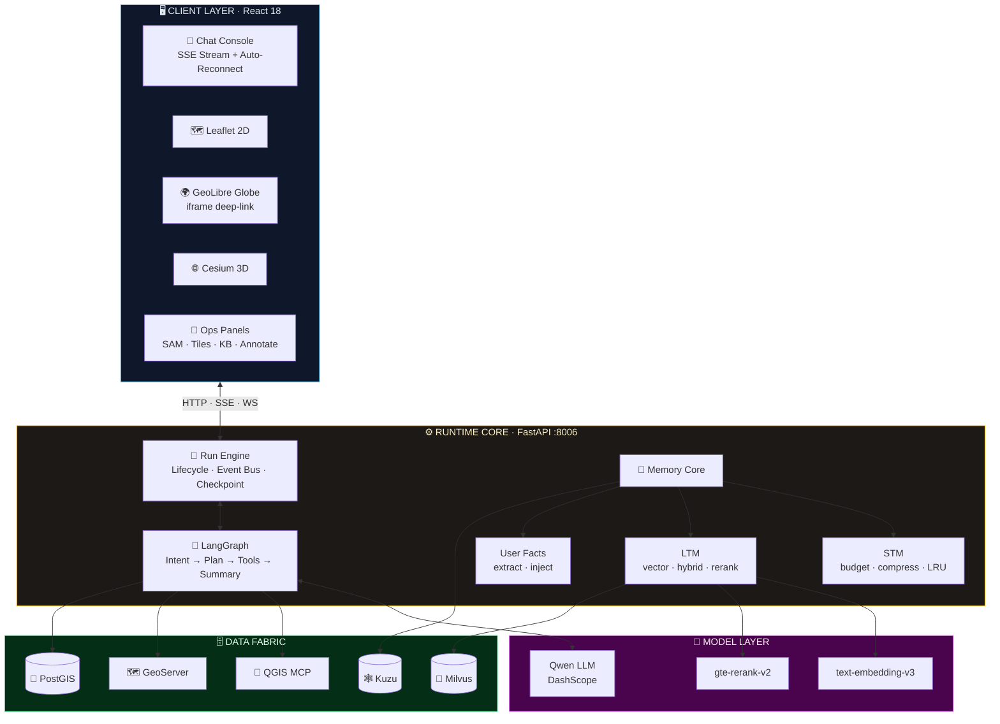
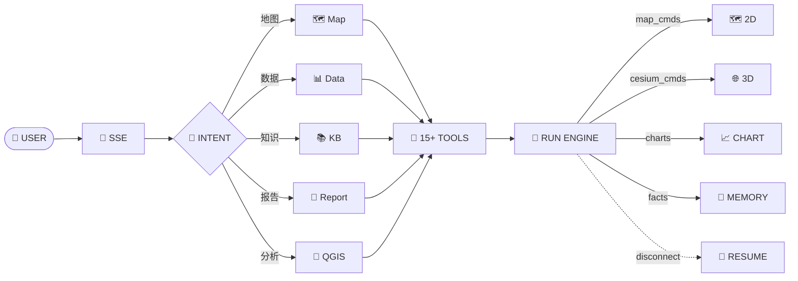

<div align="center">

<br>

```text
  ███████╗██╗    ██╗███████╗███████╗    ███████╗██╗     ██████╗
  ██╔════╝██║    ██║██╔════╝██╔════╝    ██╔════╝██║    ██╔════╝
  ███████╗██║ █╗ ██║█████╗  █████╗      █████╗  ██║    ██║  ███╗
  ╚════██║██║███╗██║██╔══╝  ██╔══╝      ██╔══╝  ██║    ██║   ██║
  ███████║╚███╔███╔╝██║     ███████╗    ██║     ███████╗╚██████╔╝
  ╚══════╝ ╚══╝╚══╝ ╚═╝     ╚══════╝    ╚═╝     ╚══════╝ ╚═════╝
                    · 会思考的空间智能操作系统 ·
```

<h3>GIS · LLM AGENT · SPATIAL INTELLIGENCE RUNTIME</h3>

**⟪ 一句话，驱动一张图。一个意图，调度整个空间计算集群。⟫**

```text
> initializing Smart Map Runtime ...
> mounting spatial engines        [ Leaflet · Cesium · GeoLibre ]  ✓ OK
> loading agent orchestration     [ LangGraph · 15+ Tools ]        ✓ OK
> hybrid retrieval pipeline       [ Milvus · BM25 · Rerank ]      ✓ OK
> memory system                   [ Short-term · Long-term · Facts ] ✓ OK
> all systems nominal. awaiting your command._
```

<br>

[]()
[]()
[]()
[]()
[]()
[]()
[]()
[]()
[]()


<br>

**`对话即操作` · `记忆即成长` · `三引擎同屏` · `断线自愈` · `越用越懂你`**

</div>

<br>

---

## ⚡ MISSION // 它解决什么问题

传统 GIS 工作流的痛点：**菜单地狱、命令行门槛、数据孤岛、重复劳动。**

Smart Map 把整个空间计算栈压进一句自然语言：

```text
┌─ INPUT ──────────────────────────────────────────────────────┐
│ "加载北汝河采区2023年高分影像，叠加河道红线，切三维看实景"     │
└──────────────────────────────┬───────────────────────────────┘
                               ▼
┌─ RUNTIME ────────────────────────────────────────────────────┐
│ ▸ intent.decode()      意图解码      → map_operation          │
│ ▸ planner.build()      计划编排      → 4 steps                │
│ ▸ tools.dispatch()     工具调度      → map_tool               │
│ ▸ engines.sync()       引擎联动      → 2D → GeoLibre          │
│ ▸ memory.commit()      记忆提交      → facts.extracted        │
└──────────────────────────────┬───────────────────────────────┘
                               ▼
┌─ OUTPUT ─────────────────────────────────────────────────────┐
│ 🗺️ 影像上图 ✓  红线叠加 ✓  3D贴地 ✓  报告就绪 ✓              │
│ 💬 "已加载 2023 年高分影像与河道红线，实景三维已就绪。"        │
└──────────────────────────────────────────────────────────────┘
```

**交互成本：一句话。执行深度：全栈。**

---

## 🧬 SYSTEM CORE // 核心子系统

| # | 子系统 | 能力 | 技术底座 |
|:-:|:---|:---|:---|
| 01 | 🧠 **Memory Core** | 三层记忆架构：会话内预算压缩 × 跨会话向量知识 × 用户事实抽取 | SQLite · Milvus · LLM Extractor |
| 02 | 🎯 **Retrieval Grid** | 双通道混合检索：语义向量 + BM25 关键词 → RRF 融合 → Rerank 精排 | Milvus · jieba · gte-rerank-v2 |
| 03 | 🌍 **Tri-Engine** | 三地图引擎同屏联动，深链接动态注入图层 | Leaflet · Cesium · GeoLibre |
| 04 | 🚦 **Run Engine** | Run 全生命周期状态机：事件流 seq 补拉 · 检查点恢复 · 断线自愈 | SSE · SQLite WAL |
| 05 | 🛰️ **Vision AI** | 遥感分割 + 双时相变化检测，河道侵占自动预警 | SAM / SAM3 · PyTorch |
| 06 | 🧪 **Spatial Compute** | 大模型直驱 QGIS 分析引擎，开口即算 | QGIS MCP · Docker |
| 07 | 📄 **Report Forge** | 多源数据融合 → Word 报告自动成文 | RTK · 航飞 · 监测数据 |
| 08 | 🛡️ **Self-Healing** | 全链路降级 + 每日备份 + 三级灾备 | PM2 · cron · LRU |

---

## 🏗️ ARCHITECTURE // 系统架构



---

## 🧠 MEMORY CORE // 记忆系统（核心竞争力）

### LAYER 1 · 短期记忆 — 会话内

```text
context_budget = {
  history:   "最近 8 轮 × 160 字/条"        # env 可调
  tools:     "4000 字 · 优先级裁剪"          # error > db > knowledge > other
  compress:  ">12 轮 → LLM 滚动摘要 · 60s 去抖"
  gc:        "MemorySaver LRU(200) · Run TTL(7d)"
}
```

| 机制 | 策略 |
|------|------|
| 持久化 | SQLite WAL · 失败轮次也落库 · 历史永不断档 |
| 压缩 | LLM 异步摘要写入 `workspace.last_summary` |
| 内存治理 | LRU 淘汰 + TTL 清理，7×24 零泄漏 |

### LAYER 2 · 长期记忆 — 知识库

```text
           ┌─ ① vector recall ── Milvus ──── top12 ─┐
 query ───>│                                        ├──> RRF(k=60) ──> rerank ──> top_k
           └─ ② keyword recall ─ BM25(jieba) ─ top12┘                    gte-rerank-v2
```

| 机制 | 策略 |
|------|------|
| 向量后端 | Milvus 默认 · 自动回退 SimpleVectorStore |
| 增量更新 | content_hash 去重 · 同名替换 · persist 防抖 |
| 降级链 | Milvus→Simple · BM25→纯向量 · LlamaIndex→RagFlow |

### LAYER 3 · 用户事实记忆 — 越用越懂你 💎

```text
run completed ──fire-and-forget──> LLM.extract(facts)
                                     │
                                     ▼
                              user_facts 表 (≤200 条, LRU)
                                     │
next session ──────────inject───────┘
                                     ▼
                    IntentAgent prompt + 500 字记忆段
```

> 每轮对话收尾后，LLM 自动抽取稳定事实（偏好/常用区域/数据习惯），
> 下次对话自动注入意图分析。**它记得你。**

```bash
curl http://localhost:8006/api/memory/facts            # inspect memory
curl -X DELETE http://localhost:8006/api/memory/facts/{id}   # manage memory
```

---

## 🌍 TRI-ENGINE // 三地图引擎

| 引擎 | 定位 | 关键能力 |
|:---:|:---|:---|
| 🗺️ **Leaflet** | 2D TACTICAL | 高分影像 · 红线 · 采区边界 · 测深数据，一句话上图 |
| 🌐 **Cesium** | 3D TERRAIN | 地形渲染 · 3D Tiles · WebSocket 实时联动 |
| 🌍 **GeoLibre** | REALITY GLOBE | iframe 深链接 · 动态项目注入 · 3D Tiles 自动贴地 `altitudeOffset` |

> 💡 2D 地图左上角一键唤出 GeoLibre 地球——高分影像、红线、采区边界、实景三维**同屏联动**。

---

## 🤖 AGENT PIPELINE // 智能体工作流



---

## 📁 REPO TREE // 项目结构

```text
Smart_Map/
├── backend/
│   ├── main.py                        # FastAPI 入口 · SSE · Run 生命周期
│   ├── prompts.py                     # 提示词 SSoT
│   ├── agents/
│   │   ├── task_executor.py           #   LangGraph 状态图
│   │   ├── intent_agent.py            #   意图识别 + 事实注入
│   │   ├── run_engine.py              #   Run 状态机 · 断线恢复
│   │   ├── run_store.py               #   三表持久化 · TTL
│   │   ├── context_manager.py         #   上下文预算 · 压缩
│   │   ├── fact_memory.py             # 💎 用户事实记忆
│   │   └── agent_harness.py           #   分派中枢
│   ├── tools/
│   │   ├── llamaindex_knowledge_tool.py   # 混合检索 RAG
│   │   ├── map_tool.py · cesium_tool.py   # 双引擎操作
│   │   ├── qgis_mcp_tool.py               # 空间分析
│   │   ├── sam_predict.py                 # 遥感分割
│   │   └── report_generator_tool.py       # 报告生成
│   ├── scripts/
│   │   ├── backup_memory.sh           #   每日备份
│   │   ├── kb_rebuild.py              #   三级灾备
│   │   └── ingest_*.py                #   数据导入
│   └── static/geolibre_projects/      # GeoLibre 动态项目
├── frontend/src/
│   ├── App.jsx                        # 主入口
│   └── components/                    # Map · Cesium · SAM · KB ...
├── deploy/                            # nginx · GeoServer
└── docker/qgis-mcp/                   # QGIS MCP 容器
```

---

## 🚀 DEPLOY // 快速启动

### REQUIREMENTS

| 依赖 | 版本 |
|:---|:---|
| Python | `3.10+` |
| Node.js | `16+` |
| PostgreSQL + PostGIS | `14+` |
| GDAL | `3.6+` |
| Milvus / GeoServer / Docker | optional |

### BOOT SEQUENCE

```bash
# 01 // clone
git clone https://github.com/PotatoH-cmd/Smart_Map.git && cd Smart_Map

# 02 // backend env
cp backend/.env.template backend/.env      # 填入 DASHSCOPE_API_KEY
conda create -n mapagent6 python=3.10 -y && conda activate mapagent6
cd backend && pip install -r requirements.txt

# 03 // launch backend (:8006)
python main.py                             # or ./start.sh [gpu] [port]

# 04 // launch frontend (:3004)
cd ../frontend && npm install && npm start

# 05 // open
open http://localhost:3004                 # start commanding_
```

<details>
<summary>⚙️ ENV VARS // 环境变量速查</summary>

```env
# backend/.env
PORT=8006
DASHSCOPE_API_KEY=sk-xxx          # LLM · Embedding · Rerank
KNOWLEDGE_BACKEND=llamaindex      # llamaindex | ragflow
KB_VECTOR_BACKEND=milvus          # milvus(default) | simple
KB_RERANK=1                       # hybrid rerank switch
MILVUS_URI=http://127.0.0.1:19530
MAPASSIST_DB_PATH=./sessions.db   # sessions · runs · facts
FACT_MEMORY_ENABLED=1             # user fact memory
CONTEXT_HISTORY_TURNS=8           # STM budget
GEOSERVER_URL=http://127.0.0.1:8088/geoserver

# frontend/.env
PORT=3004
REACT_APP_CESIUM_ION_TOKEN=xxx
REACT_APP_TIANDITU_TOKEN=xxx
```
</details>

<details>
<summary>🏭 PM2 // 生产部署</summary>

```bash
npm install -g pm2
cd backend && pm2 start ecosystem.config.js
pm2 status && pm2 logs map-assistant-backend
```
</details>

---

## 🔌 API ENDPOINTS

| 端点 | 说明 |
|:---|:---|
| `POST /chat/stream` | 核心对话 · SSE 流式 · 断线可恢复 |
| `GET /api/memory/facts` | 用户事实记忆管理 |
| `GET /api/geolibre/project` | GeoLibre 动态图层注入 |
| `POST /gis/*` · `POST /tiles/*` | GIS 工具 · 切片发布 |
| `WS /ws/cesium` | Cesium 实时联动 |
| `/docs` | 完整 API 文档 |

---

## 🛡️ RELIABILITY // 生产可靠性

```text
✅ DAILY BACKUP      sessions.db + vector + graph（轮转保留）
✅ 3-TIER RECOVERY   backup → RagFlow rebuild → empty-usable
✅ MEMORY GOVERNANCE LRU eviction · zero-leak · 24/7
✅ DATA GOVERNANCE   Run TTL 7d · failed-turn persist · WAL
✅ GRACEFUL DEGRADE  Milvus→Simple · BM25→Vector · LI→RagFlow
```

---

## 🗺️ ROADMAP

- [x] 短期记忆加固（预算 / 压缩 / LRU / TTL）
- [x] Milvus + BM25 + Rerank 混合检索
- [x] 用户事实记忆（抽取 / 注入 / 管理）
- [x] GeoLibre 三维工作台
- [x] Run 断线重连与检查点恢复
- [ ] Kuzu 知识图谱摄取管线
- [ ] 多用户体系与事实隔离
- [ ] 语音交互 · 移动端

---

## 🤝 CONTRIBUTE

欢迎 Issue / PR。

<details>
<summary>🧩 DEV GUIDE // 开发指南</summary>

**添加工具：**
1. `backend/tools/` 继承 `qwen_agent.tools.base.BaseTool`
2. `backend/agents/tool_registry.py` 注册
3. `backend/agents/agent_harness.py` 快速路由关键词（可选）

**添加 Agent：** 继承 `BaseAgent` → `_dispatch()` 分派 → LangGraph 加节点

> ⚠️ 提示词统一维护于 `backend/prompts.py`（SSoT 原则）
</details>

---

## 📖 DEEP DOCS // 深入文档

- [Harness 架构说明](backend/agents/Harness架构说明.md)
- [LangGraph 节点状态说明](backend/agents/LangGraph节点状态说明.md)
- [QGIS Recipe 开发指南](docs/QGIS_Recipe开发指南.md)
- [LlamaIndex 技术方案](backend/LlamaIndex技术方案.md)

---

> [!IMPORTANT]
> 本仓库仅含**代码与配置**。影像瓦片、报告、数据库等 30GB+ 数据均已 `.gitignore` 排除；`.env` 含密钥严禁入库。

---

<div align="center">

```text
   · · · · · · · · · · · · · · · · · · · · · · · · · · · · · ·
    SMART MAP // 让每一条河流都有数字大脑
    一句话驱动一张图 · 一次交互调度一个集群
   · · · · · · · · · · · · · · · · · · · · · · · · · · · · · ·
```

⭐ **Star 是最好的燃料**

</div>
