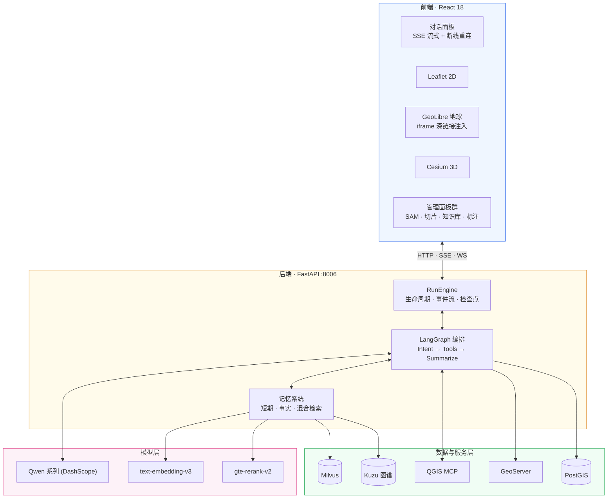
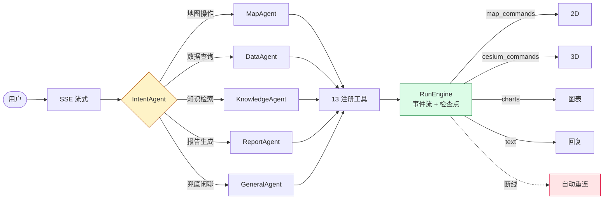

<div align="center">

# 🌊 Smart Map

**豫水智能一张图 · 会思考的 GIS 智能体**

一句话，驱动一张图。一个意图，调度整个空间计算集群。

*LLM Agent × 多引擎地图 × 混合检索 RAG × 长短期记忆 × 遥感 AI*

[]()
[]()
[]()
[]()
[]()
[]()
[]()
[]()


对话即操作 · 越用越懂你 · 三引擎同屏 · 报告一键生成

</div>

**目录**

1. [它能做什么？](#它能做什么)
2. [核心亮点](#核心亮点)
3. [系统架构](#系统架构)
4. [记忆系统](#记忆系统)
5. [三地图引擎](#三地图引擎)
6. [智能体工作流与工具](#智能体工作流与工具)
7. [项目结构](#项目结构)
8. [快速开始](#快速开始)
9. [FAQ](#faq)
10. [API 一览](#api-一览)

---

## 🎬 它能做什么？

传统 GIS 的菜单地狱、命令行门槛、数据孤岛，在这里被压缩成一句自然语言。你说：

> “加载北汝河采区的高分影像，叠加河道红线，再切到三维看看实景”

系统自动完成意图识别、计划编排、工具调度与引擎联动：

```text
👤 你 ──▶ 🤖 Smart Map
              ┌──────────────────────────┐
              │  意图识别    ✅            │
              │  执行计划    4 步          │
              │  工具调度    map_tool      │
              │  引擎联动    2D → GeoLibre │
              │  结果合成    ✅            │
              └──────────────────────────┘
              ──▶ 影像上图 · 红线叠加 · 3D 贴地 · 文字回复
```

更多典型场景：

| 场景 | 你说 | 系统做 |
|------|------|--------|
| 图层调度 | 把 2026 年采区边界和测深数据加到地图上 | 意图解码 → 计划编排 → 多图层批量上图 |
| 数据问答 | 种子场可采区去年采了多少方？ | PostGIS 查询 → 图表渲染 → 结论解读 |
| 政策检索 | 采砂现场监管有什么要求？ | 混合检索 RAG → 精排 → 带出处回答 |
| 空间分析 | 红线外 500 米缓冲区里有哪些采区？ | QGIS MCP 直驱 → 缓冲叠加 → 结果上图 |
| 遥感监测 | 对比这两期影像，河道有什么变化？ | SAM 分割 → 双时相差异 → 侵占预警 |
| 报告生成 | 出一份本月监测报告 | 多源数据融合 → Word 自动成文 |

---

## ✨ 核心亮点

- **三层记忆智能体** — 短期上下文预算 + 长期向量知识 + 用户事实抽取，对话有上下文，跨会话有积累。
- **混合检索 RAG** — Milvus 向量召回 + BM25(jieba) 关键词召回，RRF 融合后 gte-rerank-v2 精排，中文召回质量拉满。
- **三地图引擎** — Leaflet 2D、Cesium 3D、GeoLibre 实景地球同屏联动，深链接动态注入图层。
- **遥感 AI** — SAM/SAM3 分割，双时相影像变化检测，河道侵占自动识别。
- **QGIS MCP** — 大模型直驱 QGIS 空间分析引擎，缓冲区/叠加/裁剪开口即算。
- **一键报告** — RTK 测点 + 无人机影像 + 监测数据，Word 报告自动成文。
- **断线自愈** — Run 生命周期持久化，SSE 断线重连 + 事件流补拉 + 检查点恢复。
- **生产就绪** — PM2 托管、每日备份、TTL 清理、内存淘汰，7×24 稳定运行。

---

## 🏗️ 系统架构

四层结构：前端多引擎客户端、后端 Agent 运行时、模型层、数据与服务层。



---

## 🧠 记忆系统

记忆是本项目的核心竞争力，分三层：会话内短期记忆、跨会话知识库、用户事实记忆。

**短期记忆（会话内）** — 控制上下文质量，防止历史膨胀：

- 对话历史 SQLite 持久化，失败轮次也落库，历史永不断档；
- 上下文预算：最近 8 轮 × 160 字/条（env 可调）；
- 工具结果 4000 字预算，按优先级裁剪：错误 > DB 数据 > 知识库 > 其余；
- 超 12 轮触发 LLM 滚动摘要压缩，60s 去抖防重；
- MemorySaver 200 线程上限 LRU 淘汰，Run 数据 7 天 TTL，零泄漏。

**长期记忆（知识库）** — 双路召回 + 融合 + 精排：

```text
查询 ──▶ ① 向量召回 (Milvus, top12) ──┐
       ② BM25 召回 (jieba, top12) ──┼──▶ RRF 融合 (k=60) ──▶ gte-rerank-v2 ──▶ top_k
```

- 向量后端默认 Milvus，不可用自动回退 SimpleVectorStore；
- 增量更新：content_hash 内容去重、同名替换、persist 防抖；
- 全链路降级：Milvus→Simple、BM25→纯向量、LlamaIndex→RagFlow；
- 容灾：每日备份 + kb_rebuild 三级恢复（备份 → RagFlow 重建 → 空库可用）。

**用户事实记忆** — 越用越懂你。会话成功收尾后，LLM 自动从对话中抽取稳定事实（偏好、常用区域、数据习惯）存入 `user_facts` 表，下次对话自动注入意图分析。

```bash
curl http://localhost:8006/api/memory/facts                 # 查看所有记忆
curl -X DELETE http://localhost:8006/api/memory/facts/{id}  # 删除某条
```

---

## 🗺️ 三地图引擎

2D 地图左上角一键唤出 GeoLibre 地球，2023 高分影像、河道红线、2026 采区边界、北汝河实景三维同屏联动。

| 引擎 | 定位 | 关键能力 |
|------|------|----------|
| Leaflet | 2D 平面图 | 高分影像 / 河道红线 / 采区边界 / 测深数据，一句话全上图 |
| Cesium | 3D 数字地球 | 地形渲染 · 3D Tiles · WebSocket 实时联动 |
| GeoLibre | 实景三维工作台 | iframe 嵌入 · 深链接动态注入项目 · 3D Tiles 自动贴地 |

---

## 🤖 智能体工作流与工具

IntentAgent 识别意图后分派到专职 Agent，Agent 调用注册工具，RunEngine 统一产出事件流并支持断线恢复。



13 个注册工具覆盖全链路：

| 类别 | 工具 |
|------|------|
| 地图 | `map_tool` 图层加载/视角飞行 · `coordinate_marker` 打点 · `location_search` 定位 · `cesium_tool` 3D 调度 |
| 数据 | `postgresql_tool` / `mcp_postgres_tool` PostGIS 查询 · `data_visualizer_tool` 图表渲染 |
| 知识 | `knowledge_base_tool` LlamaIndex 混合检索（RagFlow 可切换） |
| 分析 | `qgis_mcp_tool` QGIS 空间分析 · `spatial_processing_tool` 矢量处理 · `spatial_reference_tool` 坐标转换 |
| 报告 | `report_generator_tool` Word 报告 · `caisha_report_tool` 采砂成果报告 |
| 遥感 | SAM 分割模块 · 双时相变化检测（面板直调） |

---

## 📁 项目结构

```text
Smart_Map/
├── backend/
│   ├── main.py                    # FastAPI 入口 · SSE · Run 生命周期
│   ├── prompts.py                 # 提示词 SSoT 单一来源
│   ├── agents/
│   │   ├── task_executor.py       # LangGraph 状态图
│   │   ├── intent_agent.py        # 意图识别（+事实记忆注入）
│   │   ├── run_engine.py          # Run 生命周期 · 断线恢复
│   │   ├── run_store.py           # 三表持久化 · TTL 清理
│   │   ├── context_manager.py     # 上下文预算 · 滚动压缩
│   │   ├── fact_memory.py         # 用户事实记忆
│   │   └── agent_harness.py       # Agent 分派中枢
│   ├── tools/                     # 13 注册工具（见上表）
│   ├── scripts/
│   │   ├── backup_memory.sh       # 每日备份（DB+向量+图谱）
│   │   ├── kb_rebuild.py          # 知识库三级恢复
│   │   └── ingest_*.py            # 数据导入
│   └── static/geolibre_projects/  # GeoLibre 动态项目配置
├── frontend/src/
│   ├── App.jsx                    # 主入口
│   └── components/                # Map · Cesium · SAM · 知识库面板
├── deploy/                        # nginx · GeoServer 编排
└── docker/qgis-mcp/               # QGIS MCP 容器
```

---

## 🚀 快速开始

环境要求：Python 3.10+、Node 16+、PostgreSQL+PostGIS 14+、GDAL 3.6+；Milvus / GeoServer / Docker 可选。

```bash
# 1. 克隆
git clone https://github.com/PotatoH-cmd/Smart_Map.git && cd Smart_Map

# 2. 后端环境
cp backend/.env.template backend/.env   # 填入 DASHSCOPE_API_KEY 等
conda create -n mapagent6 python=3.10 && conda activate mapagent6
cd backend && pip install -r requirements.txt

# 3. 启动后端 (:8006)
python main.py                # 或 ./start.sh [gpu] [port]

# 4. 启动前端 (:3004)
cd ../frontend && npm install && npm start

# 5. 打开 http://localhost:3004 开始对话
```

<details>
<summary>环境变量速查</summary>

```env
# backend/.env
PORT=8006
DASHSCOPE_API_KEY=sk-xxx            # 必填：LLM/Embedding/Rerank
KNOWLEDGE_BACKEND=llamaindex        # llamaindex | ragflow
KB_VECTOR_BACKEND=milvus            # milvus(默认) | simple
KB_RERANK=1                         # 混合检索精排开关
MILVUS_URI=http://127.0.0.1:19530
MAPASSIST_DB_PATH=./sessions.db     # 会话/Run/事实记忆
FACT_MEMORY_ENABLED=1               # 用户事实记忆开关
CONTEXT_HISTORY_TURNS=8             # 短期记忆预算
GEOSERVER_URL=http://127.0.0.1:8088/geoserver

# frontend/.env
PORT=3004
REACT_APP_CESIUM_ION_TOKEN=xxx      # 可选
REACT_APP_TIANDITU_TOKEN=xxx        # 可选
```
</details>

<details>
<summary>PM2 生产部署</summary>

```bash
npm install -g pm2
cd backend && pm2 start ecosystem.config.js
pm2 status && pm2 logs map-assistant-backend
```
</details>

---

## ❓ FAQ

<details>
<summary>没有 DASHSCOPE_API_KEY 能跑吗？</summary>

不能。LLM 意图识别、Embedding、Rerank 全部走 DashScope，在 `backend/.env` 填入后即可，其余组件均有降级链。
</details>

<details>
<summary>没装 Milvus 会怎样？</summary>

自动回退 SimpleVectorStore（本地 JSON 向量库），功能完整，仅大规模检索性能略低；BM25/Rerank 失败同样静默降级为纯向量。
</details>

<details>
<summary>GeoLibre 地球打不开？</summary>

GeoLibre 需独立部署（nginx 托管，默认 :8090），后端通过 `/api/geolibre/project` 动态注入图层；确认 `deploy/` 下 nginx 配置已启用且 CORS 放开。
</details>

<details>
<summary>QGIS MCP 是必须的吗？</summary>

可选。未部署时空间分析类意图降级为数据查询 + 地图展示，其余功能不受影响。
</details>

<details>
<summary>数据丢了怎么恢复？</summary>

`backend/scripts/kb_rebuild.py` 三级恢复：本地每日备份 → RagFlow 重建 → 空库可用；sessions.db 同样在每日备份轮转中。
</details>

---

## 🔌 API 一览

| 端点 | 说明 |
|------|------|
| `POST /chat/stream` | 核心对话（SSE 流式 · 断线可恢复） |
| `GET /api/memory/facts` | 用户事实记忆管理 |
| `GET /api/geolibre/project` | GeoLibre 动态图层注入 |
| `POST /gis/*` | GIS 工具（坐标/矢量/分析） |
| `POST /tiles/*` | 切片发布管理 |
| `WS /ws/cesium` | Cesium 实时联动 |
| `/docs` | 完整 API 文档 |

**生产可靠性**

```text
每日自动备份    sessions.db + 向量库 + 知识图谱（轮转保留）
三级灾备恢复    本地备份 → RagFlow 重建 → 空库可用
内存治理        MemorySaver LRU 淘汰 · 零泄漏
数据治理        Run 7天TTL · 失败轮次落库 · WAL 模式
全链路降级      Milvus→Simple · BM25→纯向量 · LlamaIndex→RagFlow
```

**Roadmap**

- [x] 短期记忆加固（预算/压缩/淘汰/TTL）
- [x] Milvus + BM25 + Rerank 混合检索
- [x] 用户事实记忆（抽取/注入/管理）
- [x] GeoLibre 三维工作台集成
- [x] Run 断线重连与检查点恢复
- [ ] Kuzu 知识图谱摄取管线
- [ ] 多用户体系与事实隔离
- [ ] 语音交互

---

## 🤝 贡献与文档

欢迎 Issue / PR。添加工具：在 `backend/tools/` 继承 `qwen_agent.tools.base.BaseTool` → `tool_registry.py` 注册 → 可选在 `agent_harness.py` 加快速路由关键词。添加 Agent：继承 `BaseAgent` → `_dispatch()` 分派 → LangGraph 加节点。所有提示词统一维护在 `backend/prompts.py`（SSoT 原则）。

深入文档：

- [Harness 架构说明](backend/agents/Harness架构说明.md)
- [LangGraph 节点状态说明](backend/agents/LangGraph节点状态说明.md)
- [QGIS Recipe 开发指南](docs/QGIS_Recipe开发指南.md)
- [LlamaIndex 技术方案](backend/LlamaIndex技术方案.md)

> [!IMPORTANT]
> 本仓库仅含代码与配置。影像瓦片、监测报告、数据库等大文件（30GB+）均已 `.gitignore` 排除；`.env` 含密钥严禁入库。

---

<div align="center">

**Smart Map · 让每一条河流都有数字大脑**

如果这个项目对你有帮助，Star 是最好的鼓励。

</div>
