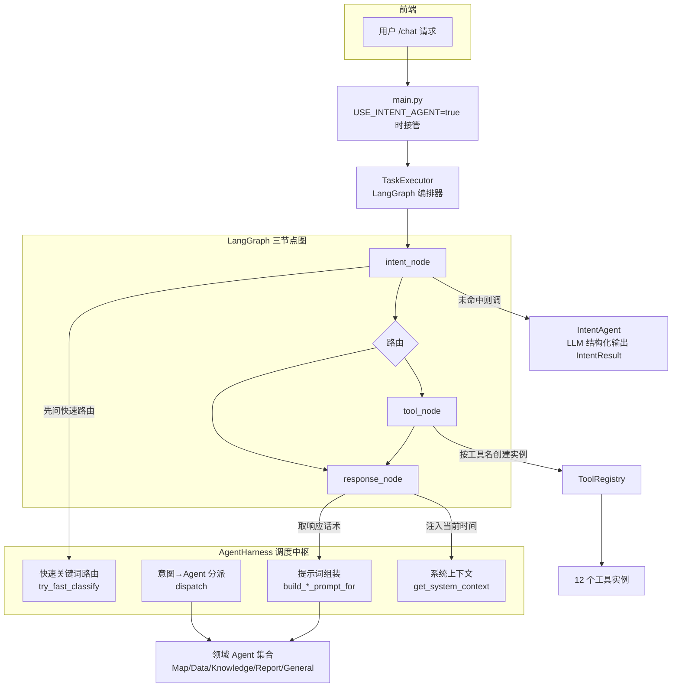
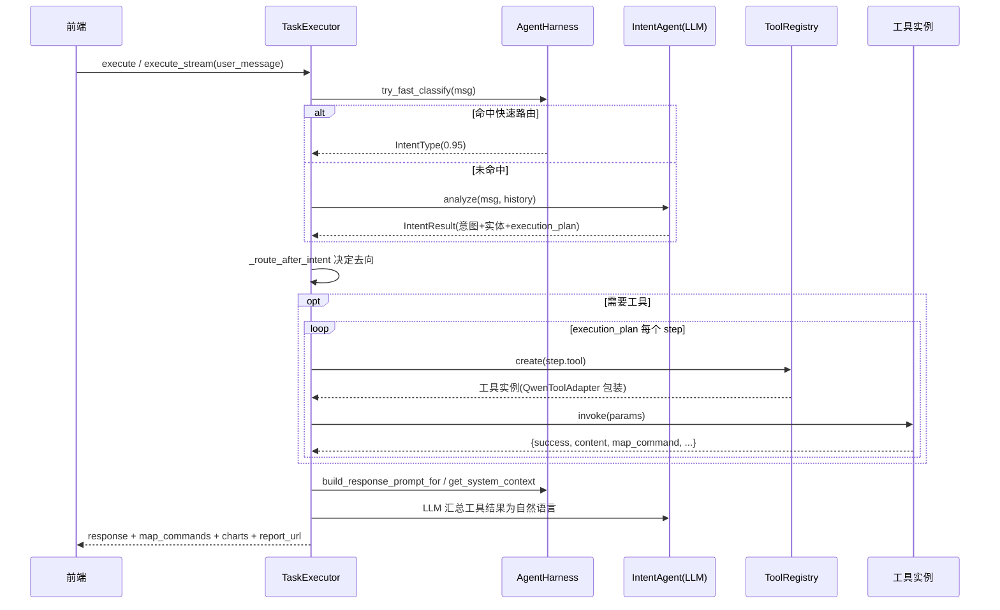

# Map Assistant —— Harness 架构说明

> 本文说明 `map_assistant_v1/backend/agents` 目录下的 **Agent Harness（调度中枢）架构**：它由哪些部件组成、彼此如何协作、一次 `/chat` 请求如何在其中流转，以及当前实现中几个需要留意的实现细节。
>
> 配套文档：`LangGraph节点状态说明.md`（聚焦 LangGraph 三节点与状态流转），本文与其互补，聚焦 **Harness 这一层的职责与装配关系**。

---

## 1. 一句话概览

> **Harness 架构 = 「一个调度中枢（AgentHarness）+ 一套可插拔部件（意图识别、工具注册、领域 Agent）+ 一个 LangGraph 编排器（TaskExecutor）」。**

它把「怎么理解用户」「该调哪些工具」「用什么话术回答」这三件事解耦成独立、可替换的部件，由 `AgentHarness` 做协调、由 `TaskExecutor` 做实际的图编排与执行。

---

## 2. 组成部件一览

所有部件都在 `backend/agents/` 下：

| 文件 | 角色 | 一句话职责 |
| --- | --- | --- |
| `intent_types.py` | 数据契约 | 定义 `IntentType`、`TaskStep`、`IntentResult` 及意图/工具映射表 |
| `intent_agent.py` | 意图分析引擎 | 用 LLM 结构化输出把自然语言翻译成 `IntentResult`（分类 + 抽实体 + 规划） |
| `tool_registry.py` | 工具注册表 | 工具名 → 零参数工厂函数的映射，负责延迟创建工具实例 |
| `base_agent.py` | Agent 抽象基类 | 规定每个领域 Agent 必须提供 `intent` / `tool_names` / 两个 prompt |
| `map_agent.py` 等 | 领域 Agent | 各自持有领域工具集与领域提示词（地图 / 数据 / 知识 / 报告 / 兜底） |
| `agent_harness.py` | **调度中枢** | 快速路由、意图→Agent 分派、提示词组装、系统上下文注入 |
| `task_executor.py` | LangGraph 编排器 | 定义三节点图、执行节点、路由状态、汇总输出、流式推送 |

各 Agent 与其覆盖意图：

| 领域 Agent | 覆盖意图 | 主要工具 |
| --- | --- | --- |
| `MapAgent` | `MAP_DISPLAY` / `LOCATION_SEARCH` / `COORDINATE_MARKER` / `SPATIAL_PROCESSING` / `SPATIAL_REFERENCE` | `map_tool` / `cesium_tool` / `location_search` / `coordinate_marker` / `spatial_processing_tool` / `spatial_reference_tool` |
| `DataAgent` | `DATA_QUERY` / `DATA_VISUALIZATION` | `postgresql_tool` / `data_visualizer_tool` |
| `KnowledgeAgent` | `KNOWLEDGE_SEARCH` | `knowledge_base_tool` |
| `ReportAgent` | `REPORT_GENERATION` | `report_generator_tool` |
| `GeneralAgent` | 兜底（`UNKNOWN` / `WEATHER_QUERY` / `CROSS_INTENT` 等） | 开放全部 12 个工具 |

---

## 3. 架构总览图

---

## 4. AgentHarness 到底做什么

`AgentHarness`（`agent_harness.py`）是本架构命名的来源。它**不替代 LangGraph 图**，而是作为 `TaskExecutor` 各节点内部调用的「协调层」，提供 4 类能力：

### 4.1 快速关键词路由 `try_fast_classify`

- 内置一张 `FAST_ROUTE_KEYWORDS` 表（如「切换卫星→MAP_DISPLAY」「生成报告→REPORT_GENERATION」）。
- 命中关键词时**直接返回意图，绕过 LLM 意图分析**，`intent_node` 据此构造一个 `confidence=0.95` 的轻量 `IntentResult`。
- 作用：高频命令零 LLM 延迟。

### 4.2 意图 → Agent 分派 `dispatch`

- 维护 `IntentType → BaseAgent` 的映射（懒加载，首次分派时才实例化所有 Agent）。
- 未匹配的意图统一落到 `GeneralAgent`（兜底，开放全部工具与完整 prompt）。
- 兼容 Pydantic `use_enum_values=True` 情况下 intent 可能是 `str` 的场景。

### 4.3 提示词组装 `build_system_prompt_for` / `build_response_prompt_for`

- 先 `dispatch` 到对应 Agent，再取该 Agent 的领域提示词，拼接通用前缀与 `execution_plan` 规范。
- 让「每个领域的工具约束/业务规则」由各 Agent 自持，而非堆在一个巨型 prompt 里。

### 4.4 系统上下文注入 `get_system_context`

- 生成「当前时间 + 星期（北京时间）」文本，注入到 `response_node` 的 system prompt，确保 LLM 能回答时间相关问题。

---

## 5. 一次请求的完整流转

关键路由规则（`_route_after_intent`）：

| 条件 | 去向 |
| --- | --- |
| `intent_result is None` | 直接 `END` |
| `confidence < 0.3` | 写兜底回复，直接 `END` |
| `requires_confirmation` | 生成确认文案，进 `response_node` |
| `execution_plan` 无工具 | 进 `response_node` 直接回答 |
| 有需要的工具 | 进 `tool_node` 并发执行 |

---

## 6. 工具层：QwenToolAdapter + ToolRegistry

- **ToolRegistry**：用「工具名 → 零参数工厂」替代原先 `if-elif` 硬编码，每个工厂自含 `import` 与配置（如 PostgreSQL 连接、知识库后端选择）。共 12 个工具。
- **知识库后端可切换**：`_create_knowledge_base_tool` 根据环境变量 `KNOWLEDGE_BACKEND`（`ragflow` / `llamaindex`）动态选择实现，但对外统一暴露 `KnowledgeBaseTool` 接口。
- **QwenToolAdapter**（在 `task_executor.py`）：把各工具的 `.call(params)` 统一包装成 `invoke(params) -> {"tool_name", "result"}`，并做 JSON 解析与异常兜底，屏蔽后端差异。
- **同步工具异步化**：工具 `.call()` 多为同步阻塞（DB/网络），通过 `loop.run_in_executor` 放入线程池，避免阻塞事件循环。

---

## 7. 稳健性设计（Harness 层的兜底逻辑）

`TaskExecutor` 在 Harness 协调下内置了几处容错：

1. **数据库空结果自动回退知识库**：`postgresql_tool`/`mcp_postgres_tool` 返回空、失败或可疑聚合值时，自动追加 `knowledge_base_tool` 检索（`_fallback_knowledge_search`），并在响应阶段同步补偿（`_sync_kb_search`）。
2. **报告生成前置数据充分性检查**：`report_generator_tool` 会先等前置工具完成，`_check_data_sufficiency` 判定数据不足则跳过报告生成而非产出空报告。
3. **富结果直通**：当工具已返回高质量 Markdown 摘要（如 `data_visualizer_tool`）时，`_try_extract_rich_response` 直接透传，跳过 LLM 二次汇总以省时省 token。

---

## 8. 当前实现中值得注意的点

> 这些不是 bug，而是接手维护时容易误解、需要留心的实现现状。

1. **意图阶段用的是 `IntentAgent` 的完整 prompt，而非 Harness 的领域 prompt。**
   `intent_node` 调用的是 `IntentAgent.analyze(msg, history)`（使用其自带的完整 system prompt）。而 `harness.build_system_prompt_for(...)` 虽已实现并有测试覆盖，但**目前未接入实时意图分析链路**——它是「已就绪但暂未在生产路径启用」的能力。`analyze()` 已预留 `system_prompt` 参数，未来可由 Harness 注入领域化 prompt。

2. **响应阶段确实走 Harness。** `_get_response_system_prompt` 通过 `harness.build_response_prompt_for` 取各领域的响应话术，失败时回退到硬编码映射。

3. **`tool_node` 的并发在节点内部，不是 LangGraph 图级并行。** 并发由 `asyncio.gather` / `asyncio.as_completed` 实现；状态字段虽用 `Annotated[List, operator.add]` 预留了合并能力，但图拓扑仍是单入口三节点。

4. **流式接口绕开了编译后的图。** `execute_stream()` 手动顺序调用 `_intent_node`/`_tool_node`/`_response_node` 以便细粒度 `yield` 进度卡片；`self._graph.ainvoke()` 仅用于非流式 `execute()`。二者共享同一套节点函数。

5. **`GeneralAgent` 是安全网。** 任何未被专职 Agent 覆盖的意图都落到它，开放全部工具并使用完整原始 prompt，保证不退化。

---

## 9. 如何扩展

| 想做的事 | 改动点 |
| --- | --- |
| 新增一个业务领域 | 新建 `XxxAgent(BaseAgent)`，在 `AgentHarness._init_agents` 注册意图映射 |
| 新增一个工具 | 在 `ToolRegistry._init_defaults` 注册工厂函数即可，无需改执行逻辑 |
| 新增高频免 LLM 命令 | 往 `FAST_ROUTE_KEYWORDS` 加关键词 → 意图 |
| 新增意图类型 | 在 `intent_types.py` 增加 `IntentType` 枚举、描述与工具映射 |
| 让意图阶段用领域 prompt | 在 `intent_node` 里改为把 `harness.build_system_prompt_for(...)` 传入 `IntentAgent.analyze(system_prompt=...)` |

---

## 10. 一句话总结

> **Harness 架构的精髓是「分派 + 解耦」：`AgentHarness` 负责把请求快速导向正确的领域 Agent 和工具集，`TaskExecutor` 负责用 LangGraph 把「识别 → 调工具 → 汇总」三段式流水线跑通，各领域的规则和工具则由可插拔的 Agent 与 ToolRegistry 各自承载。**
