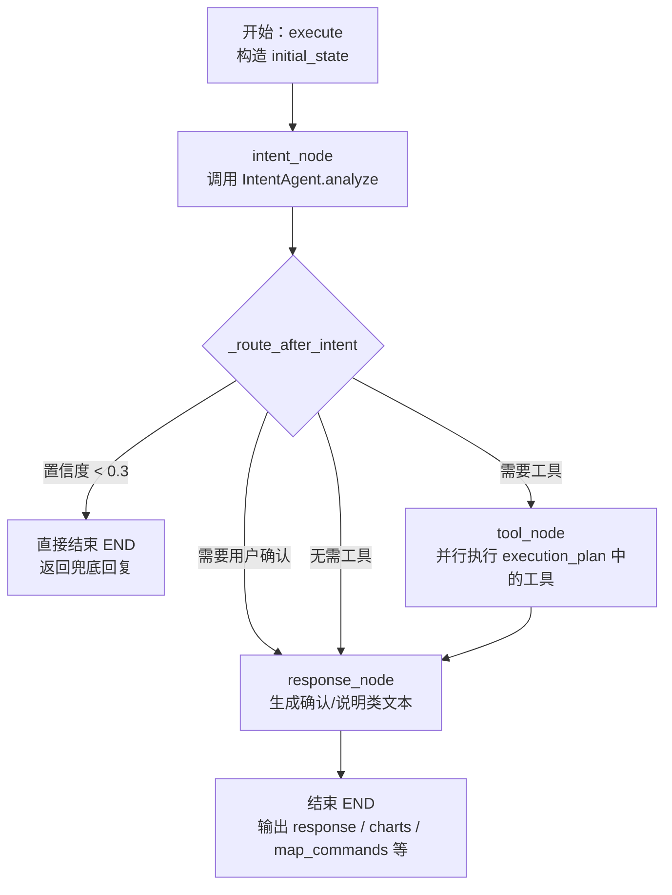
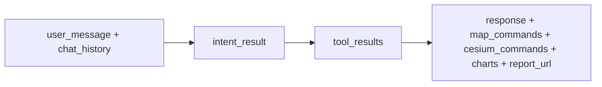
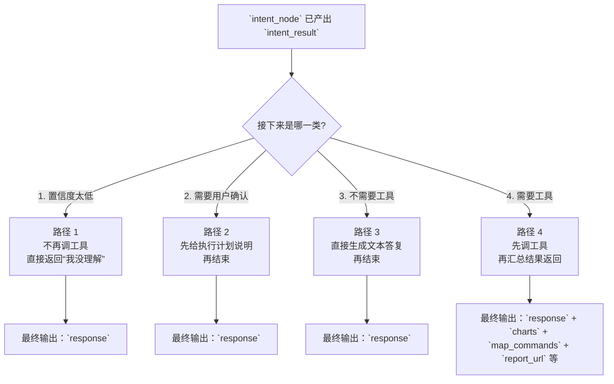
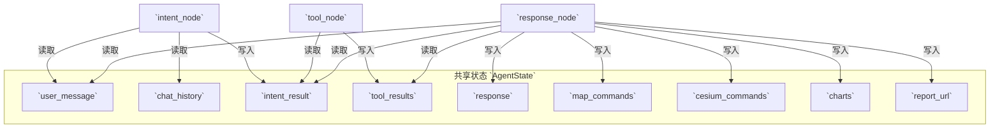
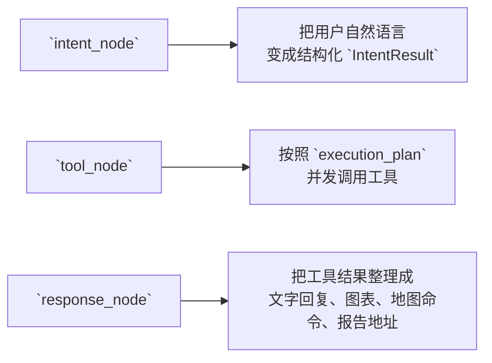

# `backend/agents` 中 LangGraph 节点与状态说明

> 面向后续接手开发的实习生。本文重点解释：**这套 LangGraph 是怎么搭起来的、每个节点读写哪些状态、状态如何在节点之间流转、以及当前实现里有哪些容易误解的点。**

## 1. 先说结论

这套 Agent 架构里，**真正定义 LangGraph 的文件是 `task_executor.py`**，而不是 `intent_agent.py`。

- `intent_agent.py`：负责**意图识别 + 任务规划**，输出结构化的 `IntentResult`
- `task_executor.py`：负责**定义 LangGraph 图、执行节点、路由状态、汇总结果**
- `intent_types.py`：负责定义图里最核心的数据结构：`IntentType`、`TaskStep`、`IntentResult`

所以你可以把它理解成：

- `IntentAgent` = 图中的“意图分析引擎”
- `TaskExecutor` = 图的“编排器 / 调度器”
- `AgentState` = 图运行过程中的“共享状态仓库”

另外要注意：**只有当 `main.py` 里 `USE_INTENT_AGENT=true` 时，这套 LangGraph 才会真正接管 `/chat` 请求。**

---

## 2. 涉及到的关键文件

- `intent_agent.py`：结构化意图识别
- `task_executor.py`：LangGraph 主体
- `intent_types.py`：意图结果和执行计划的数据模型
- `main.py`：决定是否启用 LangGraph，并把 `/chat` 请求交给 `TaskExecutor.execute()`

---

## 3. 整体结构图

### 3.1 图的主流程



### 3.2 状态流转视角



你可以把整张图理解成一个很典型的三段式流水线：

1. **先判断用户到底想干什么**
2. **如果要调用工具，就把计划里的工具跑一遍**
3. **最后把工具结果整合成人话，并抽取地图/图表/报告等结构化输出**

---

## 4. 图里有哪些节点

在 `task_executor.py` 里，LangGraph 只注册了 3 个节点：

1. `intent_node`
2. `tool_node`
3. `response_node`

入口节点是：`intent_node`

边关系是：

- `intent_node` --条件路由--> `tool_node` / `response_node` / `END`
- `tool_node` --> `response_node`
- `response_node` --> `END`

换句话说，这不是一个复杂的多分支多回环图，而是一个**单入口、单出口、中间按条件分流**的轻量图。

---

## 5. 共享状态 `AgentState` 是什么

`task_executor.py` 里通过 `TypedDict` 定义了 LangGraph 的共享状态：

| 状态字段 | 类型 | 作用 | 主要由谁写入 |
| --- | --- | --- | --- |
| `user_message` | `str` | 当前用户输入 | `execute()` 初始化 |
| `chat_history` | `List[Dict]` | 历史对话，用于辅助意图识别 | `execute()` 初始化 |
| `intent_result` | `Optional[IntentResult]` | 结构化意图分析结果 | `intent_node` |
| `tool_results` | `List[Dict]` | 所有工具执行结果 | `tool_node` |
| `response` | `str` | 最终返回给前端的文本回答 | `response_node` 或路由阶段兜底 |
| `map_commands` | `List[Dict]` | 2D 地图命令 | `response_node` |
| `cesium_commands` | `List[Dict]` | 3D 地图命令 | `response_node` |
| `charts` | `List[Dict]` | 图表配置 | `response_node` |
| `report_url` | `Optional[str]` | 报告下载地址 | `response_node` |
| `error` | `Optional[str]` | 预留错误字段，目前使用不多 | `execute()` 初始化 |

其中这几个字段用了：

- `Annotated[List[Dict], operator.add]`

包括：

- `tool_results`
- `map_commands`
- `cesium_commands`
- `charts`

这表示 **LangGraph 在并行分支合并状态时，可以用 `operator.add` 追加列表**。不过要注意：**当前这份图并没有真正把 `tool_node` 拆成多个 LangGraph 并行节点**，而是在 `tool_node` 内部使用 `asyncio.gather()` 做并发。所以这里更像是“为后续扩展预留的状态合并能力”。

---

## 6. 每个节点到底读什么、写什么

### 6.1 `intent_node`

**职责**：识别意图，生成执行计划。

**核心调用**：

- `self.intent_agent.analyze(state["user_message"], state.get("chat_history"))`

**输入状态**：

- `user_message`
- `chat_history`

**输出状态**：

- `intent_result`

**状态变化前后**：

| 阶段 | 关键状态 |
| --- | --- |
| 进入前 | `intent_result = None` |
| 离开后 | `intent_result = IntentResult(...)` |

`IntentAgent.analyze()` 最终会让大模型输出一个结构化对象 `IntentResult`，里面至少包括：

- `primary_intent`：主意图
- `confidence`：置信度
- `entities`：提取出的实体
- `task_context`：任务摘要
- `execution_plan`：后续要执行的步骤列表
- `requires_confirmation`：是否需要用户确认

所以 `intent_node` 的本质可以概括为：

> **把自然语言用户请求，翻译成机器可执行的结构化任务单。**

---

### 6.2 `_route_after_intent`（条件路由器）

严格来说它不是 `add_node()` 注册的节点，但它是这张图最重要的“分流器”。

它会根据 `intent_result` 决定下一步走向：

#### 情况 A：`intent_result is None`

- 直接 `END`

#### 情况 B：`confidence < 0.3`

- 写入兜底 `response`
- 清空 `map_commands / cesium_commands / charts / tool_results`
- 直接 `END`

#### 情况 C：`requires_confirmation = True`

- 先写入确认提示文本到 `response`
- 清空 `map_commands / cesium_commands / charts / tool_results`
- 跳到 `response_node`

#### 情况 D：不需要工具

- `tool_results = []`
- 跳到 `response_node`

#### 情况 E：需要工具

- 跳到 `tool_node`

可以把它理解成：

> **先看意图分析结果够不够靠谱，再决定是直接结束、先确认，还是继续跑工具。**

---

### 6.3 `tool_node`

**职责**：执行 `execution_plan` 里需要工具的步骤。

**输入状态**：

- `intent_result.execution_plan`

**输出状态**：

- `tool_results`

它的执行逻辑是：

1. 从 `execution_plan` 里筛出带 `tool` 的步骤
2. 为每个步骤找到对应的工具适配器 `QwenToolAdapter`
3. 用 `asyncio.gather()` 并发执行全部步骤
4. 把每一步的结果收集成列表，写入 `state["tool_results"]`

`tool_results` 中每一项大致长这样：

```python
{
  "tool_name": "postgresql_tool",
  "result": {
    "success": True,
    "content": "...",
    "map_command": {...},
    "chart_type": "line",
    "config": {...}
  }
}
```

这里要注意一个实现特点：

- **工具是并发执行的**，但并发发生在 `tool_node` 内部
- **LangGraph 图本身没有拆成多个工具子节点**

也就是说，目前的图拓扑仍然很简单；真正“并行”的是节点内部的 Python 代码。

---

### 6.4 `response_node`

**职责**：把 `tool_results` 汇总成最终输出。

**输入状态**：

- `user_message`
- `intent_result`
- `tool_results`

**输出状态**：

- `map_commands`
- `cesium_commands`
- `charts`
- `report_url`
- `response`

它干了两类事情：

#### 第一类：提取结构化结果

从 `tool_results` 中抽取：

- `map_command` -> 收集到 `map_commands`
- `cesium_command` -> 收集到 `cesium_commands`
- `data_visualizer_tool` 的图表配置 -> 收集到 `charts`
- `report_generator_tool` 的下载地址 -> 写入 `report_url`

#### 第二类：生成面向用户的文本回复

把每个工具的 `content / message / error` 抽成摘要后，再调用一次 LLM 做自然语言总结，写入 `response`。

所以 `response_node` 的本质不是单纯“回复一句话”，而是：

> **把工具层产生的结构化结果和文字摘要打包成最终输出对象。**

---

## 7. `IntentResult` 为什么是整个图的核心状态

在这套实现里，`IntentResult` 基本决定了后续所有分支：

| 字段 | 作用 |
| --- | --- |
| `primary_intent` | 决定回答风格，也影响后续规划 |
| `confidence` | 决定是否直接拒答/兜底 |
| `entities` | 保存实体抽取结果 |
| `task_context` | 对当前任务的摘要说明 |
| `execution_plan` | 决定要不要调用工具、调用哪些工具 |
| `requires_confirmation` | 决定是否需要先向用户确认 |
| `suggestions` | 无法理解时给用户的补充建议 |

因此，很多同学第一次看代码会误以为：

- `intent_agent.py` 只是“分类器”

其实不止。它做的是：

- **分类** + **实体抽取** + **任务规划**

这就是为什么 `intent_node` 的输出足以驱动整个 LangGraph 后半段。

---

## 8. 4 条最常见的状态流转路径

### 8.1 正常路径：识别成功 + 需要工具

例如用户说：

> “统计最近一月采砂量趋势，并生成折线图。”

状态流转大致是：

1. `execute()` 初始化：
   - `user_message` 有值
   - `intent_result = None`
   - `tool_results = []`
   - `charts = []`
2. `intent_node`：
   - 识别出 `data_visualization`
   - 生成 `execution_plan`
3. `_route_after_intent`：
   - 置信度高
   - 不需要确认
   - 需要工具
   - 跳到 `tool_node`
4. `tool_node`：
   - 调用 `postgresql_tool`
   - 调用 `data_visualizer_tool`
   - 得到 `tool_results`
5. `response_node`：
   - 从结果中抽出 `charts`
   - 生成文字说明 `response`
6. `END`：
   - 前端拿到 `response + charts`

---

### 8.2 低置信度路径：识别失败

例如用户输入非常模糊，模型无法可靠分类。

状态变化：

1. `intent_node` 仍会产出 `intent_result`
2. `_route_after_intent` 发现 `confidence < 0.3`
3. 写入兜底回复：
   - `response = 抱歉，我无法理解您的意图...`
4. 清空：
   - `tool_results = []`
   - `map_commands = []`
   - `cesium_commands = []`
   - `charts = []`
5. 直接 `END`

这条路径**不会进入 `tool_node`**，因为系统认为继续执行风险太高。

---

### 8.3 需要确认路径：先问用户要不要执行

当 `IntentAgent` 判断任务需要确认时：

1. `_route_after_intent` 先生成确认文案
2. 清空所有结构化输出
3. 跳转到 `response_node`

从设计意图看，这条路径是：

> **先告诉用户“我理解你要做什么，我准备怎么做，请确认一下”。**

不过这里要特别提醒：

### 当前实现有一个值得注意的细节

在 `_route_after_intent()` 里，代码先把确认文案写进了 `state["response"]`，然后返回 `"response_node"`。

但 `response_node()` 里又会重新生成一次 `response`，并把原来的值覆盖掉。

也就是说：

- **从“代码意图”看**：这条路径应该返回确认信息
- **从“当前实现”看**：确认信息存在被后续 `response_node` 覆盖的风险

这属于一个非常值得后续维护者注意的点。

---

### 8.4 不需要工具路径：直接生成文字答复

如果 `execution_plan` 里没有任何工具：

1. `_route_after_intent` 设定 `tool_results = []`
2. 跳到 `response_node`
3. `response_node` 发现没有工具摘要
4. 返回：

```text
已完成操作：{intent_result.task_context}
```

这条路径适合一些非常轻量的意图解释或无需查库/上图的请求。

---

## 9. 一个更适合实习生记忆的“节点状态表”

| 节点 / 阶段 | 进入时重点状态 | 离开时新增/修改状态 | 你可以怎么理解 |
| --- | --- | --- | --- |
| `execute()` | 用户输入、历史消息 | 初始化整份 `AgentState` | 开局装配上下文 |
| `intent_node` | `user_message`, `chat_history` | `intent_result` | 把自然语言翻译成任务单 |
| `_route_after_intent` | `intent_result` | 决定下一个节点，并可能提前写 `response` | 图的交通指挥员 |
| `tool_node` | `intent_result.execution_plan` | `tool_results` | 按计划真正干活 |
| `response_node` | `tool_results` | `response`, `charts`, `map_commands` 等 | 把执行结果包装成最终输出 |
| `END` | 完整最终状态 | 返回给调用方 | 本轮图执行结束 |

---

## 10. `intent_agent.py` 在图里扮演什么角色

这个文件里没有 `StateGraph`、没有 `add_node()`、也没有 `add_edge()`。

所以它**不是图定义文件**。

但它在 `intent_node` 中被直接调用，是整张图最关键的“上游分析器”。它的工作流程是：

1. 构造系统提示词（定义意图体系、工具映射、业务规则）
2. 拼接最近几轮对话上下文
3. 调用结构化输出 LLM：`llm.with_structured_output(IntentResult)`
4. 拿到一个标准化的 `IntentResult`

因此更准确的表述应该是：

> `intent_agent.py` 不是节点定义文件，但它承载了 `intent_node` 的核心计算逻辑。

---

## 11. `main.py` 和 LangGraph 的关系

很多人看 `agents/` 目录时会遗漏一个事实：

- **图的定义在 `agents/`**
- **图的实际启用入口在 `main.py`**

在 `/chat` 接口里，后端会先判断：

- 环境变量 `USE_INTENT_AGENT` 是否为 `true`

如果是，才会：

- 调用 `task_executor.execute(...)`

否则就还是走旧的 `bot` 路径。

所以如果你发现自己改了 LangGraph 代码，但接口行为没变化，第一件事要排查的不是节点逻辑，而是：

> **当前服务到底有没有真的走到 `TaskExecutor`。**

---

## 12. 这套实现里最容易踩坑的 6 个点

### 12.1 `intent_agent.py` 不是图定义文件

新同学最容易误判这里“是不是 LangGraph 主体”。答案是：**不是**。

---

### 12.2 `tool_results` 虽然声明了可合并，但目前不是 LangGraph 多节点并行

现在的并发发生在：

- `tool_node` 内部的 `asyncio.gather()`

而不是：

- LangGraph 图里拆出多个并行工具节点

所以不要把现在的实现误解成“图级并行 DAG”。

---

### 12.3 `requires_confirmation` 路径有回复被覆盖风险

这是当前实现里最值得注意的维护点之一，上面已经解释过。

---

### 12.4 `MemorySaver` 存在，但图状态的业务连续性仍主要依赖传入的 `chat_history`

虽然 `TaskExecutor` 用了：

- `MemorySaver`
- `thread_id`

但当前每次 `execute()` 仍然会重新构造一份 `initial_state`，并显式传入：

- `user_message`
- `chat_history`

因此从业务视角看，**会话连续性主要还是靠外部请求把历史消息带进来**，而不是完全依赖 LangGraph 内部状态滚动累积。

---

### 12.5 LangGraph 模式下返回值里 `messages` 是空列表

`execute()` 返回时写死了：

- `"messages": []`

这意味着前端如果还沿用旧的“从 `messages` 里读工具消息”的思路，就可能需要额外适配 `charts / map_commands / cesium_commands` 这些独立字段。

---

### 12.6 `response_node` 既负责“抽结构化结果”，又负责“写自然语言回复”

这让它看起来很方便，但同时意味着：

- 节点职责略重
- 一旦后续加更多输出类型，这个节点很容易继续膨胀

后面如果系统变复杂，比较自然的演进方向是再拆出：

- `extract_output_node`
- `summarize_response_node`

---

## 13. 给后续开发的建议

如果后面要继续扩展这套图，建议优先考虑以下方向：

### 13.1 把确认分支从 `response_node` 中剥离

最稳妥的做法是新增一个专门节点，例如：

- `confirmation_node`

这样可以避免确认文案被后续统一回复逻辑覆盖。

### 13.2 真正把工具调用升级成图级并行分支

当前只是 `tool_node` 内部并发。后面如果需要更清晰的可观测性，可以拆成：

- `db_query_node`
- `visualize_node`
- `report_node`

然后通过 LangGraph 的合并能力汇总状态。

### 13.3 给 `AgentState` 增加更明确的中间字段

例如：

- `tool_summaries`
- `selected_tools`
- `confirmation_message`
- `final_payload`

这样维护时会更容易观察每一阶段到底产出了什么。

---

## 14. 一句话总结

如果只记一句话，请记这个：

> **这套 LangGraph 的核心流程就是：`intent_node` 先把用户需求转成 `IntentResult`，`tool_node` 按 `execution_plan` 干活，`response_node` 再把工具结果整理成最终输出。**

而 `intent_agent.py` 并不是图本身，它是 `intent_node` 背后的“分析引擎”。

---

## 15. 建议你阅读源码的顺序

对于第一次接手这块代码的人，推荐阅读顺序是：

1. `intent_types.py` —— 先弄清 `IntentResult` 长什么样
2. `intent_agent.py` —— 理解这个结构化结果是怎么来的
3. `task_executor.py` —— 理解 LangGraph 如何消费这些状态
4. `main.py` —— 理解请求什么时候会进入 LangGraph

按这个顺序看，最不容易迷路。

---

## 16. 一眼看懂版逻辑图

上面已经把细节解释清楚了；如果你觉得前面的图太“工程化”，那这一节就只保留 **最值得先看懂的 4 张图**。建议把这 4 张图当成“地图”，再回头看源码。

### 16.1 总览图：一次请求到底怎么走

先只看这一张，就能知道整个系统的主干流程。

```mermaid
flowchart LR
    A[1. 前端发起 /chat 请求] --> B[2. `main.py` 的 `chat()` 接口]
    B --> C{3. 是否启用 `USE_INTENT_AGENT`?}
    C -->|否| X[走旧版 bot 链路]
    C -->|是| D[4. `TaskExecutor.execute()`]

    subgraph G1[LangGraph 主流程]
        D --> E[5. `intent_node`\n识别意图 + 生成任务计划]
        E --> F{6. 路由判断}
        F -->|低置信度| G[直接结束\n返回兜底回复]
        F -->|需要确认| H[进入 `response_node`\n生成说明文本]
        F -->|无需工具| H
        F -->|需要工具| I[进入 `tool_node`\n并发调用工具]
        I --> J[进入 `response_node`\n汇总工具结果]
        H --> K[END]
        G --> K
        J --> K
    end
```

### 16.2 四条典型路径图：系统最后只会走这 4 种结果

读代码时最容易迷路的地方，其实不是节点本身，而是不知道“最后会落到哪种情况”。这张图专门解决这个问题。



### 16.3 状态仓库图：每个节点往哪里写数据

把 `AgentState` 想成一个“共享仓库”就好。每个节点只是往仓库里放东西、再从仓库里取东西。



### 16.4 节点职责图：每个节点只做什么事

如果你不想先管状态字段，只想知道“每个节点负责什么”，那就看这一张。



### 16.5 当前实现里最值得注意的风险图

这一张图只讲一个问题：**确认分支本来想先返回确认文案，但后面可能被 `response_node` 改写。**

```mermaid
flowchart LR
    A[`_route_after_intent()`\n先写入确认文案] --> B[`response_node`\n再次生成 `response`]
    B --> C[最终返回给前端的文本\n可能不是原来的确认文案]
```

### 16.6 最推荐的阅读顺序

如果是第一次接手，建议按下面这个顺序看：

1. **先看 `16.1`**：知道整条链路从哪里进、到哪里出
2. **再看 `16.2`**：知道系统最终只有 4 种路径
3. **再看 `16.3`**：知道每个节点往共享状态里写什么
4. **最后看 `16.5`**：知道当前实现里最值得留心的一个点

如果看完这 4 张图还是觉得抽象，再回到前面的详细文字说明，就会顺很多。

---

## 17. `execute_stream()` 与 LangGraph 图的关系——最容易误解的一个设计

### 17.1 问题：流式接口到底走不走 LangGraph 图？

`TaskExecutor` 里有两个对外接口：

| 方法 | 调用者 | 走不走 `self._graph`？ |
|------|--------|----------------------|
| `execute(message, session_id)` | `main.py` 的非流式 `/chat` 端点（如果存在） | ✅ 走，调用 `self._graph.ainvoke()` |
| `execute_stream(message, session_id)` | `main.py` 的 SSE `/chat/stream` 端点 | ❌ 不走，手写生成器手动调节点 |

**结论：前端看到的所有流式状态卡片，走的完全是 `execute_stream()` 这个手写生成器，与 LangGraph 图的调度逻辑无关。**

---

### 17.2 为什么要绕开 LangGraph 图？

LangGraph 原生的 `.astream()` / `.ainvoke()` 只能在**节点完成后**才能拿到该节点的输出，粒度是"节点级"的。

但我们需要的进度粒度更细：
- 意图识别**开始时**就想推一张卡片
- 每个工具**开始执行**时推一张卡片，**完成时**再更新
- LLM 汇总**开始生成**时推一张卡片

LangGraph 的节点是黑盒，无法在节点内部埋 `yield`。所以 `execute_stream()` 选择**完全绕开 `self._graph`**，改为手动顺序调用各节点函数，并在每个关键时间点插入 `yield`。

---

### 17.3 `execute_stream()` 的执行顺序

```
execute_stream()
│
├─ yield {type: "queued"}          # 收到请求，排队中
├─ yield {type: "start"}           # 开始处理
│
├─ 调用 _intent_node(state)
│   ├─ yield {type: "intent_start"}         # 意图分析开始
│   └─ yield {type: "intent_complete"}      # 意图分析完成，附带 intent_result
│
├─ 调用 _tool_node(state)          （如果有需要工具的步骤）
│   ├─ yield {type: "tool_start", tool_label: ...}   # 每个工具开始
│   └─ yield {type: "tool_result", tool_label: ...}  # 每个工具完成（asyncio.as_completed 顺序）
│
├─ 调用 _response_node(state)
│   ├─ yield {type: "response_start"}       # LLM 汇总开始
│   └─ yield {type: "response_complete"}    # 汇总完成
│
└─ yield {type: "final", result: {...}}     # 最终结果，包含 response/charts/map_commands 等
```

---

### 17.4 `self._graph` 什么时候被用到？

`self._graph` 在 `__init__` 里编译好，绑定了 `MemorySaver` 做会话记忆。  
如果将来有非流式调用场景（如批处理、测试），可以直接用 `self._graph.ainvoke()`，享受 LangGraph 的自动状态管理和路由。

目前的前端 SSE 链路完全走 `execute_stream()`，`self._graph` 在生产环境中暂时处于**备用/测试状态**。

---

### 17.5 SSE 事件如何从后端到前端状态卡片

```
task_executor.py                   main.py                        前端 App.jsx
execute_stream()                   /chat/stream                   SSE EventSource
    │                                  │                               │
    ├─ yield {type:"intent_start"}  ──►│ data: {...}\n\n  ──────────►│ pushStreamProgress()
    ├─ yield {type:"tool_start"}    ──►│ data: {...}\n\n  ──────────►│ pushStreamProgress()
    ├─ yield {type:"tool_result"}   ──►│ data: {...}\n\n  ──────────►│ pushStreamProgress()
    └─ yield {type:"final"}         ──►│ data: {...}\n\n  ──────────►│ finalResult = event.result
                                       │                               │ setMessages(...) 渲染最终回复
```

前端对每个收到的非 `final` 事件：
1. 调 `activateRealProgress()`：清除 fallback 占位卡片
2. 调 `pushStreamProgress()`：追加真实进度卡片
3. `queued` / `start` 阶段事件被过滤，不渲染卡片

---

### 17.6 一句话总结

> **`self._graph` 定义了"图长什么样"，`execute_stream()` 定义了"流式接口怎么跑"。两者共享同一套节点函数（`_intent_node` / `_tool_node` / `_response_node`），但调度方式完全不同。**

---

## 18. 本项目用到了哪些 LangGraph / LangChain 技术——科普篇

> 面向没有接触过 LangGraph 的读者。本章解释"这些技术是什么、为什么存在、在本项目里怎么用的"。

---

### 18.1 LangGraph 是什么？

LangGraph 是 LangChain 团队推出的 **有状态多节点工作流框架**，专为 LLM 应用设计。

你可以把它理解成：

```
普通代码：if/else + 函数调用 = 写死的顺序
LangGraph：节点 + 边 + 共享状态 = 可以动态路由的图
```

它解决的核心问题：**LLM 应用经常需要"根据 LLM 输出决定下一步做什么"，普通代码很难优雅地表达这种动态分支。**

---

### 18.2 技术 1：`StateGraph` + `TypedDict` 状态定义

**是什么**：LangGraph 的图容器。所有节点共享一个 `State` 字典，节点读取、修改这个字典，图负责在节点之间传递它。

**本项目用法**（`task_executor.py`）：

```python
from langgraph.graph import StateGraph, END

class AgentState(TypedDict):
    user_message: str
    intent_result: Optional[IntentResult]
    tool_results: Annotated[List[Dict], operator.add]  # 见 18.3
    response: str
    map_commands: Annotated[List[Dict], operator.add]
    ...

graph = StateGraph(AgentState)
```

**为什么用 TypedDict 而不是普通 dict**：TypedDict 提供类型提示，IDE 可以自动补全字段名，减少手误。LangGraph 在运行时也会用它做状态校验。

---

### 18.3 技术 2：`Annotated[List, operator.add]` —— 状态合并器

**是什么**：告诉 LangGraph，当多个节点同时向同一个字段写入数据时，应该用 `operator.add`（即列表拼接）而不是覆盖。

**本项目用法**：

```python
tool_results: Annotated[List[Dict], operator.add]
map_commands: Annotated[List[Dict], operator.add]
```

**为什么需要它**：`_tool_node` 并发执行多个工具，每个工具的结果都要追加到 `tool_results`，而不是互相覆盖。没有这个注解，后写的会把先写的冲掉。

**对比**：

```
没有 Annotated：node_A 写 [结果1]，node_B 写 [结果2] → 最终只有 [结果2]
有 Annotated：  node_A 写 [结果1]，node_B 写 [结果2] → 最终是 [结果1, 结果2]
```

---

### 18.4 技术 3：`add_node` / `add_edge` / `add_conditional_edges`

**是什么**：图的结构定义 API。

| API | 作用 |
|-----|------|
| `graph.add_node("名字", 函数)` | 注册一个节点，绑定执行函数 |
| `graph.add_edge("A", "B")` | A 完成后必定进入 B（固定边） |
| `graph.add_conditional_edges("A", 路由函数, 映射表)` | A 完成后，由路由函数的返回值决定进哪个节点（动态边） |
| `graph.set_entry_point("A")` | 指定入口节点 |

**本项目用法**：

```python
graph.set_entry_point("intent_node")
graph.add_conditional_edges(
    "intent_node",
    self._route_after_intent,        # 路由函数：返回 "tool_node" / "response_node" / END
    {
        "tool_node": "tool_node",
        "response_node": "response_node",
        END: END,
    },
)
graph.add_edge("tool_node", "response_node")   # 工具执行完，固定进入汇总节点
graph.add_edge("response_node", END)
```

`_route_after_intent` 就是那个"看 LLM 输出，决定往哪走"的函数：

```python
def _route_after_intent(self, state):
    if intent_result.confidence < 0.3:
        return END          # 置信度太低，直接结束
    if intent_result.requires_confirmation:
        return "response_node"   # 需要确认，跳过工具
    if not required_tools:
        return "response_node"   # 无工具，直接回答
    return "tool_node"           # 正常路径，先调工具
```

---

### 18.5 技术 4：`MemorySaver` —— 进程内会话记忆

**是什么**：LangGraph 内置的检查点（Checkpointer）实现，把每次图运行的状态保存在内存里。下次同一个 `thread_id` 的请求进来，可以恢复上次的状态，实现多轮对话记忆。

**本项目用法**：

```python
from langgraph.checkpoint.memory import MemorySaver

self._memory = MemorySaver()
self._graph = graph.compile(checkpointer=self._memory)

# 调用时传 thread_id，同一会话复用同一份记忆
config = {"configurable": {"thread_id": thread_id}}
final_state = await self._graph.ainvoke(initial_state, config=config)
```

**注意**：MemorySaver 是进程内内存，重启服务后记忆清空。生产环境多实例部署需要换成 `SqliteSaver` 或 `PostgresSaver`。

---

### 18.6 技术 5：`graph.compile()` —— 图的编译

**是什么**：把定义好的图（节点 + 边 + 路由）"编译"成一个可执行对象，同时绑定检查点存储。

```python
self._graph = graph.compile(checkpointer=self._memory)
```

编译后的对象提供：
- `await self._graph.ainvoke(state, config)` — 异步执行，返回最终状态
- `self._graph.astream(state, config)` — 异步流式执行，按节点 yield 状态快照

---

### 18.7 技术 6：`with_structured_output(Pydantic模型)` —— LLM 结构化输出

**是什么**：LangChain 提供的能力，让 LLM 直接输出一个符合 Pydantic 模型定义的 JSON 对象，而不是自由文本。底层会把 Pydantic Schema 注入到 LLM 的 function calling / tool use 参数中。

**本项目用法**（`intent_agent.py`）：

```python
from langchain_openai import ChatOpenAI

llm = ChatOpenAI(model="qwen-plus", ...)
self.structured_llm = llm.with_structured_output(IntentResult)

# 调用时直接返回 IntentResult 实例，不是字符串
result: IntentResult = self.structured_llm.invoke(messages)
```

**IntentResult 是什么**（`intent_types.py`）：

```python
class IntentResult(BaseModel):
    primary_intent: IntentType      # 枚举：map_display / data_query / ...
    confidence: float               # 0.0 ~ 1.0
    entities: List[str]             # 提取的实体
    task_context: str               # 任务摘要
    execution_plan: List[TaskStep]  # 每一步用什么工具、传什么参数
    requires_confirmation: bool
    suggestions: List[str]
```

**为什么不直接让 LLM 返回文本再解析**：结构化输出避免了 JSON 解析失败、字段缺失、格式不稳定等问题，LangChain 会自动重试校验，直到输出符合 Schema 为止。

---

### 18.8 技术 7：`asyncio.gather` + `asyncio.as_completed` —— 工具并发

**是什么**：Python 标准库的异步并发原语，不是 LangGraph 的功能，但在本项目的工具执行层被大量使用。

| 函数 | 行为 |
|------|------|
| `asyncio.gather(*tasks)` | 并发启动所有任务，等全部完成，按**提交顺序**返回结果 |
| `asyncio.as_completed(tasks)` | 并发启动，按**完成顺序**返回结果（谁先完成谁先 yield） |

**本项目用法**：
- `_tool_node`（非流式）：用 `asyncio.gather`，一次性拿到所有工具结果
- `execute_stream`（流式）：用 `asyncio.as_completed`，每个工具完成后立刻 `yield tool_result` 事件给前端

```python
# 流式版：工具完成一个，立刻推一个进度卡片
for finished_task in asyncio.as_completed(tasks):
    step_id, result = await finished_task
    yield {"type": "tool_result", ...}   # 立刻推给前端
```

**为什么这么做**：用户发出请求后，如果有 3 个工具要并发执行，不用等全部完成才看到进度，而是每完成一个就能看到一张进度卡片，体验更好。

---

### 18.9 技术 8：`loop.run_in_executor` —— 同步工具的异步化

**是什么**：把一个**同步阻塞函数**放到线程池里执行，让 asyncio 事件循环不被阻塞。

**本项目用法**：各工具（`MapTool`、`PostgreSQLTool` 等）的 `.call()` 方法都是同步的（涉及数据库 IO、网络请求），在异步上下文里直接调用会阻塞事件循环，导致其他请求卡住。

```python
loop = asyncio.get_event_loop()
result = await loop.run_in_executor(None, adapter.invoke, params)
#                              ^^^^  None = 用默认线程池
```

---

### 18.10 技术 9：`AsyncGenerator` —— 异步生成器（流式的核心）

**是什么**：Python 的 `async def` 函数里使用 `yield` 就成了异步生成器，调用者用 `async for` 遍历，每次 `yield` 推送一个值。

**本项目用法**：`execute_stream()` 的完整签名：

```python
async def execute_stream(
    self, user_message, chat_history, thread_id
) -> AsyncGenerator[Dict[str, Any], None]:
    ...
    yield {"type": "intent_start", ...}
    state = self._intent_node(state)
    yield {"type": "intent_complete", ...}
    ...
    yield {"type": "final", "result": {...}}
```

`main.py` 的 SSE 端点用 `async for` 遍历它，逐个推给前端：

```python
async def event_generator():
    async for event in task_executor.execute_stream(message):
        yield f"data: {json.dumps(event)}\n\n"   # SSE 格式
```

---

### 18.11 技术汇总表

| 技术 | 来源 | 本项目用途 |
|------|------|-----------|
| `StateGraph` | LangGraph | 定义三节点图的结构和路由 |
| `TypedDict` + `Annotated` | Python / LangGraph | 共享状态定义 + 列表自动合并 |
| `add_conditional_edges` | LangGraph | `intent_node` 完成后动态决定走哪个节点 |
| `MemorySaver` | LangGraph | 进程内多轮对话记忆 |
| `graph.compile()` | LangGraph | 编译图，绑定检查点 |
| `with_structured_output` | LangChain | 意图识别直接输出 `IntentResult` Pydantic 对象 |
| `ChatOpenAI` | LangChain | 统一调用 Qwen 模型（兼容 OpenAI API） |
| `SystemMessage` / `HumanMessage` | LangChain | 构造 LLM 输入消息 |
| `asyncio.gather` | Python 标准库 | 非流式并发调用工具 |
| `asyncio.as_completed` | Python 标准库 | 流式按完成顺序推进度事件 |
| `run_in_executor` | Python 标准库 | 同步工具异步化，不阻塞事件循环 |
| `AsyncGenerator` / `yield` | Python 标准库 | `execute_stream()` 流式输出核心 |
| `Pydantic BaseModel` | Pydantic | `IntentResult` / `TaskStep` 数据校验 |
| `str Enum` | Python 标准库 | `IntentType` 枚举，值即字符串，JSON 序列化友好 |
