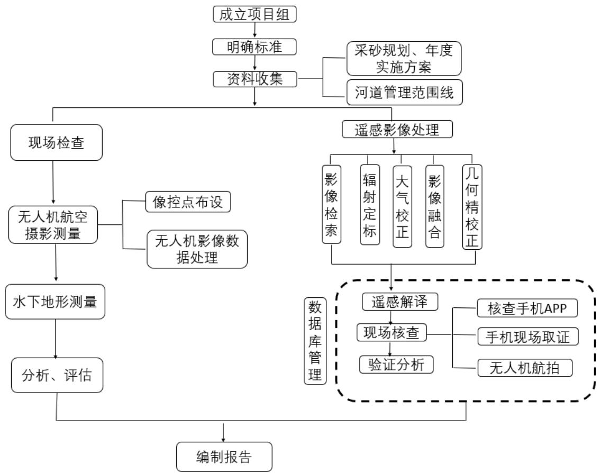

本次信阳市水利局 2023 年度市级河流“智慧巡河”监管项目主要包括前期数据收集准备、数据处理、开发协同解译平台、“四乱”及妨碍河 道行洪突出问题解译分析、“四乱”及碍洪问题现场详查、“四乱”问题核查认定、“四乱”问题整改复查、采砂区无人机航空摄影测量、无人船水下地形测量、现场监督检查、成果总结与报告编写等部分，项目实施流程如图 1.3-1 所示。  图 1.3-1 项目流程图 # 1、前期数据准备 收集信阳市市级河长负责的 17 条河流的河道管理范围线数据、水利普查矢量数据，2021、2022 年信阳市各县区认定的“四乱”问题、相关材料以及整改复查资料，收集覆盖市级河长负责河流的河道管理范围的时效高分辨率卫星遥感影像，影像分辨率优于 0.8m 。 # 2、数据处理 对收集到的矢量数据和栅格数据进行标准化处理，对数据质量和精度 进行检查，所有数据坐标系统一采用 CGCS2000 大地坐标系，保证数据基准的一致性。 # 3、开发协同解译平台 通过对收集到的数据进行相应处理，对影像进行切片处理，结合解译的“四乱”及碍洪问题属性信息，基于 B/S 架构开发协同解译平台，实现多用户基于网络端进行同步操作，同时参数化的选择有效地提高了解译效率。 # 4、解译分析 基于协同解译平台，利用具有高分辨、高精度的真彩色遥感影像对信阳市 17 条市级河流的“乱建、乱采、乱占、乱堆”及妨碍河道行洪等疑似问题进行解译，列出疑似问题清单。对于 2021、2022 年认定材料不完善、未完成整改或整改不彻底的“四乱”及碍洪问题点，保留历史解译编号并继续纳入本年度监管台账，台账的主要包括点位类别、位置信息、面积、问题所在行政区（精确到乡级）、解译影像日期、岸别等信息。 # 5、现场复核 对内业解译的疑似图斑进行现场复核，使用移动端复核 APP 对疑似问题点进行手机和无人机拍照，将现场情况录入外业复核 APP 系统并上传至综合管理平台进行实时查看。同时，APP 具备新增问题点的功能，对于现场发现的问题也可以进行增加补充。 # 6、智慧监管 基于河长 $^ +$ 互联网技术，利用智慧监管系统实现对信阳市市级河流信息化监管，实现从问题详查、问题核查、整改复查等信息化、可视化的闭 环管理。 # 7、采砂现场监管 采砂监管主要包括现场检查采区开采结束后是否存在坑洼不平、遗留砂堆等问题。利用无人机进行采砂区域航飞，构建厘米级正射影像图，基于无人机正射影像，叠加规划批复的方案范围判别现场是否“谁开采、谁修复”，以及是否存在超范围开采问题。对比评估采砂活动对周边生态环境的影响及河道平整修复情况。采用无人船携带水下声呐进行水底高程测量，结合年度实施方案监测采区开采高程，评估是否存在超深度开采。 # 8、成果总结与报告编写 对本次工作进行总结，对每个问题点的情况进行详细描述，包括问题点类型，所在河流、所在政区、经纬度坐标、详细位置、现场情况等，形成问题成果汇总；通过现场监督检查情况、无人机航空摄影测量成果、水下地形测量成果等，结合规划方案和年度实施方案对比分析各个采区的基本情况。对于监管过程中发现的问题提出意见和建议，总结监管成果编写信阳市水利局 2023 年度市级河长“智慧巡河”监管项目总结报告。
