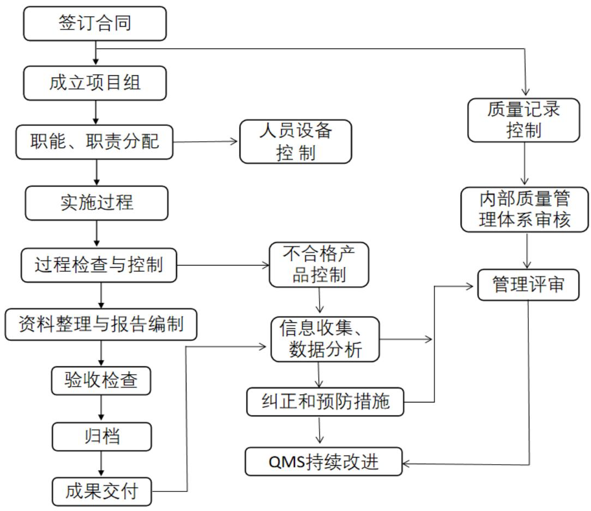

河南省水利勘测有限公司（原河南省水利勘测总队）2000 年 12 月通过 ISO9001:1994 质量体系认证，2006 年随着改制，质量体系文件依据GB/T19001-2008idtISO9001:2008 标准要求，编制的《质量手册》，2006 年通过 ISO9001:2008 质量体系认证。 我公司产品勘测设计过程严格按质量体系的要求开展工作。接受委托后，立即成立了项目部，按照公司质量管理体系文件要求，建立项目拟采用的质量保证体系。 首先召开项目策划会议，明确任务，项目负责人组织编制总体实施计划，明确项目人员的职责和分工，由各专业组分别承担相应工作。项目负责人对本项目质量负责，专业负责人和每一个专业组组长负责本组质量管理、保证、控制和改进，专业负责人会同各专业负责人跟踪监督项目实施过程中各专业组执行公司质量体系文件的情况，以及在实施过程中出现的质量问题。  图 2.2-1 质量保证体系图
