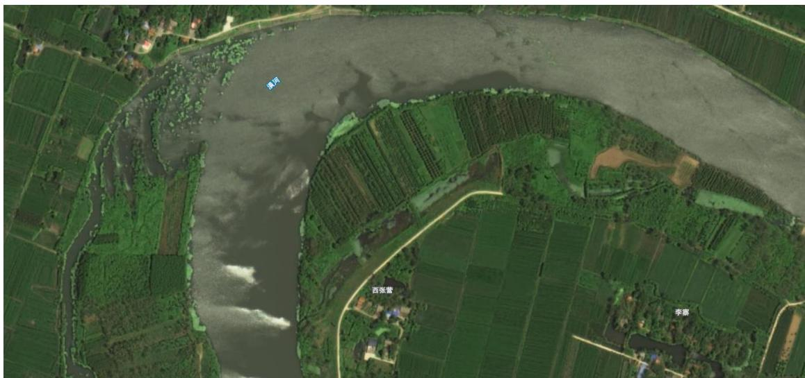
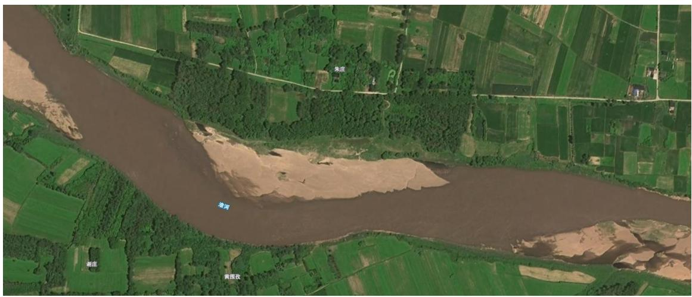

1、河流矢量数据收集 为了避免遗漏，收集信阳市 17 条市级河流的水利普查矢量数据，坐标系转换至 CGCS2000 大地坐标系。 # 2、河道管理范围线收集 收集合同中规定的信阳市 17 条市级河流管理范围线矢量数据，坐标系转换至 CGCS2000 大地坐标系，并对收集到的成果按照数据库标准进行整理和发布。 # 3、历史问题收集 收集 2021、2022 年省智慧巡河监管项目中未完成整改或整改不彻底问题的认定与整改数据。 # 4、卫星遥感影像收集与处理 通过河南省水利勘测有限公司遥感大数据中心检索查询全国民用、商业卫星数据资源，查询并获取覆盖信阳市市级河流卫星遥感，主要使用吉林 1 号卫星数据，部分使用高分 2 号数据补全，影像时间以 2023 年第三季度为主，影像分辨率优于 0.8 米，基本无云层覆盖，影像质量清晰。对收集到的卫星遥感影像进行辐射定标、大气校正、几何校正、影像融合等预处理，通过实地采集地面控制点数据，对区域内影像进行几何精校正，坐标系选用 CGCS2000 大地坐标系，几何精度优于 3 个像元。   图 3.2-1 信阳市潢河 0.8 米卫星遥感影像 图 3.2-2 信阳市淮河干流卫星遥感影像
