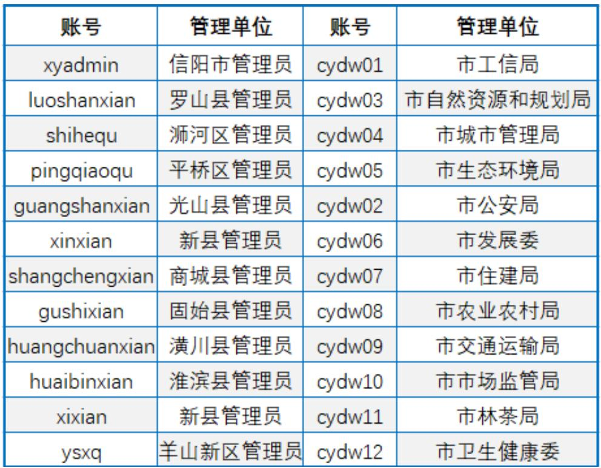
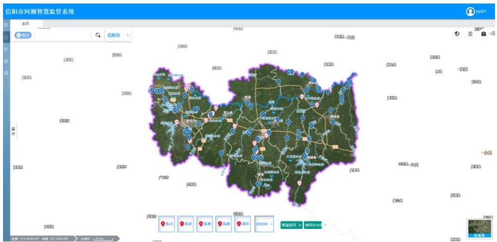
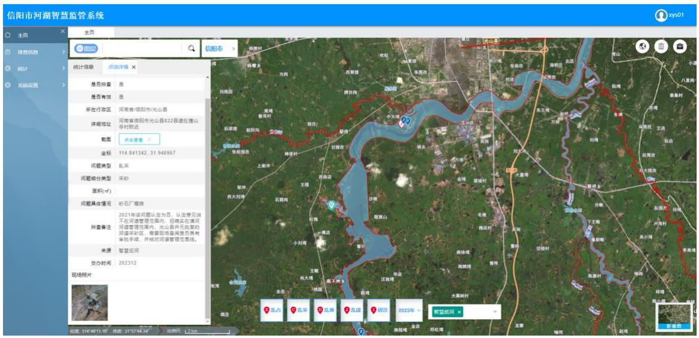
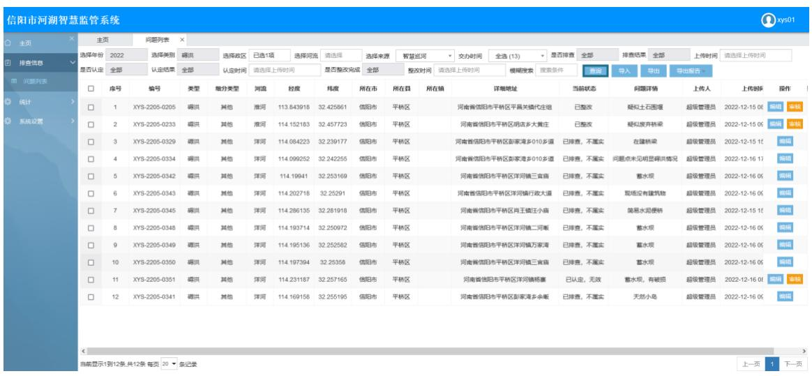
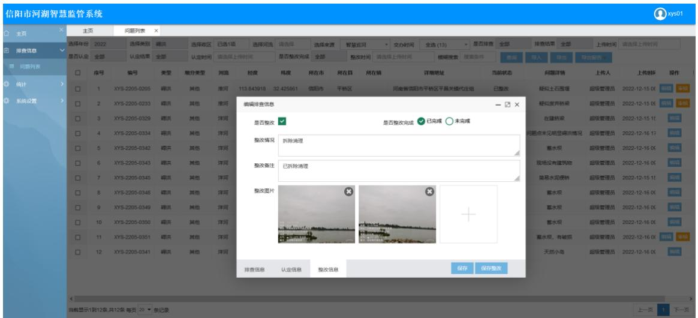

为了方便对解译的疑似“四乱”问题进行统一管理，及时跟踪“四乱”问题处理流程，开发了 B/S架构的信阳市河湖智慧监管系统。 系统共配置22 个管理账号，其中信阳市各县区分配账号11 个，成员单位分配账号 12 个，如图 3.5-1 所示。用户登录系统后只能对所辖行政区域或所负责河流的“四乱”问题进行管理。 系统账号分配完成后，信阳市各个县区河长办相关工作人员、市河长办成员单位都进行了安装使用，各级用户在信阳市 2023 年度“四乱”问题认定、整改过程中，分别使用系统按照严格的流程操作执行。信息化管理系统可以有效提升问题全过程管理的信息化，快速统计各个县区认定、整改效率，通过“一张图”的展示形式，加强了对问题认定与整改标准的监管，对不达标的问题，通过系统进行快速反馈。信息化管理系统的应用，是“智慧巡河”的一个关键。  图3.5-1 系统账号分配 登录系统后，主页面以可视化的形式展示了用户管理范围内的“四乱”及碍洪问题空间分布，如图3.5-2 所示，其中“I”表示“碍洪”，“Z”表示“乱占”，“C”表示“乱采”，“D”表示“乱堆”，“J”表示“乱建”。用户可以点击界面下方的“乱占”、“乱采”、“乱堆”、“乱建”、“碍洪”按钮，单独控制某种类型“问题点的显示与隐藏。同时可以通过界面下方的下拉列表按照问 题解译的年度进行显示。  图 3.5-2 监管系统主页 用户在界面中点击某个问题点，界面左侧会详细展示该问题详情，如所属政区、详细地址、坐标、面积大小、现场排查、认定及整改情况，如图 3.5-3 所示。  图 3.5-3 问题点选 系统提供了条件检索功能，进入“问题列表”界面，用户可以设置筛选条件检索问题，如“四乱”及碍洪问题类别、政区、河流、排查与否、认定与否等，图 3.5-4 展示了检索条件为信阳市平桥区、问题类型为“碍洪”的问题清单，共检索到 17 条记录，每条记录显示了该问题的详细信息、当前状态、上传人及上传时间，点击该条记录右端的“编辑”按钮可对该处 “四乱”问题进行管理，如图 3.5-5 所示，编辑界面分为问题排查、问题认定、问题整改三个选项卡，分别对应着“四乱”及碍洪问题现场详查、认定核查、整改复查，与基于遥感影像的解译巡查共同构成“四查”手段的闭环管理。同时在该界面用户可以将检索到的问题以列表或报告形式批量导出。  图 3.5-4 平桥区碍洪问题列表  图3.5-5 问题监管详情界面
