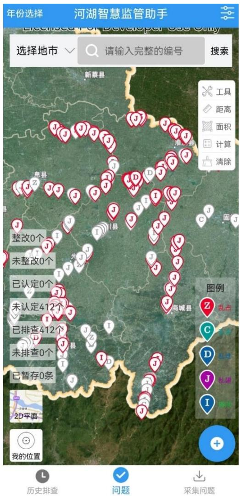
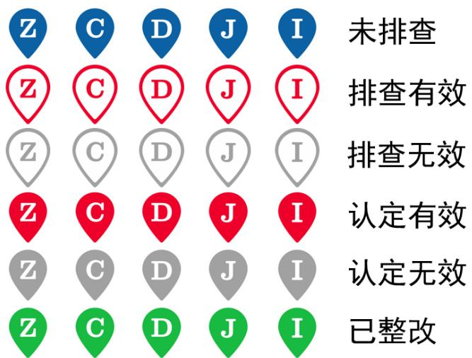
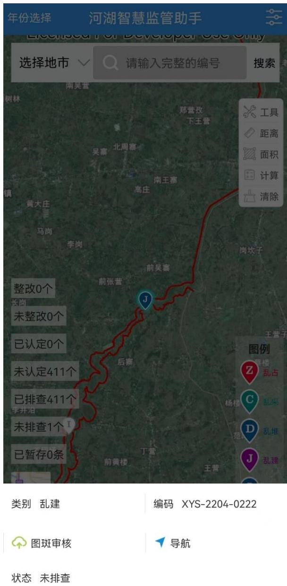
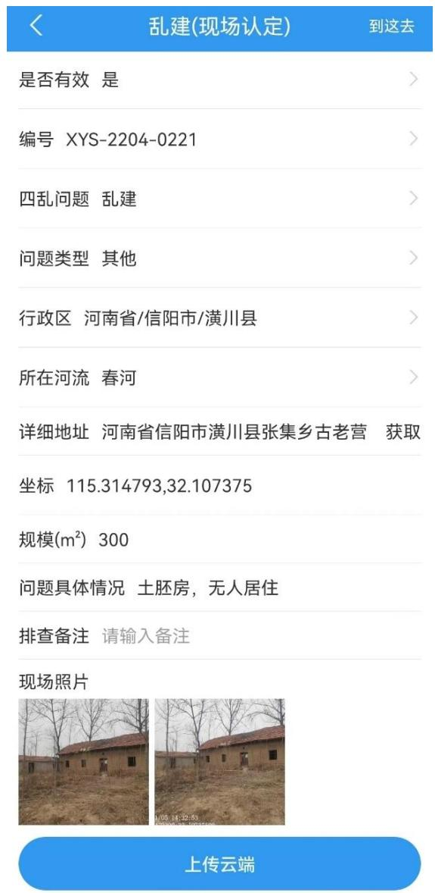

为了方便工作人员开展现场排查、认定工作，提高工作效率，开发了 移动端的信阳市河湖智慧监管助手 APP。 主界面以地图形式展示了账户权限范围内的“四乱”及碍洪问题空间分布，五类问题分别用不同字母进行标识，其中“Z”表示“乱占”，“C”表示“乱采”，“D”表示“乱堆”，“J”表示“乱建”，“I”表示“碍洪问题”。用户可以通过界面上方的搜索栏快速定位至疑似问题点，也可以在地图上通过点选方式查看问题点详情。界面左侧汇总了所有问题的排查、认定和整改情况，点击对应按钮可在地图上单独显示相应点图层。不同排查阶段的问题点使用不同颜色进行标识，其中解译完成但未排查的问题点为蓝底白线；已排查初步判定是疑似问题的为白底红线；已排查是非疑似问题的为白底灰线；现场排查后，需要对排查属实的点（白底红线）逐个进行认定，认定是有效的为红底白线；认定是无效的为灰底白线；认定有效的点进入到监管体系中，分时间逐步进行整改，经复核完成整改的问题点为绿底白线。信阳市河湖智慧监管助手 APP主界面如图3.5-6 所示，符号系统如图 3.5-7 所示。  图 3.5-6 信阳市河湖智慧监管助手APP 界面  图 3.5-7 符号颜色对应图 点击某个疑似问题点即可查看对应详细信息。为了方便现场核查人员 快速到达问题点，智慧监管助手 APP提供了导航功能，点击“导航”按钮，即可调用手机安装的第三方导航软件或浏览器进行导航，如图 3.5-8 所示。  图 3.5-8 点选问题点弹窗 到达现场后，定位至当前位置，选择该问题点后，点击“图斑审核”按钮即可进行现场认定工作，界面如图 3.5-9 所示。在该界面用户可以编辑“四乱”问题类型，根据定位自动获取现场详细地址，通过文字和照片描述现场具体情况，同时 APP 具备新增问题点的功能，对于现场发现的新问 题也可以在 APP 中进行增加补充。当地水行政部门也可以借助 APP 开展现场认定、整改核查等后续工作。  图 3.5-9 现场核查内容页面
