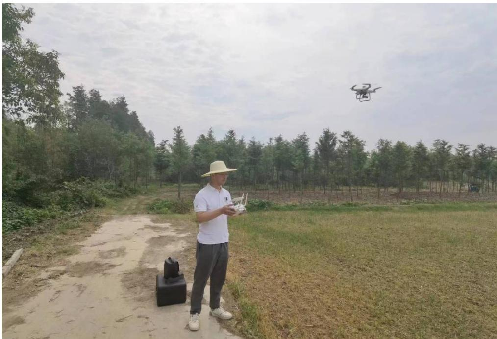
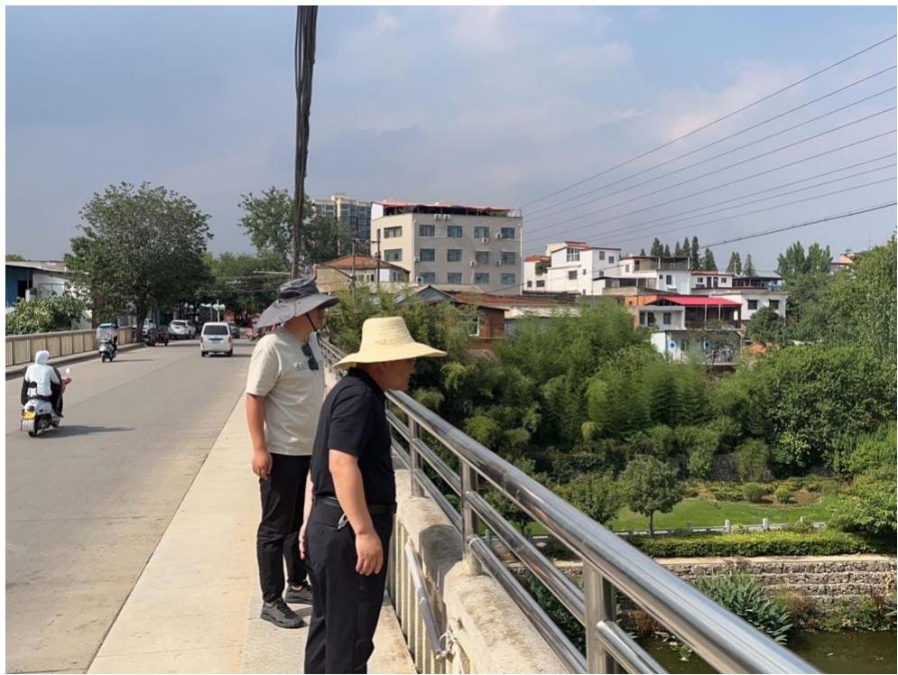

基于卫星遥感影像解译的疑似“四乱”及碍洪问题，由于时效性，或者解译人员的主观性，可能与现场实际情况有所出入。为了能够全方位、全覆盖、高标准地掌握信阳市市级河流的“四乱”及碍洪问题现状，需要开展现场核查工作。现场核查主要采用无人机航拍、手机拍照等方式，依 靠开发的信阳市河湖智慧监管助手 APP 进行外业核查和数据实时上传。对信阳市辖区范围内解译的 116 个疑似“四乱”及碍洪问题逐一进行了现场详查，排除一些水利工程用房和占地情况，以及部分已经完成整改的问题，共初步判定疑似问题 70 个，其中初步判定疑似“四乱”问题共有 63个，其中“乱建”47 个，“乱采”3 个，“乱堆”8 个，“乱占”5 个；疑似妨碍河道行洪问题 7 个，详细统计信息如表 3.6-1 所示。  图 3.6-1 无人机现场核查  图 3.6-2 人工现场复核 表 3.6-1 信阳市疑似碍洪及“四乱”问题初步核查结果 序号 县区 碍洪 乱占 乱建 乱堆 乱采 合计 1 浠河区 2 1 5 1 0 9 2 平桥区 2 2 5 4 0 13 3 罗山县 0 0 10 1 0 11 4 潢川县 0 0 2 0 0 2 5 固始县 1 0 4 0 0 5 6 息县 0 0 1 0 1 2 7 淮滨县 1 0 2 1 1 5 8 光山县 0 2 14 0 1 17 9 商城县 1 1 3 1 0 5 10 新县 0 0 1 0 0 1 合计 7 5 47 8 3 70
