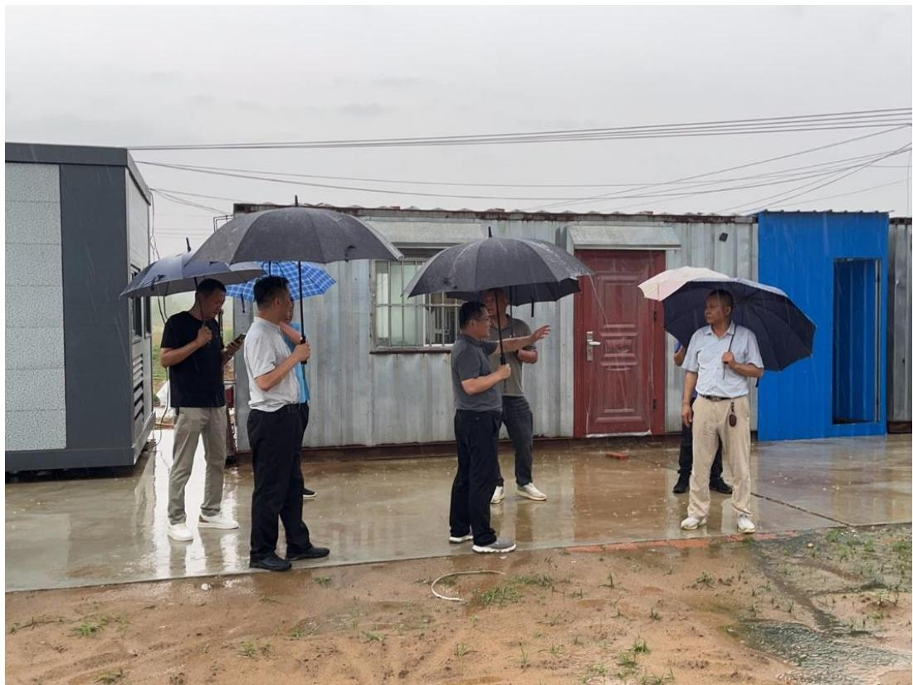
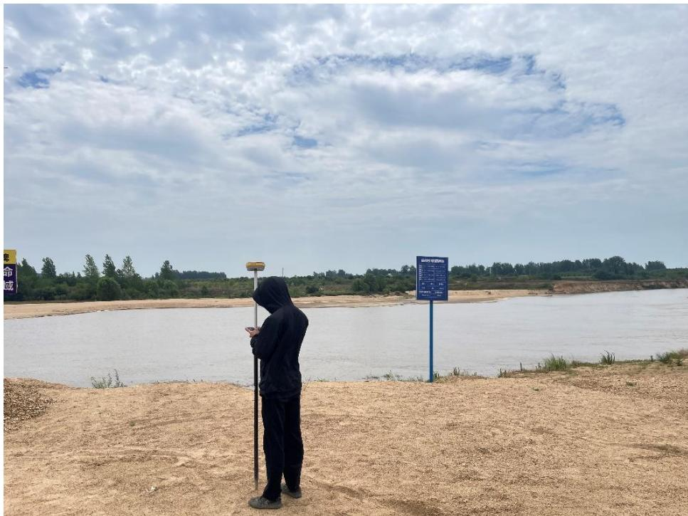
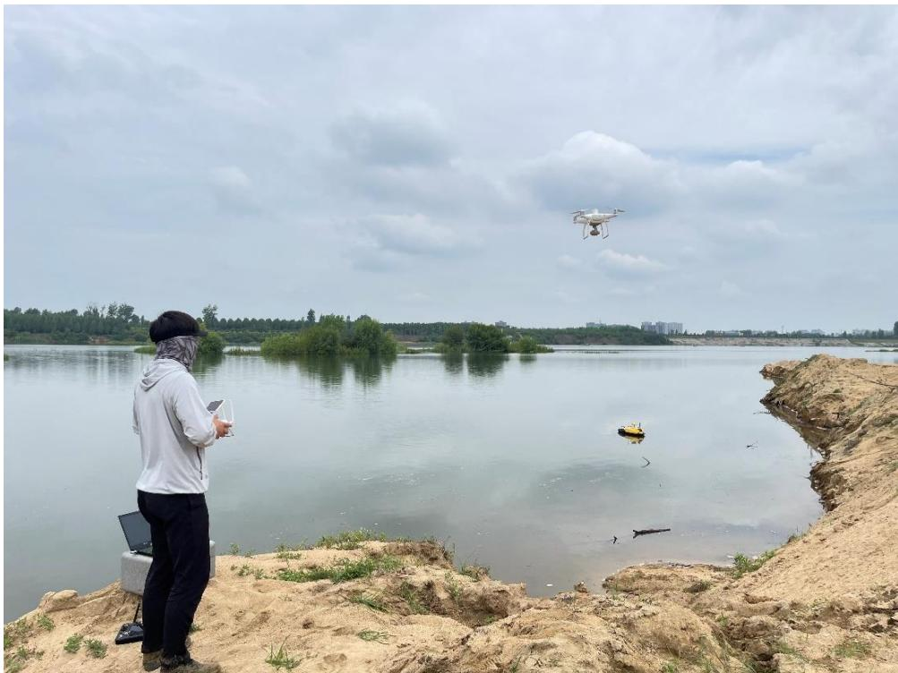
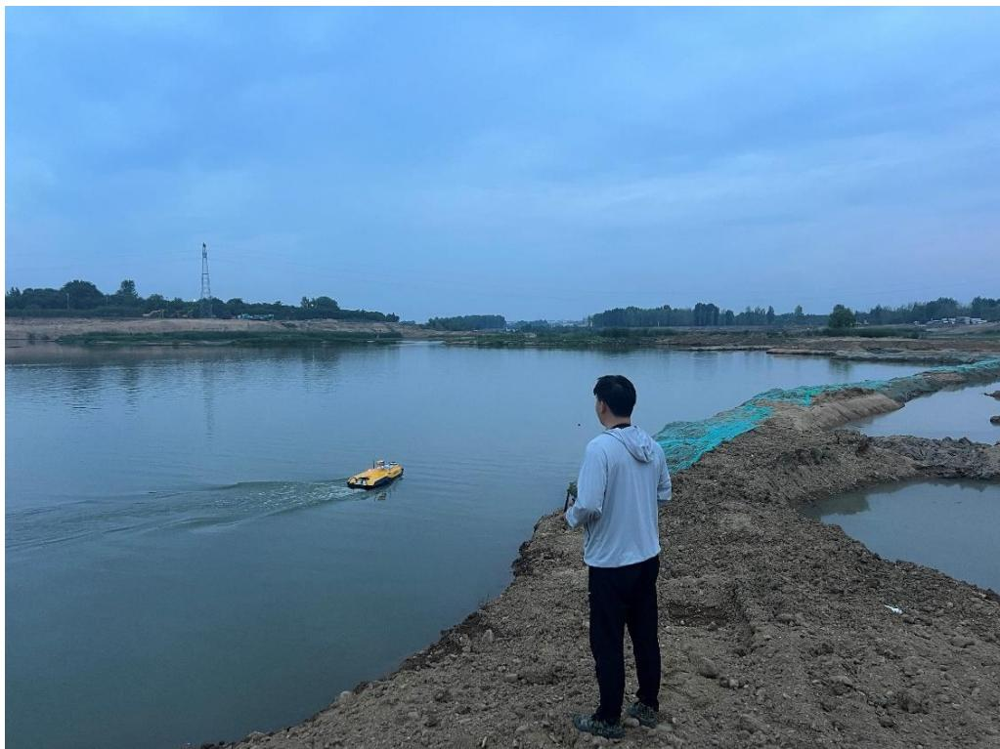

本次监测的主要内容包括：采砂作业区基本情况监测、现场监督管理 情况监测、开采范围监测、开采深度监测、河道河势及生态环境影响监测，评估采砂规划实施执行过程中采砂活动对河道河势、水生态等方面的影响，以及是否按照制定的采砂规划（年度实施方案、砂石处置方案）执行。 工作组利用卫星遥感、无人机、无人船、RTK 测量仪、采砂监管 APP等现代化信息技术手段与设备，对信阳市 2023 年度批复的 47 处许可采砂区域及正在实施的 8 处河道疏浚工程进行现场监测（监管采区清单见下表），对比规划方案、年度实施方案（砂石处置方案）、及开采前测量成果数据进行分析评估并形成监测意见。 表3.7-1 信阳市 2023年度批复采区与疏浚工程现场监管清单 序号 县区 河湖名称 类型 采区(工程)名称 作业内容 1 湄河区 游河 批复采砂 吴店砂场 现场监管、航飞、测深 2 平桥区 湄河 批复采砂 王水砂场 现场监管、航飞、测深 3 平桥区 湄河 批复采砂 上天梯砂场 现场监管、航飞、测深 4 平桥区 湄河 批复采砂 闵岗砂场 现场监管、航飞、测深 5 平桥区 淮河 批复采砂 郑湾砂场 现场监管、航飞、测深 6 罗山县 竹竿河 批复采砂 南里店砂场 现场监管、航飞、测深 7 罗山县 竹竿河 批复采砂 北洼砂场 现场监管、航飞、测深 8 罗山县 竹竿河 批复采砂 章楼砂场 现场监管、航飞、测深 9 罗山县 竹竿河 批复采砂 天湖砂场 现场监管、航飞、测深 10 罗山县 竹竿河 批复采砂 青龙砂场 现场监管、航飞、测深 11 罗山县 湄河 批复采砂 邵湾砂场 现场监管、航飞、测深 12 罗山县 湄河 批复采砂 李寨砂场 现场监管、航飞、测深 13 罗山县 竹竿河 批复采砂 中山砂场 现场监管、航飞、测深 14 罗山县 竹竿河 批复采砂 闵湾砂场 现场监管、航飞、测深 15 罗山县 竹竿河 批复采砂 青莲砂场 现场监管、航飞、测深 16 罗山县 竹竿河 批复采砂 河口砂场 现场监管、航飞、测深 17 罗山县 湄河 批复采砂 王湾砂场 现场监管、航飞、测深 18 息县 竹竿河 批复采砂 陈大洼、景美店砂场 现场监管、航飞、测深 19 息县 竹竿河 批复采砂 李家庄砂场 现场监管、航飞、测深 20 商城县 灌河 批复采砂 金寨砂场 现场监管、航飞、测深 21 商城县 灌河 批复采砂 李家楼砂场 现场监管、航飞、测深 22 商城县 灌河 批复采砂 凤凰窝砂场 现场监管、航飞、测深 23 商城县 灌河 批复采砂 大湖沿砂场 现场监管、航飞、测深 24 商城县 灌河 批复采砂 李湖砂场 现场监管、航飞、测深 25 商城县 灌河 批复采砂 范围孜砂场 现场监管、航飞、测深 26 商城县 灌河 批复采砂 坝下砂场 现场监管、航飞、测深 27 新县 潢河 批复采砂 浒湾砂场 现场监管、航飞 28 潢川县 白露河 批复采砂 三星砂场 现场监管、航飞、测深 29 潢川县 白露河 批复采砂 傅营沙场 现场监管、航飞 30 潢川县 潢河 批复采砂 宋寨砂场 现场监管、航飞、测深 31 潢川县 白露河 批复采砂 黄堰砂场 现场监管、航飞、测深 32 固始县 史灌河 批复采砂 SGH1(潘庄可采区) 现场监管、航飞、测深 33 固始县 史灌河 批复采砂 SGH2(李棚-黄寨可采区) 现场监管、航飞、测深 34 固始县 史灌河 批复采砂 SGH3(种子场可采区) 现场监管、航飞、测深 35 固始县 史灌河 批复采砂 SGH4(童庙-老李集可采区) 现场监管、航飞、测深 36 固始县 史灌河 批复采砂 SGH5(大营-范营可采区) 现场监管、航飞、测深 37 固始县 史河 批复采砂 SH1(汪营可采区) 现场监管、航飞、测深 38 固始县 史河 批复采砂 SH2(夹河-红石可采区) 现场监管、航飞、测深 39 固始县 史河 批复采砂 SH3-1(陈营-柳沟可采点) 现场监管、航飞、测深 40 固始县 史河 批复采砂 SH3-2(郑堂-大庄可采点) 现场监管、航飞、测深 41 固始县 史河 批复采砂 SH4(余庆-人主可采点) 现场监管、航飞、测深 42 固始县 史河 批复采砂 SH5-1(南元-祝家楼可采点) 现场监管、航飞、测深 43 固始县 史河 批复采砂 SH5-2(牛老家-龙潭可采点) 现场监管、航飞、测深 44 固始县 史河 批复采砂 SH6(毕店可采区) 现场监管、航飞、测深 45 固始县 史河 批复采砂 SH7(泗湖-长兴可采区) 现场监管、航飞、测深 46 固始县 灌河 批复采砂 GH1(淮堰-周集可采区) 现场监管、航飞、测深 47 固始县 灌河 批复采砂 GH4(叶岗可采区) 现场监管、航飞、测深 48 息县 淮河 疏浚工程 淮河（竹竿河入淮口至桃花岛段）航道疏浚及岸线整治工程 现场监管、航飞 49 息县 淮河 疏浚工程 息县淮河干流桃花岛至息县枢纽段河道整治工程 现场监管、航飞 50 固始县 史河 疏浚工程 固始县2021年重点水毁修复黎集滚水坝上游清淤扩容工程 现场监管、航飞、测深 51 固始县 夹河 疏浚工程 固始县史河故道（夹河）区域综合整治工程 现场监管、航飞 52 光山县 潢河（袁湾水库） 疏浚工程 河南省袁湾水库库底特殊清理工程 现场监管、航飞 53 豫东南高新区 潢河 疏浚工程 豫东南高新技术产业开发区潢河生态治理工程（一期） 现场监管、航飞、测深 54 罗山县 九龙河 疏浚工程 信阳市罗山县九龙河彭新镇张墩至铁铺镇镇区段治理工程 现场监管、航飞 55 新县 七里坪河 疏浚工程 信阳市新县七里坪河郭家河乡镇区段治理工程 现场监管、航飞  图 3.7-1 现场监督检查  图 3.7-2 提砂作业码头高程测量  图 3.7-3 无人机航空摄影测量  图 3.7-4 无人船水下测量。
