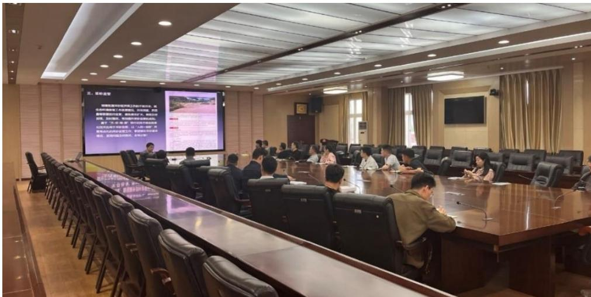
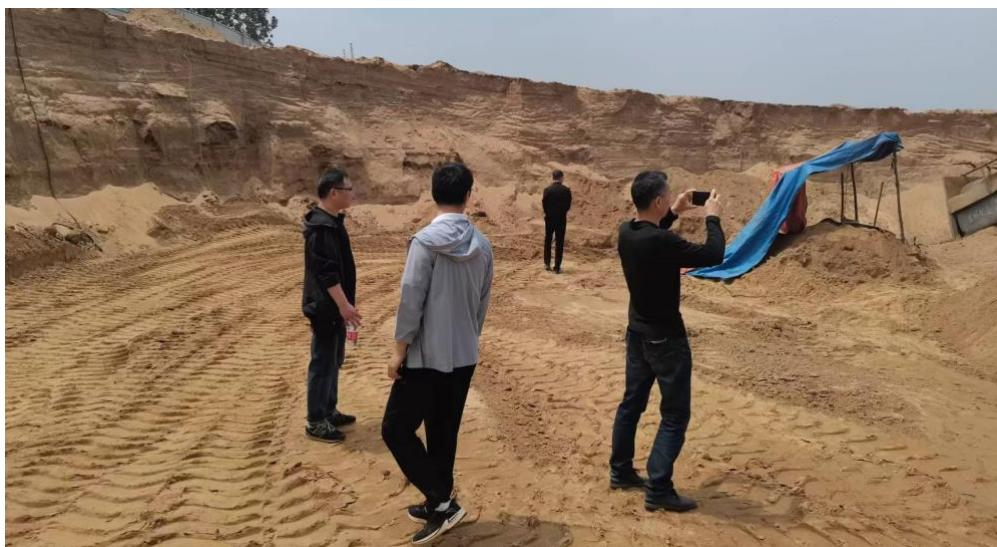
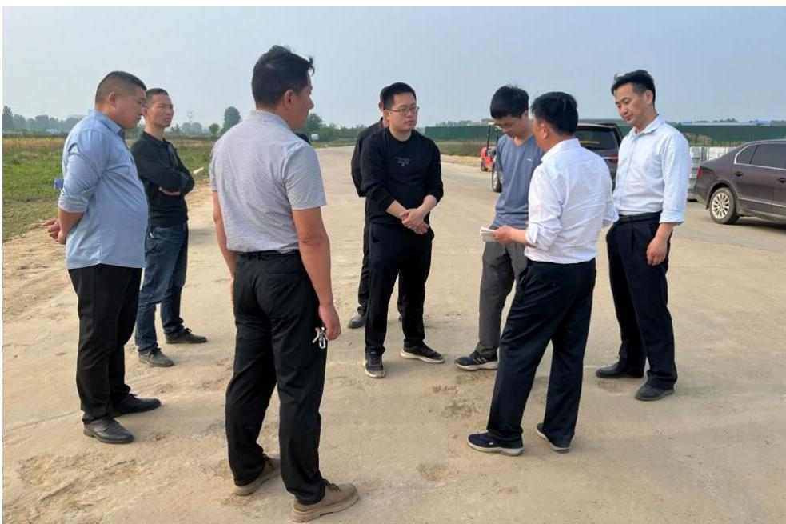

为了便于信阳市各级河长办及成员单位熟练操作“智慧巡河”相关信息化管理系统，项目团队对信阳市河长办成员单位进行了统一的系统应用培训，并按设置好的账号权限进行分权限管理，各成员单位只能查看管辖区域内的基本情况，所有“四乱”及碍洪问题从疑似问题发现到现场详查，再到各级河长办认定，以及最后的整改结果上传，整改情况的抽查都可以在系统中便捷地上传和查看，进而实现了全流程的信息化、智能化监管。 为了进一步检验培训成效，在实践中熟练掌握河湖智慧监管系统及APP 的操作，信阳市水利局河长制工作科联合市河湖事务中心河长制事务科到息县、潢川县、固始县开展河道采砂暗访及现场监管工作，我公司作为技术支撑单位由相关技术人员携带无人机、单波束测深无人船、河湖智慧监管 APP 等软硬件监测设备全程参与实践培训活动。  图 3.9-1 “智慧巡河”应用现场培训会  图 3.9-2 “智慧巡河”系统应用现场实践教学  图 3.9-3 培训成员与水行政主管部门局负责人现场交流
