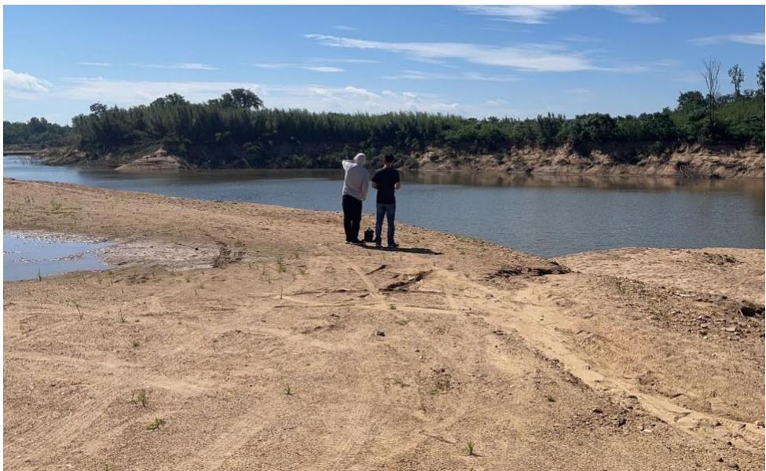
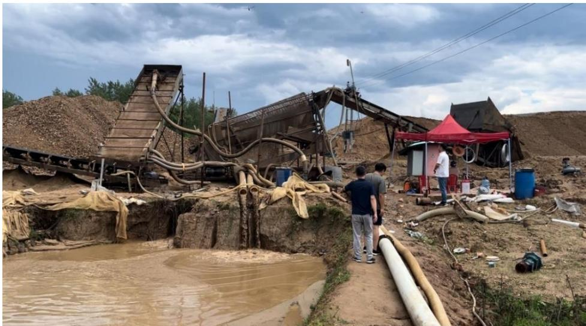

为了加强河砂管理，压实地方主体责任，信阳市河长办成员单位在我公司的技术支撑下对采砂区年度实施情况监测与评估过程中发现问题较多的许可采区和疏浚工程开展采砂监管“回头看”。“回头看”工作小组一行现场查看了罗山县、息县、固始县、商城县、光山县、平桥区等 6 个县区，共 28 处采点（含疏浚工程），总体情况见表 3.10-1，各采区详细情况见本报告第 5 章第 11 节。  图 3.10-1 采砂监管“回头看”小组查看整改后河道变化情况  图 3.10-2 采砂监管“回头看”人员查看作业机械工作状态 表3.10-1 信阳市采砂监管“回头看”情况汇总表 序号 县区 采区名称 河流 回头看情况 1 固始县 郑堂大庄可采点 史河 问题已整改 2 固始县 夹河红石采区 史河 已完成整改 3 固始县 陈营沙场 史河 已整改 4 固始县 夹河疏浚工程 夹河 较上次调研无变化 5 固始县 龙潭沙场 史河 问题已整改，因船集中停靠河岸边造成堵塞部分垃圾 6 固始县 汪营砂场 史灌河 采区水位较高 现场零星堆砂已被洪水冲平 7 固始县 南元祝家楼可采点 史河 岸线陡峭不平顺，码头小面积不平整，临时堆砂点过高，堆放时间过长，其余已整改 8 固始县 长兴可采区 史河 船只停靠在河道中间 9 固始县 毕店可采区 史河 已整改 10 固始县 童庙老李集采区童庙采点 史灌河 采区岸线不平顺 作业区零星沙堆已被前期洪水平复 11 固始县 童庙老李集采区老李集采点 史灌河 提沙区沙堆已转运 现场已完成平复 集装箱房屋及地磅冲淋设施已拆除。提沙码头岸线陡立，现场筛砂设备底座未拖离河道管理范围线 12 固始县 种子场可采区 史灌河 临时堆砂场堆砂已转运平复 作业机具已吊离出场 13 固始县 余庆人主可采点 史河 储砂场未覆盖，储砂场未完全封闭，其他问题已整改 14 固始县 黎集滚水坝上游清淤扩容工程 史河 河道内有堆积砂堆，施工便道未拆除完毕，河道内有作业机具 15 固始县 李棚黄寨可采区李棚采点 史灌河 紧邻河道的临时堆砂已清理平整 现有河道管理范围线内堆砂体量仍较大 正在往储砂场转运 16 固始县 李棚黄寨可采区黄寨采点 史灌河 紧邻河道边的堆砂已经清理 临时堆砂场体量较大，前不久洪水已经涨至临时储砂场下，现场仍有部分作业机具未拖离河道管理线 17 固始县 潘庄可采区 史灌河 储砂场堆砂高度已降低 并覆盖防尘网，大型船只仍采用抽砂管扎入河床的方式进行锚固，河滩零星堆砂已经被前期洪水冲平 18 固始县 周集砂场 灌河 废弃料砂堆堆砌码头侵占河道，采区上游有河滩养鹅情况，河道内船只机具料未清理 19 固始县 叶岗砂场 灌河 叶岗码头岸线边坡陡立 20 商城县 李湖砂场 灌河 存在鸡窝式、点状开采，采区岸线参差不平顺，未修复。河道红线范围内存在私人堆砂场，需转运出河道管理范围线外。较上次未整 改 21 商城县 凤凰窝砂场 灌河 采区临时堆砂未转运至储砂场,部分作业机具未拖离至河道管理范围线外,较上次未整改 22 光山县 袁湾水库库底清淤 潢河 现场除增加了边界识别牌、警示牌、储砂场堆砂高度降低,其余均未整改,同时本次调发现存在开采作业侵占河道问题 23 罗山县 闵湾砂场 竹竿河 采区岸线边坡陡立,左岸边坡已修复到位,但右岸未进行修复 24 罗山县 青莲砂场 竹竿河 采区临时堆砂过高,目前正在转运,下游鸡商高速施工便道正在平复,新发现高速桥下游河道左岸有建筑垃圾 25 息县 陈大洼、景美店砂场 竹竿河 过期的识别牌已清除、船只已拖离河滩靠岸锚固,其未找到的建筑垃圾依旧在河道内未清理 26 息县 竹竿河入淮口至桃花岛疏浚工程 淮河 工程7个标段中,目前只有一个标段在开采,现场作业不规范,没有严格按照砂石处置方案中要求的逐层剥离的方式开采,存在鸡窝式开采,现场多处深砂坑。储砂场堆砂超高 27 息县 桃花岛至息县枢纽疏浚工程 淮河 河道内临时堆砂未完全转移至储砂场,堆砂已推平,高度降低至四米以下 28 平桥区 郑湾砂场 淮河 储砂场堆砂高度超高,采区内有建筑垃圾(石块)未清理,临时板房、地磅、部分作业机具位于河道管理范围内,施工临时便道未完全拆除。
