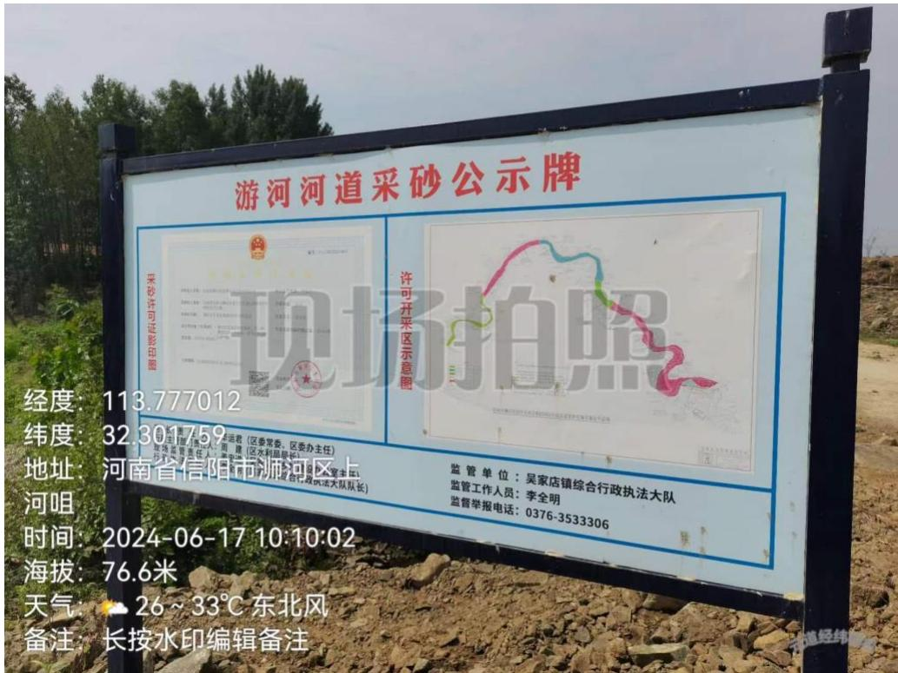
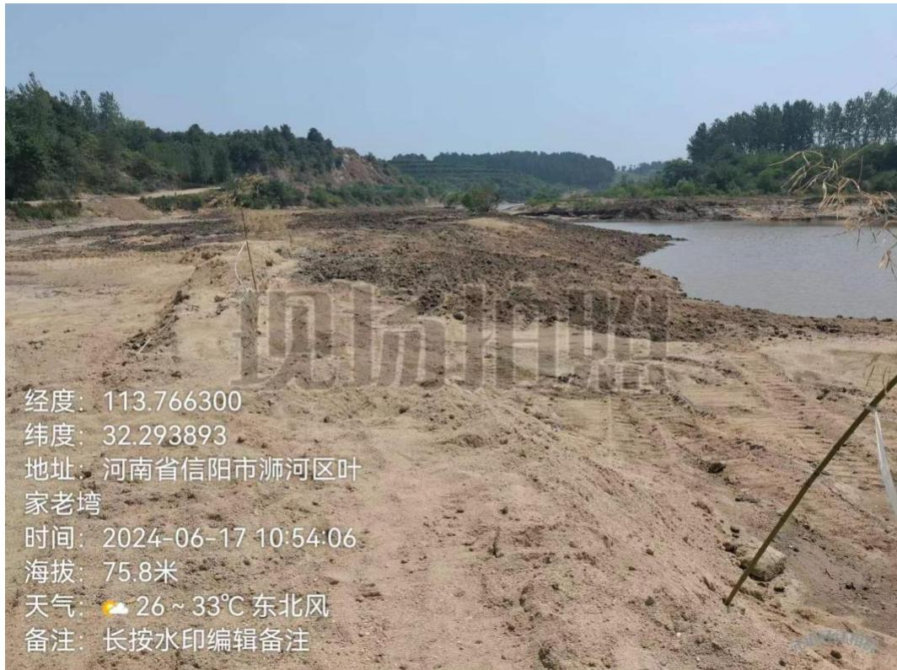
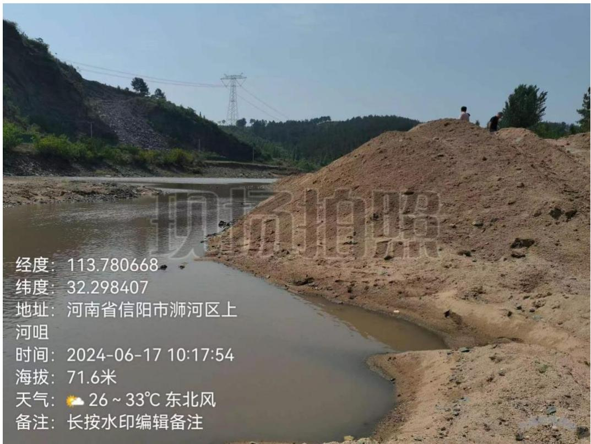
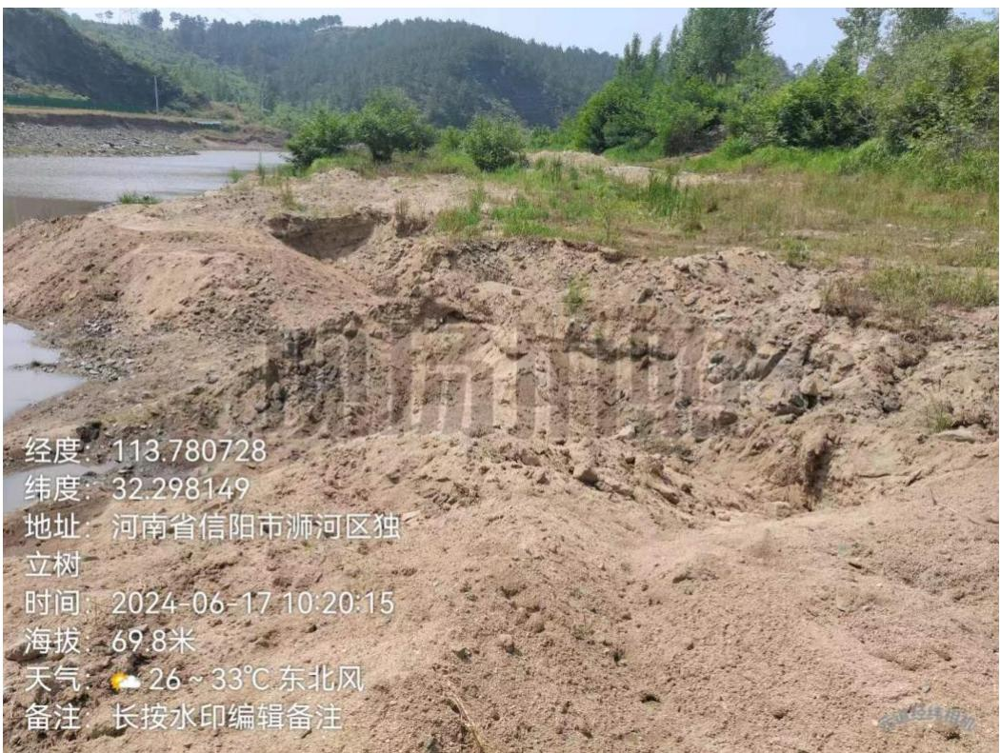
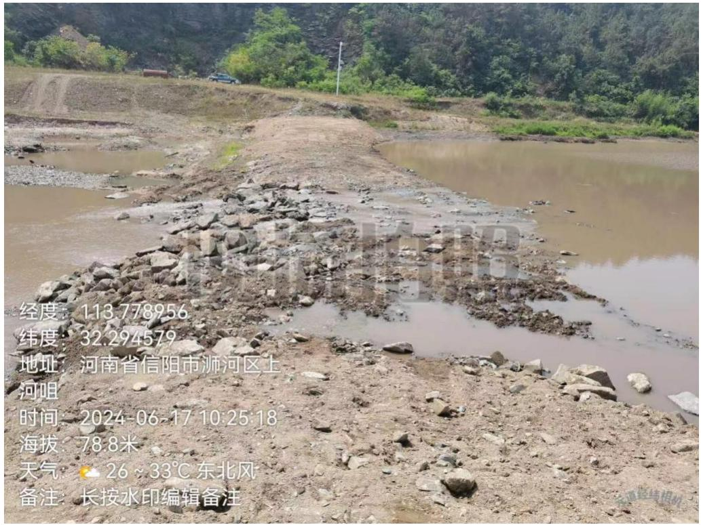
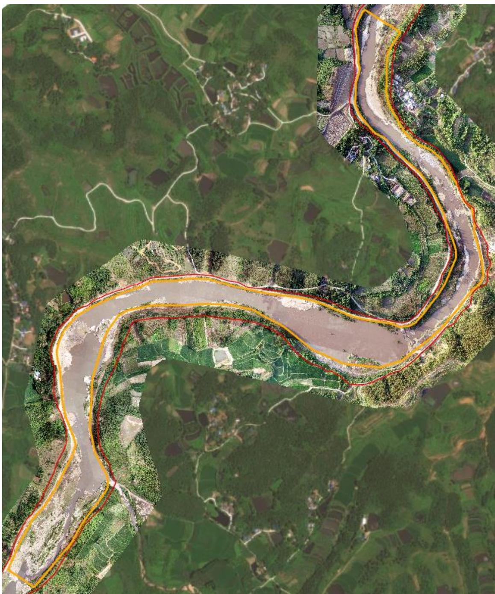
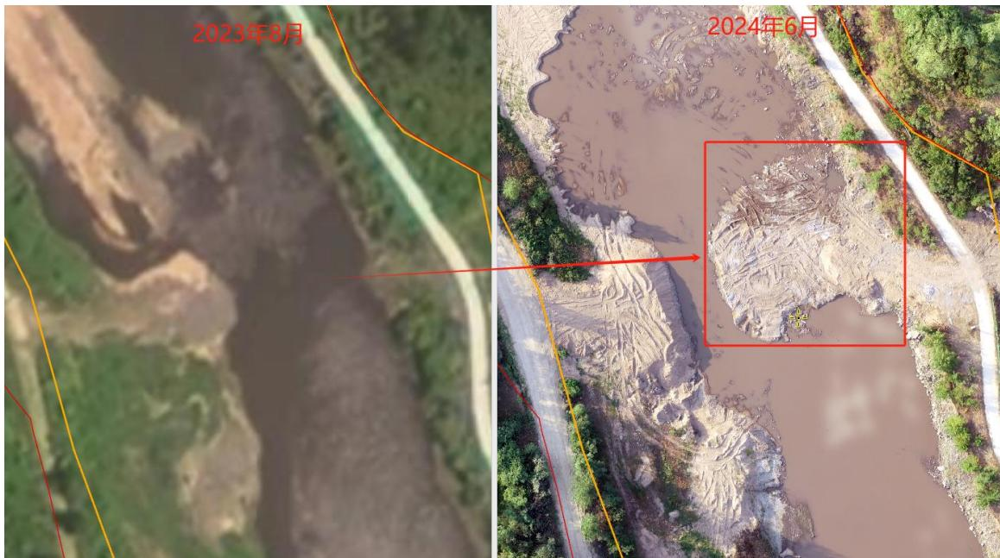
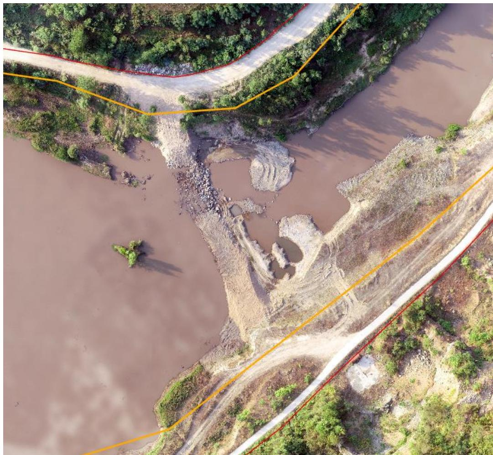
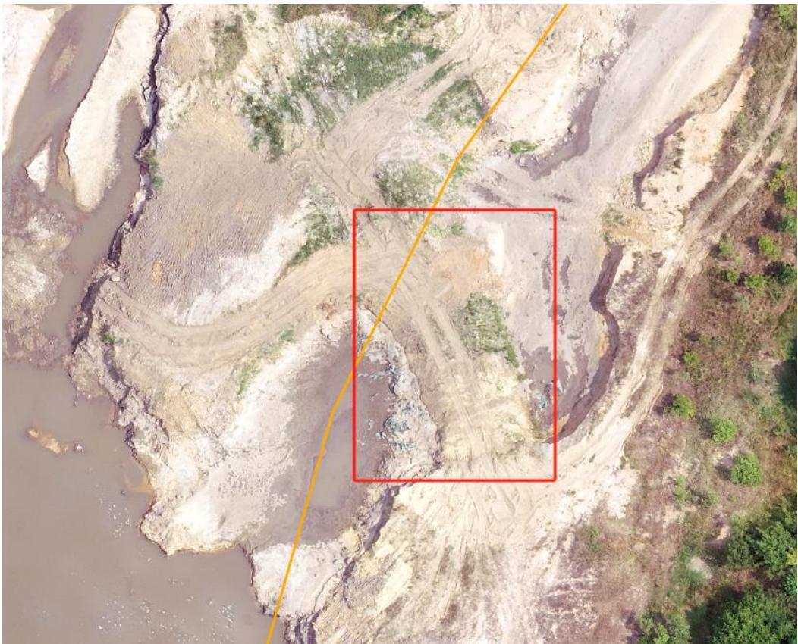
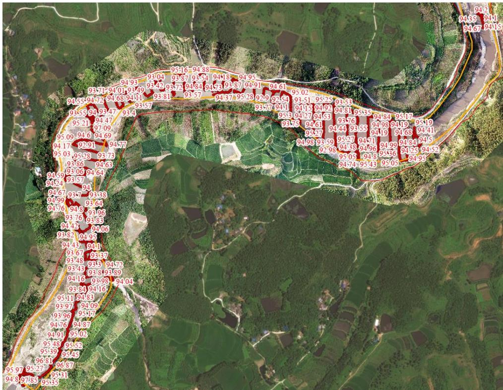

（1）现场监测 浉河区豫浉砂许〔2023〕第 01 号开采区域位于游河，现场发现：河道内弃土未及时清理，采区局部区域坑洼不平、未进行生态修复，施工围堰未拆除，存在妨碍河道行洪风险。采区范围内存在私自填河扩岸措施，未经水行政许可部门批复及防洪影响评价，形成改变河道河势现状。  图 5.1-1 采砂公示牌  图 5.1-2 采区范围内填河扩岸改变河道河势   图 5.1-3 采区河道内弃土未清理 图 5.1-4 采区局部区域坑洼不平、未进行生态修复  图 5.1-5 施工围堰未拆除 # （2）无人机航测 采砂监管测量人员对 YH04#可采区（桩号 $2 5 + 3 0 0 \sim 2 8 + 8 0 0$ ）进行无人机航空摄影测量，对比开采前卫星遥感影像同时叠加规划批复范围进行评估分析，未发现超范围开采问题，采区现场多处坑洼不平，生态修复有待提升，采区下游存在一处作业码头侵占河道，改变河道局部走势，有两处围堰未拆除影响汛期行洪通畅。  图 5.1-6YH04#可采区无人机正射影像  图 5.1-7 采区下游开采作业平台侵占河道（开采前后对比）  图 5.1-8 采区中游围堰未拆除存在碍洪风险  图 5.1-9 采区上游围堰未拆除影响河道行洪通畅 # （3）无人船水下测量 通过无人船单波束声呐测量开采区水下地形，对比开采前测量成果，依据采砂年度实施方案中要求的 YH04#可采区开采后控制高程 89.91-96.00m 进行分析评估，开采后实测水下高程均在92.31m以上，高于89.91m的开采最低控制高程，未发现超深度开采问题。  图 5.1-10 YH04#可采区无人船实测数据
