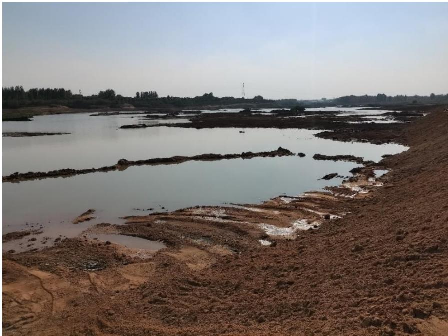
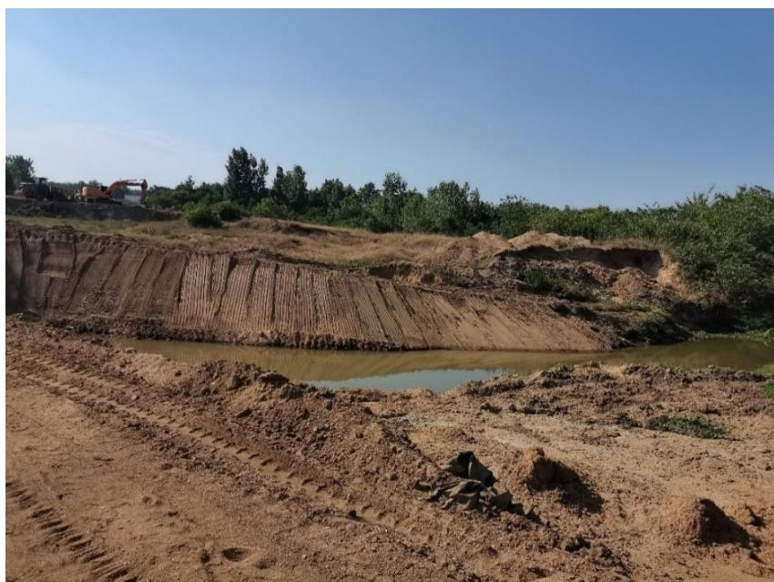
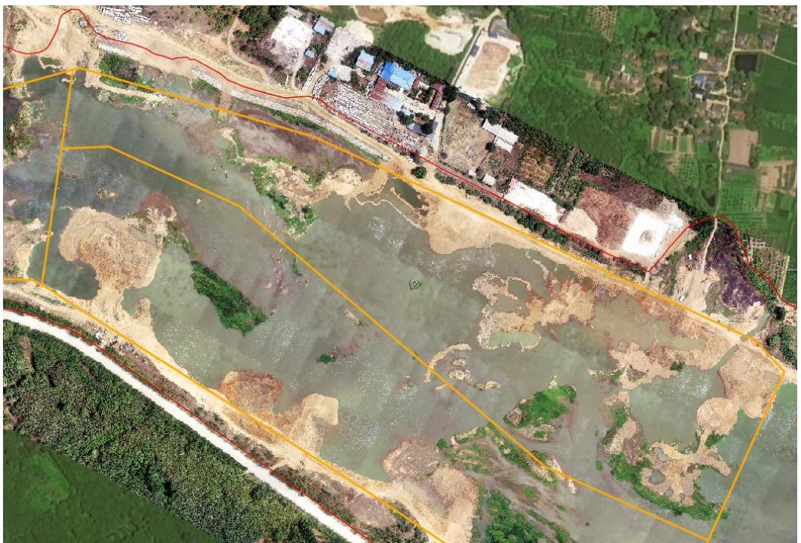
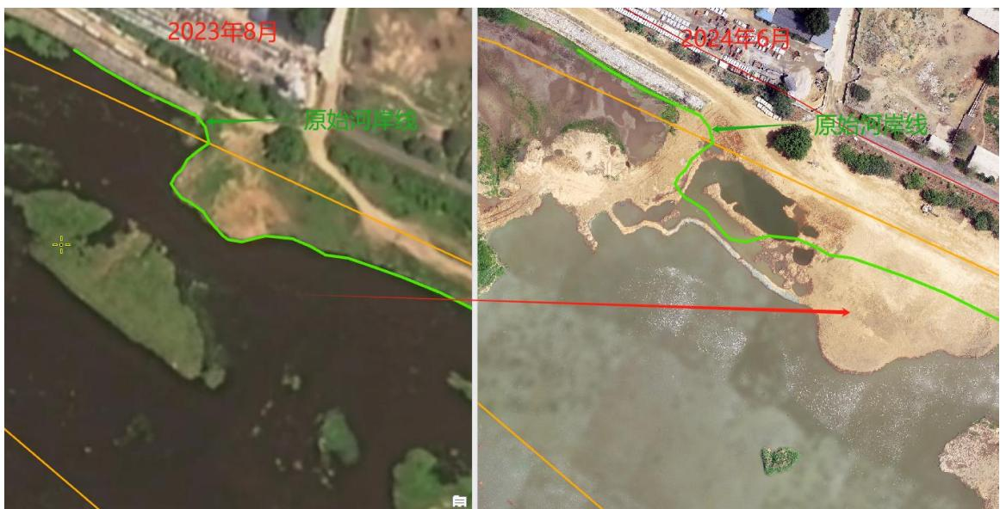
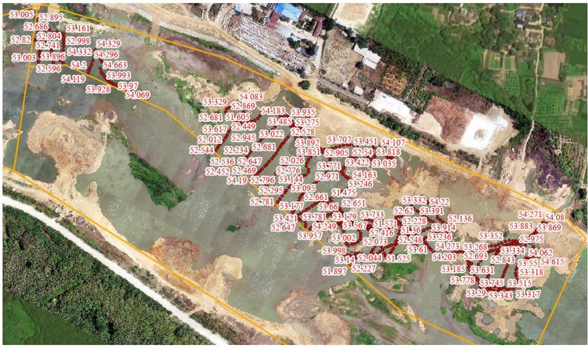

（1）现场监测 信阳市浉河珍珠桥～312 国道桥平桥区 SH03#01 可采区未严格执行边开采边修复，开采结束后虽进行了生态修复，但标准不高。   图 5.2-1 平桥区 SH03#-1 采区边坡 图 5.2-2 平桥区 $\mathrm { S H } 0 3 \# - 1$ 采区边坡 # （2）无人机航测 采砂监管测量人员对平桥区 SH03#01 可采区进行了无人机航空摄影测量，叠加规划批复范围（ $\mathrm { K } 3 1 + 1 0 0 - \mathrm { K } 3 2 + 1 0 0$ 北岸）评估分析，未发现有超范围开采情况，采区现场坑洼不平，生态修复不到位；采区北岸中部提砂作业码头疑似侵占河道。   图 5.2-3 平桥区浉河北岸SH03#01 可采区无人机正射影像 图 5.2-4 采区中部提砂作业区疑似侵占河道 # （3）无人船水下测量 通过无人船单波束声呐测量开采区水下地形，对比开采前测量成果，依据采砂年度实施方案中要求的 SH03#-1 可采区开采后控制高程 $5 1 . 6 3 \mathrm { m } \mathrm { - }$ 51.89m 进行分析评估，采区开采后实测水下高程普遍高于 51.63m ，未发现超深度开采问题。  图 5.2-5 平桥区浉河SH03#-1 可采区无人船实测数据
