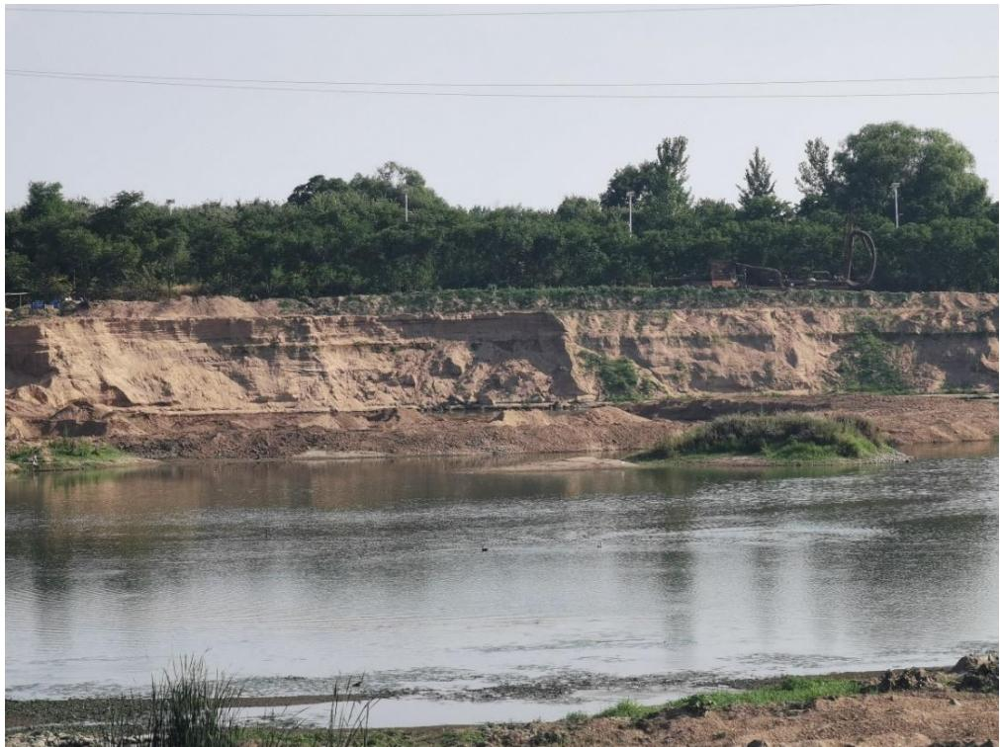
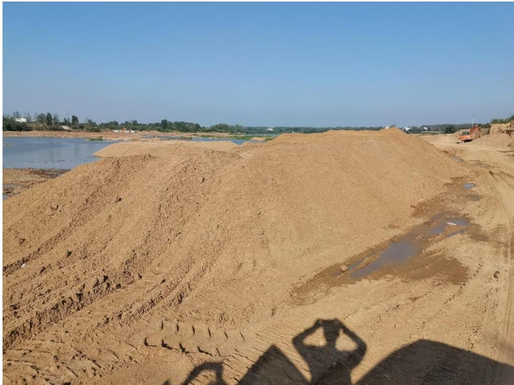
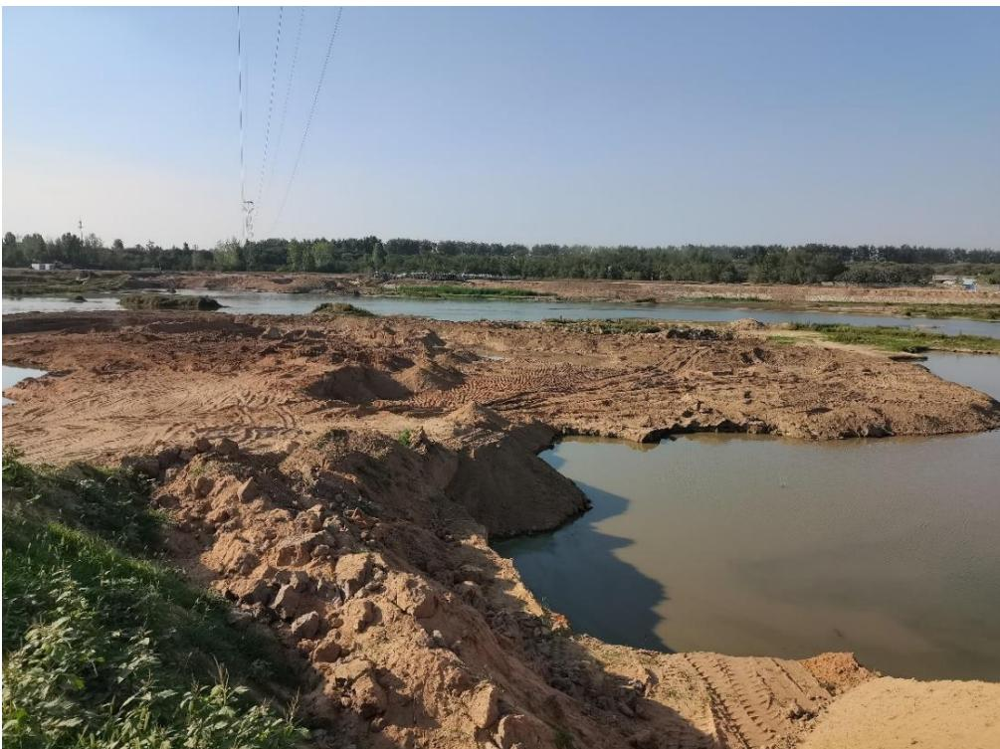
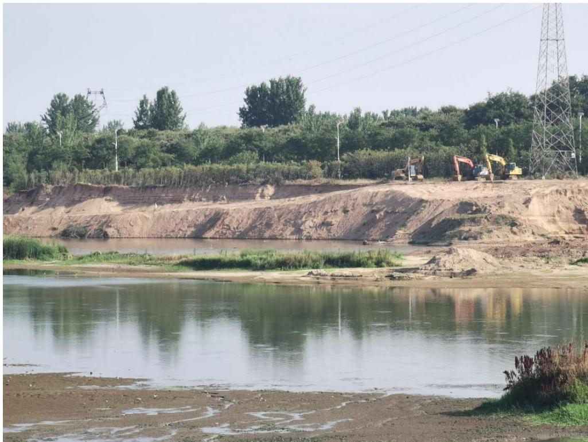
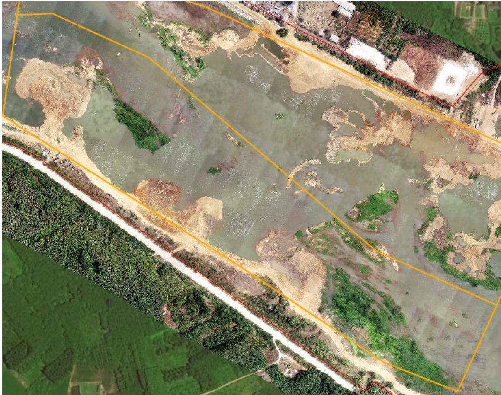
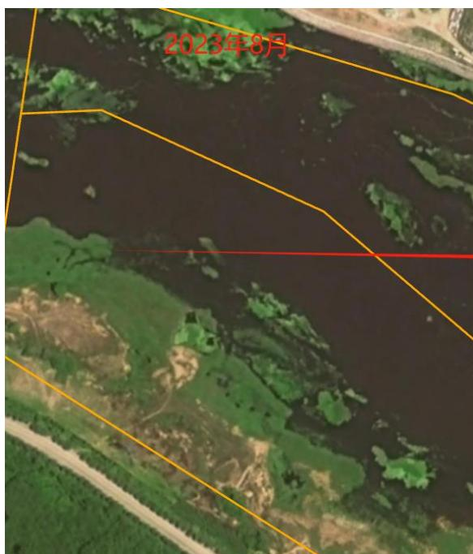
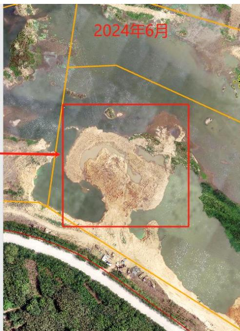
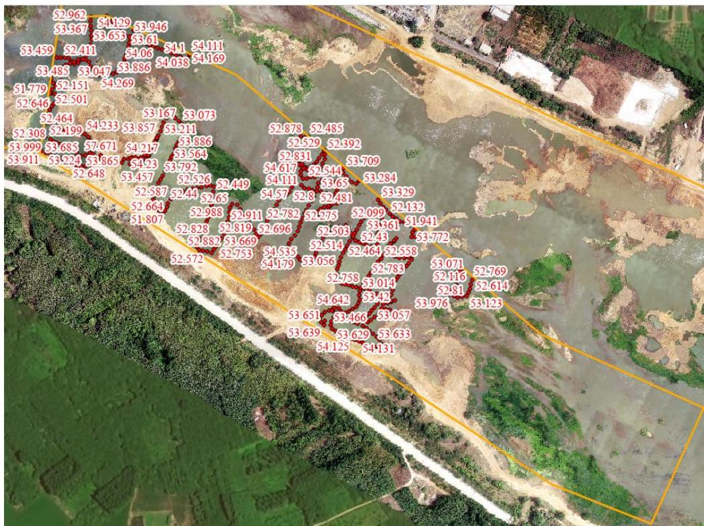

（1）现场监测 信阳市浉河珍珠桥～312 国道桥平桥区 SH03#-2 可采区采砂作业导致岸线边坡陡立，汛期存在冲刷坡底隐患，需在开采作业过程中执行规划方案，以采砂工程结合河道治理，放缓工程边坡；现场存在多处弃料未及时转运；作业机具未集中规范停靠。  图 5.2-6 平桥区 SH03#-2 采区边坡陡立  图 5.2-7 平桥区 $\mathrm { S H } 0 3 \# - 2$ 采区弃料未及时转运  图 5.2-8 采区生态修复不到位  图 5.2-9 采区作业机具未集中规范停靠 # （2）无人机航测 采砂监管测量人员对平桥区 SH03#-2 可采区进行了无人机航空摄影测量，叠加规划批复范围（ $\mathrm { K } 3 1 + 1 0 0 - \mathrm { K } 3 2 + 1 0 0$ 南岸）评估分析，开采活动主要位于采区中上游区域，未发现有超范围开采情况，采区上游提砂作业码头疑似侵占河道，现场坑洼不平生态修复不到位。   图 5.2-10 上天梯浉河南岸SH03#-2可采区无人机正射影像  图 5.2-11 上天梯采区提砂码头疑似侵占河道 # （3）无人船水下测量 通过无人船单波束声呐测量开采区水下地形，对比开采前测量成果，依据采砂年度实施方案中要求的 SH03#-2 可采区开采后控制高程 51.63m-51.89m 进行分析评估，采区开采后实测水下高程高于 51.89 的开采最高控制高程，未发现超深度开采问题。  图 5.2-12 平桥区浉河SH03#-2可采区无人船实测数据
