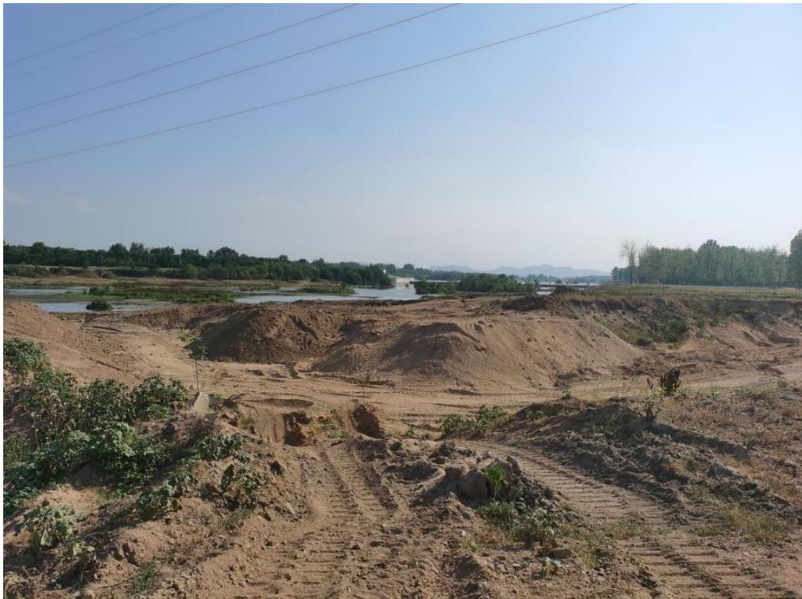
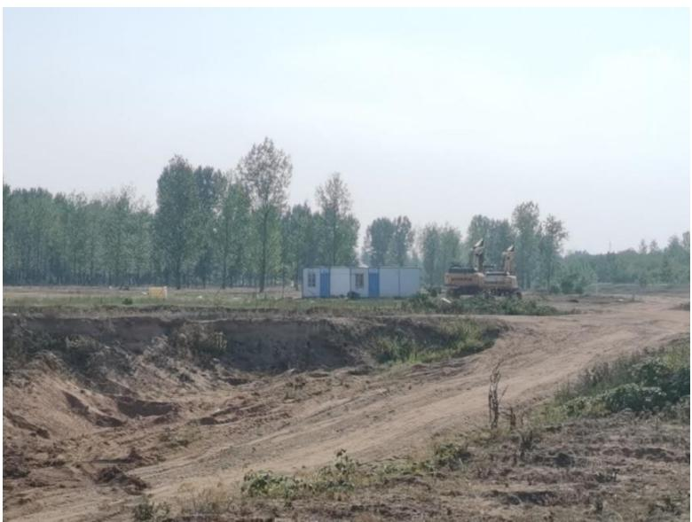
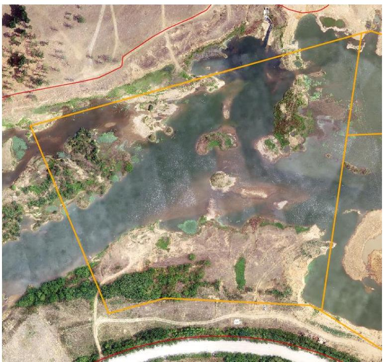
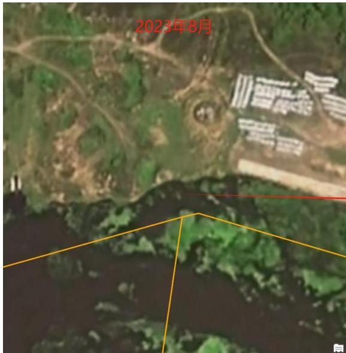
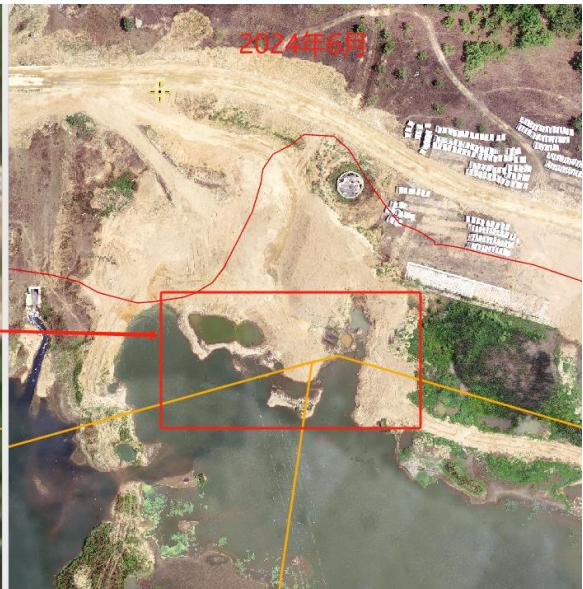
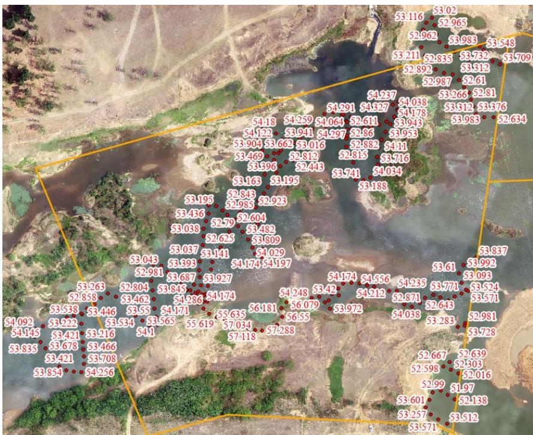

（1）现场监测 信阳市浉河珍珠桥～312 国道桥平桥区 SH03#-3 可采区在作业区内存在若干堆砂；河道管理范围线内临时管理用房占用河道，存在乱堆、乱建问题。  图 5.2-13 采区内未清运堆砂  图 5.2-14采区内临时管理用房占用河道 # （2）无人机航测 采砂监管测量人员对平桥区 SH03#-3 可采区进行了无人机航空摄影测量，叠加规划批复范围（ $\mathrm { K } 3 2 \substack { + 1 0 0 - \mathrm { K } 3 2 \substack { + 4 0 0 } }$ ）评估分析，未发现有超范围开采情况，现场实际开采面积不大，采区下游北岸作业码头疑似存在侵占河道情况，采区现场生态修复有待提升。  图 5.2-15 平桥区浉河SH03#-3可采区无人机正射影像   图 5.2-16 采区疑似提砂作业区侵占河道 # （3）无人船水下测量 通过无人船单波束声呐测量开采区水下地形，对比开采前测量成果，依据采砂年度实施方案中要求的 SH03#-3 可采区开采后控制高程 $5 1 . 8 9 \mathrm { m } \mathrm { - }$ 52m 进行分析评估，采区开采后实测水下高程均在 52m 以上，未发现超深度开采问题。  图 5.2-17 平桥区浉河SH03#-3可采区无人船实测数据
