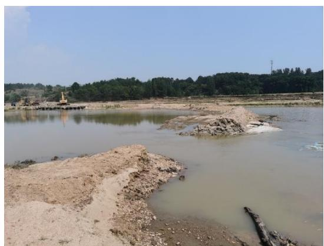
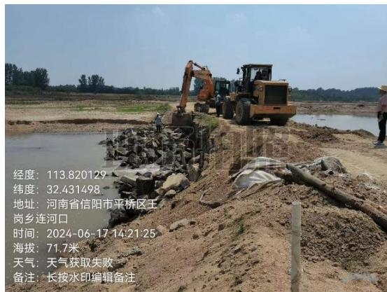
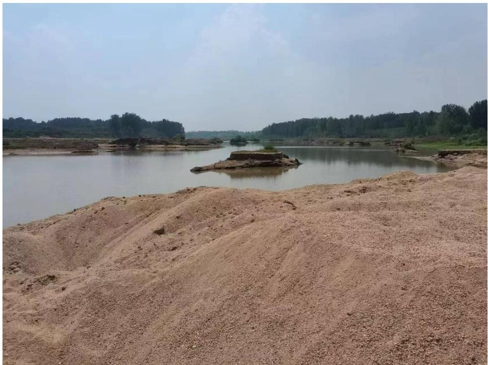
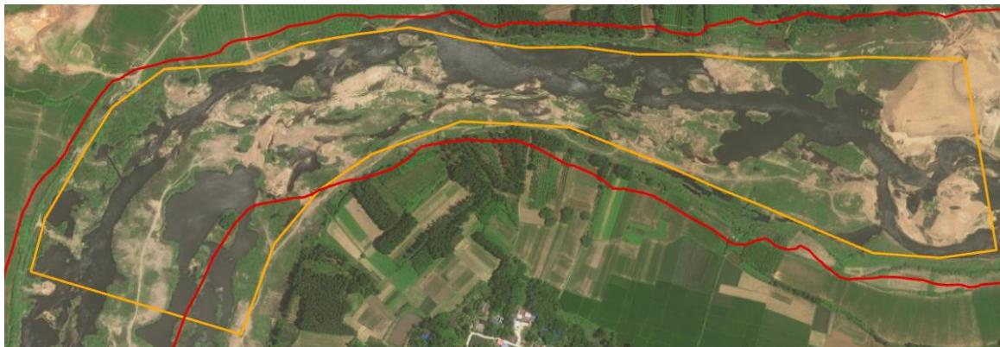
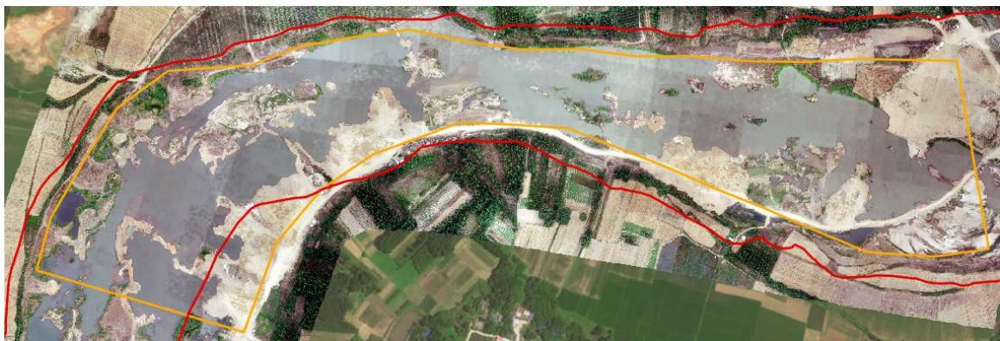
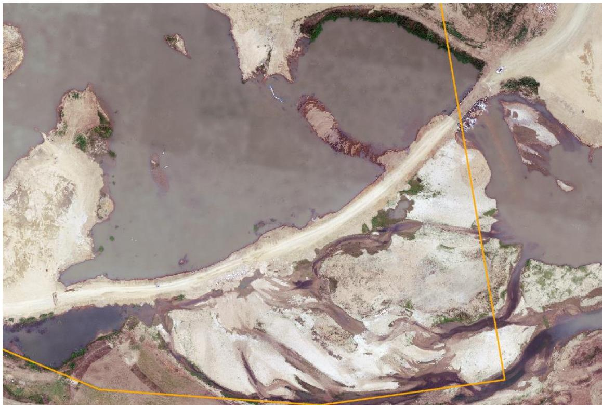
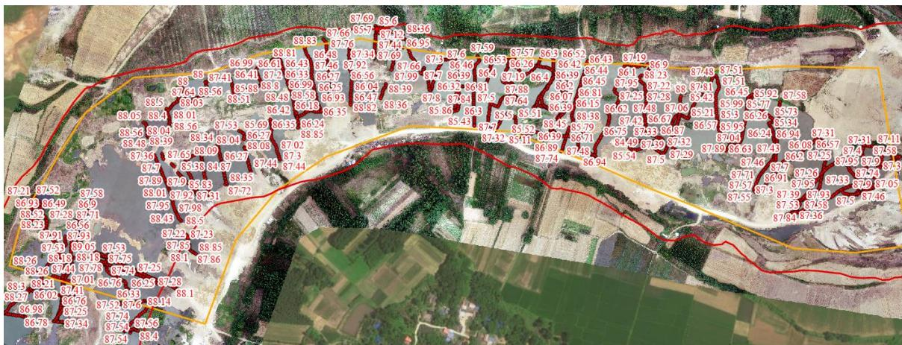

（1）现场监测 经 现 场 监 测 ， 信 阳 市 平 桥 区 淮 河 郑 湾 村 可 采 区 （ 桩 号K11+000~K12+900）机械设备数量、功率、作业范围符合采砂许可证规定，但汛期淮河主河槽内有两处拦河便道未按要求及时清除，严重影响淮河河道行洪。现场未执行边开采边修复情况，现场坑洼不平，淮河管理范围线内、主河槽附近存在多出小规模弃土堆积。    图 5.2-18 开采区两处拦河便道未拆除 图 5.2-19 采区现场坑洼不平、存在多处小规模弃土 # （2）无人机航测 采砂监管测量人员对淮河干流信阳市平桥区（出山店水库上游段）郑湾村可采区（HHK3）2023 年度采区进行了无人机航空摄影测量，叠加规划批复范围（ $\mathrm { K } 1 1 + 0 0 0 ~ \mathrm { K } 1 2 { + } 9 0 0 \ ,$ ）进行评估分析，未发现有超范围开采情况，生态修复不到位，采区下游临时施工便道未拆除影响汛期行洪安全。   图 5.2-20 淮河平桥区郑湾村可采区开采前后影像  图 5.2-21采区下游施工便道汛期未拆除 # （3）无人船水下测量 通过无人船单波束声呐测量开采区水下地形，对比开采前测量成果， 依据 2023 年度采砂实施方案中要求的郑湾村可采区开采后控制高程85.976～86.823m 进行分析评估，大部分区域采后高程高于 85.976m 的开采最低控制高程，下游局部提砂作业区略低于 85.976m,属于提砂作业区修复不到位问题。  图 5.2-22 淮河平桥区郑湾村可采区无人船实测数据
