（1）现场监测 罗山县竹竿河 LG9 采区现场基本平复完成，公示牌完整，视频监控设备设施完善，且正常运转，现场无坑洼不平及砂堆，生态修复工作良好。堆砂码头现场虽进行了平复修整但仍存在抬高原始河道滩地情况；采砂作业导致岸线边坡陡立，汛期存在冲刷坡底隐患。 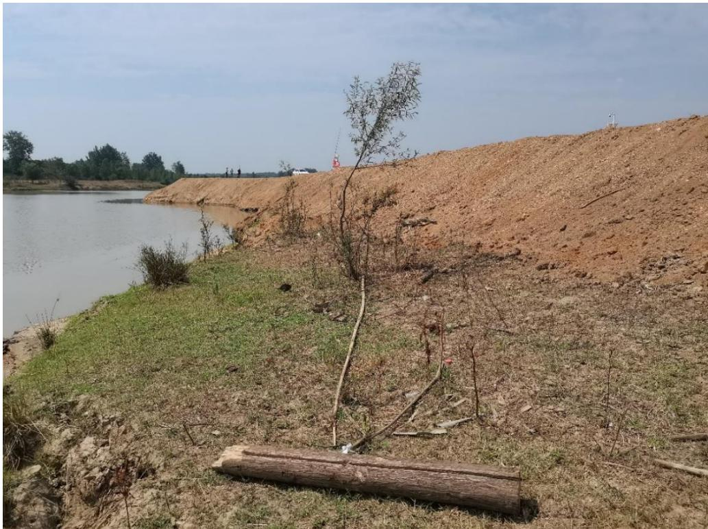 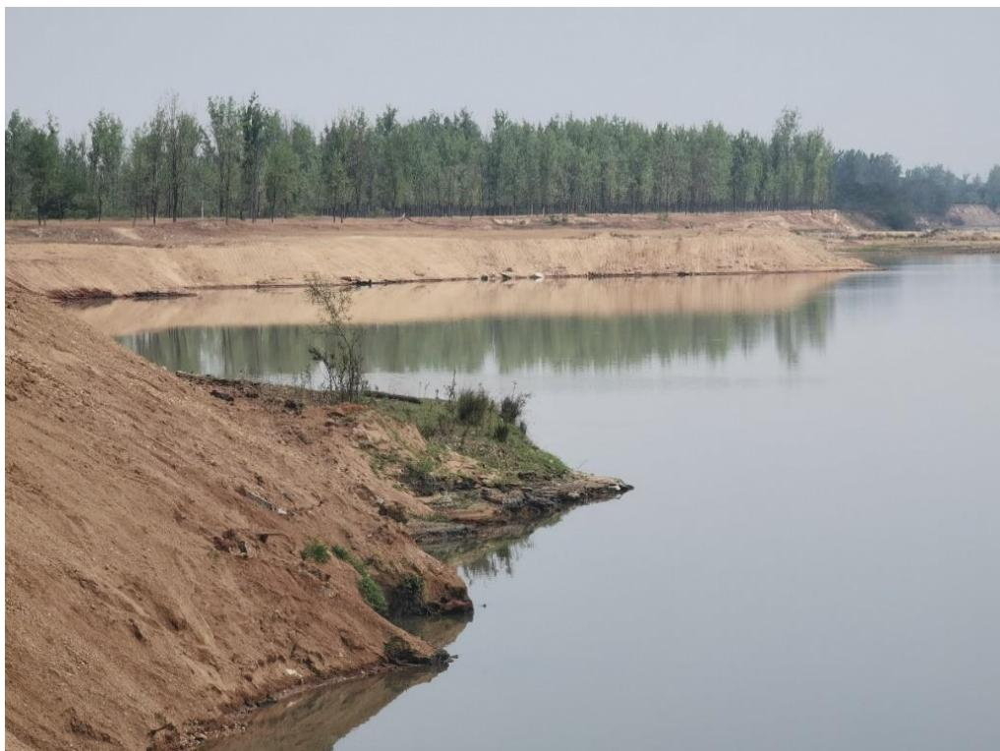 图 5.3-1 提砂作业码头平整修复抬高原始河道滩地 图 5.3-2 岸线边坡陡立 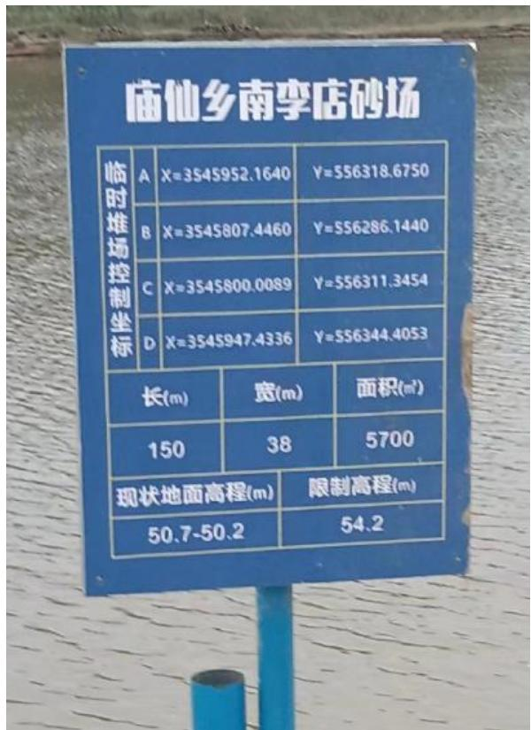 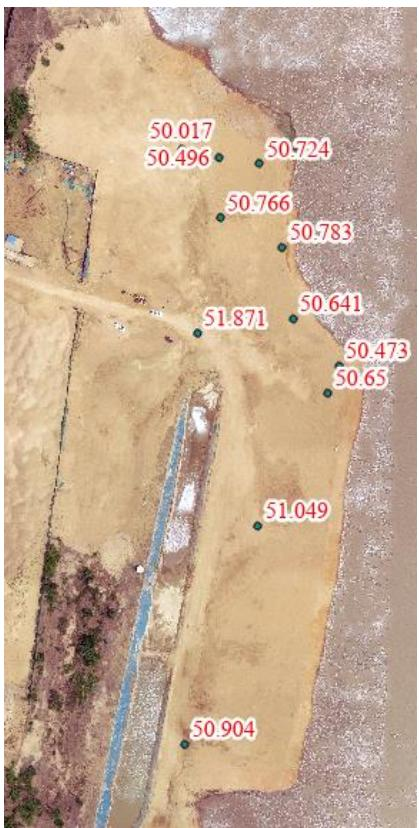 图 5.3-3 临时堆砂场限制高程与实测高程 # （2）无人机航测 采砂监管外业测量团队对罗山县 LG9 采区进行了无人机航空摄影测量，叠加规划批复范围（桩号 $3 5 + 2 5 0 \sim 3 5 + 8 0 0$ 、37+400～38+500）评估分析，作业船只已拖离上岸，下游采区开采活动对河滩扰动较小，主要位于水下，上游采区外右岸河滩局部区域被开采，但不再本年度批复采区内，存在超范围开采问题，上下游两处采区左岸河道管理范围线内均有一定规模的临时堆砂未转运。 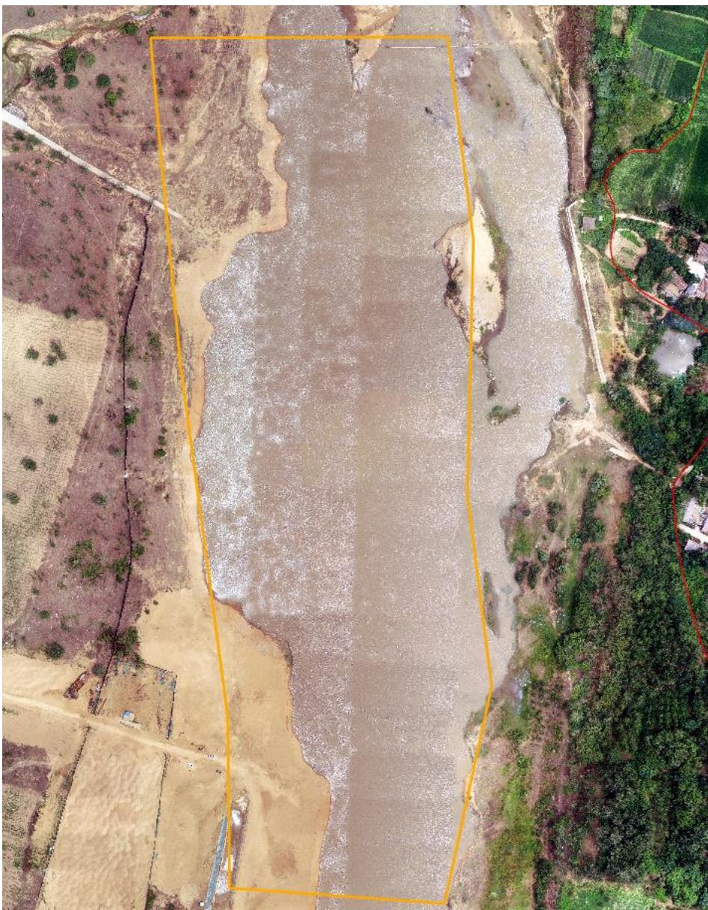 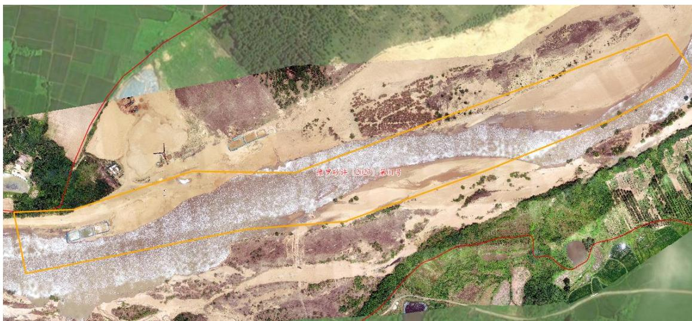 图 5.3-4 采区下游无人机正射影像 图 5.3-5 采区上游无人机正射影像 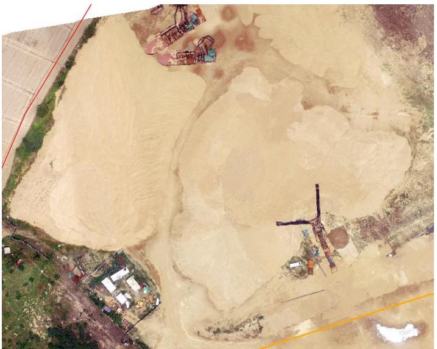 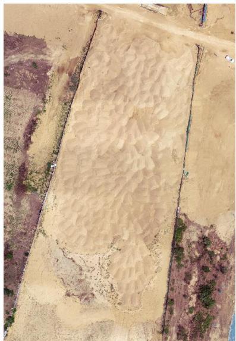 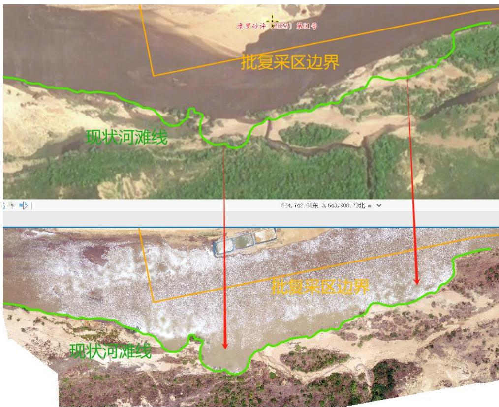 图 5.3-6 河道管理范围内两处临时堆砂场 图 5.3-7 上游采区河道右岸疑似超范围开采 # （3）无人船水下测量 通过无人船单波束声呐测量开采区水下地形，对比开采前测量成果，依据采砂年度实施方案中要求的 LG9 可采区，开采前河底现状高程约42.0～46.8m、 $4 6 . 8 \sim 4 8 . 9 \mathrm { m }$ ，年度控制开采底部高程 43.6～43.7m、44.6～ 45.1m。上游采点采后高程基本高于 47m ，未发现超深度开采问题，下游采点高程主要位于 $3 8 { - } 4 2 \mathrm { m }$ 之间，平均深度 40.5m ，超深约 1.5m 。 开采的地点、深度、范围（附范围图 序号 所属河道 可采区名称 作业区域和范围 开采量 采砂机具 砂石堆放地点 作业地点 开采深度(m) 规划范围 实际开采范围 年度可采量(万方) 日均采量(万方) 作业方式 采砂机具 采砂船数量(艘) 1 竹竿河 LG9 庙仙乡南李店村、吴乡村采区 6.6 总长度1650M 35+250°35+80037+400°38+500 40 0.25 水采 无底船或绞吸式抽砂船 采砂船5艘提砂船3艘 庙仙乡南李店村、吴乡村采区 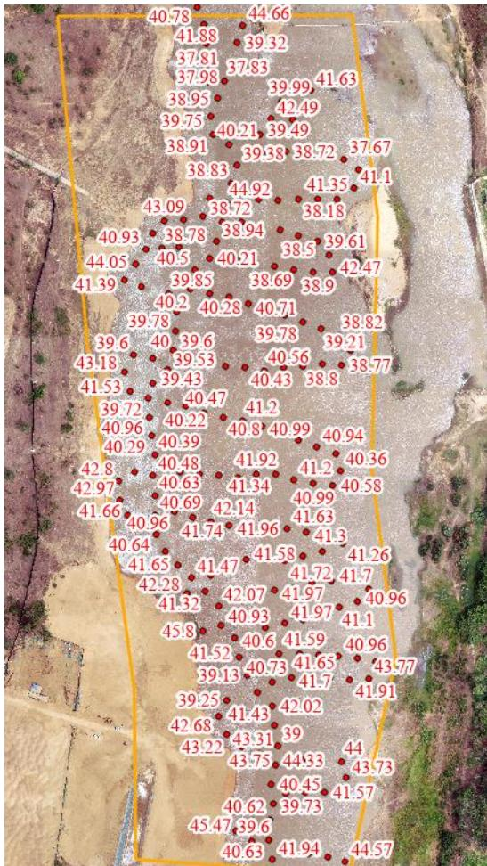 图 5.3-8 批复开采深度 图 5.3-9 下游采点无人船实测数据 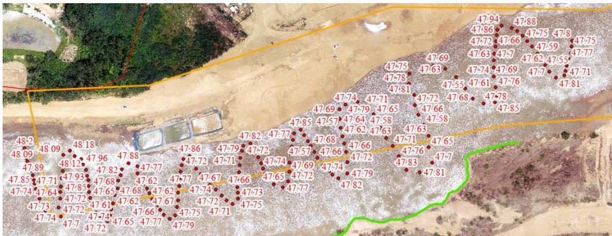 图 5.3-10 上游采点无人船实测数据
