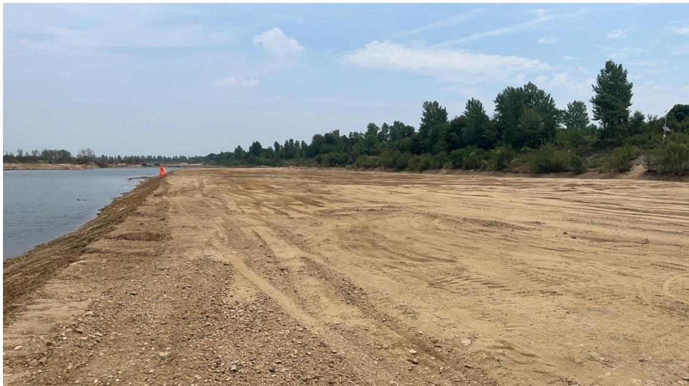
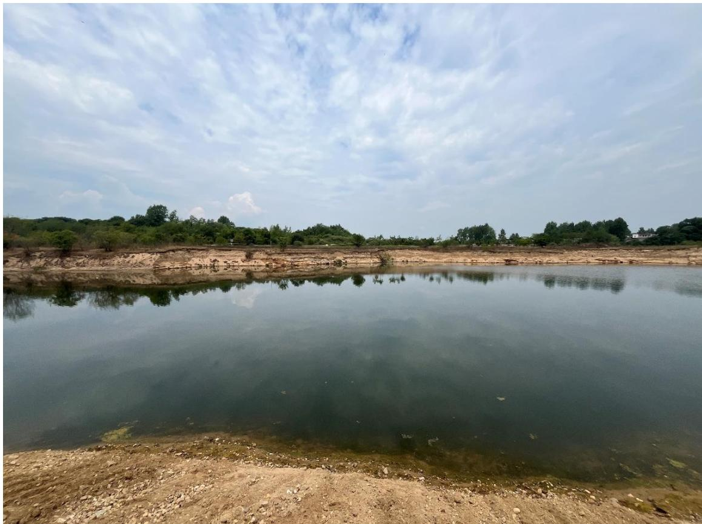
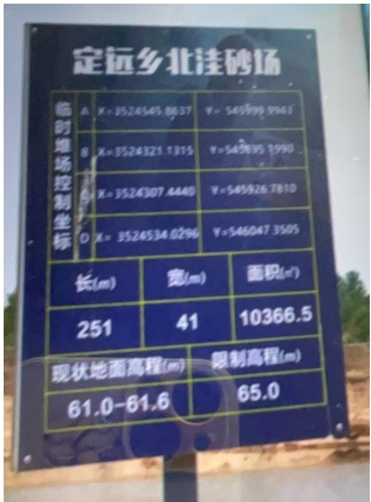
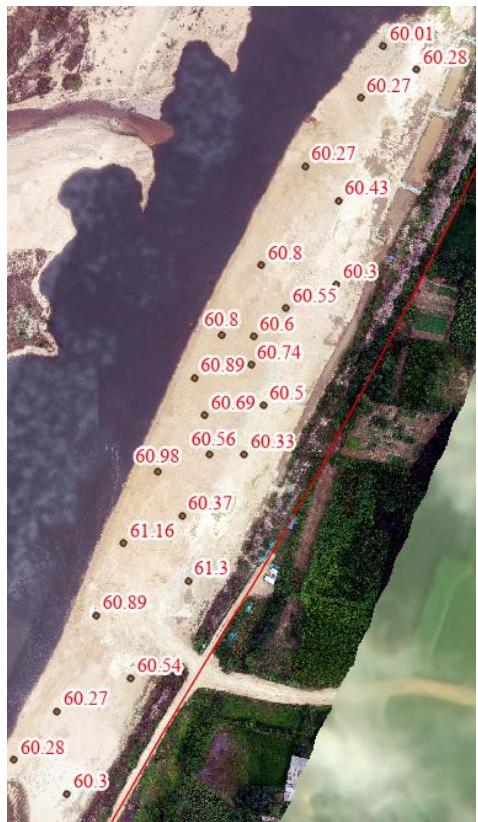
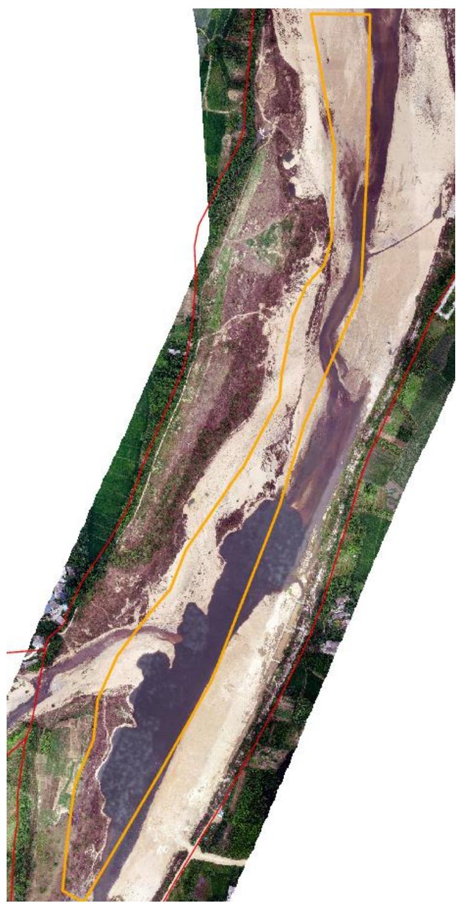
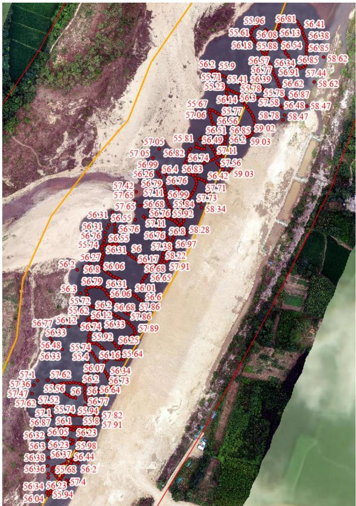

（1）现场监测 通过现场实地查看 LS14 测区的基本情况，现场平整修复基本到位、作业码头边界明晰，现场有公示牌、警示牌等设施，无明显的坑洼及砂堆情况，开采结束后，现场作业机具按要求集中停靠，临时堆砂场高度位于$6 0 \mathrm { m } \mathrm { - } 6 1 \mathrm { m }$ 之间，满足相关要求。  图 5.3-11 采区现场照片  图 5.3-12 采区现场照片   图 5.3-13 临时堆砂场限制高程与实测高程 # （2）无人机航测 采砂监管测量人员对罗山县 LS14 采区进行了无人机航空摄影测量，叠加规划批复范围（桩号 $6 4 \substack { + 7 5 0 \sim 6 7 + 5 0 0 }$ ）评估分析，现场得到有效平复，采区现场生态修复情况基本良好，未发现超范围开采问题。  图 5.3-14 无人机正射影像 # （3）无人船水下测量 LS14 采区开采前河底现状高程约 $5 5 . 2 – 6 0 . 9 \mathrm { m }$ ，年度控制开采底部高程 $5 8 . 5 \sim 5 9 . 2 \mathrm { m }$ 。通过无人船单波束声呐测量开采区水下地形，河底高程高于 55.23m ，符合方案中要求的开采深度。 开采的地点、深度范围付范围图） 序号 所属河道 可采区名称 作业区域和范围 开挖量 采砂机具 砂石堆放地点 作业地点 开采深度(m) 规划范围 实际开采范围 年度可采量(万方) 日均采量(万方) 作业方式 采砂机具 采砂船数量(艘) 1 竹竿河 LG14 定远乡北洼村 4.7m 总长度1250m 66+25067+500 37 0.2 水采 无底船或绞吸式抽砂船 采砂船4艘、提砂船3艘 定远乡北洼村  图 5.3-15 批复开采深度 图 5.3-16 无人船实测数据
