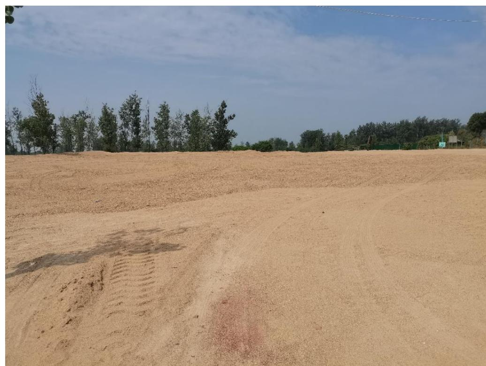
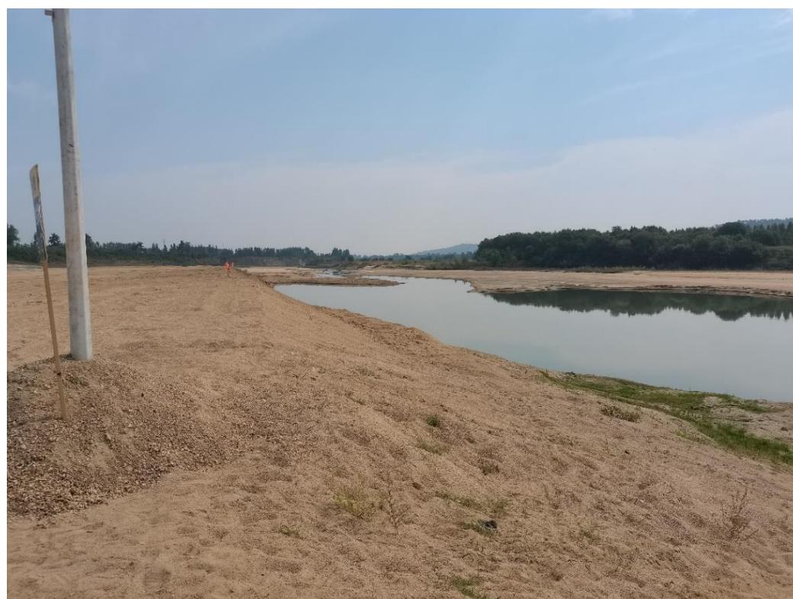
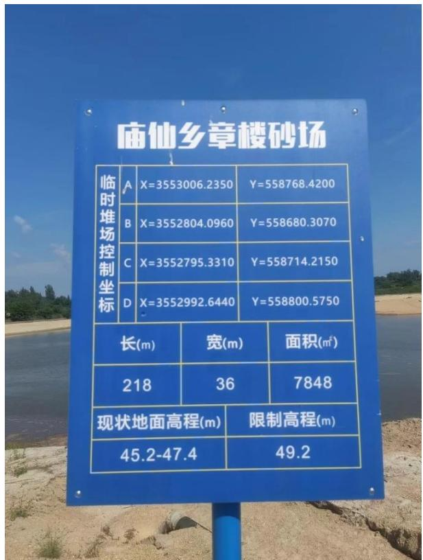
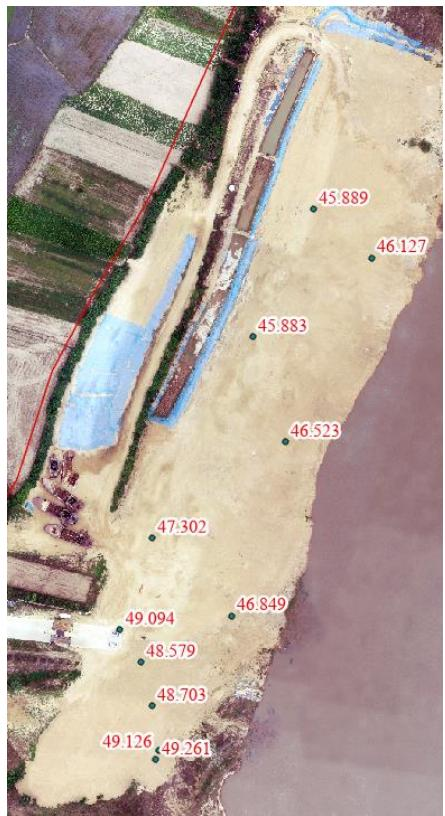
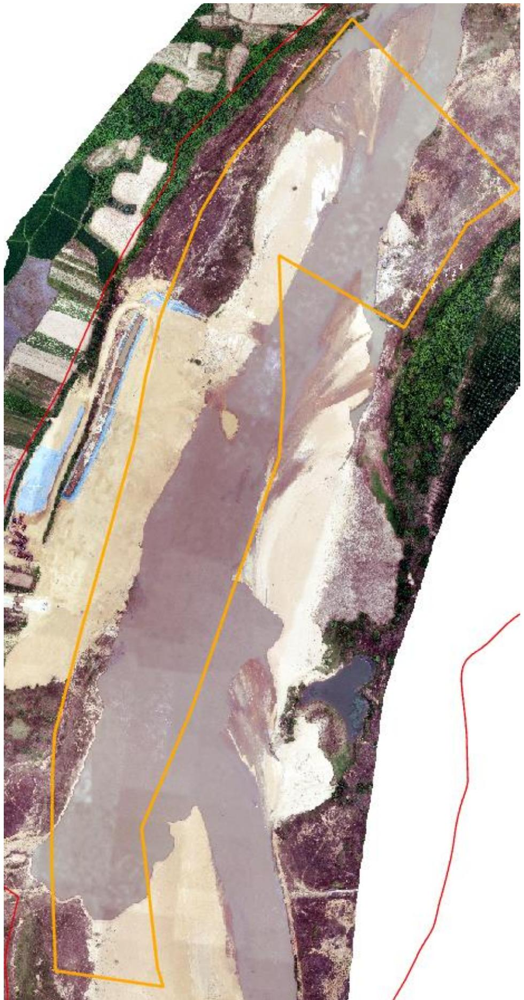
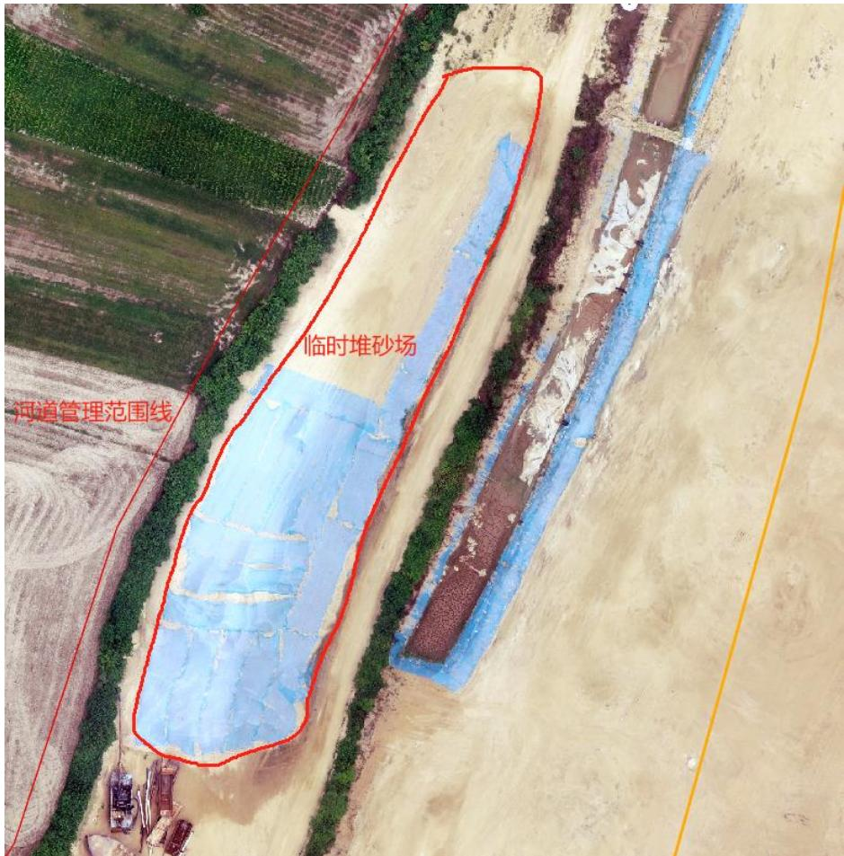
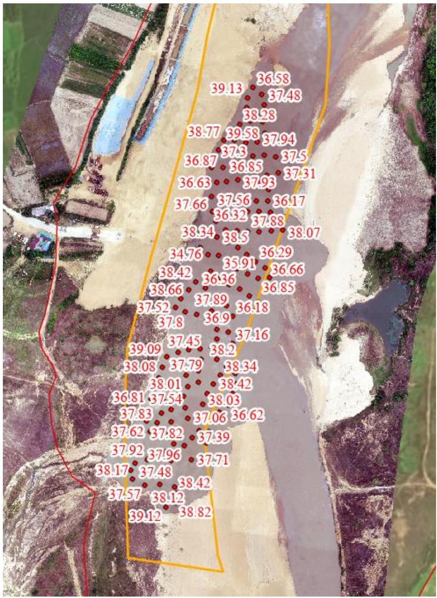

（1）现场监测 通过现场实地查看LG5 测区的基本情况，现场公示牌齐全，视频监控设备设施完善且正常运转，但存在未严格执行边开采边修复情况。采区临时堆场局部区域高度高于 49.2m 的限制高程，后续开采过程中需要引起重视，严格控制临时堆场高度。  图 5.3-17 采区现场照片  图 5.3-18 采区现场照片   图 5.3-19 临时堆砂场限制高程与实测高程 # （2）无人机航测 采砂监管测量人员对罗山县 LG5 采区进行了无人机航空摄影测量，叠加规划批复范围评估分析，现场生态修复情况基本良好，采区左岸河道管理范围内有一定规模堆砂，未发现超范围开采问题。  图 5.3-20 无人机正射影像  图 5.3-22 批复开采深度 图 5.3-21 临时堆砂未转运至储砂场 # （3）无人船水下测量 LG5 采区范围为 $2 7 + 8 0 0 \sim 2 8 + 7 0 0$ 区域，开采前河底高程约$3 9 . 6 \sim 4 1 . 3 \mathrm { m }$ ，控制开采高程 $4 0 . 1 \sim 4 0 . 5 \mathrm { m }$ ，采砂监管人员通过无人船单波束声呐测量开采区水下地形，开采后河底高程低于开采控制最低高程，最低高程 34.76m ，平均高程 37.5m ，平均超深约 2.1m 。 开采的地点、深度、范围（附范围图） 序号 所属河道 可采区名称 作业区域和范围 开采量 采砂机具 砂石堆放地点 作业地点 开采深度 规划范围 实际开采范围 年度可采量(万方) 日均采量(万方) 作业方式 采砂机具 采砂船数量(艘) 1 竹竿河 LG5 庙仙乡窑楼村 3.8m 总长度900m 27+800-28+700 25 0.15 水采 无底船或绞吸式抽砂船 采砂船3艘、提砂船2艘 庙仙乡章楼村采区  图 5.3-23 无人船实测数据
