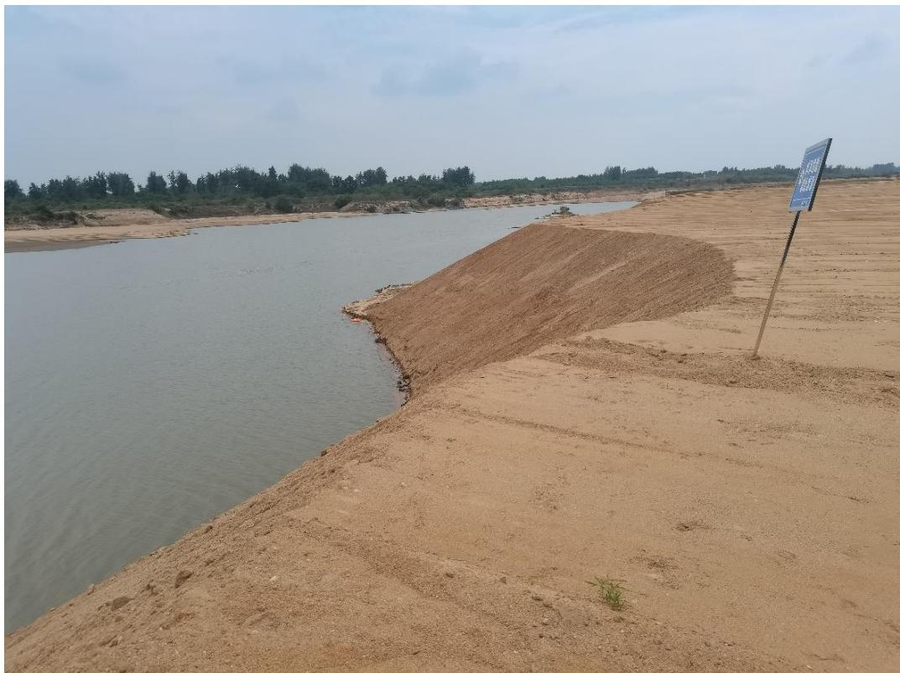
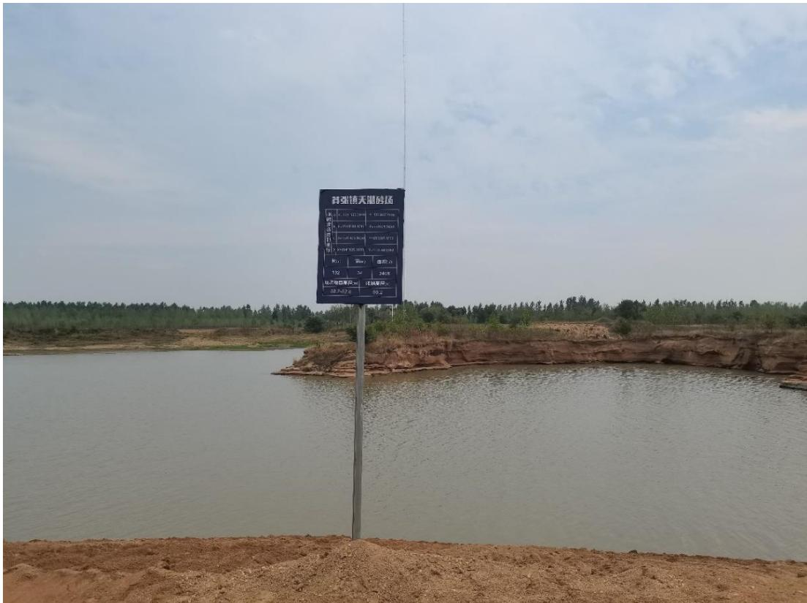
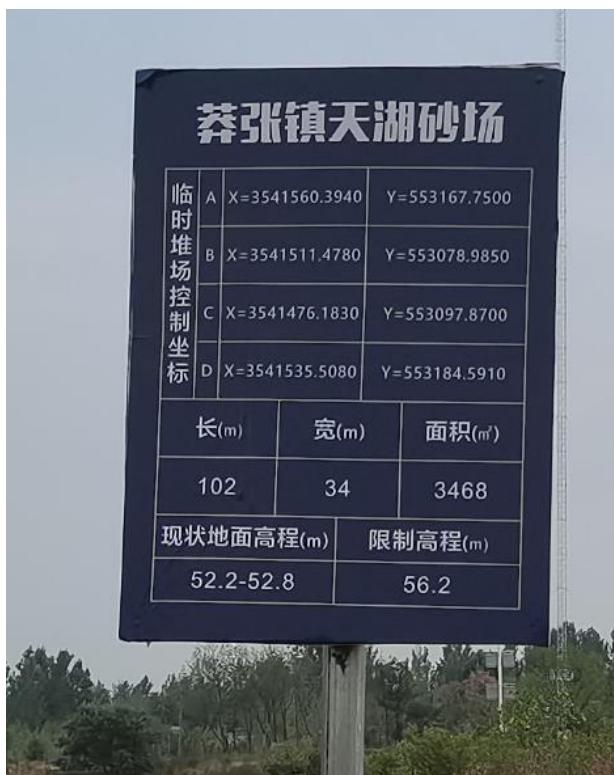
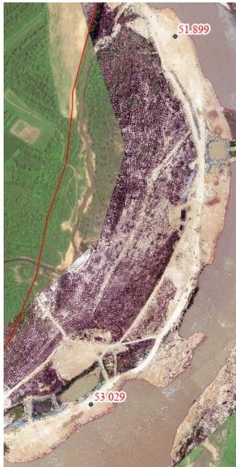
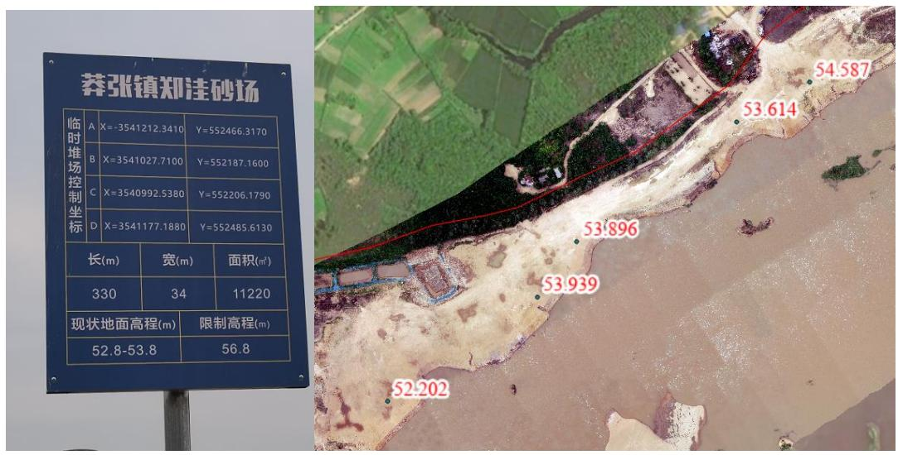
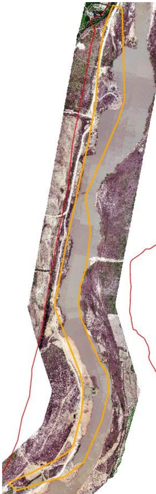
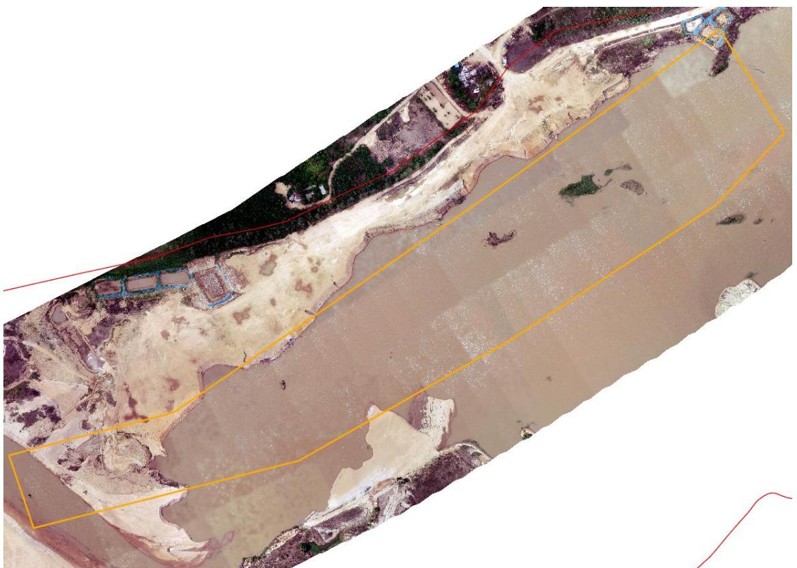
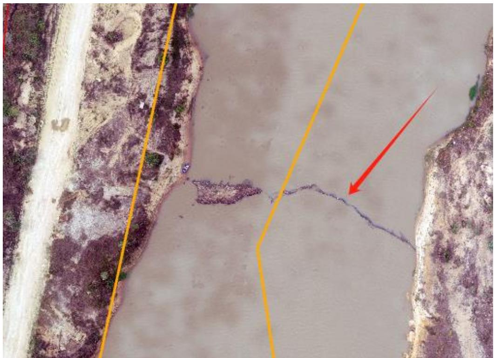
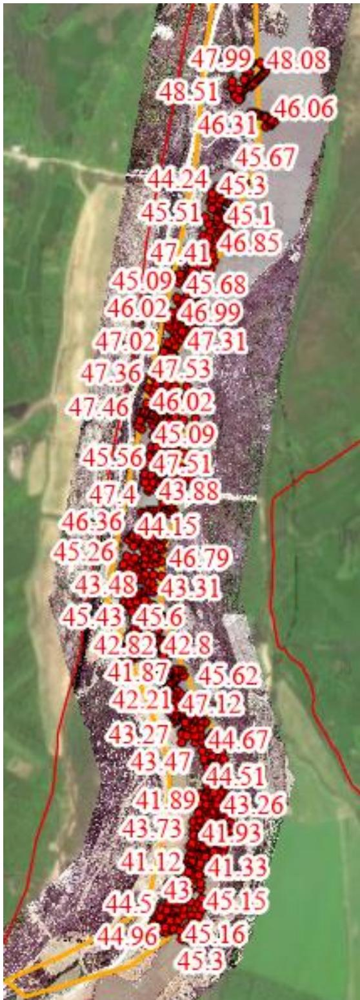
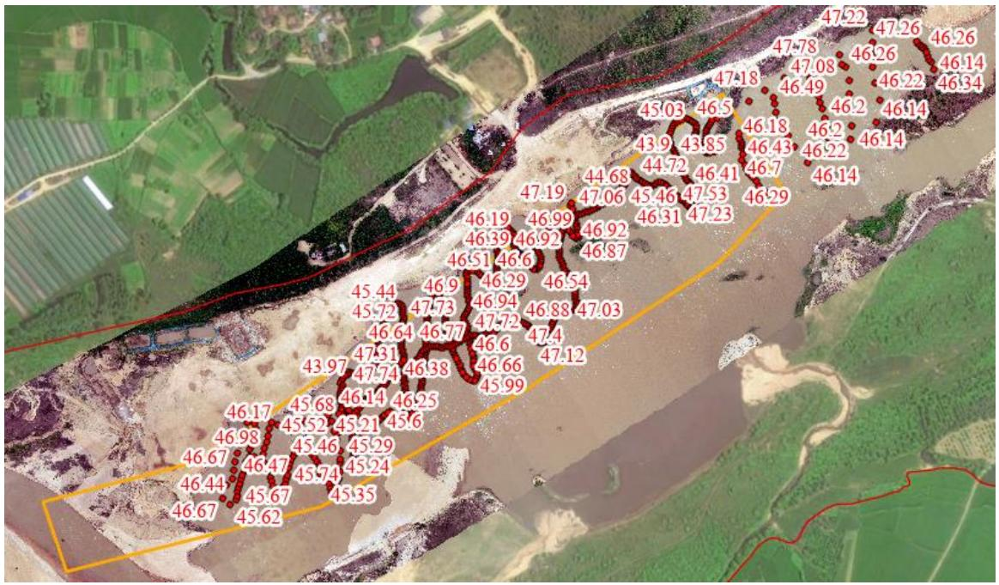

（1）现场监测 通过现场查看 LG10 采区，现场有公示牌、警示牌等，采区现场无明显的坑洼不平及砂堆，采砂活动主要位于水下，现场的生态修复工作基本良好，临时堆砂场现状高程低于限制高程。  图 5.3-24 采区现场照片   图 5.3-25 采区现场照片  图 5.3-26 下游临时堆砂场限制高程与实测高程  图 5.3-27 上游临时堆砂场限制高程与实测高程 # （2）无人机航测 采砂监管测量人员对罗山县 LG10 采区进行了无人机航空摄影测量，叠加规划批复范围（桩号 $3 9 + 4 0 0 \sim 4 1 + 8 0 0$ 、42+200～43+200）评估分析，未发现有超范围开采问题，现场生态修复情况基本良好，采区下游有一处拦河渔网。  图 5.3-28 采区下游无人机正射影像   图 5.3-29 采区上游无人机正射影像 图 5.3-30 采区下游拦河渔网 # （3）无人船水下测量 通过无人船单波束声呐测量开采区水下地形，依据采砂年度实施方案 中要求，开采前河底高程约 $4 5 . 1 \sim 4 9 . 3 \mathrm { m }$ 、 $4 5 . 8 \sim 4 9 . 9 \mathrm { m }$ ，控制开采高程45.6～46.7m、46.8～47.3m。测深结果显示：上游采区采后高程高于 45.8m ，满足开采深度要求，下游采区局部区域低于最低开采深度（45.1m）,主要位于提砂作业区附近，需进一步加强管理。 附范围图 开采的地点、深度、范围 序号 所属河道 可采区名称 作业区域和范围 开采量 采砂机具 砂石堆放地点 作业地点 开采深度(m) 规划范围 实际开采范围 年度可采量(万方) 日均采量(万方) 作业方式 采砂机具 采砂船数量(艘) 竹竿河 LG10 莽张镇天湖村郑洼村 7.1 总长度3400m 39+400-41+80042+200-43+200 95 0.4 水采 无底船或绞吸式抽砂船 采沙船10艘提砂船7艘 莽张镇天湖村郑洼村 图 5.3-31 批复开采深度  图 5.3-32 下游采点无人船实测数据  图 5.3-33 上游采点无人船实测数据
