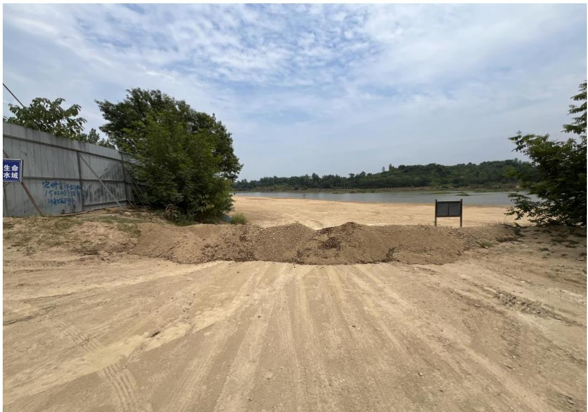
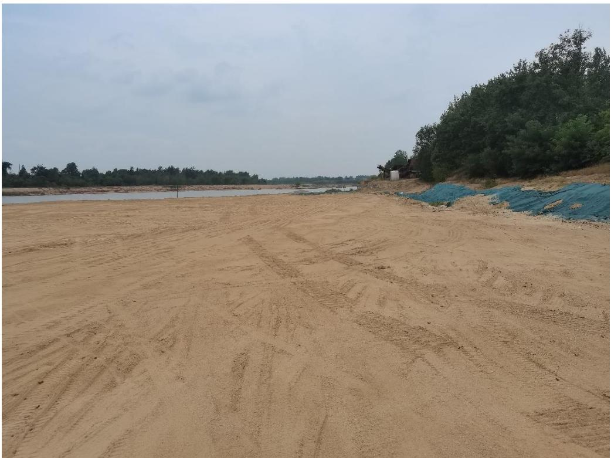
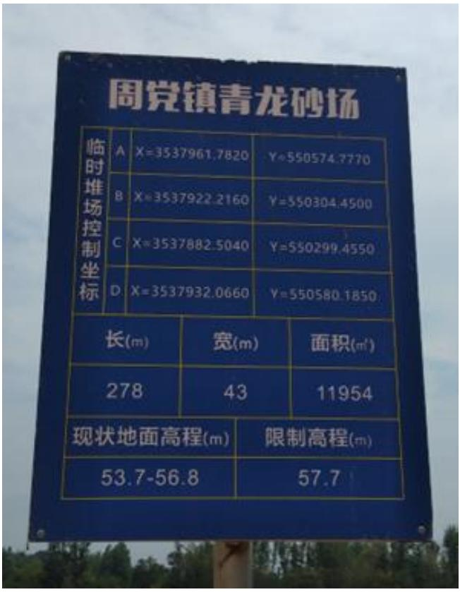
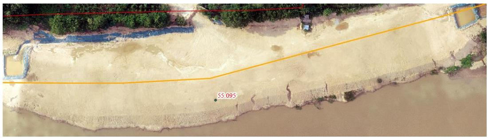
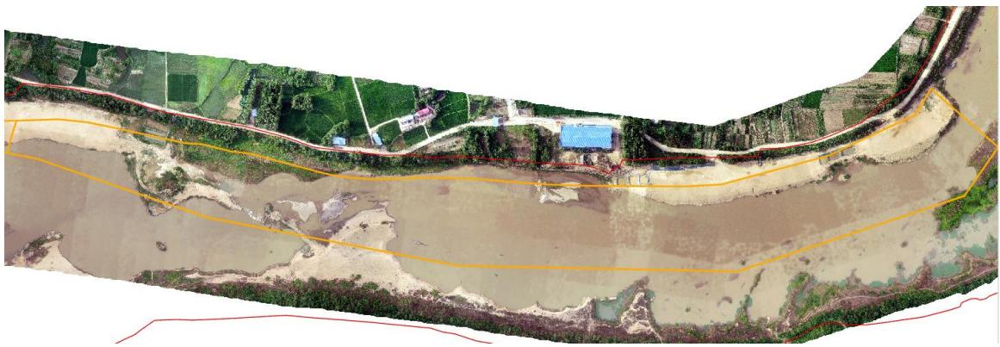
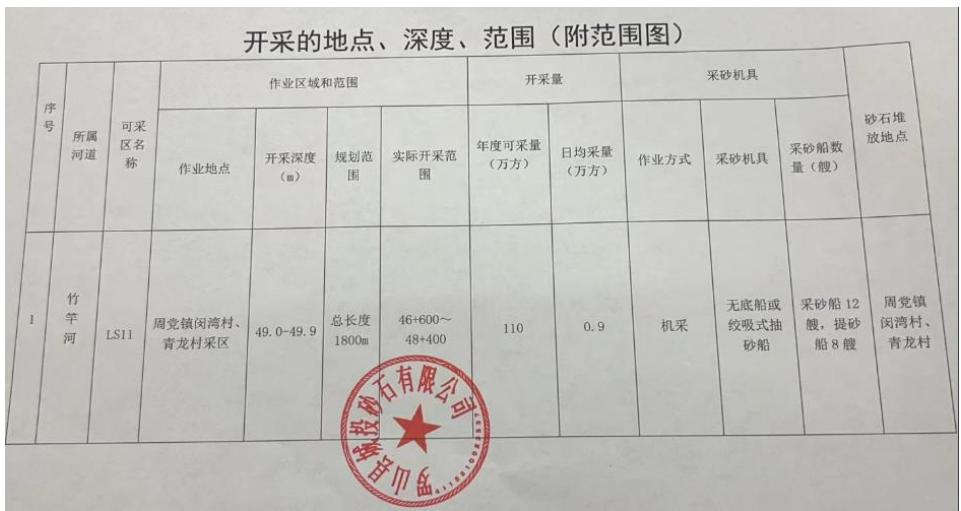
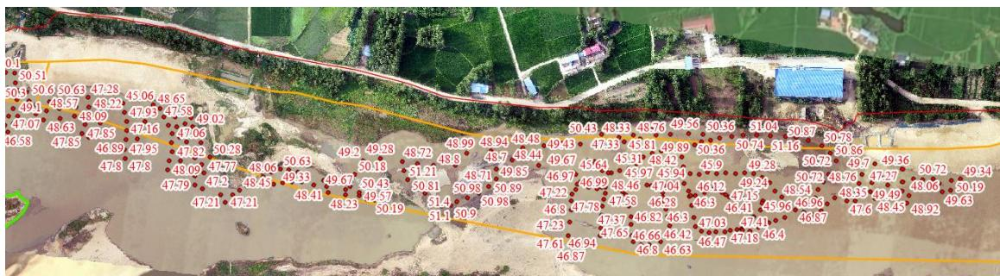

（1）现场监测 通过实地查看LS11现场基本情况，现场基本无明显砂堆，有公示牌、 警示牌等设施，现场无明显坑洼不平等情况，生态修复基本到位，临时堆砂场实测高程为 55.095m，与原始河滩高程基本一致，高程控制满足要求。   图 5.3-34 采区现场照片 图 5.3-35 采区现场照片   图 5.3-36 临时堆砂场限制高程 图 5.3-37 临时堆砂场实测高程 # （2）无人机航测 采砂监管测量人员对罗山县 LS11 采区进行了无人机航空摄影测量，叠加规划批复范围（桩号 $4 6 + 6 0 0 \sim 4 8 + 4 0 0$ ）评估分析，现场生态修复基本到位，未发现超范围开采问题，作业机具均拖离至河道管理范围线外。  图 5.3-38 无人机正射影像 # （3）无人船水下测量 通过无人船单波束声呐测量开采区水下地形，LS11 开采前河底高程$4 7 . 5 ~ 5 0 . 5 \mathrm { m }$ ，控制开采高程为 $4 9 . 3 ~ 4 9 . 9 \mathrm { m }$ ，测量成果显示，采区局部区域采后高程低于控制最低高程，主要位于提砂作业区附近，属于提砂区修复不到位，后期需加强管理。   图 5.3-39 批复开采深度 图 5.3-40 无人船实测数据
