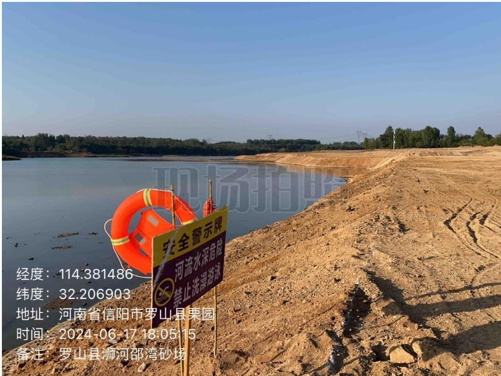
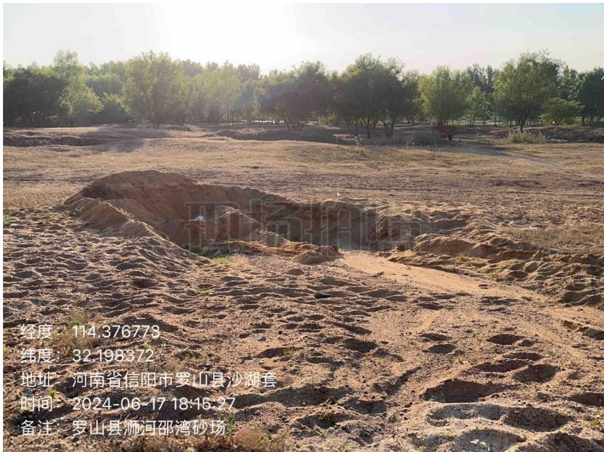
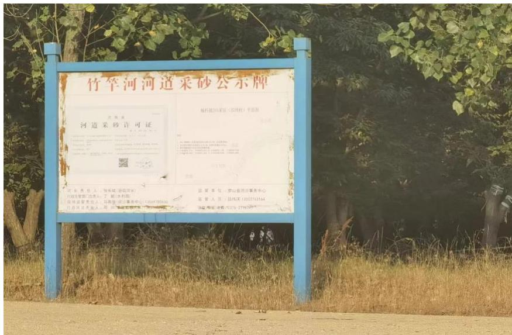
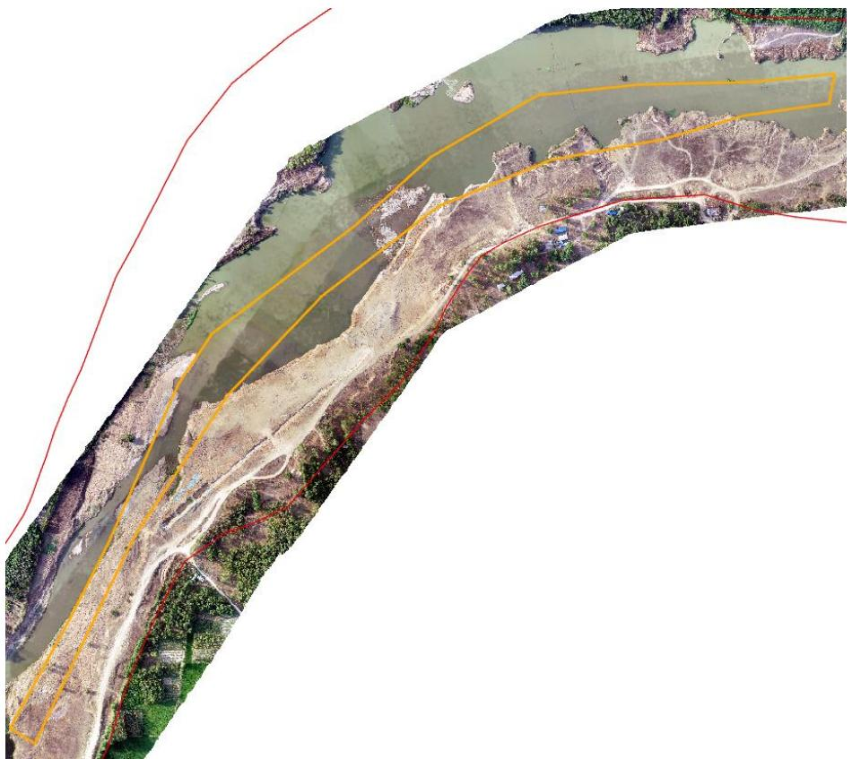
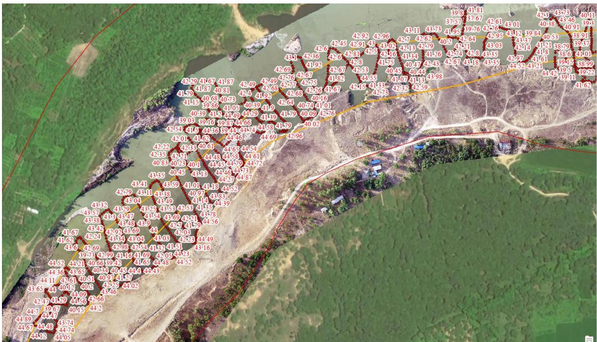

（1）现场监测 通过现场查看 SH4采区，有公示牌、警示牌、视频监控等设施，采区内有砂堆砂坑未进行修复、过期公示牌未拆除。   图 5.3-41 采区现场基本情况 图 5.3-42 采区现场基本情况  图 5.3-43 过期公示牌内容未清理 # （2）无人机航测 采砂监管测量人员对罗山县 SH4 采区进行了无人机航空摄影测量，叠加规划批复范围（桩号 $1 3 \substack { + 0 5 0 } \sim 1 5 \substack { + 1 6 0 }$ ）评估分析，开采活动主要位于采区中游和下游，现场生态修复基本到位，未发现超范围开采问题。  图 5.3-44 无人机正射影像 # （3）无人船水下测量 通过无人船单波束声呐测量开采区水下地形，依据采砂年度实施方案中要求，SH4本年度桩号 $1 3 \substack { + 0 5 0 } \sim 1 5 \substack { + 1 6 0 }$ ，开采前河底高程约 $4 0 . 5 \sim 4 5 . 1 \mathrm { m }$ ，控制开采高程 $4 4 . 0 \sim 4 4 . 6 \mathrm { m }$ （仅采河滩部分），无人船实测结果显示，开采后河底高程主要位于 $4 0 . 5 – 4 5 \mathrm { m }$ 之间，开采深度符合要求。 开采的地点、深度、范围（附范围图 序号 所属河道 可采区名称 作业区域和范围 开采量 采砂机具 砂石堆放地点 作业地点 开采深度(m) 规划范围 实际开采范围 年度可采量(万方) 日均采量(万方) 作业次数 采砂机具 采砂船数量(艘) 1 源河 SH4 楠杆镇邵埠村、李寨村，高店乡闫河村 4.6m 总长度2110m 13+050-15+160 35 0.19 水采 无底船或绞吸式抽砂船 采砂船3艘、提砂船2艘 楠杆镇邵埠村、李寨村，高店乡闫河村  图 5.3-45 批复开采深度 图 5.3-46 无人船测量数据
