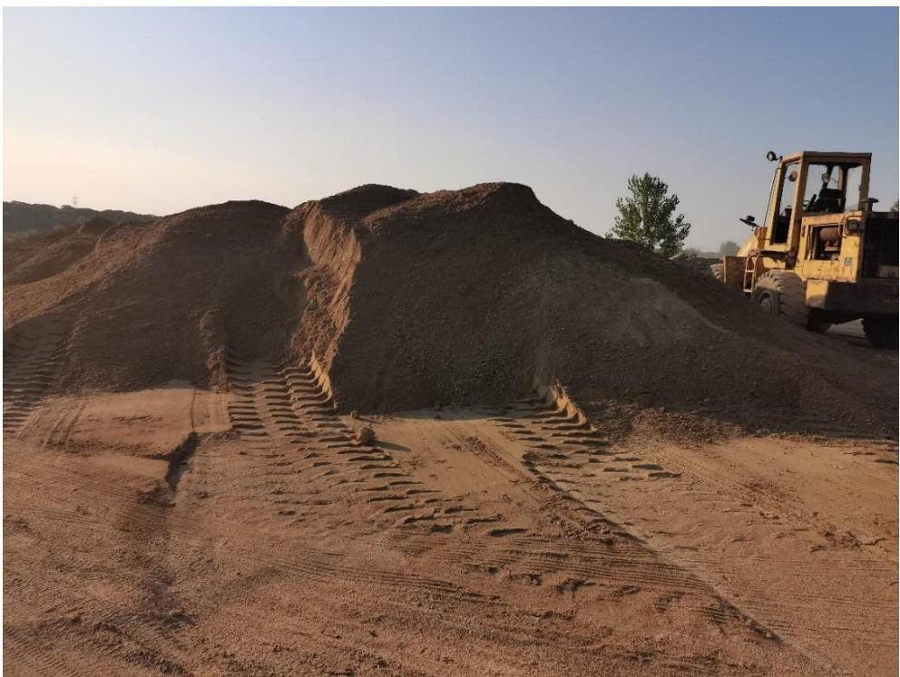
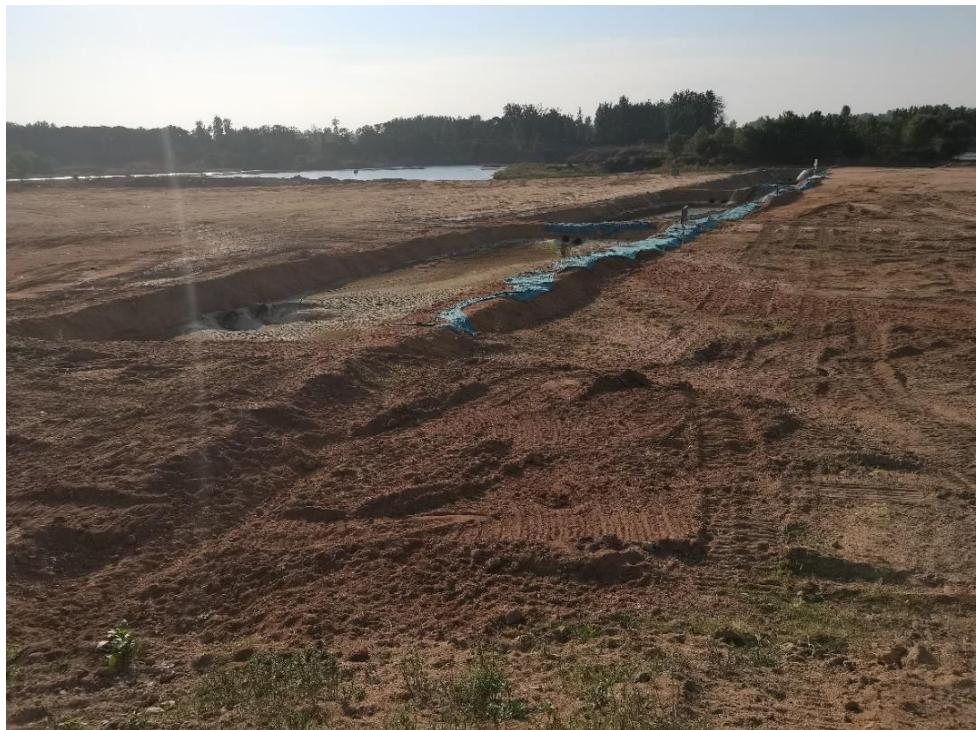
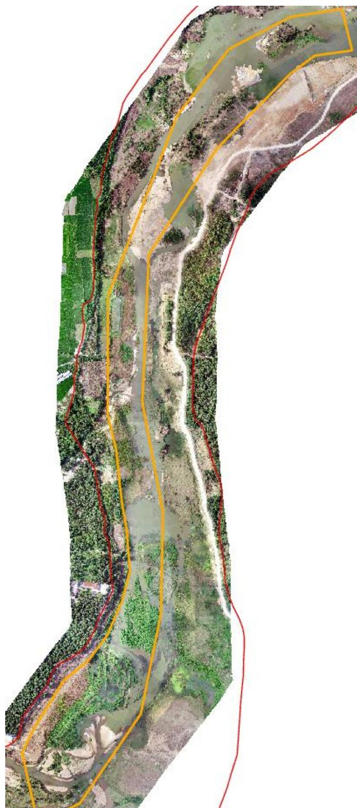
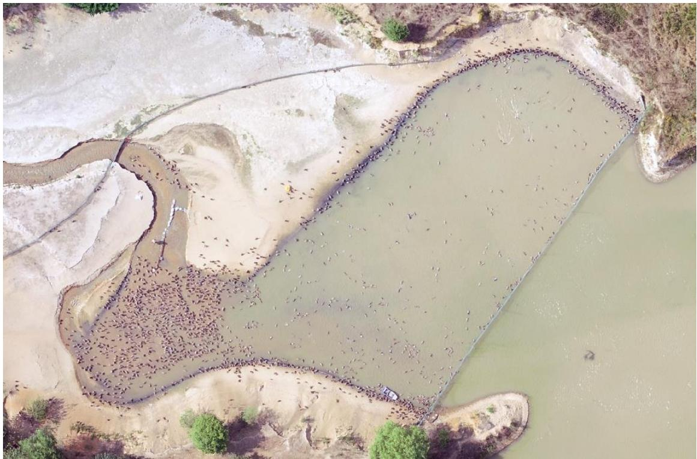
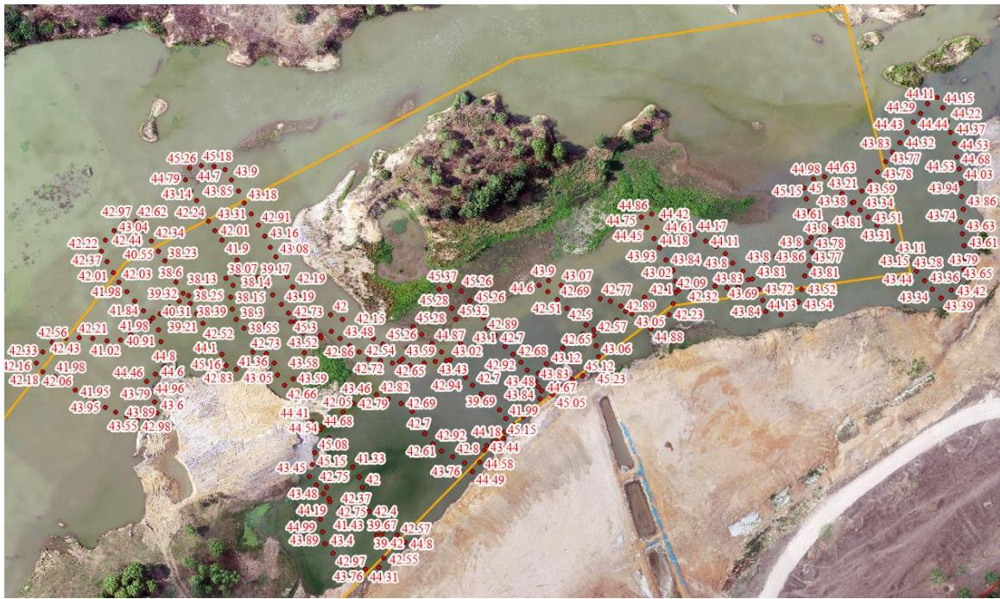

（1）现场监测 通过实地查看 SH05 采区的基本情况，采区现场生态修复工作基本良好无明显砂堆，无坑洼不平，但在砂场入口有小规模堆砂未及时清运。  图 5.3-47 砂场入口堆砂  图 5.3-48 采区现场照片 # （2）无人机航测 采砂监管测量人员对罗山县 SH5 采区进行了无人机航空摄影测量，叠加规划批复范围（桩号 $1 5 \substack { + 2 6 0 } \sim 1 9 \substack { + 3 8 0 }$ ）评估分析，开采作业主要位于采区下游，现场生态修复情况基本良好，河道管理范围线内无临时性管理房，现场作业机具集中停靠，未发现超范围开采问题，采区下游左岸支流入浉河口处存在鸭子养殖问题。  图 5.3-49 无人机正射影像  图 5.3-51 批复开采深度 图 5.3-50采区下游左岸支流入浉河口处存在鸭子养殖 # （3）无人船水下测量 依据采砂年度实施方案中要求，SH5 采区开采前河底高程约 42.2～46.5m，控制开采高程 $4 5 . 3 \sim 4 6 . 4 \mathrm { m }$ ，无人船测深数据显示，开采区域河底高程主要位于 $4 2 { - } 4 5 . 3 7 \mathrm { m }$ 之间，开采深度符合年度实施方案要求。 开采的地点、深度、范围（附范围图） 序号 所属河道 可采区名称 作业区域和范围 开采量 采矿机具 砂石堆放地点 作业地点 开采深度(m) 规划范围 实际开采范围 年度可采量(万方) 日均采量(万方) 作业方式 采砂机具 采砂船数量(艘) 1 濒河 SH5 楠杆镇李寨村高店乡三合村、张河村 4.9m 总长度2980m 16+400-19+380 40 0.22 水采 无底船或绞吸式抽砂船 采砂船4艘、提砂船2艘 楠杆镇李寨村高店乡三合村、张河村  图 5.3-52 无人船测量数据
