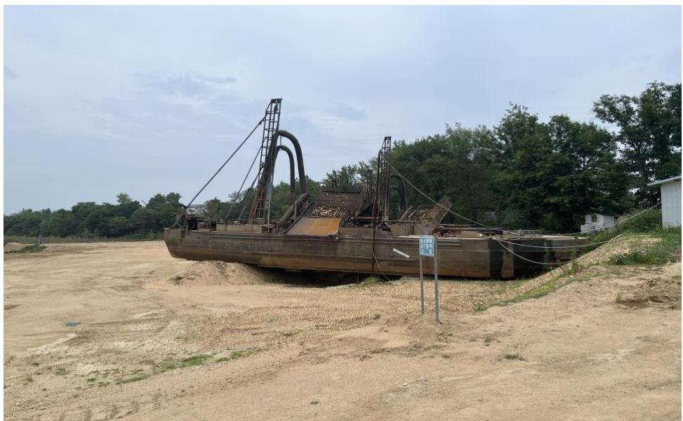
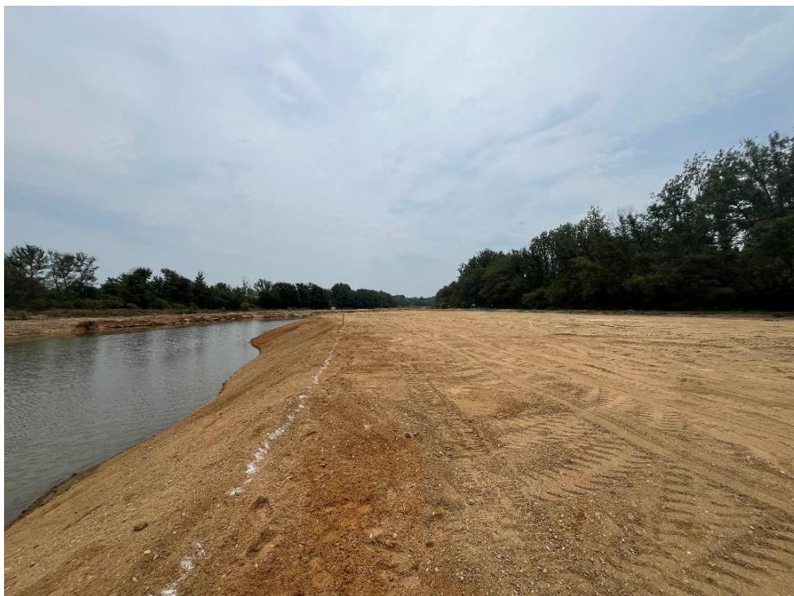
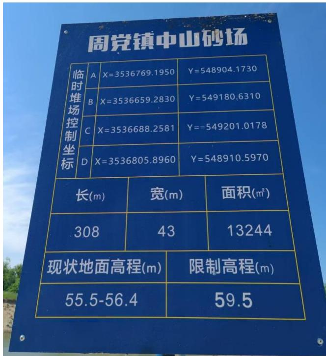
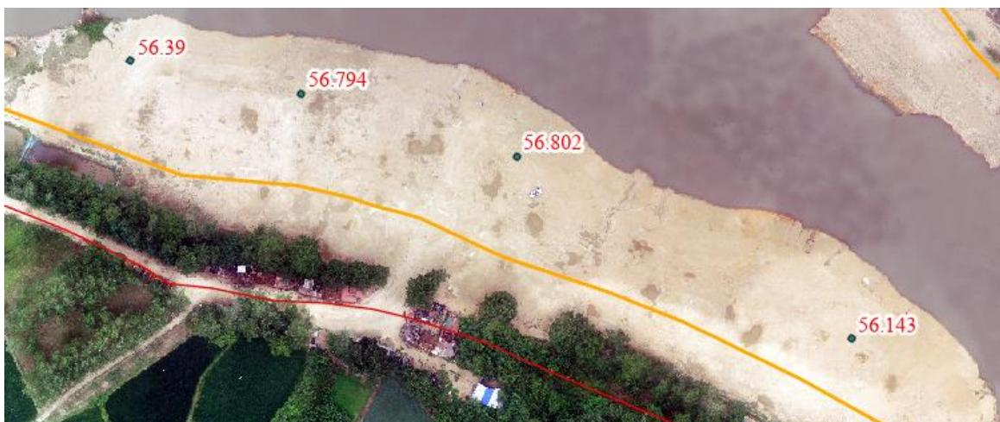
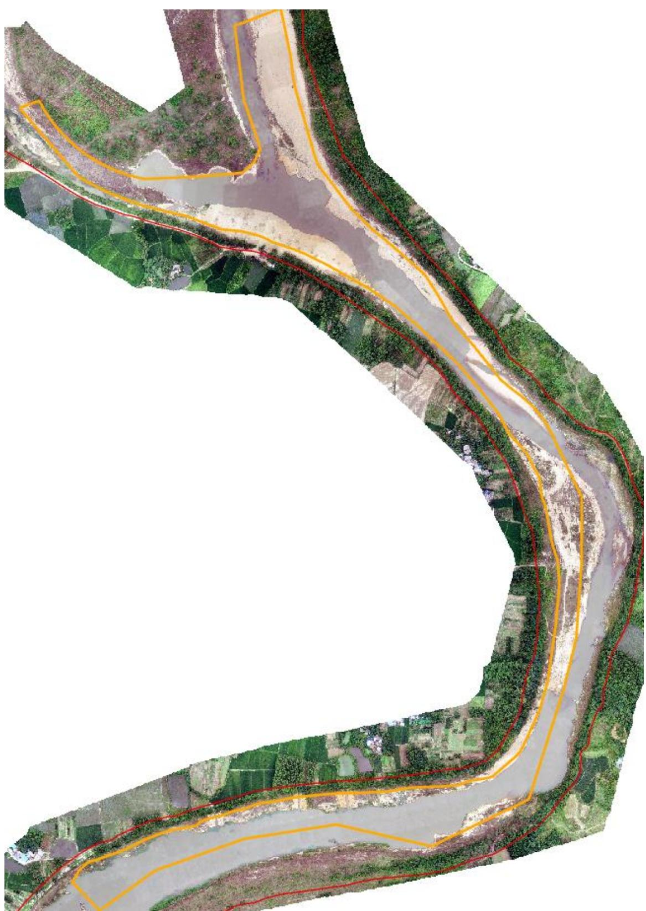
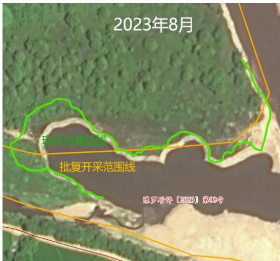
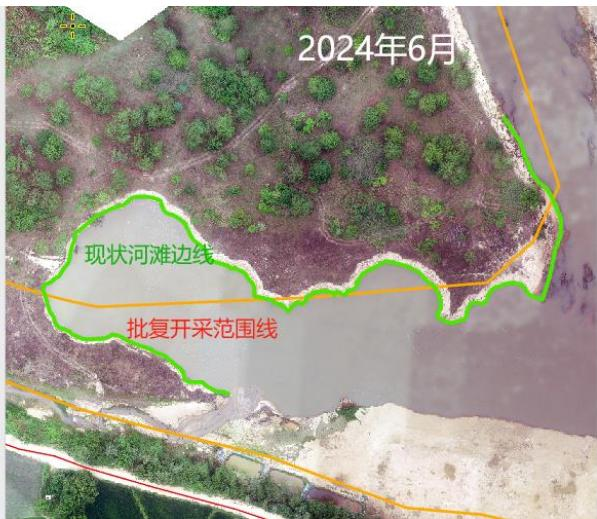
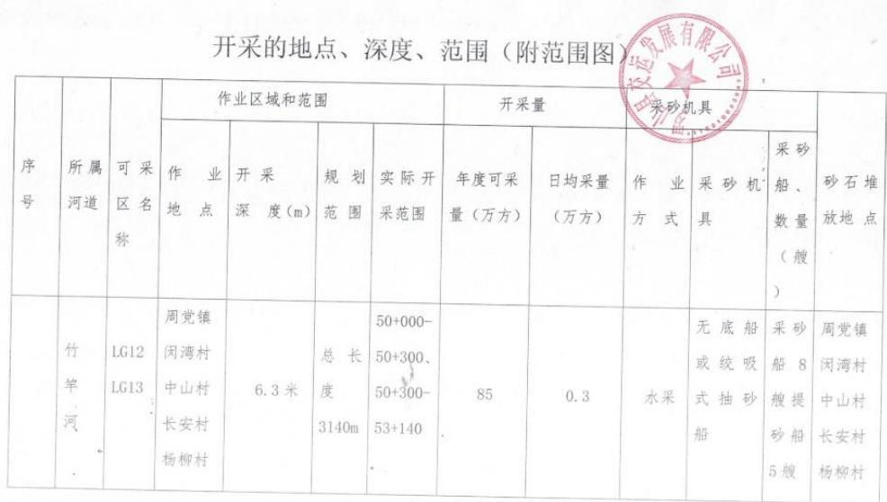
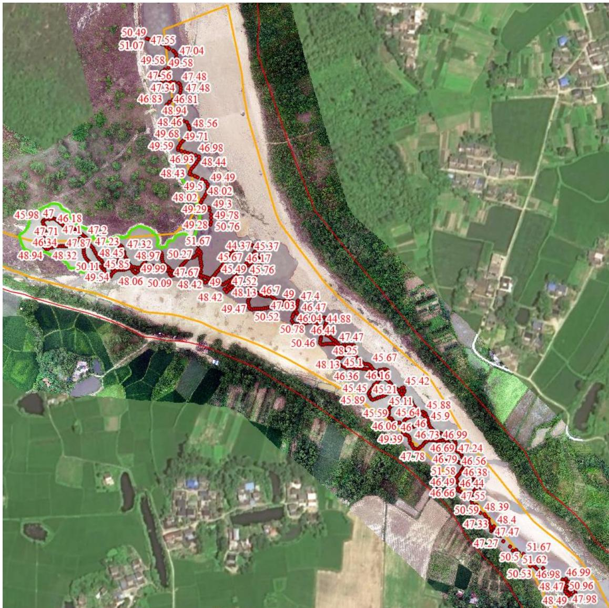
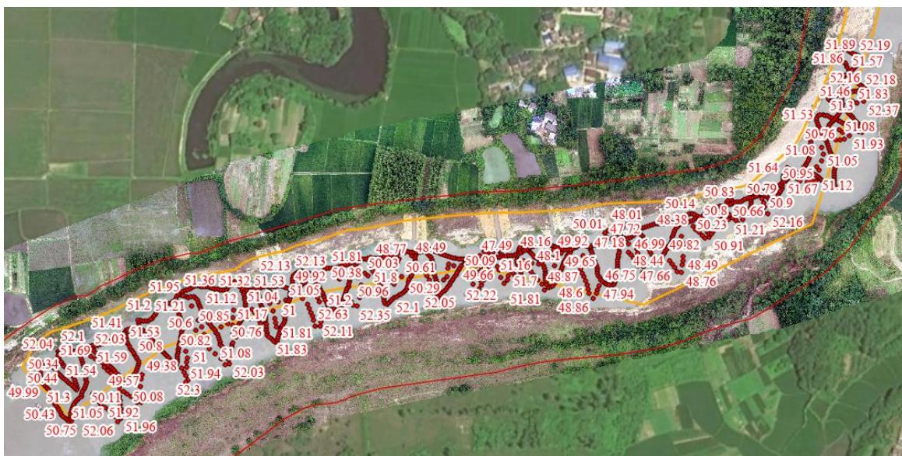

（1）现场监测 通过实地查看采区的基本情况，现场有公示牌、警示牌、视频监控设备设施，且正常运转，作业区域平整修复到位，中山砂场临时堆砂场实测高程与原始河滩高程基本一致，低于限制高程，满足相关要求。  图 5.3-53 采砂船上岸集中停靠  图 5.3-54 采区平整修复到位   图 5.3-55 临时堆砂场限制高程 图 5.3-56 临时堆砂场实测高程 # （2）无人机航测 采砂监管测量人员对罗山县 LS12 和 LS13 采区进行了无人机航空摄影测量，叠加规划批复范围（桩号 $5 0 \substack { + 0 0 0 } \sim 5 0 \substack { + 3 0 0 }$ 、50+300～53+140）评估分析，现场生态修复基本到位，河道管理范围线内无临时性管理房，采区下游存在小规模超范围开采问题。  图 5.3-57 无人机正射影像   图 5.3-58 采区下游开采前后河滩边线对比 # （3）无人船水下测量 通过无人船单波束声呐测量开采区水下地形，LS12 上游开采前河底高程 $5 3 . 5 \sim 5 4 . 3 \mathrm { m }$ ，控制开采高程为 $5 0 . 7 \sim 5 0 . 9 \mathrm { m }$ ，对比开采后实际河底高程，LS12 上游采区基本位于 49.5m 以上，无明显超深度开采情况；LS13可采区开采前河底高程约 $5 0 . 0 \sim 5 3 . 5 \mathrm { m }$ ，控制开采高程 $5 0 . 9 ~ 5 2 . 3 \mathrm { m }$ ，对比开采后实际河底高程，LS13 采区基本位于 50.5m 以上，无明显超深度开采情况，两个可采区局部提砂作业区存在修复不到位问题，后续开采应加强管理。  图 5.3-59 批复开采深度   图 5.3-60 LS12可采区上游无人船测量数据 图 5.3-61 LS13 可采区无人船测量数据
