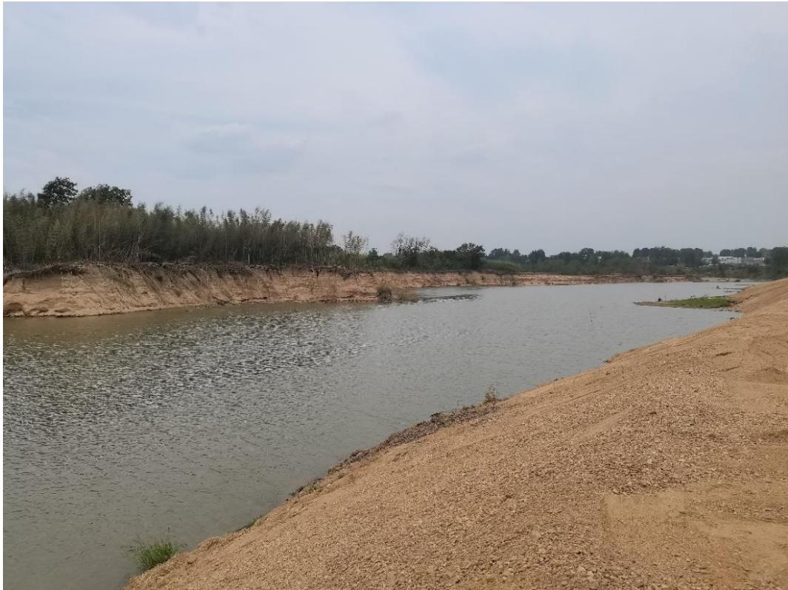
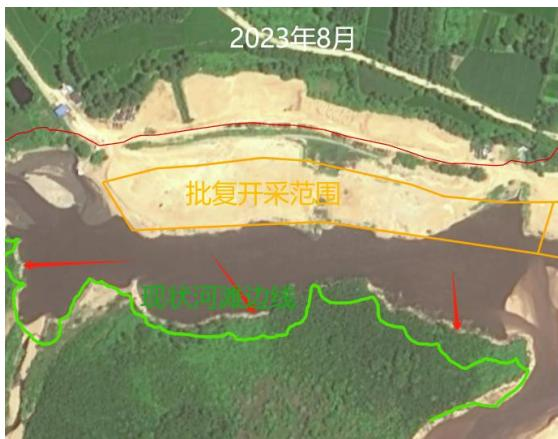
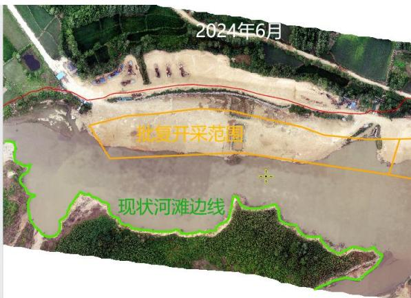
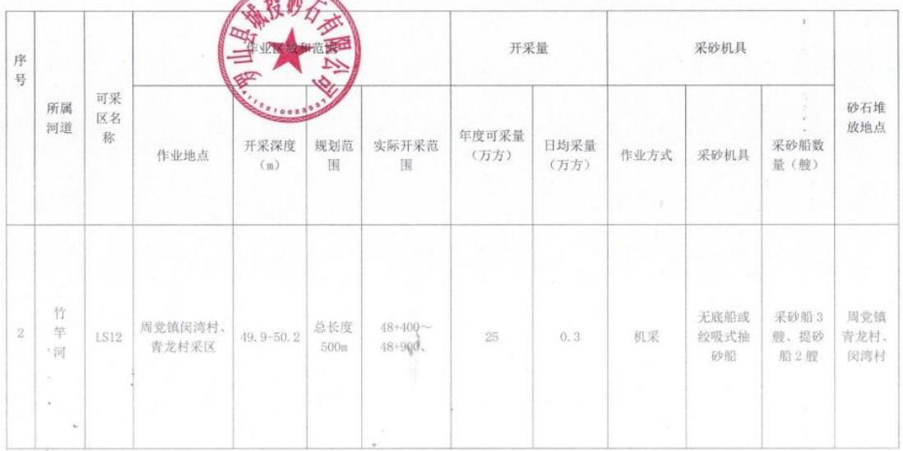
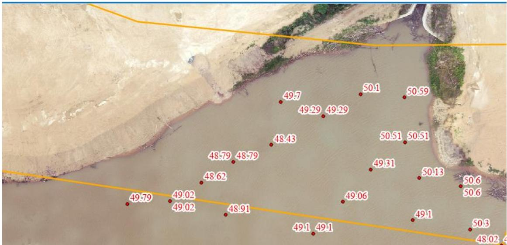

（1）现场监测 通过实地查看 LS12 可采区下游的基本情况，现场基本平复，但采砂作业导致岸线边坡陡立，汛期存在冲刷坡底隐患，需进一步加强管理。  图 5.3-62 采区现场基本情况 # （2）无人机航测 采砂监管测量人员对罗山县 LS12 采区进行了无人机航空摄影测量，叠加规划批复范围（桩号 $4 8 + 4 0 0 \sim 4 8 + 9 0 0$ ）评估分析，现场平复修整基本到位，作业机具拖离至河道管理范围线外，作业区对面河道边线较去年相比存在明显垮塌，需高度重视加强修复。   图 5.3-63 无人机正射影像 # （3）无人船水下测量 依据采砂年度实施方案中要求，LS12 采区开采前河底高程约 48.7～49.2m ，控制开采高程 49.9～50.2m，通过无人船单波束声呐测量开采区水下地形，测量成果显示采区内开采深度满足批复要求。  开采的地点、深度、范围（附范围图）  图 5.3-64 批复开采深度 图 5.3-65 无人船测量数据
