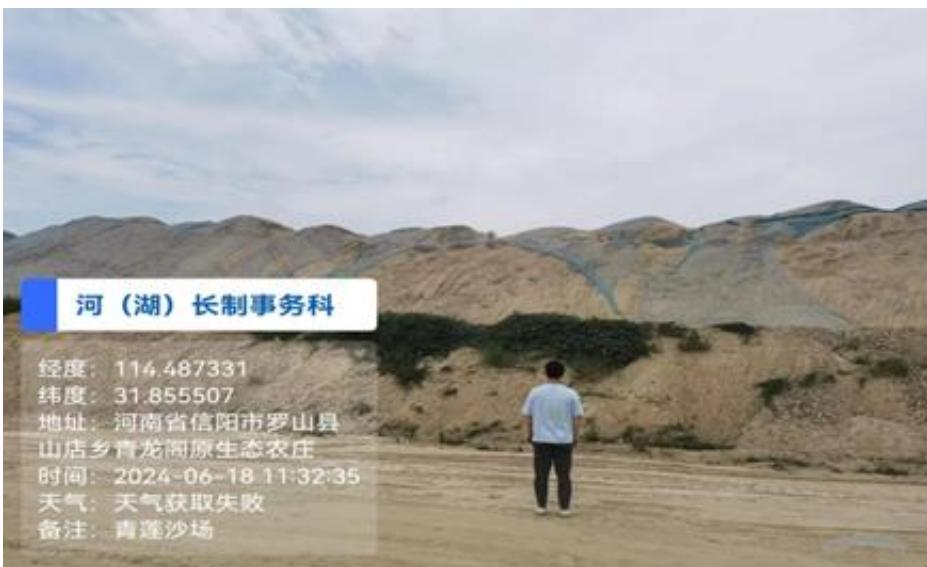
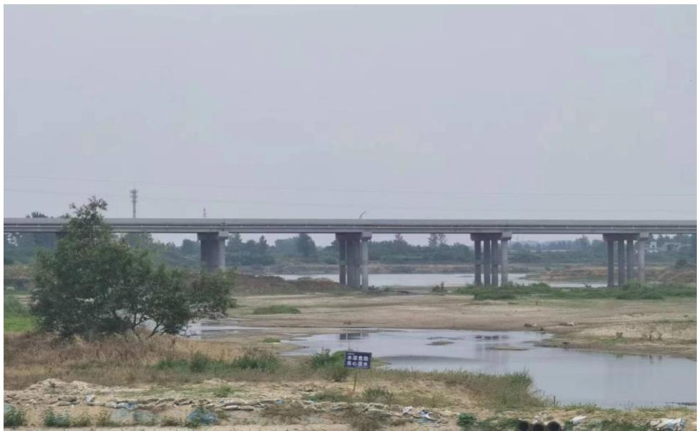
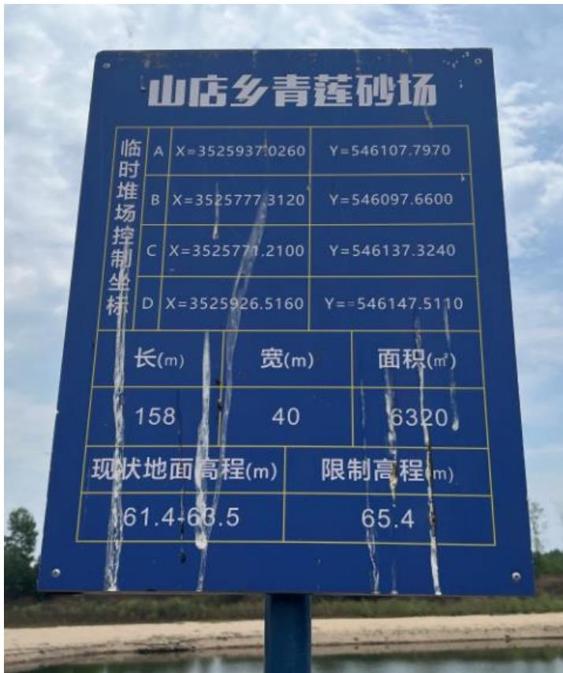
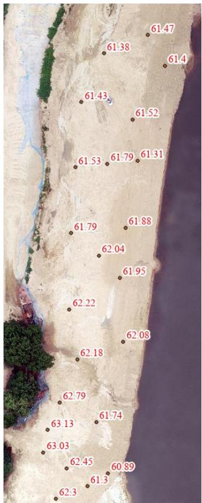
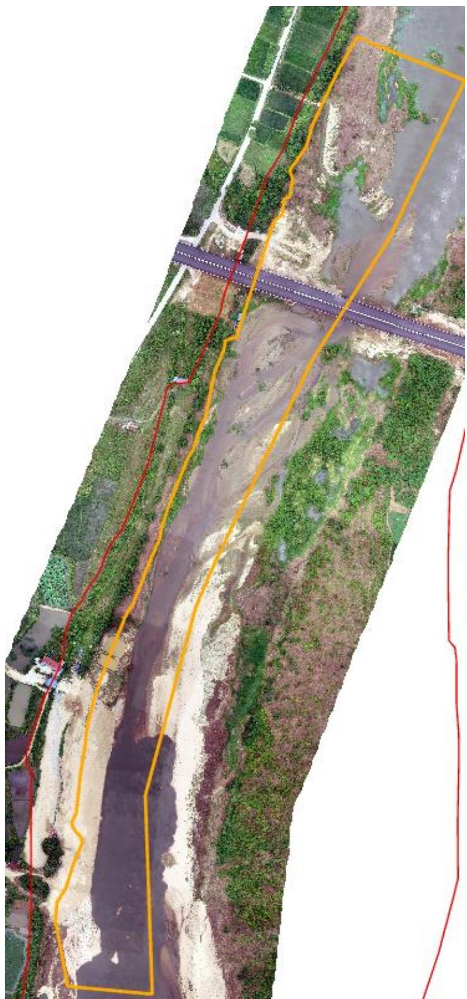
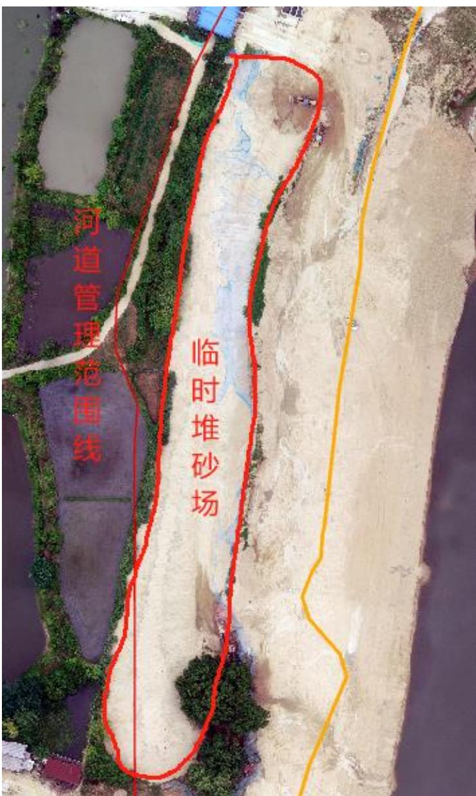
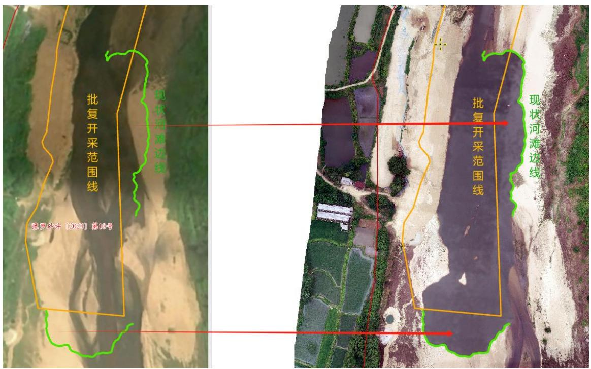
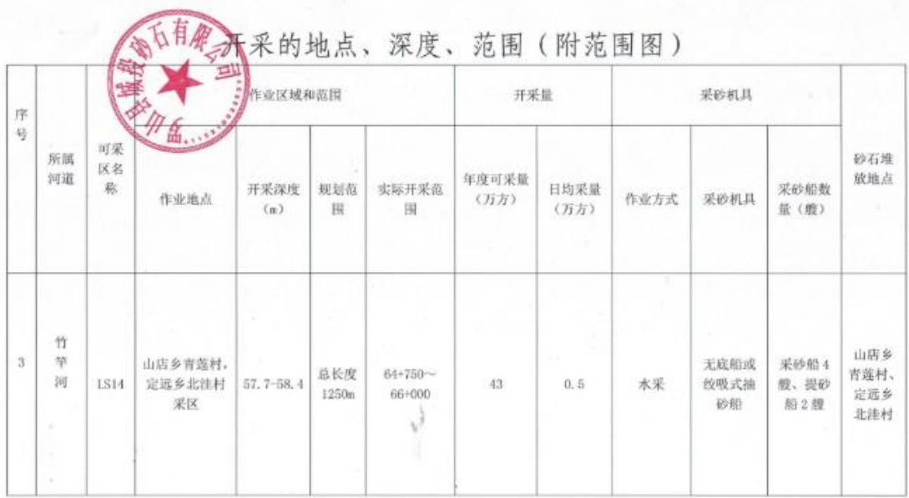
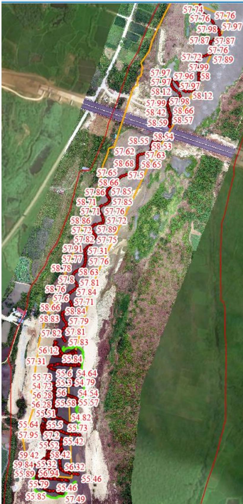

（1）现场监测 通过实地查看 LS14 采区的基本情况，采区现场有公示牌、警示牌、视频监控等设备设施，但现场临时堆砂未及时清运且严重超高、采区下游鸡商高速施工便桥存在妨碍河道行洪风险、需要协调联系建设管理部门及鸡商高速建设部门清理临时便桥弃土。临时堆砂码头高程与原始河滩高程基本一致。  图 5.3-66 采区现场临时堆砂超高  图 5.3-67 采区下游新建高速桥下施工便道弃土侵占河道   图 5.3-68 临时堆砂场限制高程与实测高程 # （2）无人机航测 采砂监管测量人员对罗山县 LS14 采区进行了无人机航空摄影测量，叠加规划批复范围（桩号 $6 4 \substack { + 7 5 0 \sim 6 6 + 0 0 0 }$ ）评估分析，现场生态修复情况基本良好，开采作业主要位于采区上游，上游局部区域存在超范围开采 问题，上游左岸河道管理范围内有一定规模堆砂未转运至储砂场。  图 5.3-69 无人机正射影像  图 5.3-70 河道管理范围内一定规模堆砂  图 5.3-71 上游局部区域超范围开采（开采前后河滩边线对比） # （3）无人船水下测量 依据采砂年度实施方案中要求，LS14 采区开采前河底高程约 55.2-60.9m ，控制开采高程 $5 7 . 7 ~ 5 8 . 4 \mathrm { m }$ ，通过无人船单波束声呐测量开采区水下地形，采后高程均大于开采控制高程（ $. 5 5 . 2 \mathrm { m } \ .$ ），未发现超深度开采问题。  图 5.3-72 批复开采深度  图 5.3-73 无人船测量数据
