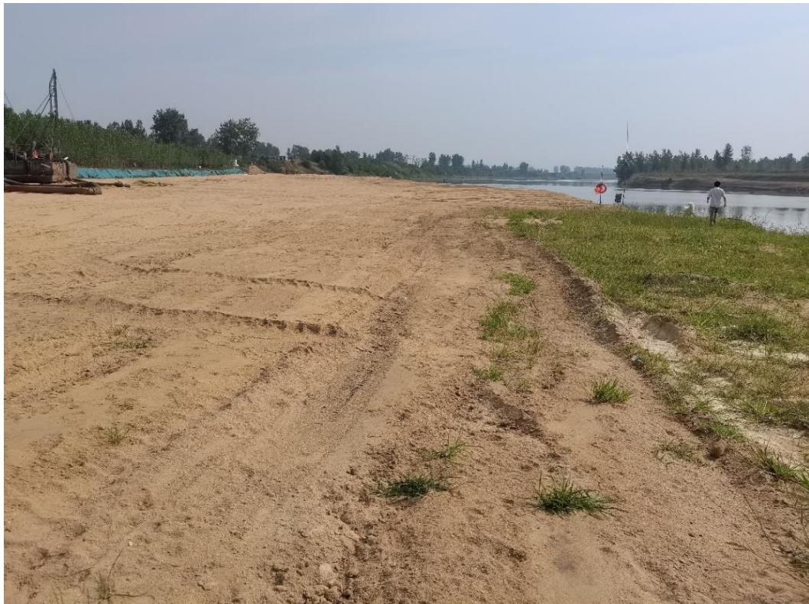
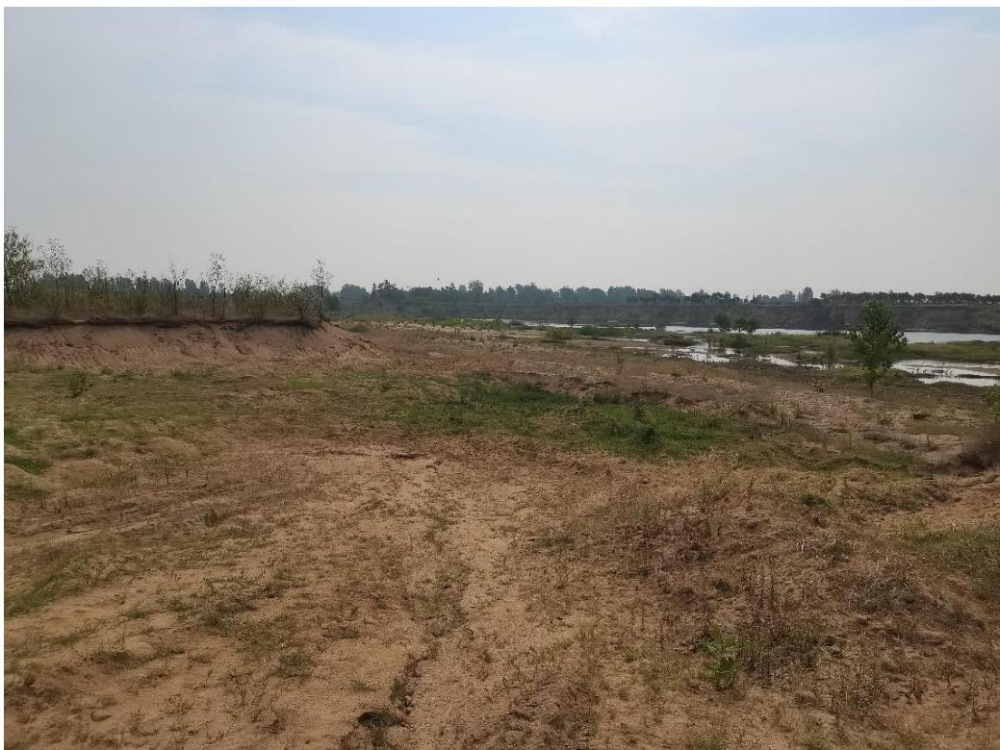
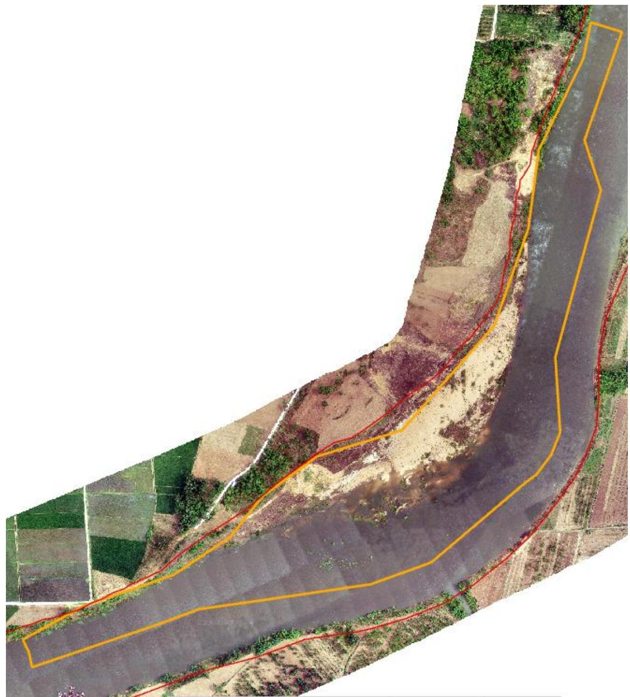
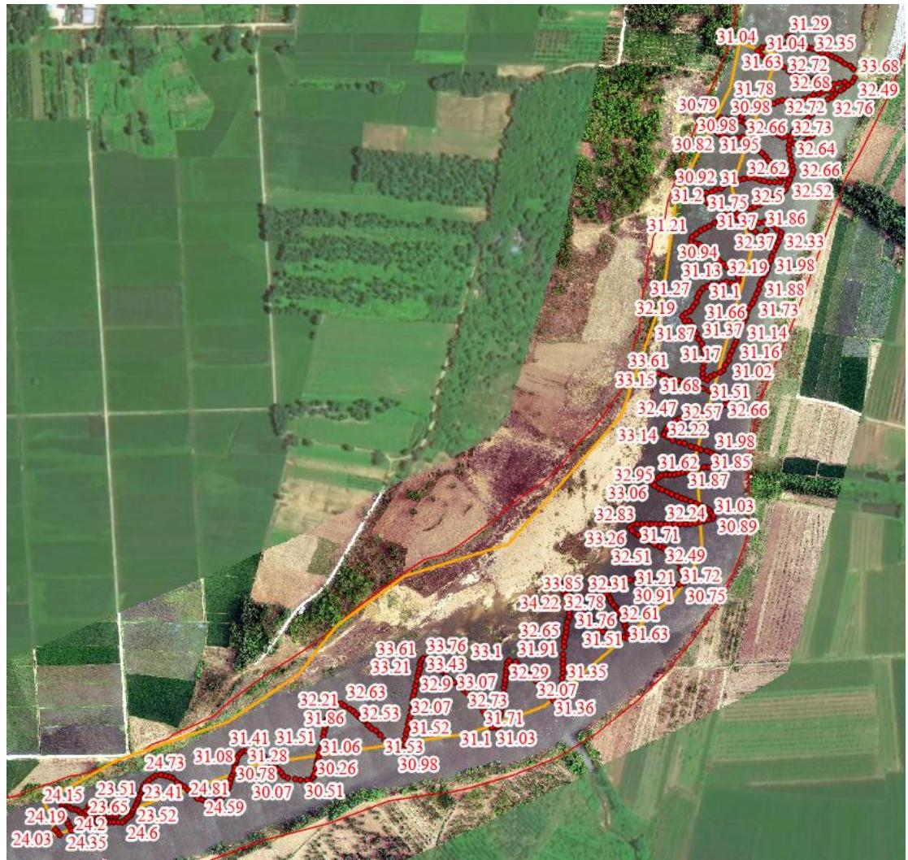
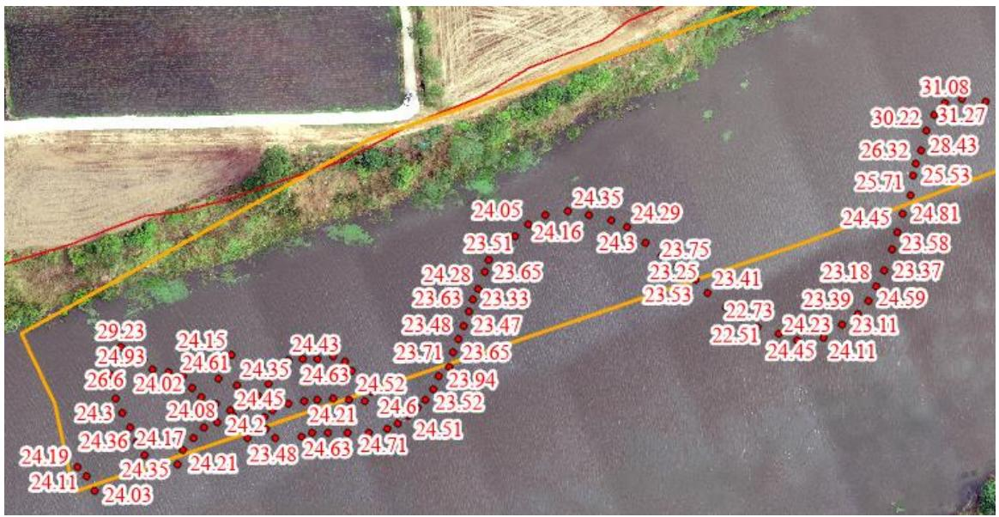

（1）现场监测 通过实地查看 LX1 采区的基本情况，采区现场有公示牌、警示牌、视频监控等设备设施，生态修复基本到位。   图 5.3-74 完成平复的作业码头 图 5.3-75 采区现场照片 # （2）无人机航测 采砂监管测量人员对罗山县 LX1 采区进行了无人机航空摄影测量， 叠加规划批复范围（桩号 $1 + 5 0 0 \sim 3 + 0 0 0$ ）评估分析，经现场查看，该采区作业活动主要位于水下，对河滩扰动较小，河道管理范围线内无临时性看护管理房，船只集中停靠，现场生态修复基本到位。  图 5.3-76 无人机正射影像 # （3）无人船水下测量 依据采砂年度实施方案中要求，LX1 采区开采前河底高程约 29.7～32.2m ，控制开采高程 $2 8 . 9 \sim 2 9 . 1 \mathrm { m }$ ，测深结果显示：采区上游局部区域超 深，存在提砂作业区修复不到位问题，后续开采应加强管理。 开采的地点、深度、范围（附范围图） 序号 所属河道 可采区名称 作业区域和范围 开采量(万m3) 采砂机具 砂石堆放地点 作业地点 开采深度(m) 规划范围 实际开采范围 年度可采量(万方) 日均采量(万方) 作业方式 采砂机具 采砂船数量(艘) 竹竿河 LX1 竹竿镇:汪河村淮河村 6.2 总长度1500m 1+500-3+000 45 0.2 水采 无底船或绞吸式抽砂船 采沙船5艘提砂船3艘 竹竿镇汪河村淮河村  图 5.3-77 批复开采深度 图 5.3-78 无人船测量数据  图 5.3-79 采区上游测量数据
