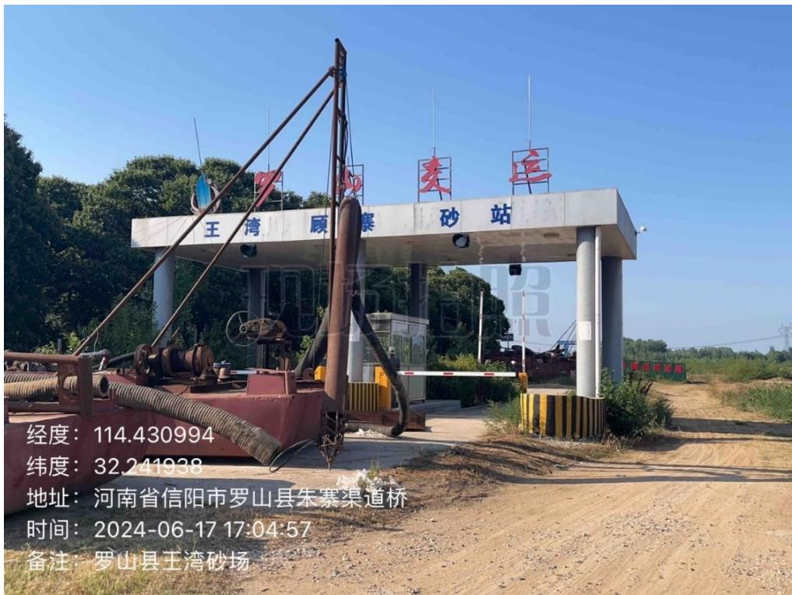
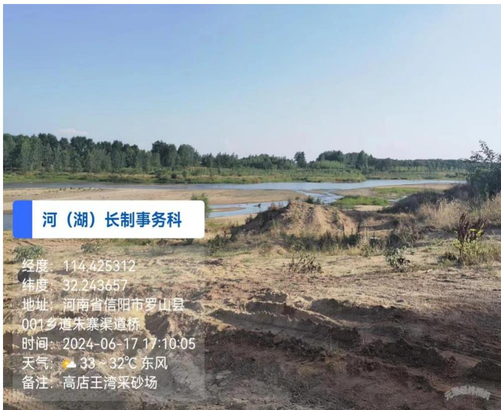
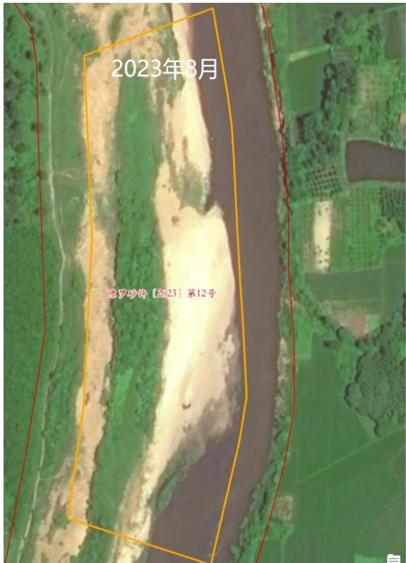
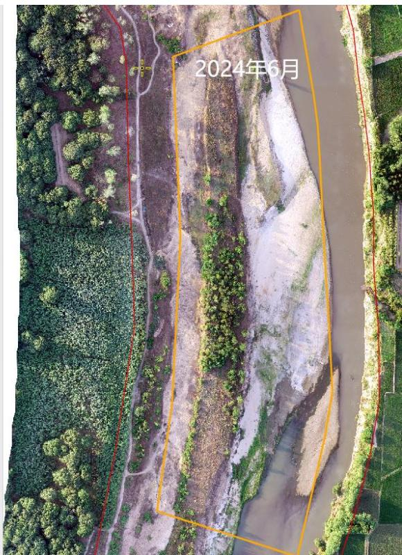

（1）现场监测 通过实地查看 SH2 采区的基本情况，采区现场有公示牌、警示牌、视频监控等设备设施，由于运输道路未与周边村民协商一致，该采区为实施开采作业。前期进场施工形成的砂堆未平复，生态需进一步修复。  图 5.3-80 采区现场照片  图 5.3-81 生态修复不到位 # （2）无人机航测 采砂监管测量人员对罗山县 SH2 采区进行了无人机航空摄影测量， 叠加规划批复范围（桩号 $5 \substack { + 7 0 0 } \sim 6 \substack { + 1 6 0 }$ ）评估分析，河道基本保持原始自然地貌，该采区 2023 度年未开采作业，河道管理范围线内无临时性看护管理房。   图 5.3-82 无人机正射影像
