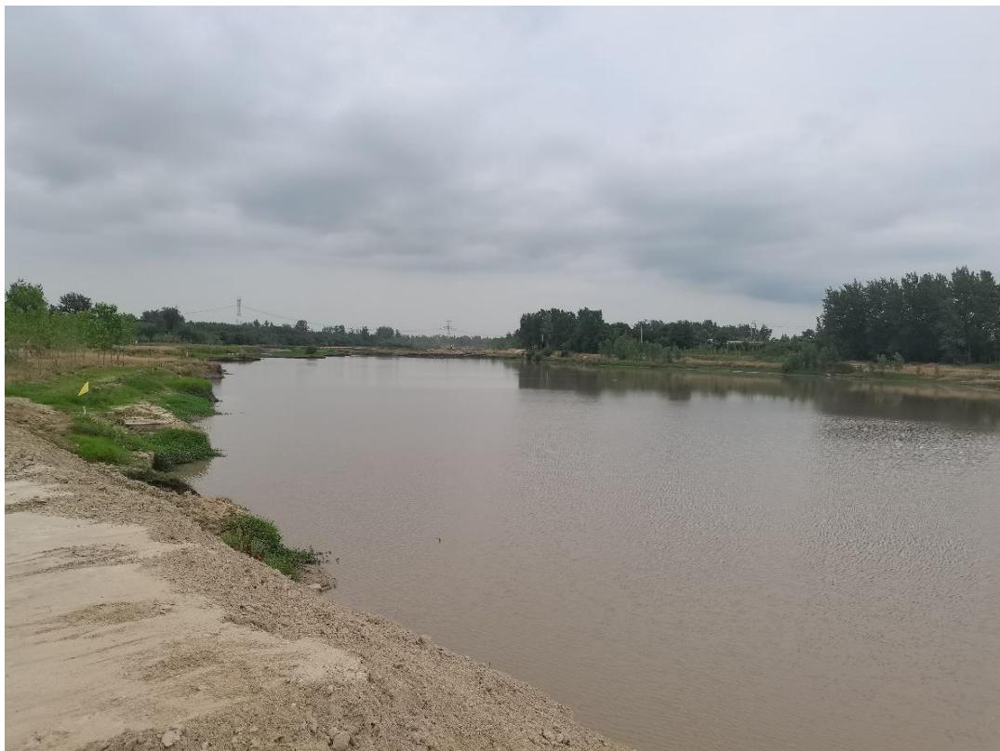
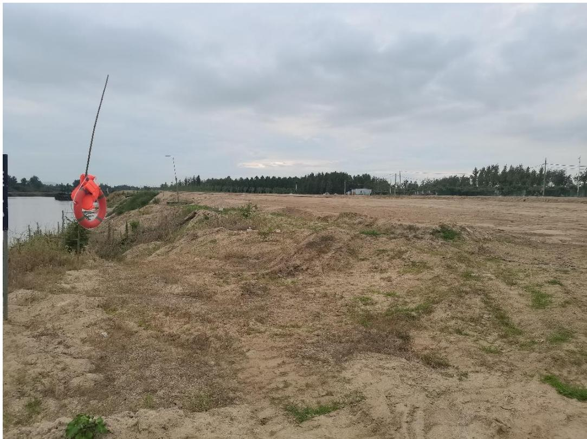
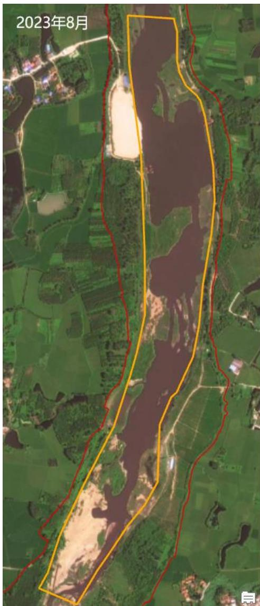
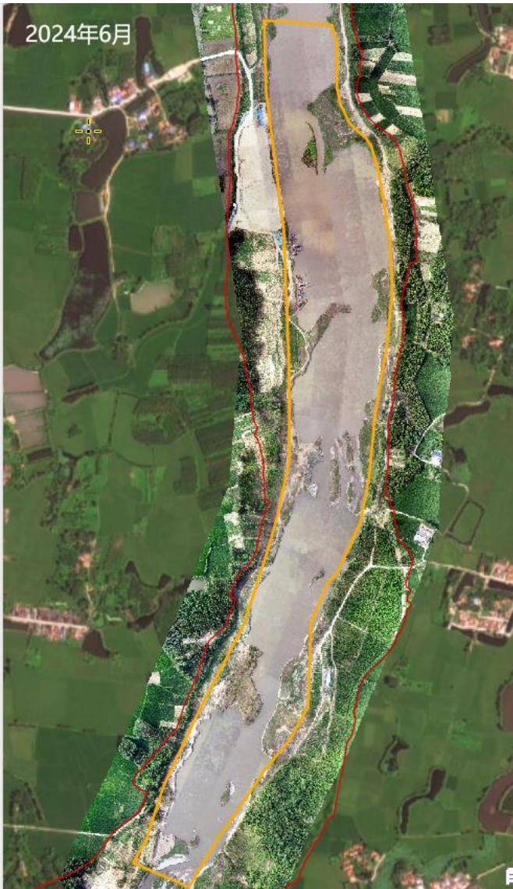
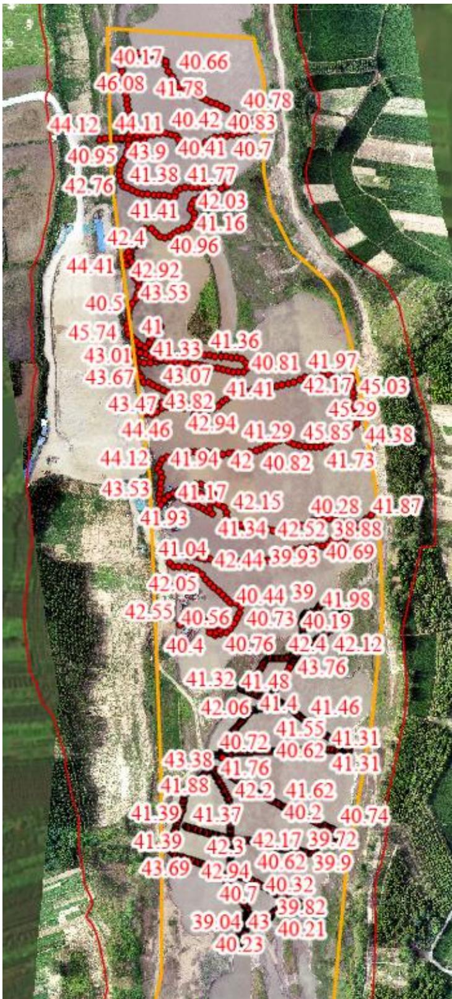

（1）现场监测 通过现场实地查看，潢川县白露河 BLHK2#三星采砂场可采区开采活动主要位于水下，开采活动未对采区周围河岸环境造成影响。开采砂石通过船只运送至采区下游临时堆砂点，开采结束后船只在码头集中停靠，现场生态修复工作基本到位。  图 5.4-1 三星砂场现场照片  图 5.4-2 三星砂场临时堆砂点 # （2）无人机航测 采砂监管测量人员对豫潢砂许〔2023〕第 01 号采砂区域进行了无人机航空摄影测量，叠加 2023 年度规划批复范围（桩号 $\mathrm { K } 1 8 \substack { + } 1 1 2 \sim \mathrm { K } 2 0 \substack { + } 1 8 6$ ）进行评估分析，开采作业主要位于采区中上游区域，未发现超范围开采问题，开采区现场生态修复基本到位。   图 5.4-3 潢川县三星砂场无人机正射影像 # （3）无人船水下测量 根据批复文件和 2023 年度实施方案，开采后控制高程为 41.98m-42.93m 。通过无人船单波束声呐测量采区水下地形，测量成果显示局部区域高程略低于开采控制高程，主要位于提砂作业区，存在提砂区域修复不到位问题。  图 5.4-4 潢川县三星砂场无人船测量成果
