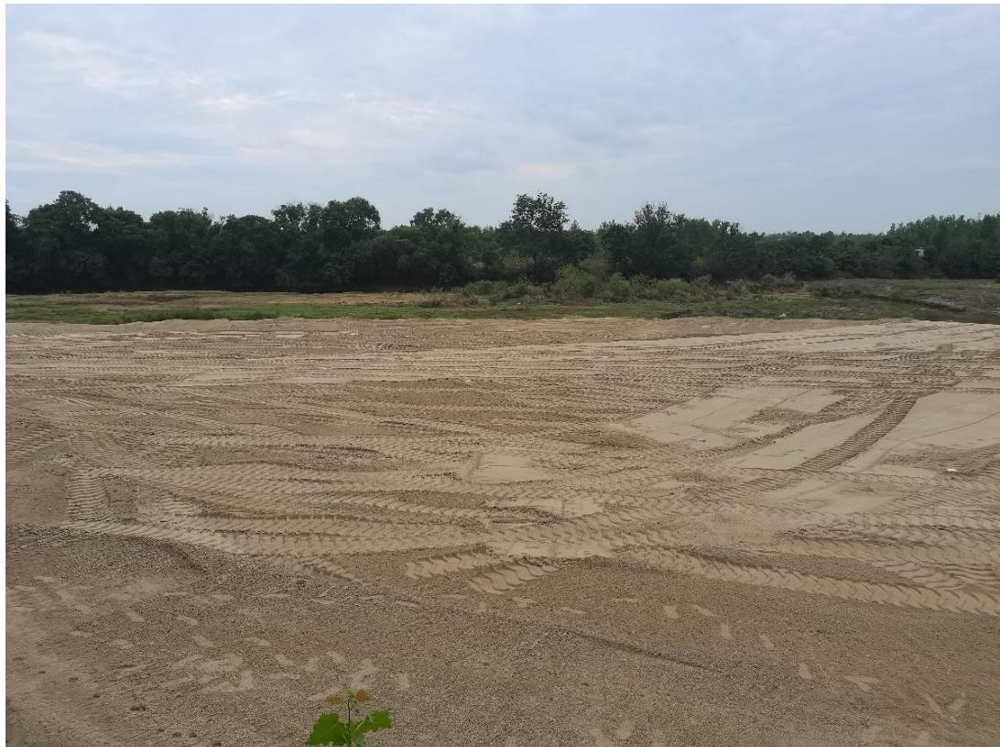
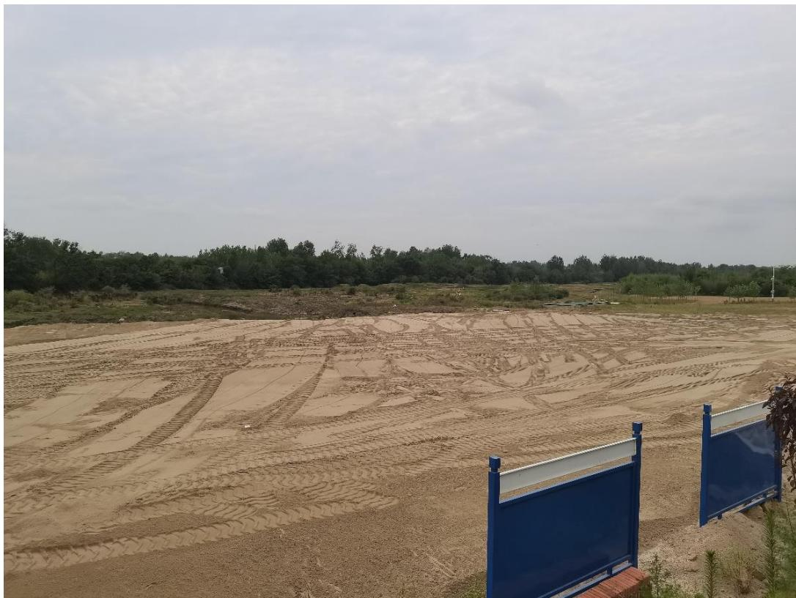
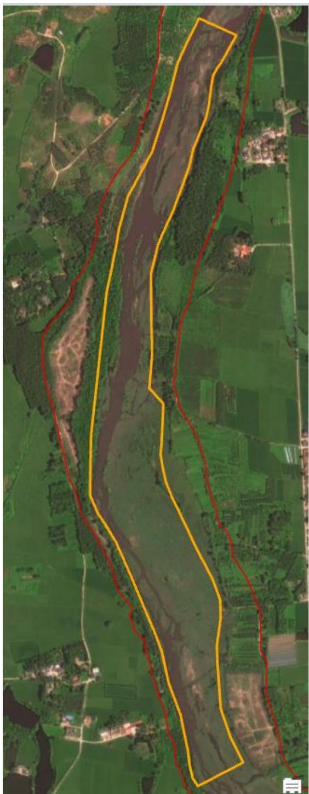
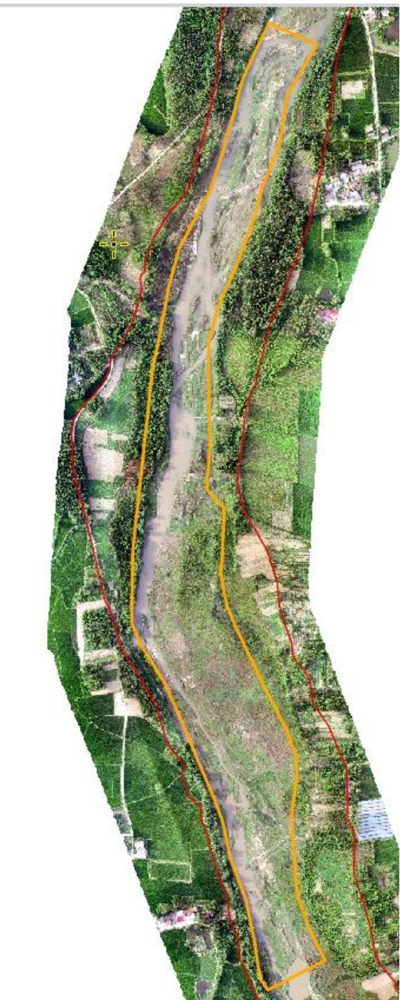

（1）现场监测 通过现场实地查看，潢川县白露河 BLHK1#傅营砂场电子监控设施运行正常。开采结束后船只机具已撤离采区并在码头集中停靠，现场无坑洼不平，堆砂码头现场虽进行了平复修整但仍存在抬高原始河道滩地情况。  图 5.4-5 潢川县白露河 BLHK1 傅营砂场现场  图 5.4-6 傅营砂场平复后的堆砂掩盖公示牌立柱 # （2）无人机航测 采砂监管测量人员对豫潢砂许〔2023〕第 02 号采砂区域进行了无人 机航空摄影测量，叠加 2023 年度规划批复范围（桩号 $\mathrm { K } 1 3 + 7 2 1 \sim \mathrm { K } 1 5 + 6 1 2 \ ,$ ） 进行评估分析，未发现超范围开采情况，开采区现场生态修复基本到位。   图 5.4-7 潢川县傅营砂场无人机正射影像
