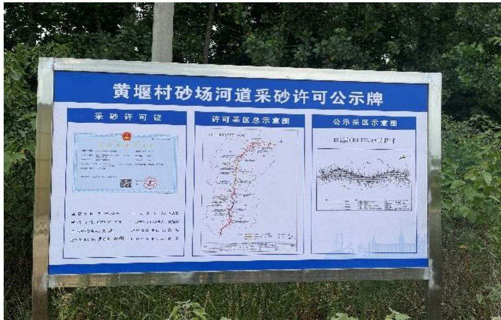
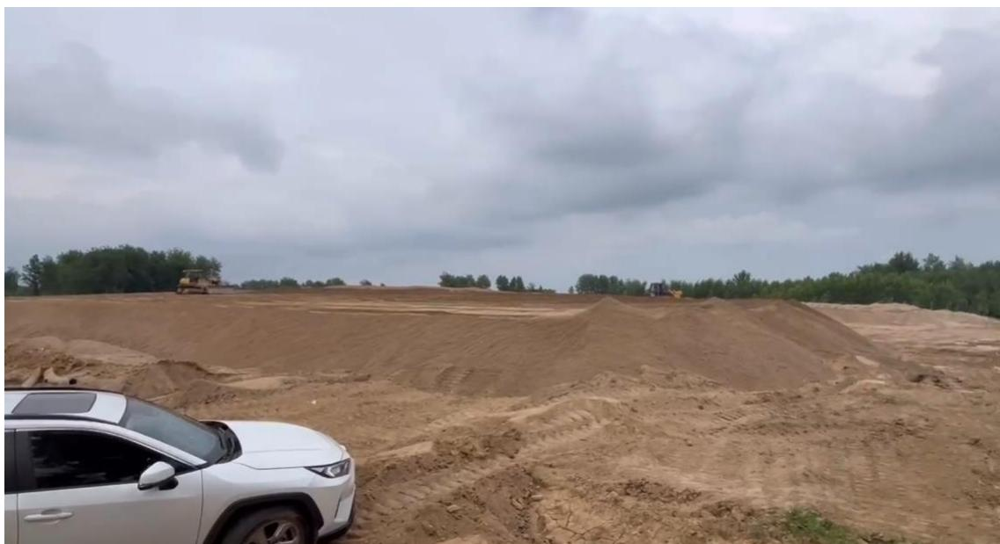
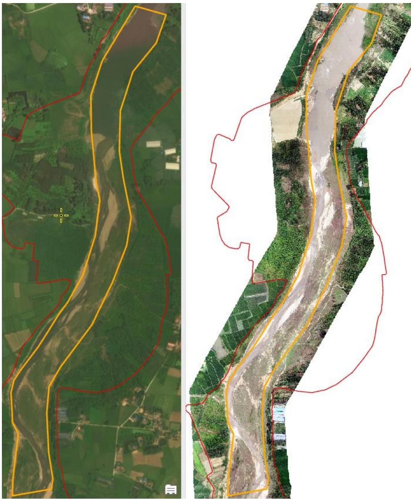
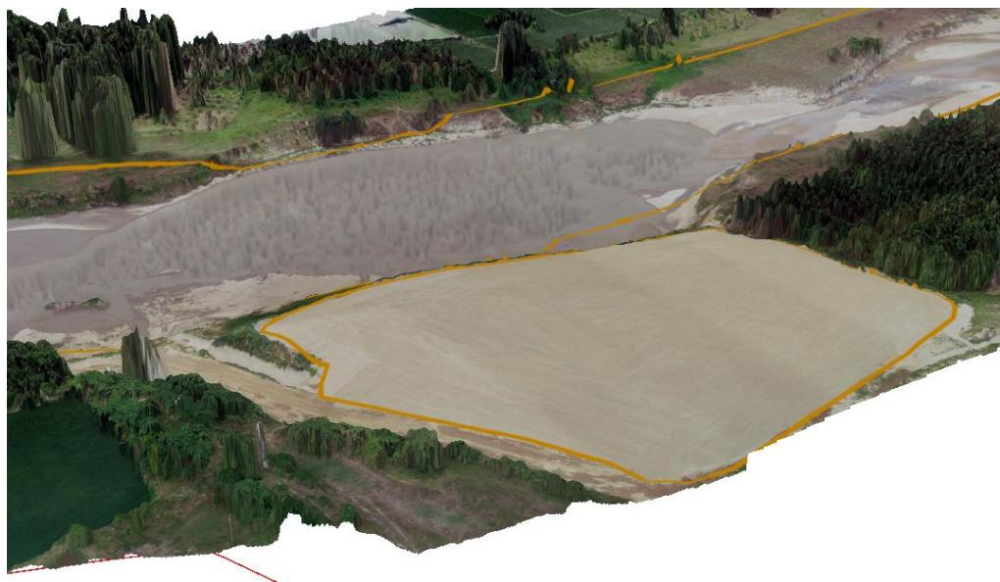
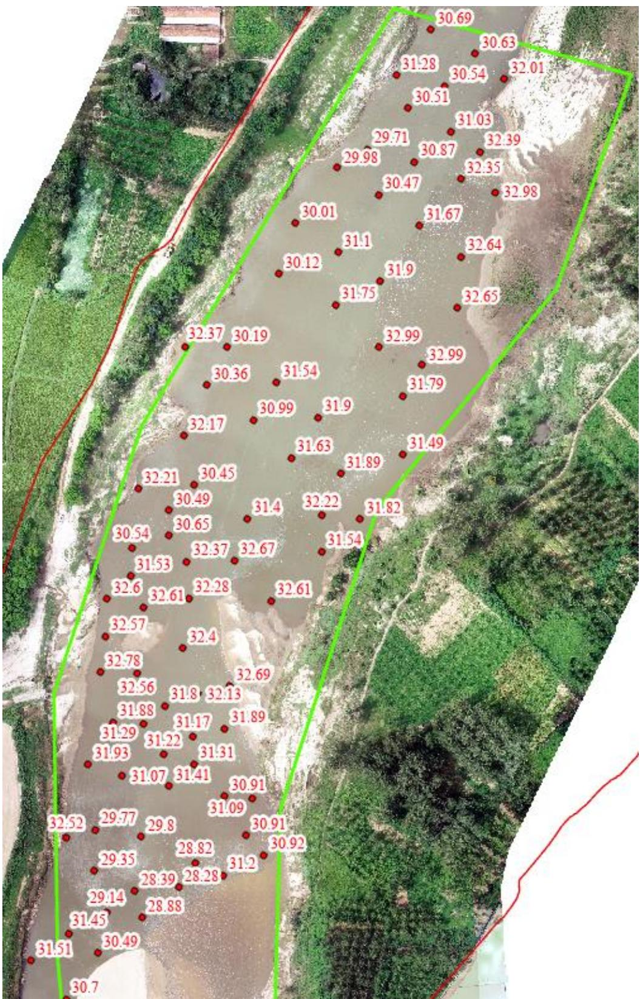

（1）现场监测 通过现场实地查看，BLHK4#黄堰村可采区开采结束后船只在堆砂码头附近集中停靠。临时堆砂点堆砂未清运至储砂场，现场有作业机具正在摊平过高砂堆，临时堆砂点与外界运输道路已经打通。  图 5.4-8 潢川县白露河黄堰村砂场采砂公示牌  图 5.4-9 潢川县林寨采砂场临时堆砂点 # （2）无人机航测 采砂监管测量人员对豫潢砂许〔2023〕第 03 号采砂区域进行了无人机航空摄影测量，叠加 2023 年度规划批复范围（桩号 $\mathrm { K } 3 1 + 7 3 0 \sim \mathrm { K } 3 3 + 6 6 1$ ）进行评估分析，开采作业主要位于采区下游区域，未发现超范围开采情况，采区左岸河道管理范围线内临时堆砂场河砂未转运，堆砂面积约 1.24 公 顷，平均堆砂高度约 3.82 米。  图 5.4-10 潢川县白露河林寨砂场无人机正射影像  图 5.4-11 潢川县白露河林寨砂场临时堆砂场实景三维影像 # （3）无人船水下测量 根据批复文件和 2023 年度实施方案，该采区开采后控制高程为$3 3 . 7 9 \mathrm { m } \mathrm { - } 3 4 . 6 8 \mathrm { m }$ 。通过无人船单波束声呐测量采区水下地形，测量成果显示开采区域采后河底高程为 27.81-33.10m，最高高程为 33.10m ，最低采后高程主要位于提砂作业码头附近，平均高程 30.00m ，低于最低开采控制高度 3.79m ，属于超深度开采。  图 5.4-12 潢川县白露河林寨砂场实际作业区无人船测量成果
