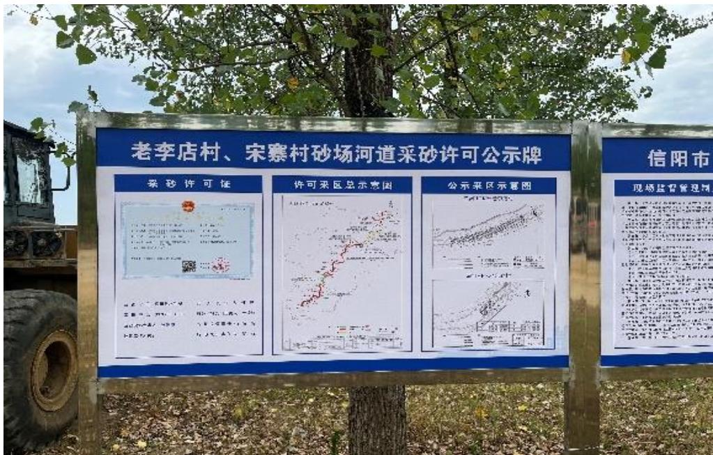
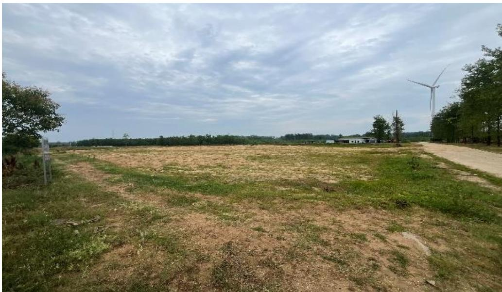
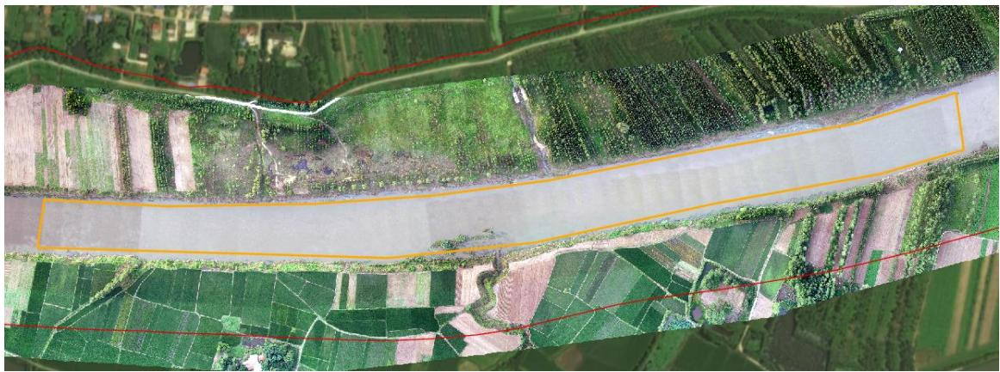
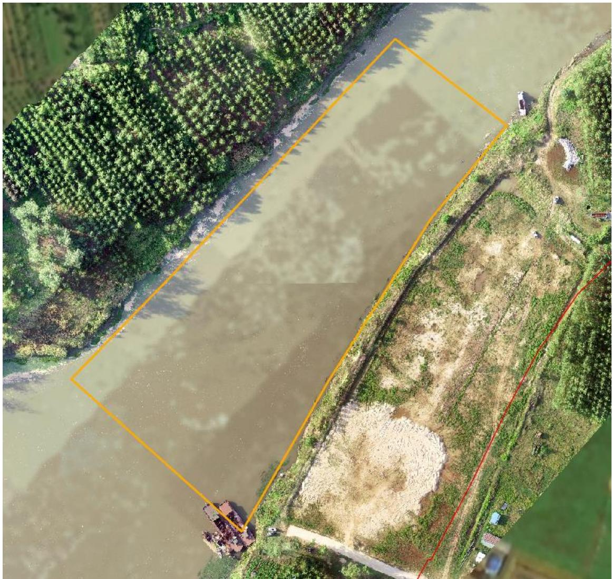
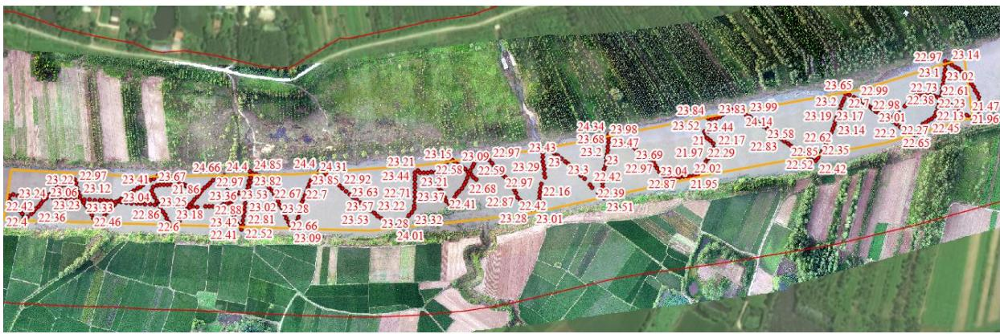
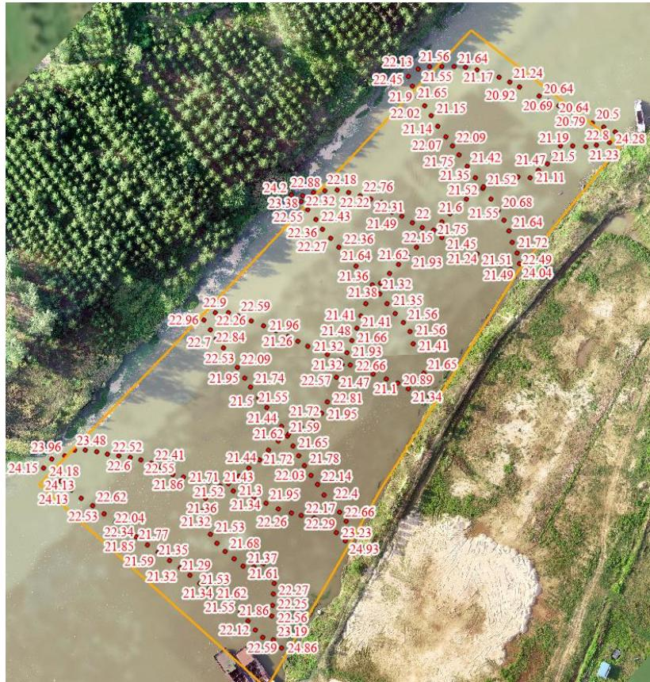

（1）现场监测 通过现场实地查看，潢川县潢河 HHK2#老李店村可采区、HHK3#宋寨村可采区开采活动主要位于水下，开采活动未对采区周围河岸环境造成影响。开采结束后船只机具已撤离采区并在码头集中停靠。临时堆砂点已完成平复，无坑洼不平，生态修复工作基本到位。   图 5.4-13 老李店村、宋寨村采砂许可公示牌 图 5.4-14 完成平整修复的临时堆砂场 # （2）无人机航测 采砂监管测量人员对豫潢砂许〔2023〕第 04 号采砂区域进行了无人 机航空摄影测量，叠加 2023 年度规划批复范围（桩号 $\mathrm { K } 3 1 + 5 9 6 \sim \mathrm { K } 3 2 + 9 7 1$ 、$\mathrm { K } 3 9 + 3 9 3 \sim \mathrm { K } 3 9 + 6 9 3$ ）进行评估分析，未发现超范围开采情况，可采区生态修复基本到位。  图 5.4-15 潢川县潢河老李店采区无人机正射影像  图 5.4-16 潢川县潢河宋寨采区无人机正射影像 # （3）无人船水下测量 根据批复文件和 2023 年度实施方案，该采区开采后控制高程分别为20.52-20.89m（老李店采区）、20.06-20.14m（宋寨采区）。通过无人船单波束声呐测量采区水下地形，测量成果显示老李店采区最低开采高程为20.998m ，采后平均高程 23.05m ，宋寨采区最低开采高程 20.495m ，采后平均高程 21.98m ，开采深度满足批复要求。  图 5.4-17 潢川县潢河老李店采区无人船测量成果  图 5.4-18 潢川县潢河宋寨采区无人船测量成果
