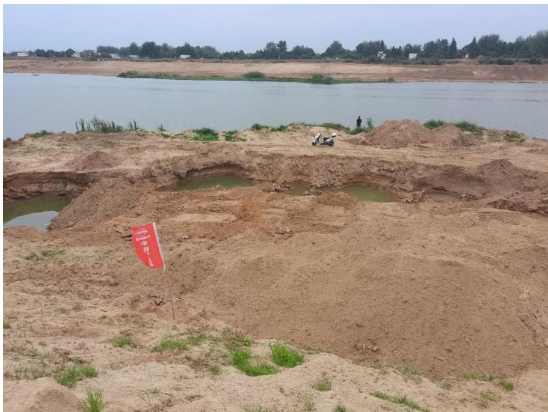
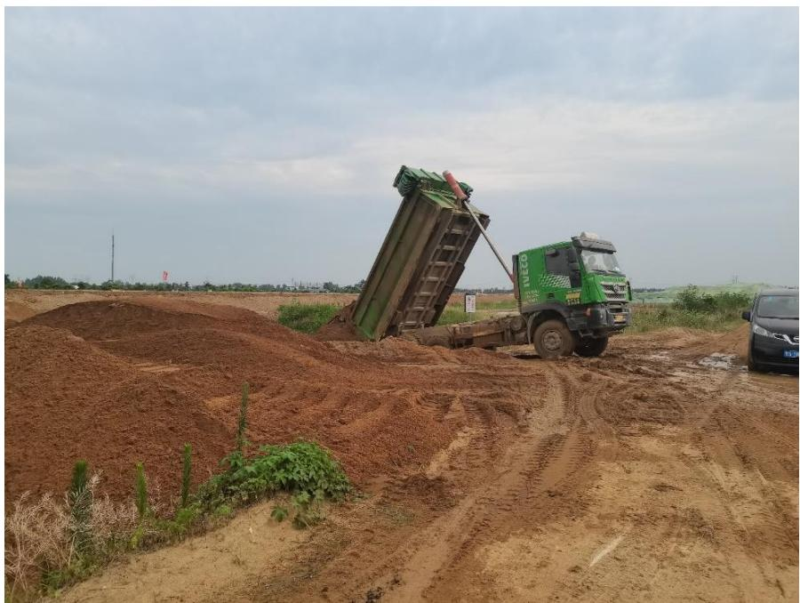
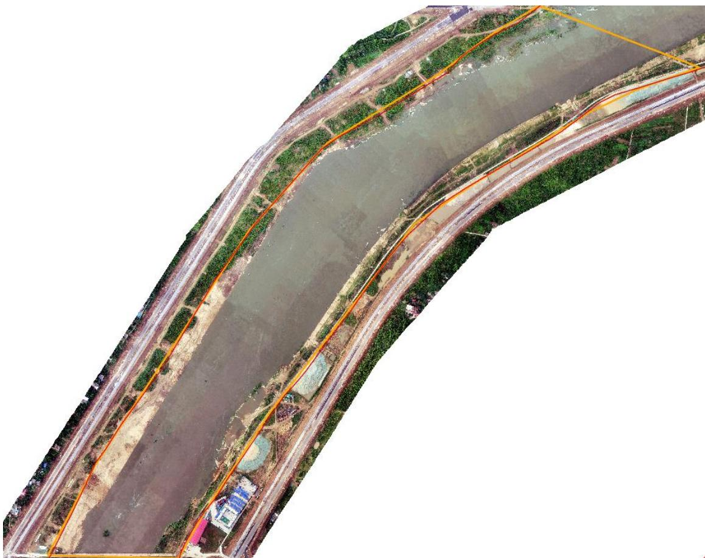
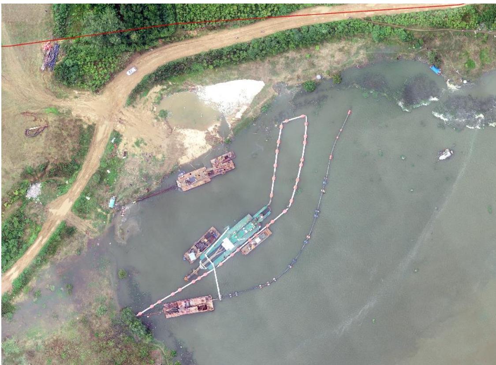
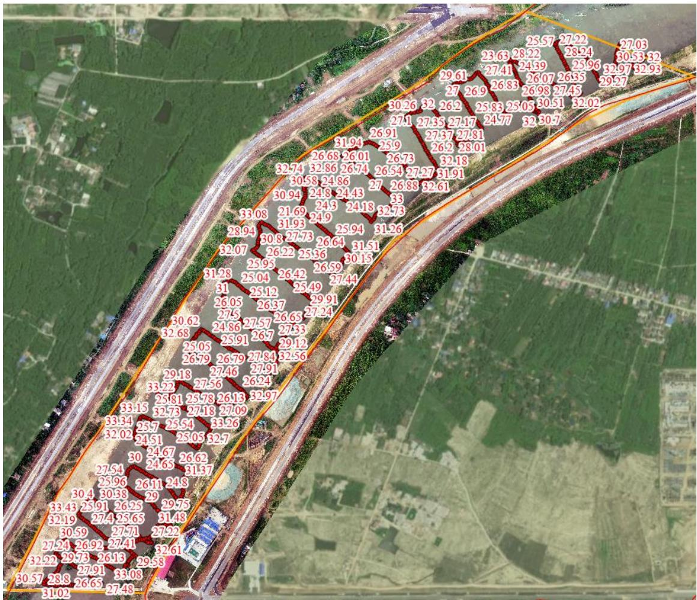
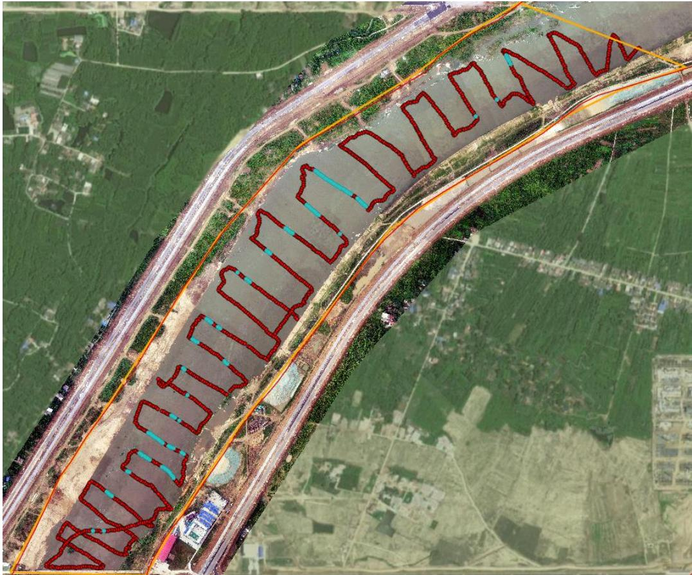

（1）现场监测 通过实地查看，现场疏浚船只已全部吊离上岸，现场挖掘机正在河道边坡开展作业；局部区域存在坑洼不平，该工程未高标准执行“边作业边修复”要求，河道右岸临时堆砂场（位于河道管理范围线外）堆砂未及时转运至储砂场，未封闭管理，且未设置监控设施。   图 5.5-1 局部区域存在坑洼不平 图 5.5-2 现场作业机具正在施工 # （2）无人机航测 采砂监管测量人员对豫东南高新区潢河生态治理工程进行无人机航空摄影测量，经评估分析，采区左岸生态修复较好，上游右岸局部区域存在坑洼不平，右岸四处临时堆砂场堆砂未转运。疏浚工程下游左岸，有一艘疏浚船只未靠岸集中停靠，疑似未锚固，汛期存在风险。  图 5.5-3 无人机正射影像  图 5.5-4 疏浚工程下游左岸未靠岸锚固的疏浚船只 # （3）无人船水下测量 根据砂石处置方案，该疏浚工程河底疏挖后控制高程为 25.08m-25.91m。通过无人船单波束声呐测量采区水下地形，测量成果显示局部区域高程略低于疏挖后控制高程，存在提砂作业区域修复不到位问题。  图 5.5-5 豫东南高新区潢河生态治理工程无人船水下测量成果  图 5.5-6 采后高程低于最低控制高程的点位空间分布
