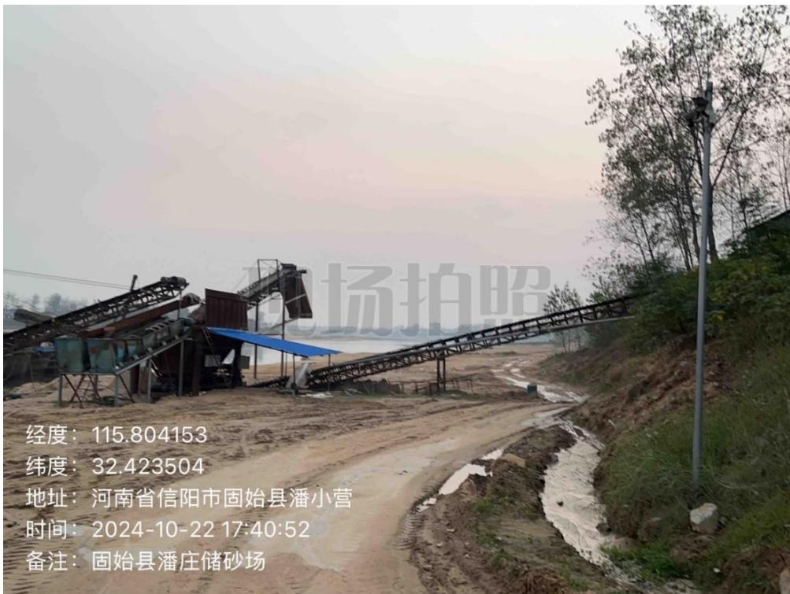
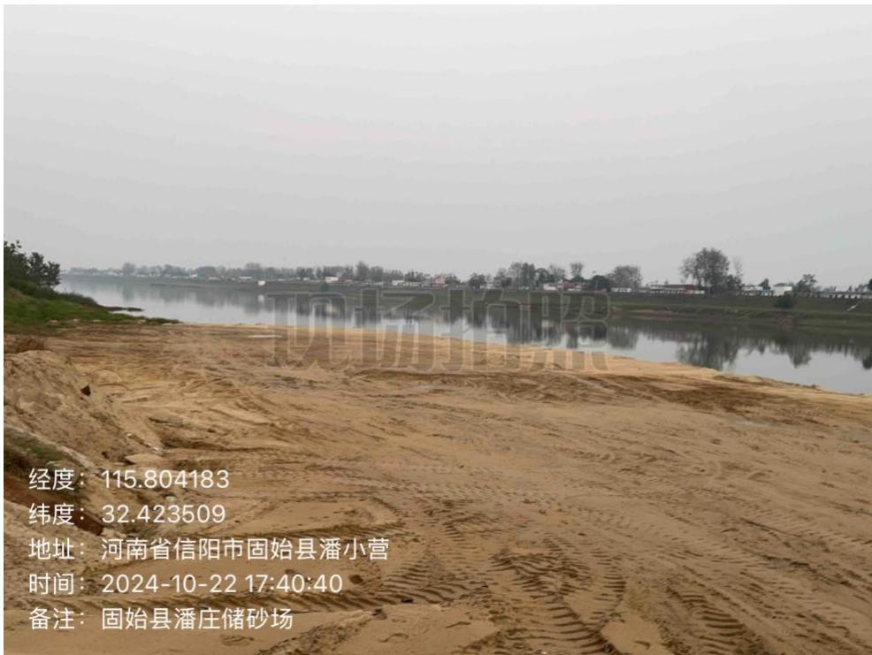
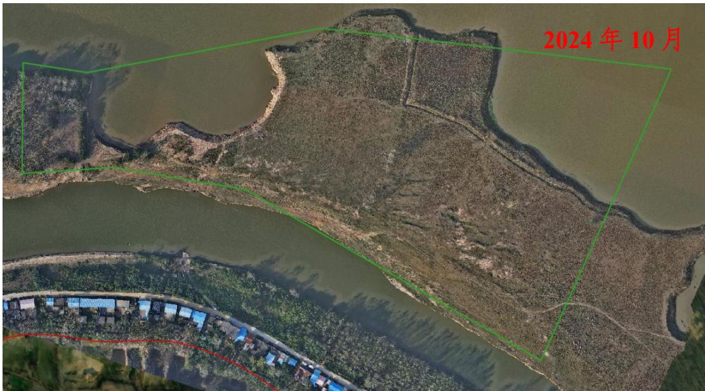
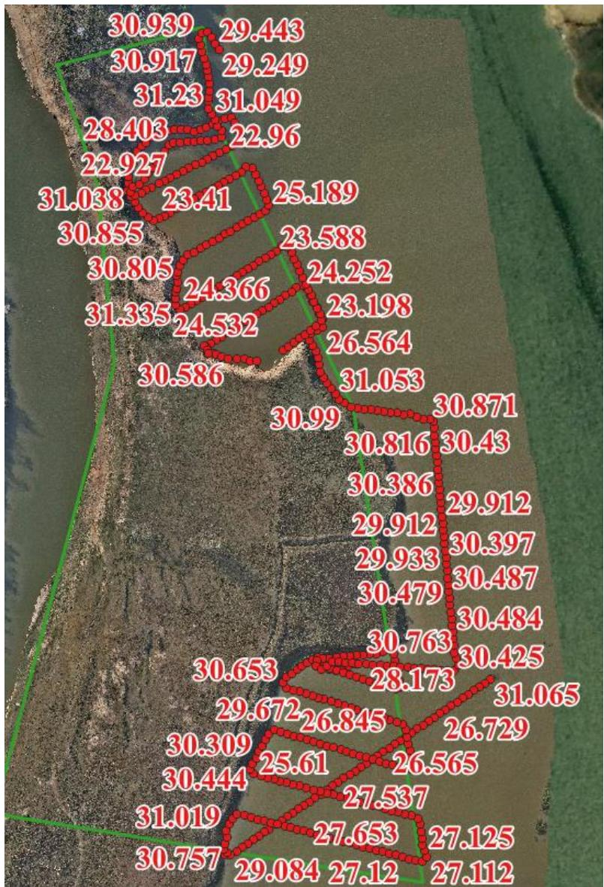

（1）现场监测 通过实地查看，固始县潘庄储砂场码头临时堆砂已转运至河道管理范围线外的储砂场，船只集中停靠，现场平整修复基本到位，生态修复良好。   图 5.6-1 停靠在码头的大型采砂船只及传输装置 图 5.6-2 采区现场情况 # （2）无人机航测 采砂监管测量人员对固始潘庄储砂场区域进行了无人机航空摄影测量，经评估分析，未发现超范围开采情况，开采区现场生态修复基本到位。  图 5.6-3 固始县史灌河潘庄可采区无人机正射影像 # （3）无人船水下测量 根据批复文件和 2023 年度实施方案，开采后控制高程为 17.10m-17.20m。通过无人船单波束声呐测量采区水下地形，测量成果显示区域高程高于开采控制高程，开采深度符合年度实施方案要求。  图 5.6-4固始县史灌河潘庄可采区水下测量成果
