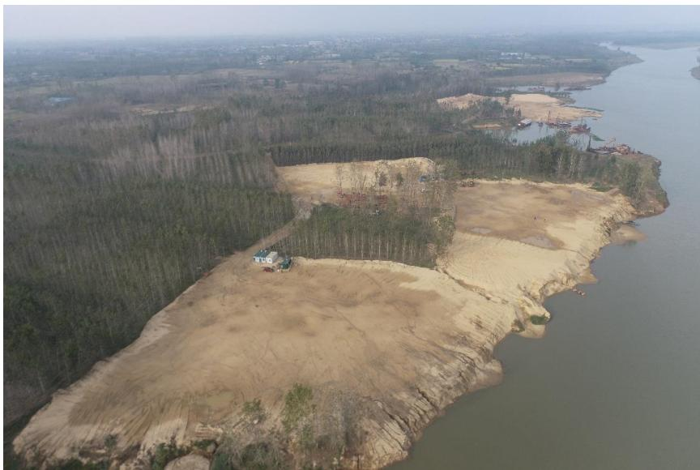
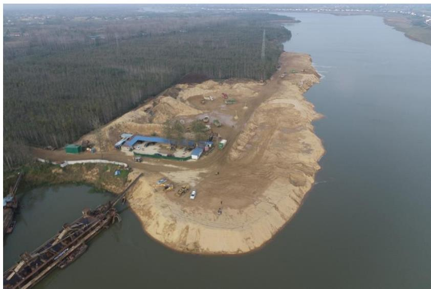
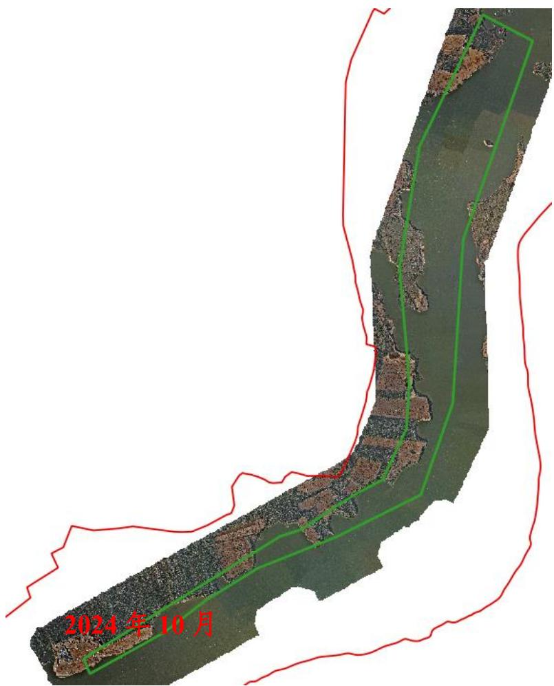
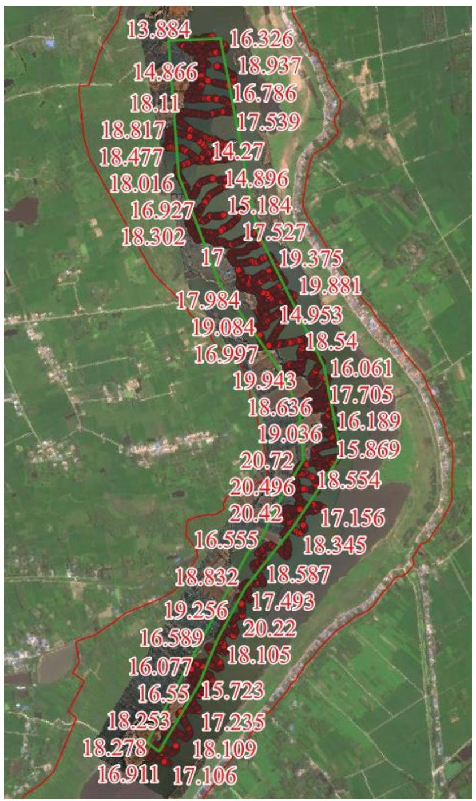

（1）现场监测 黄寨采点场地平整、生态修复基本到位，现场部分作业船只正在拆解，临时堆砂场大批量堆砂已转运出河道管理范围线外，零星堆砂待转运；李棚采点临时堆砂正在积极转运，堆砂作业码头正在开展平整修复工作。   图 5.6-5 黄寨采点现场照片 图 5.6-6 李棚采点现场照片 # （2）无人机航测 采砂监管测量人员对豫信固砂许〔2023〕第 02 号区域进行了无人机航空摄影测量，经评估分析，未发现超范围开采情况，现场平复修整基本到位。  图 5.6-7 固始县李棚-黄寨可采区无人机正射影像 # （3）无人船水下测量 根据批复文件和2023年度实施方案，开采后控制高程为17.65-18.30m，通过无人船单波束声呐测量采区水下地形，测量成果显示该采区开采深度总体符合年度实施方案要求，部分提砂作业区存在修复不到位问题，后续开采应加强管理。  图 5.6-8 固始县李棚-黄寨可采区无人船水下测量成果
