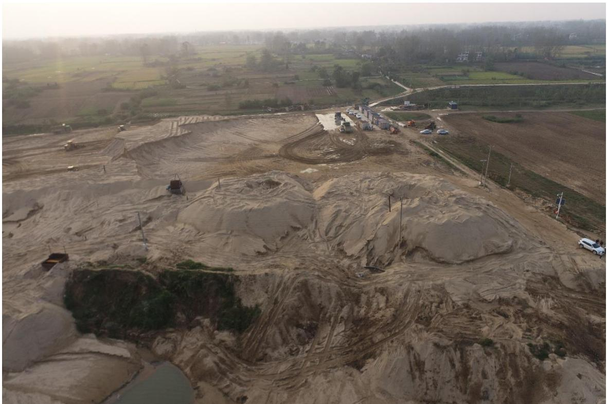
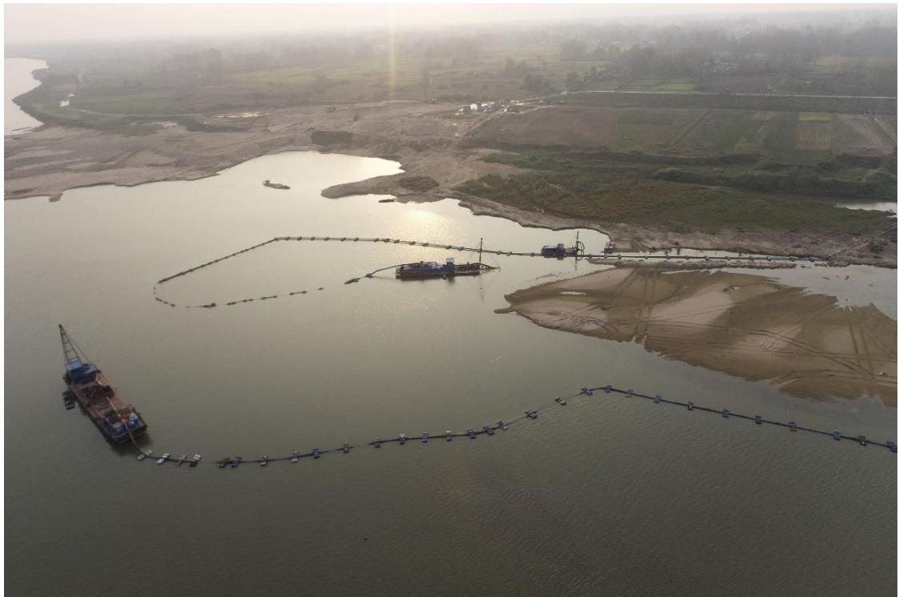
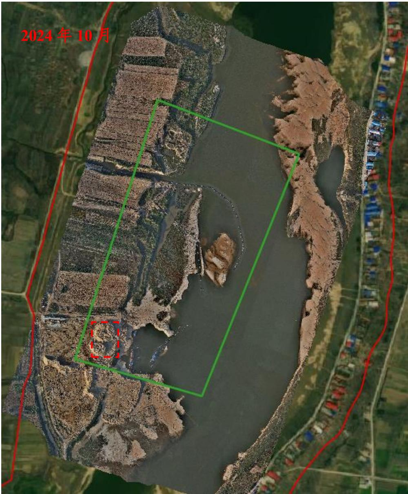
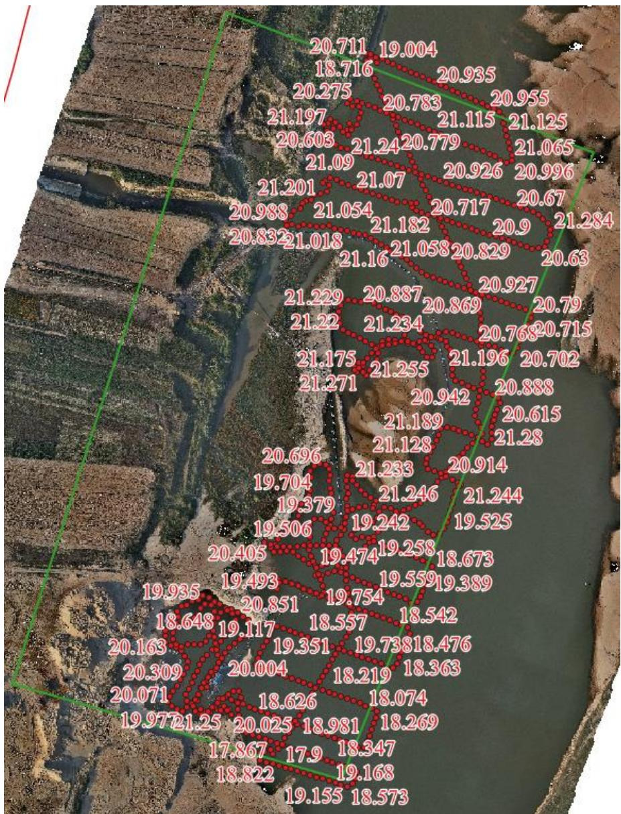

（1）现场监测 通过实地查看，临时堆砂场仍有大量砂石未转运，堆砂高度有所降低但依旧超4 米，三艘采砂船搁浅在河道内未撤离，抽砂管道漂浮在河面未撤离。  图 5.6-9 作业区临时堆砂未清运出场  图 5.6-10 作业船只搁浅在河道内 # （2）无人机航测 采砂监管测量人员对固始县种子场采区进行了无人机航空摄影测量，经评估分析，未发现超范围开采情况，主河槽内区左岸河道管理范围内有一定规模堆砂侵占河道，应及时转运。  图 5.6-11 固始县种子场砂场可采区无人机正射影像 # （3）无人船水下测量 根据批复文件和2023年度实施方案，开采后控制高程为19.70-19.9m，通过无人船单波束声呐测量采区水下地形，测量成果显示开采后深度总体符合年度实施方案要求，部分提砂作业区生态修复不到位，主要位于种子采区东南角附近，后续应加强提砂作业区管理。  图 5.6-12 固始县种子场砂场可采区无人船水下测量成果
