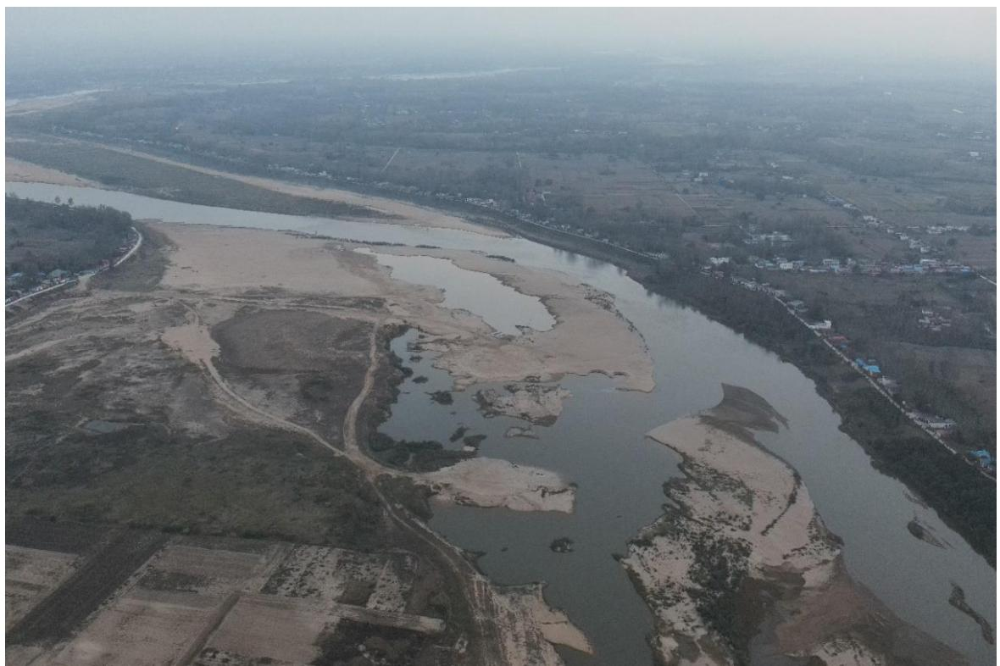
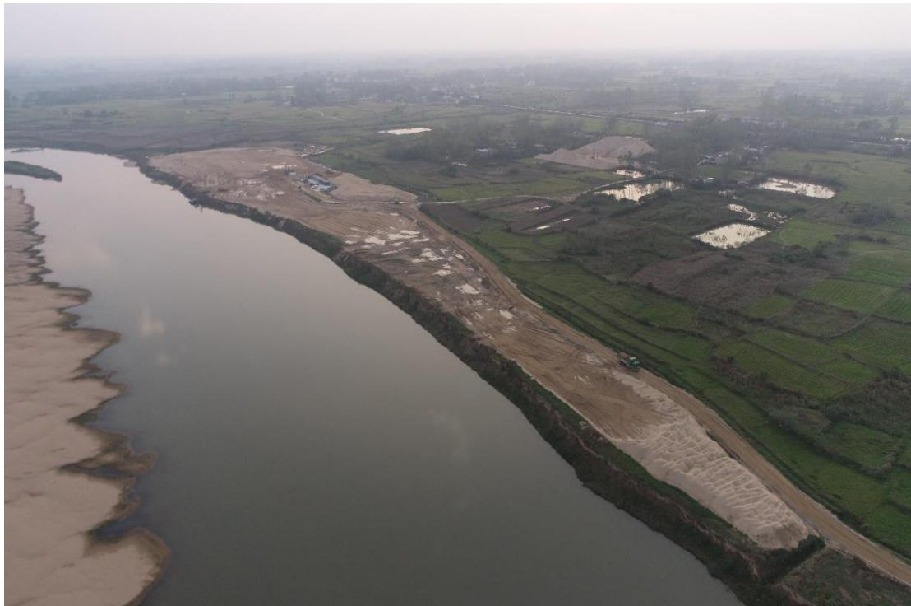
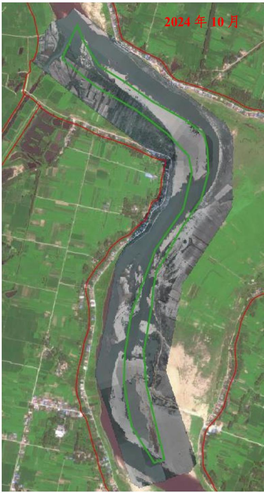
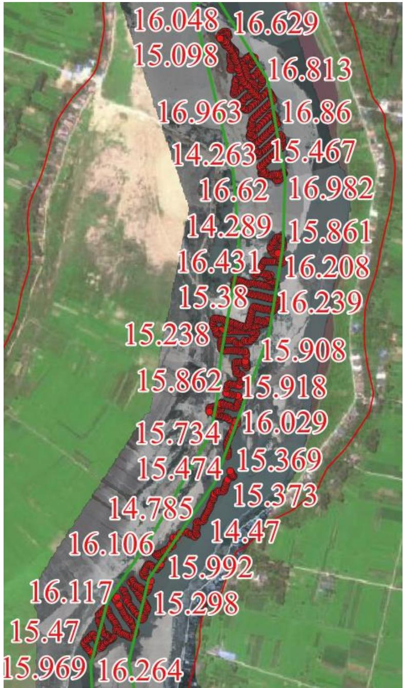

（1）现场监测 通过实地查看，童庙采点采区平整修复基本到位，采区河滩岸线不平顺，后续开采应加强统一系统管理，兼顾生态效益与经济效益，将前期开采形成的破碎河滩纳入年度采区进行修复性开采。老李集采点临时堆砂场剩余小规模堆砂正在转运中，大批量堆砂已经基本完成转运，堆砂码头平整修复基本到位。  图 5.6-13 童庙采点无人机照片  图 5.6-14 老李集采区作业现场照片 # （2）无人机航测 采砂监管测量人员对固始县童庙-老李集可采区进行了无人机航空摄影测量，经评估分析，未发现超范围开采情况，临时堆砂点未封闭，有废弃料砂堆堆砌，岸线崎岖不平，生态修复有待进一步提升。  图 5.6-15 固始县童庙-老李集可采区无人机正射影像 # （3）无人船水下测量 根据批复文件和2023年度实施方案，开采后控制高程为21.20-21.90m，通过无人船单波束声呐测量采区水下地形，测量成果显示开采上下游采点采后平均河底高程均低于开采控制高程，存在超深度开采问题，平均超采 深度 5 米左右。采后高程最低点位于河道上游童庙采点。  图 5.6-16 固始县史童庙-老李集可采区无人船水下测量成果
