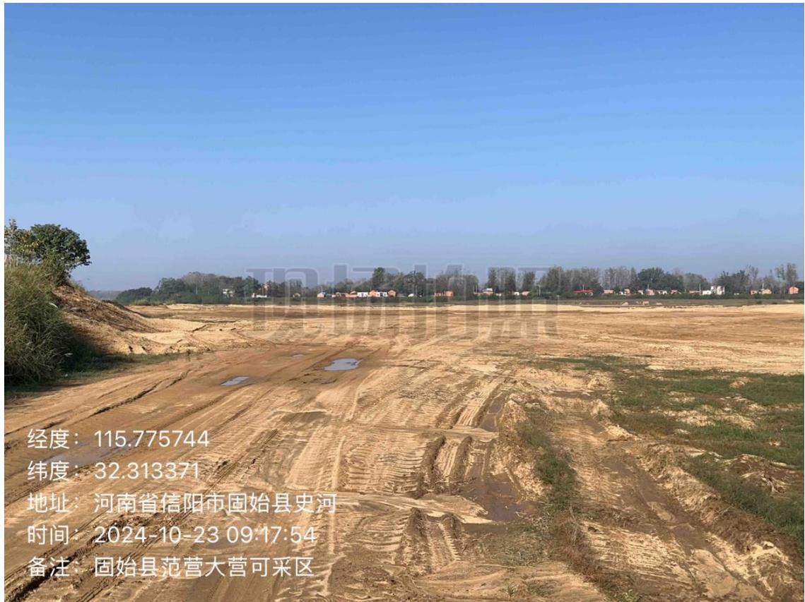
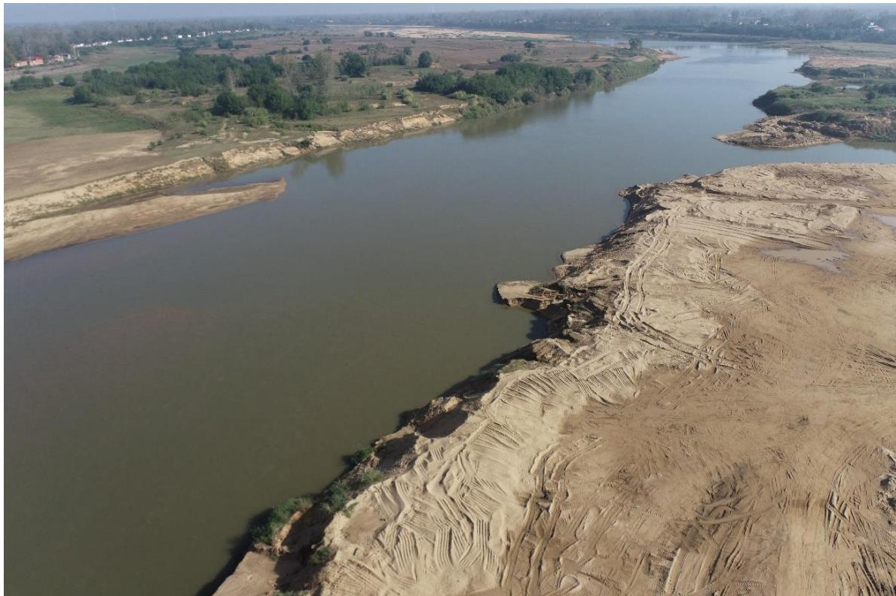
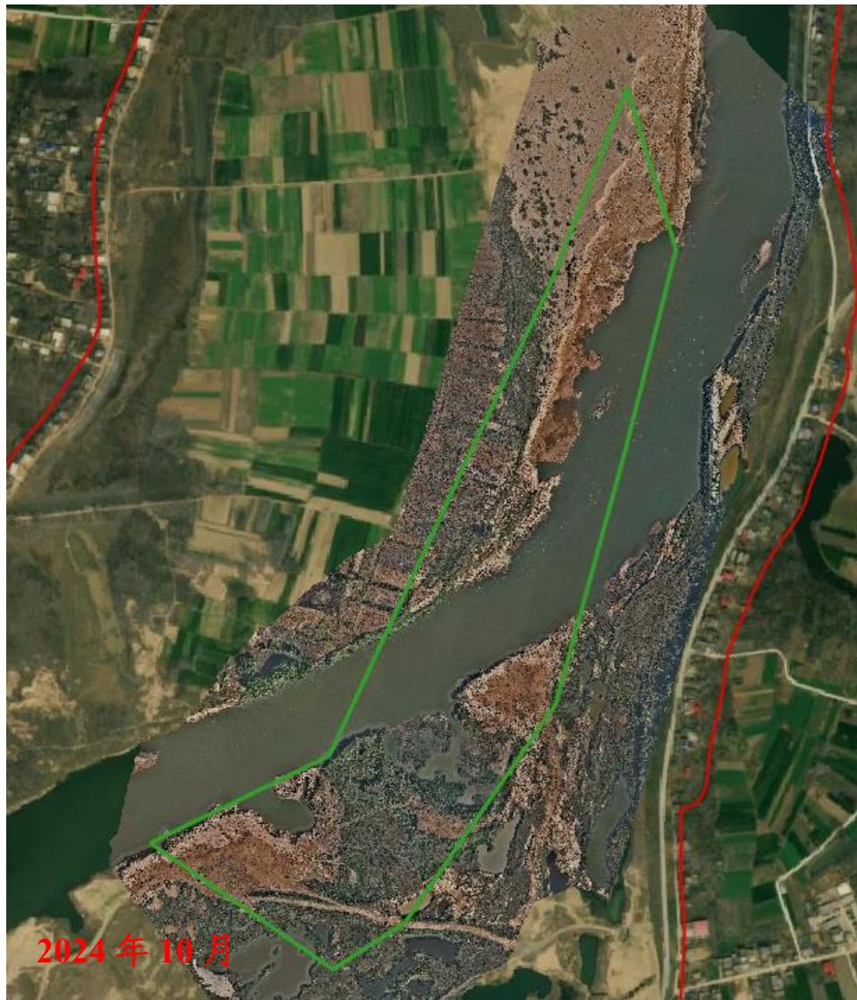
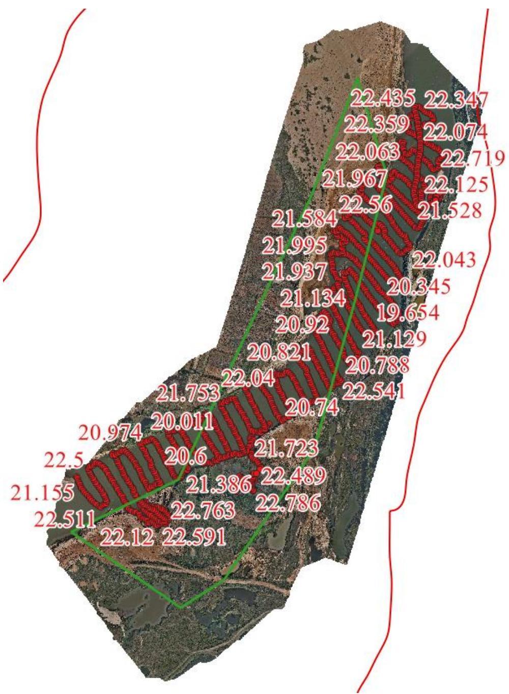

（1）现场监测 通过实地查看，临时堆砂已完成转运，场地平整修复基本到位。  图 5.6-17 大营-范营采区现场照片  图 5.6-188 大营-范营采区现场照片 # （2）无人机航测 采砂监管测量人员对固始县大营-范营可采区区域进行了无人机航空摄影测量，经评估分析，未发现超范围开采情况。现场平复修整基本到位。  图 5.6-19 固始县大营-范营可采区无人机正射影像 # （3）无人船水下测量 根据批复文件和2023年度实施方案，开采后控制高程为22.4-22.6m，通过无人船单波束声呐测量采区水下地形，测量成果显示该采区开采深度基本符合年度实施方案要求，部分提砂作业区存在修复不到位问题，后续开采应加强对提砂作业区的管理。  图 5.6-20 固始县大营-范营采区可采区无人船水下测量成果
