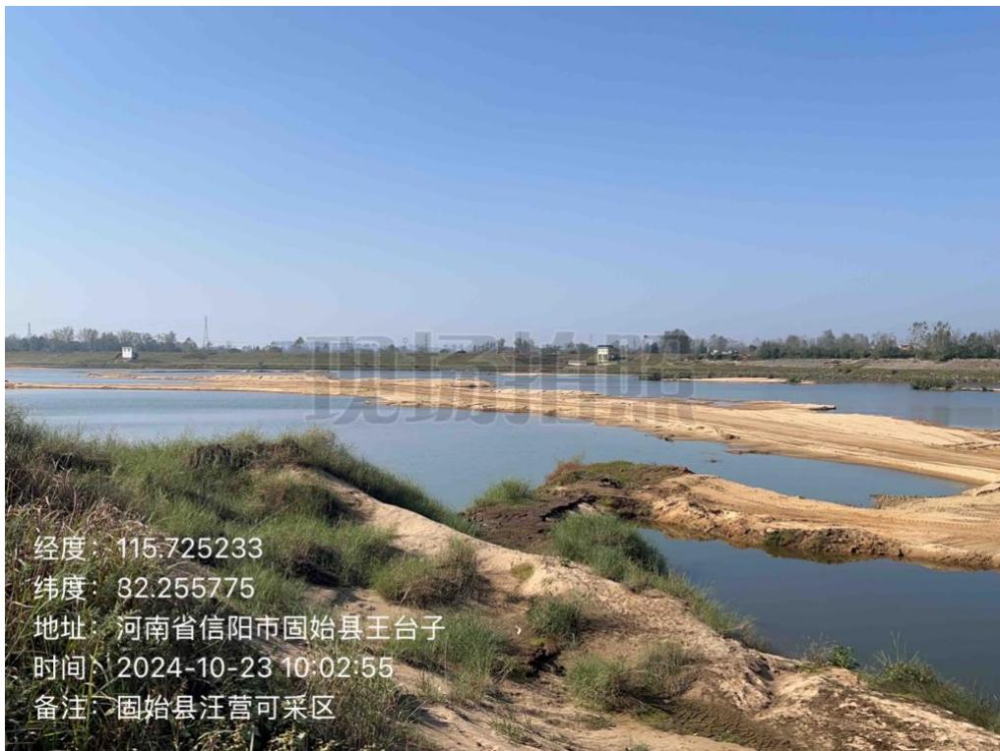
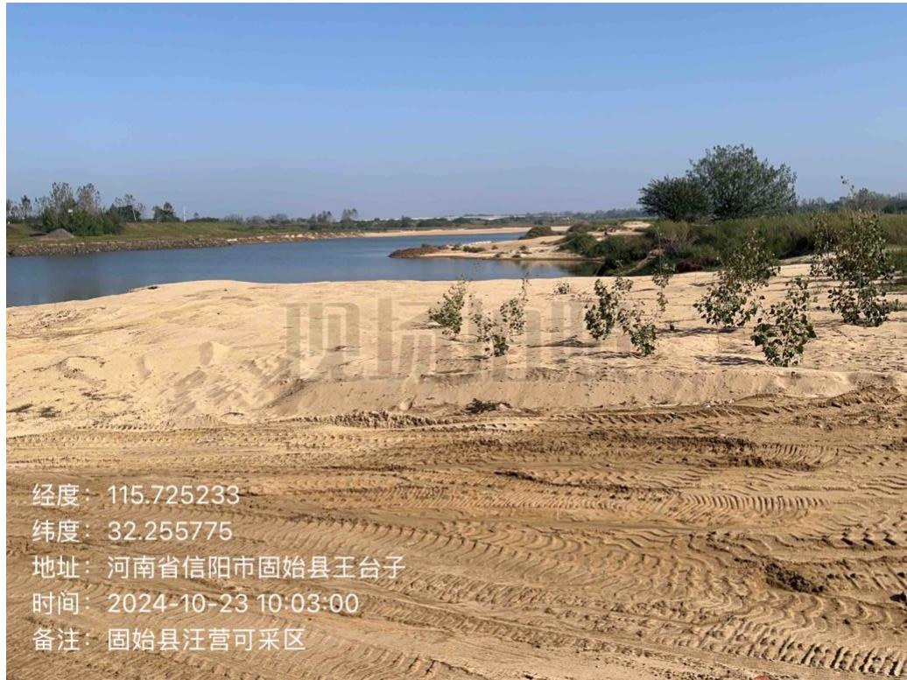
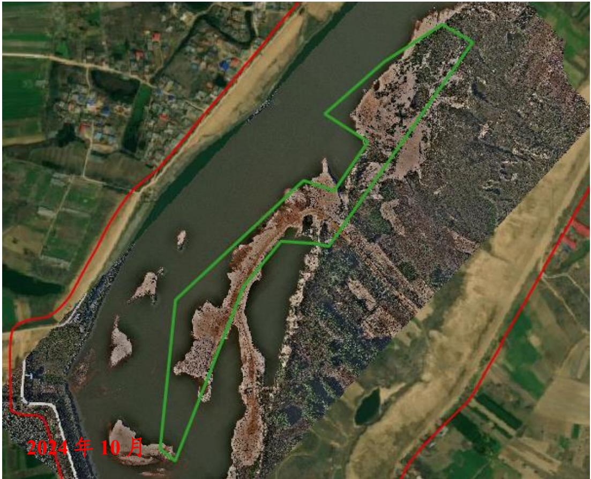
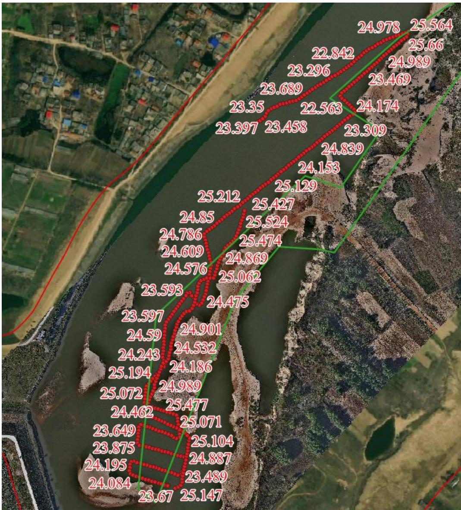

（1）现场监测 通过实地查看，采区作业区域完成平整，生态修复基本到位。  图 5.6-21 采区现场情况  图 5.6-22 采区生态修复标准不高 # （2）无人机航测 采砂监管测量人员对固始县汪营可采区区域进行了无人机航空摄影测量，经评估分析，采砂活动主要位于采区中游和下游，未发现超范围开采情况。但现场生态修复标准不高，现场坑洼不平堆砂平复不到位。  图 5.6-23 固始县汪营可采区无人机正射影像 # （3）无人船水下测量 根据批复文件和2023年度实施方案，开采后控制高程为24.65-24.95m，通过无人船单波束声呐测量采区水下地形，测量成果显示该采区开采深度基本符合年度实施方案要求，采区下游局部区域存在提砂作业区修复不到位问题。  图 5.6-24固始县汪营可采区无人船水下测量成果
