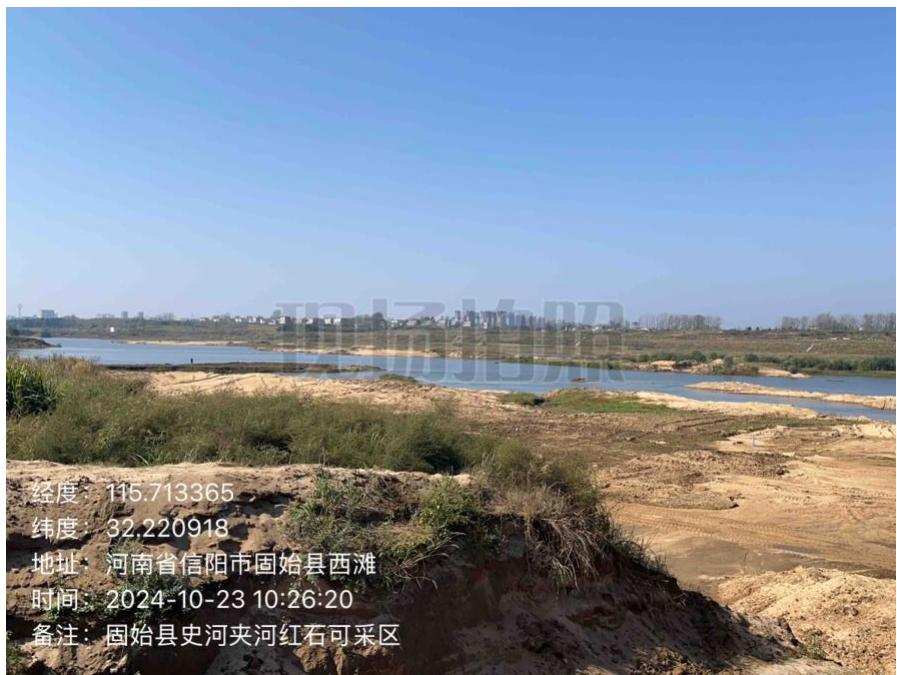
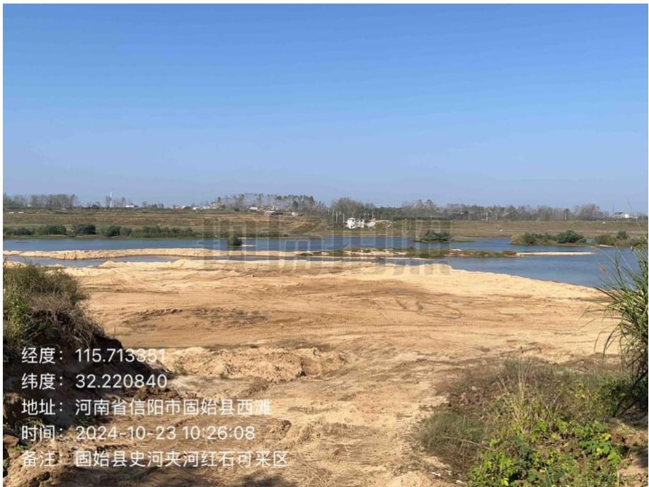
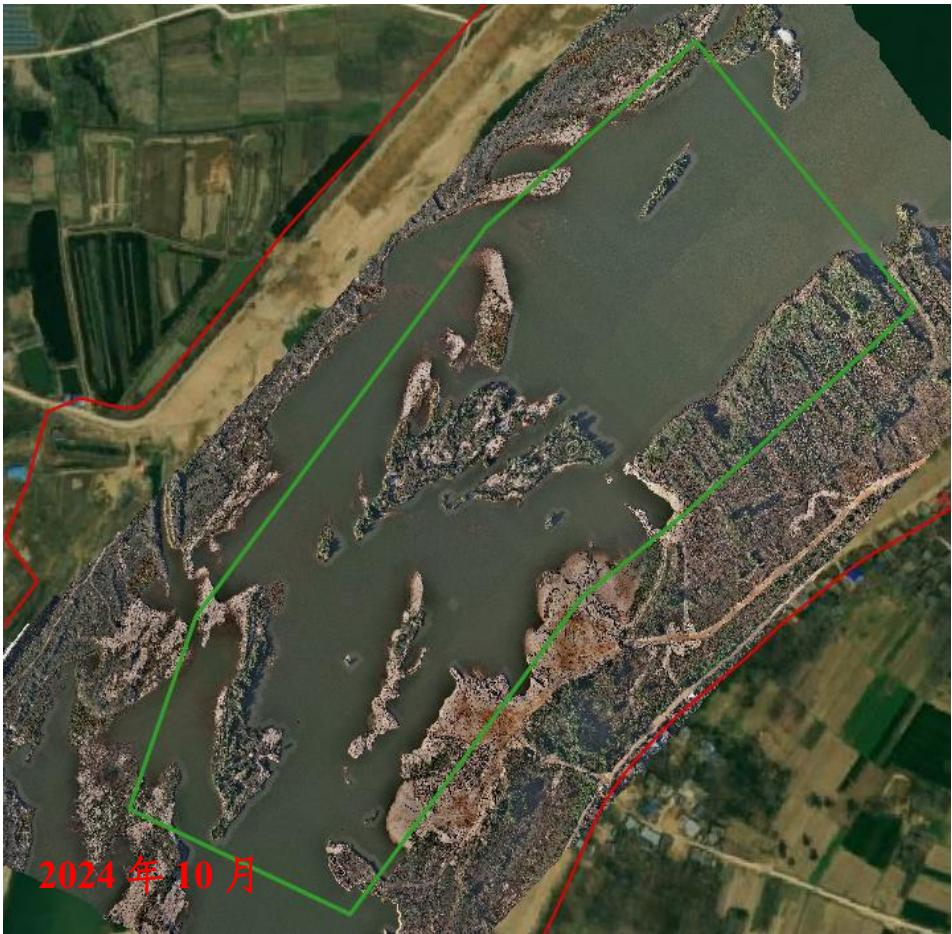
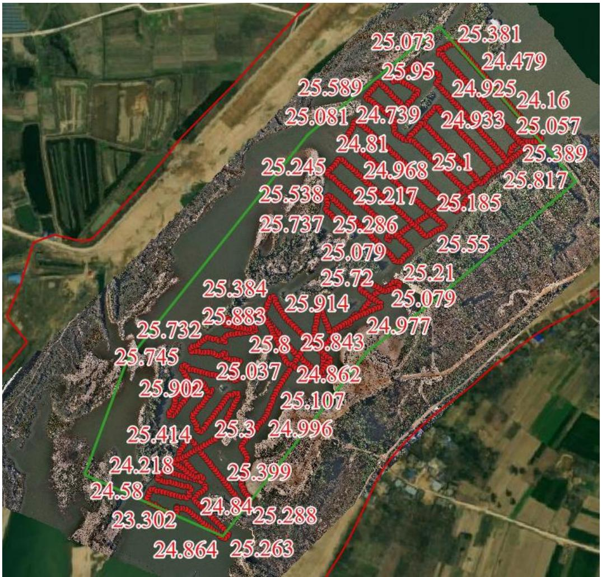

（1）现场监测 通过实地查看，采区场地完成平整，生态修复基本到位。  图 5.6-25 采区现场照片  图 5.6-26 采区提砂作业区完成平整修复 # （2）无人机航测 采砂监管测量人员对固始县夹河-红石可采区进行了无人机航空摄影测量，经评估分析，采砂活动主要位于采区中游和下游，未发现超范围开采情况，主河槽内多处凸起砂包，后期施工过程中应加强对该问题的处理，而且未高标准平复堆砂，生态修复有待进一步提升。  图 5.6-27 固始县夹河-红石可采区无人机正射影像 # （3）无人船水下测量 根据批复文件和2023年度实施方案，开采后控制高程为 $2 5 . 8 – 2 6 . 0 \mathrm { m }$ ，通过无人船单波束声呐测量采区水下地形，测量成果显示该采区采后平均河底高程高于控制高程，开采深度基本满足批复要求。  图 5.6-28 固始县夹河-红石可采区无人船水下测量成果
