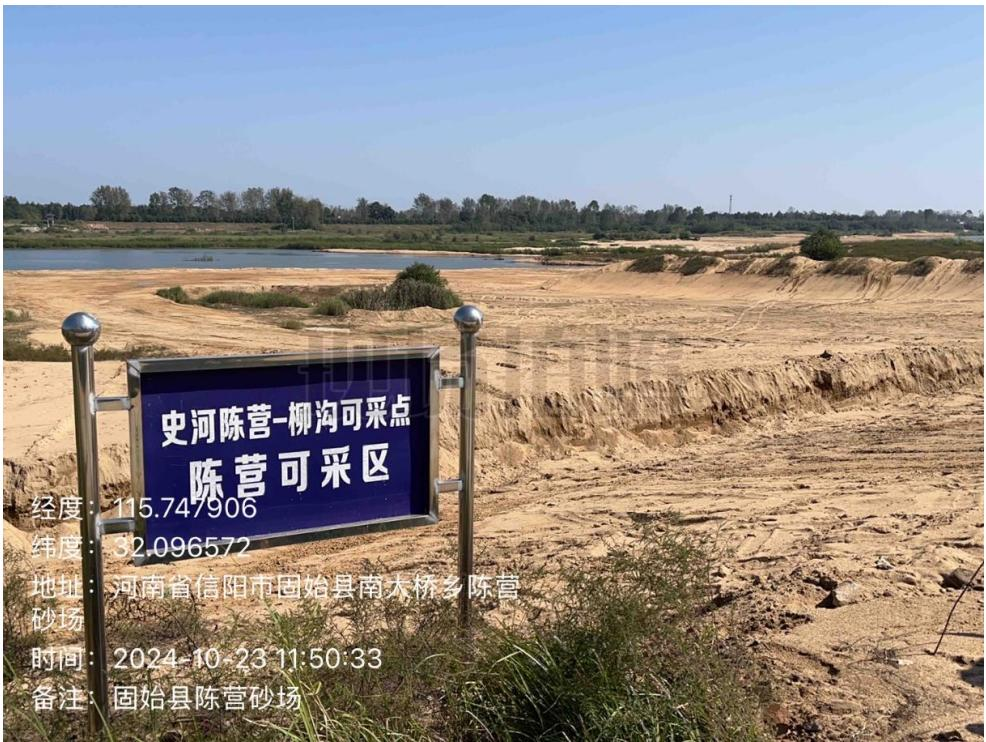
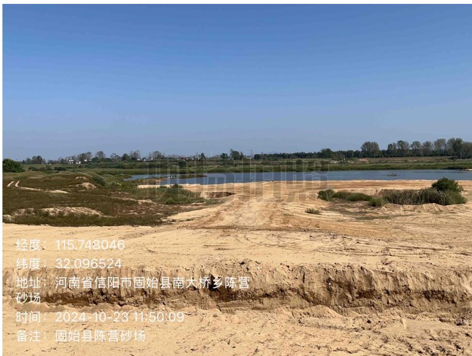
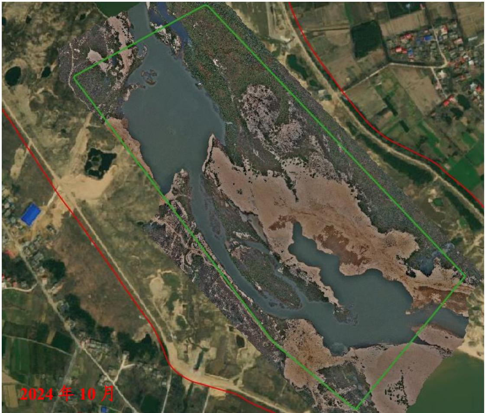
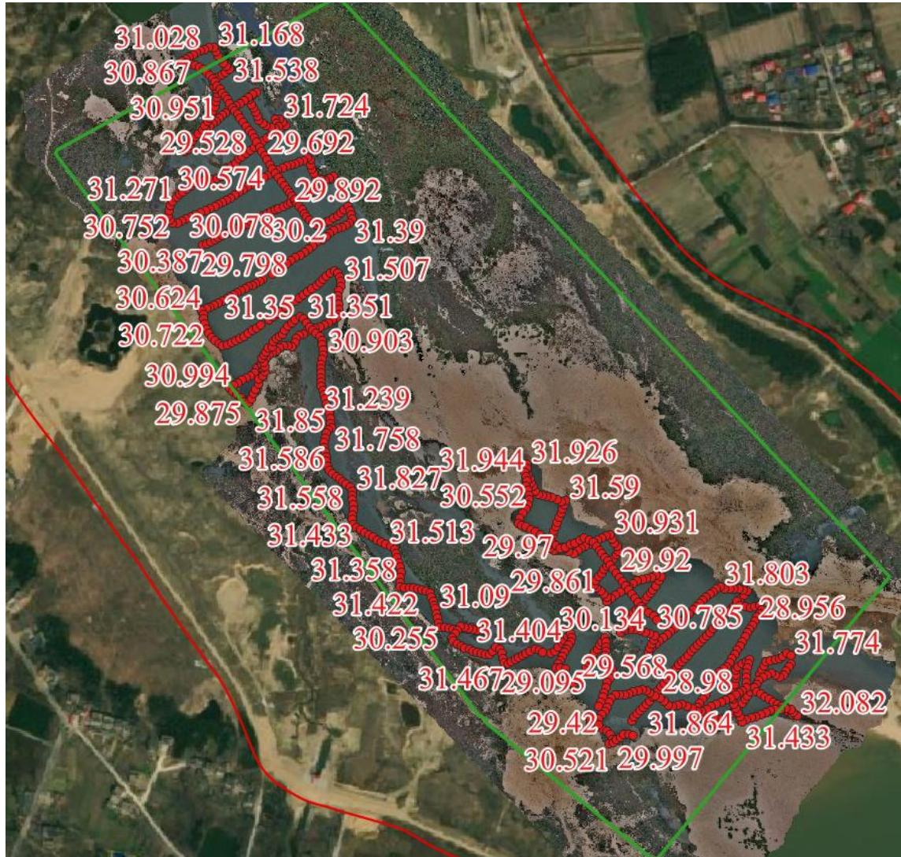

（1）现场监测 通过实地查看，临时堆砂已转运，堆砂码头平整修复基本到位。   图 5.6-29 采区现场照片 图 5.6-30 采区现场照片 # （2）无人机航测 采砂监管测量人员对固始县陈营-柳沟采区进行了无人机航空摄影测量，经评估分析，经评估分析，采砂活动主要位于采区上游和下游，未发现超范围开采情况，采区沟壑不平现场坑洼堆砂平复不到位，生态修复有待进一步提升。  图 5.6-31 固始县陈营-柳沟采区无人机正射影像 # （3）无人船水下测量 根据批复文件和2023年度实施方案，开采后控制高程为32.7-33.1m，通过无人船单波束声呐测量采区水下地形，测量成果显示开采区域采后平均河底高程略低于开采控制高程，开采深度基本符合年度实施方案要求。采区下游存在提砂作业区修复不到位问题，需进一步加强管理。  图 5.6-32 固始县陈营-柳沟采区无人船水下测量成果
