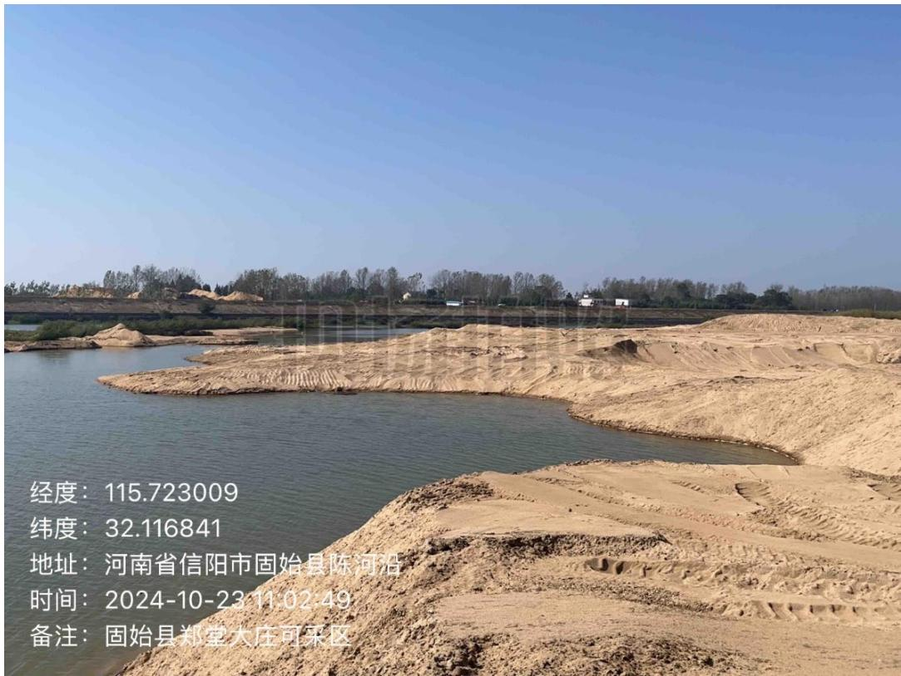
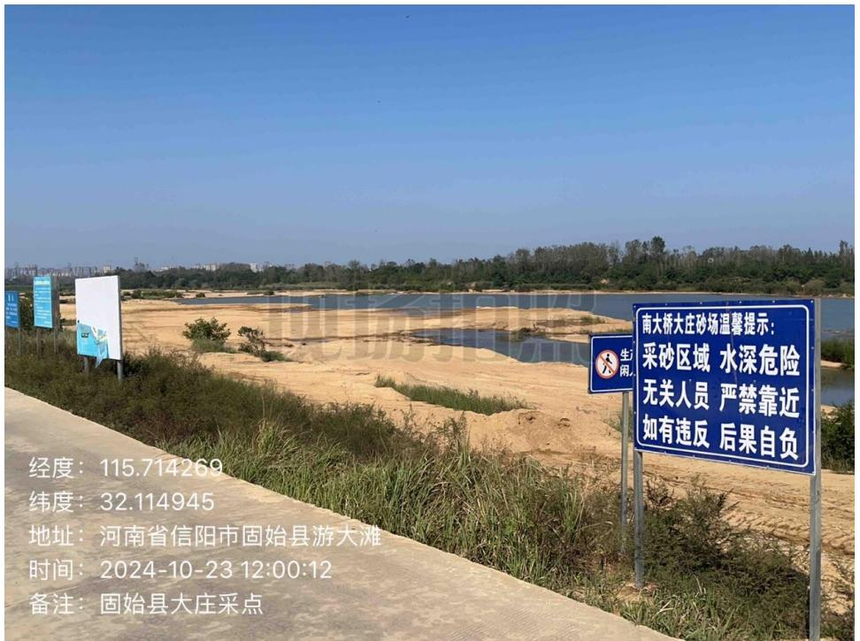
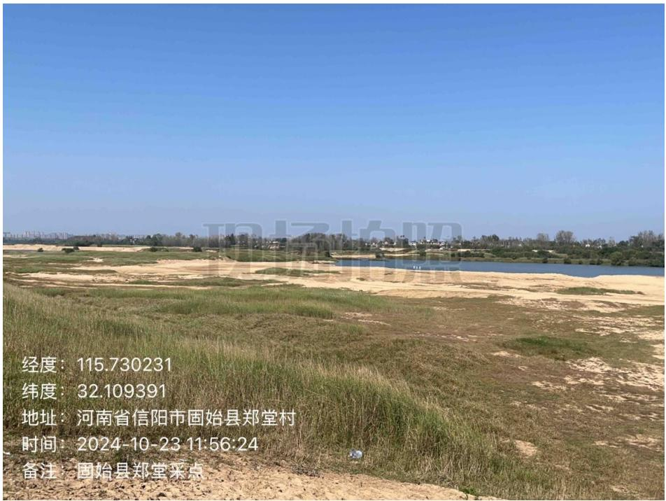
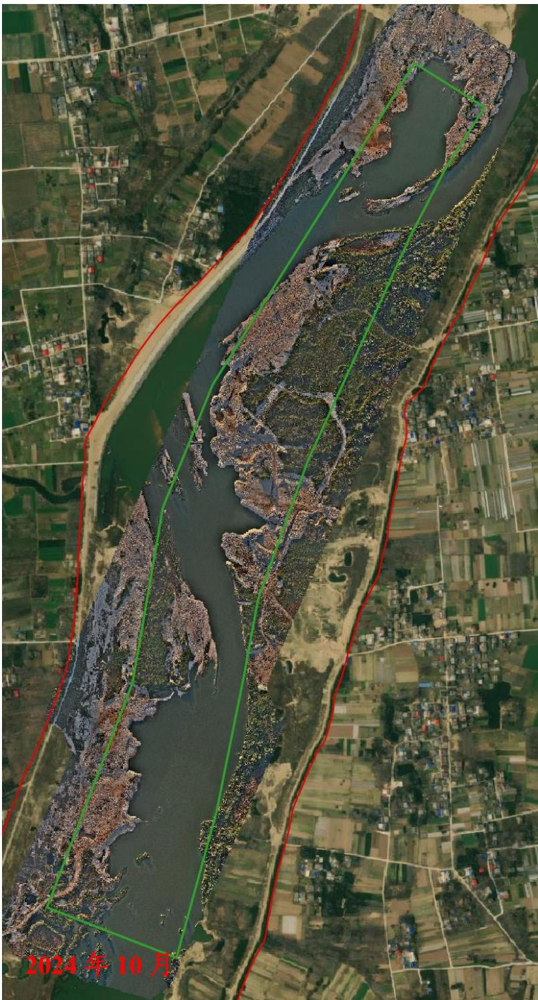
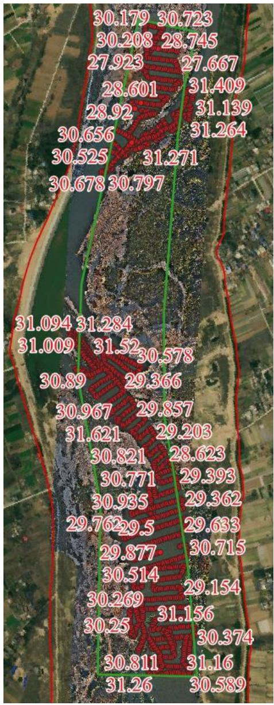

（1）现场监测 通过实地查看，五河采点堆砂已基本完成转运，采区生态修复不到位，采区坑洼不平；大庄及郑堂采点临时堆砂已转运，生态修复基本到位。  图 5.6-33 五河采点现场照片  图 5.6-34 大庄采点现场照片  图 5.6-35 郑堂采点现场照片 # （2）无人机航测 采砂监管测量人员对固始县郑堂-大庄采区进行了无人机航空摄影测量，经评估分析，未发现超范围开采情况，开采活动主要位于采区上游和下游，主河槽内多处凸起砂包，岸线不平顺未修复，现场生态修复需进一 步加强。  图 5.6-36 固始县郑堂-大庄采区无人机正射影像 # （3）无人船水下测量 根据批复文件和2023年度实施方案，开采后控制高程为32.1-32.6m，通过无人船单波束声呐测量采区水下地形，测量成果显示采区采后河底平 均高程略低于开采控制高程，开采深度基本符合年度实施方案要求。郑堂、五河采点提砂作业区修复不到位，后续需进一步加强管理。  图 5.6-37 固始县黎郑堂-大庄采区水下测量成果
