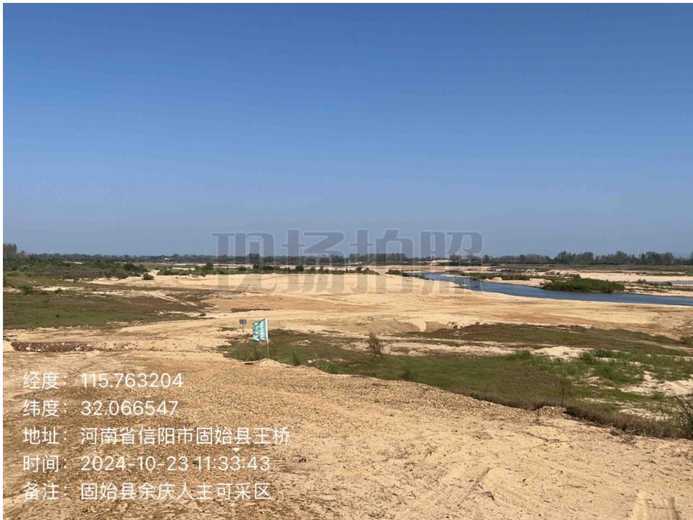
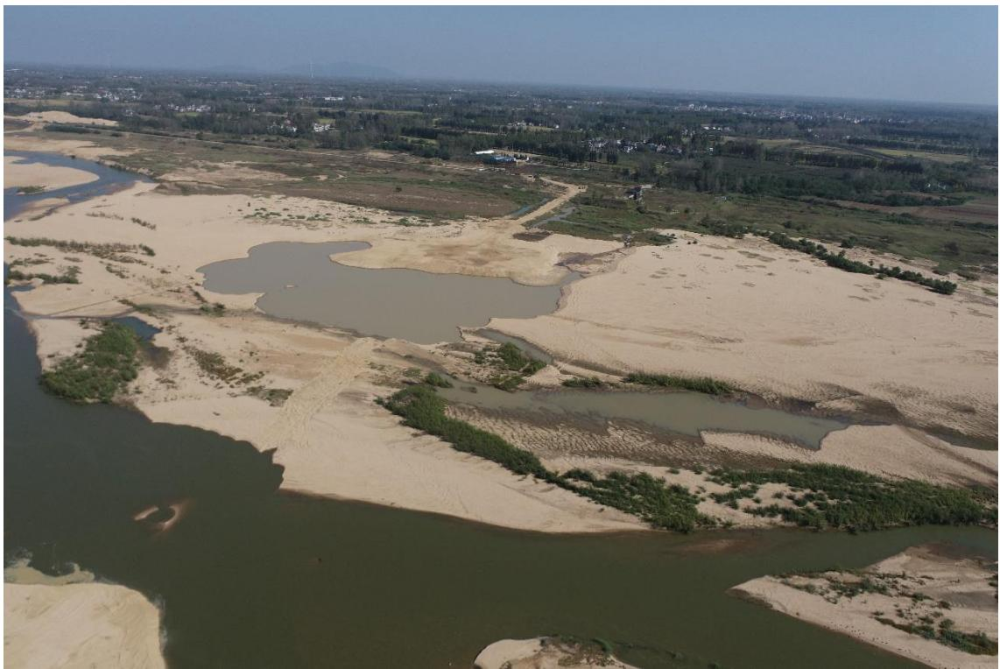
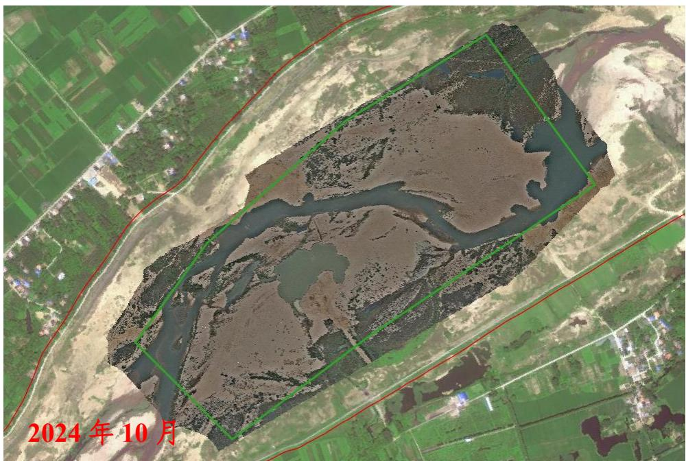
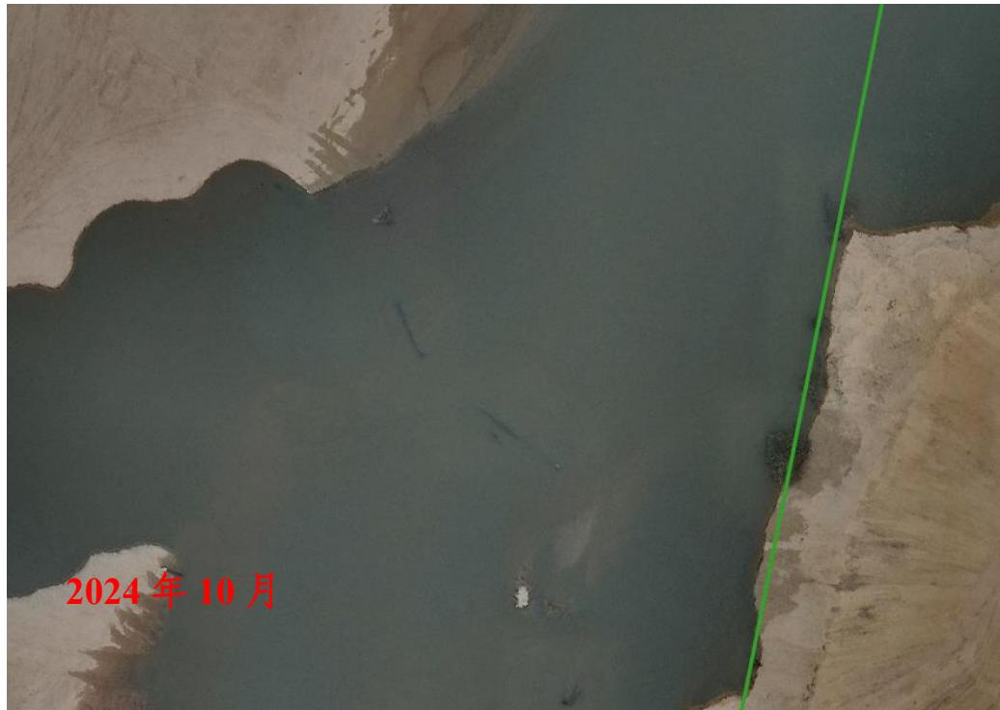
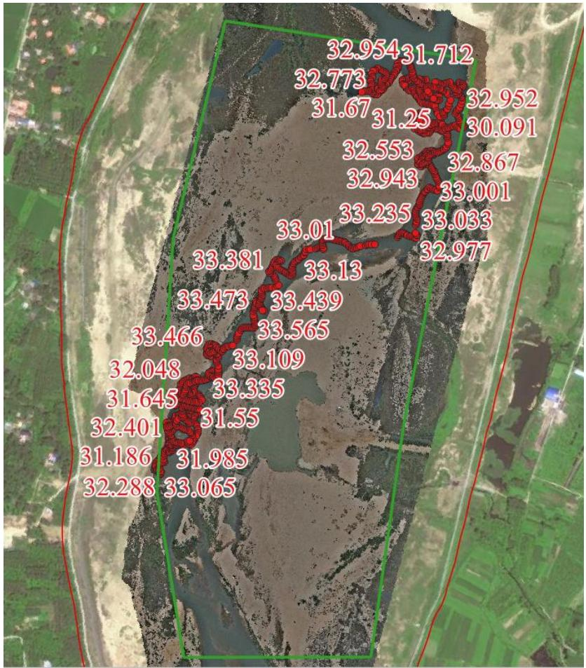

（1）现场监测 通过实地查看，临时堆砂已转运至储砂场，场地完成平整修复。  图 5.6-38 采区现场照片  图 5.6-39 余庆采区无人机照片 # （2）无人机航测 采砂监管测量人员对固始县余庆-人主采区区域进行了无人机航空摄影测量，经评估分析，未发现超范围开采情况。开采结束后采砂物料遗留在采区河道，开采结束后应进一步加强设备物料管理。  图 5.6-40 固始县余庆-人主采区无人机正射影像  图 5.6-41采砂作业物料未清运出河道 # （3）无人船水下测量 根据批复文件和2023年度实施方案，开采后控制高程为34.8-35.1m，通过无人船单波束声呐测量采区水下地形，测量成果显示开采深度基本符合年度实施方案要求，存在局部提砂作业区修复不到位问题，需后续进一步加强管理。  图 5.6-42 固始县余庆-人主采区无人船水下测量成果
