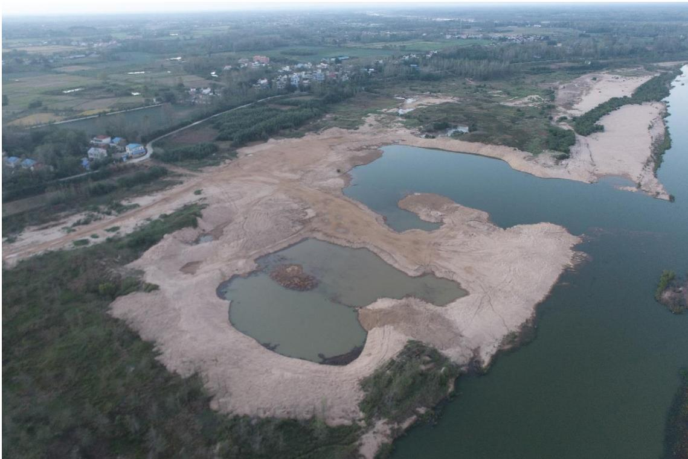
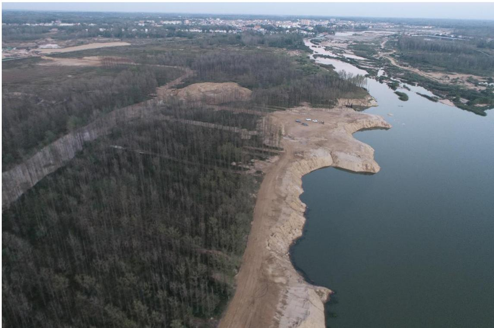
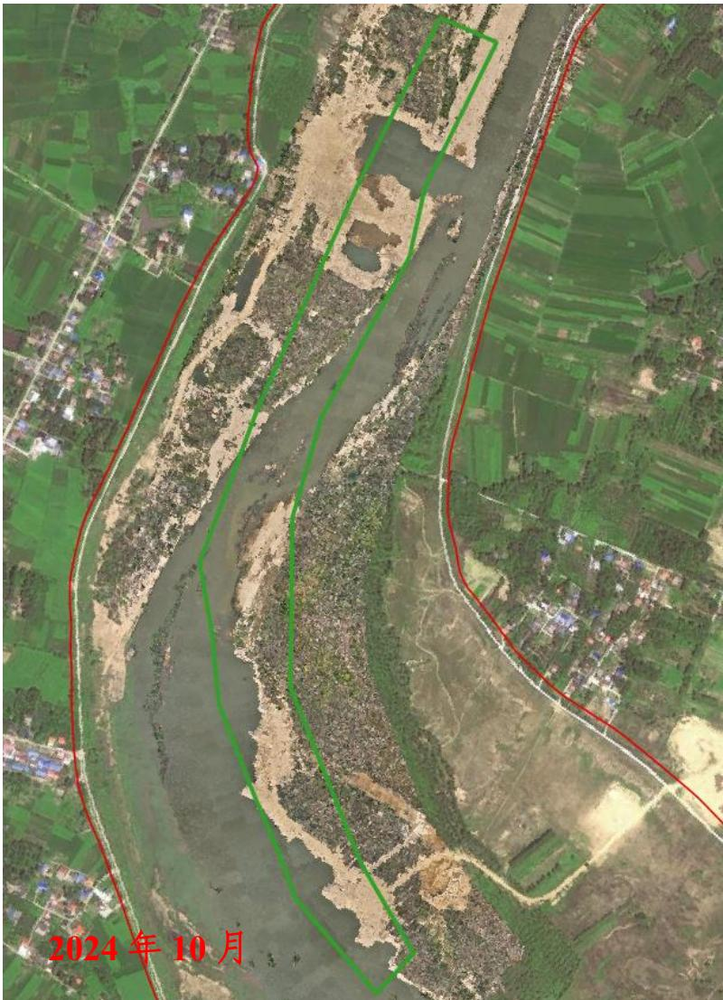
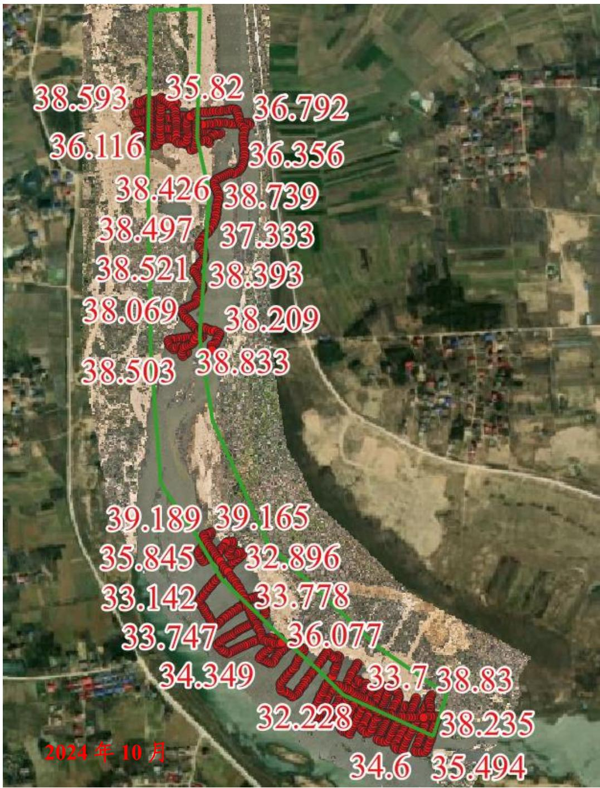

（1）现场监测 通过实地查看，采区临时堆砂已转运，场地平整生态修复基本到位。  图 5.6-43 采区现场照片  图 5.6-44 采区现场照片 # （2）无人机航测 采砂监管测量人员对南元-祝家楼区域进行了无人机航空摄影测量， 经评估分析，未发现超范围开采情况，岸线边坡陡立，生态修复标准有待进一步提升。  图 5.6-45 固始县南元-祝家楼可采区域无人机正射影像 # （3）无人船水下测量 根据批复文件和2023年度实施方案，开采后控制高程为38.80-39.10m，通过无人船单波束声呐测量采区水下地形，测量成果显示采区下游采点开展深度总体满足年度实施方案要求，局部提砂作业区修复不到位；上游采点平均开采深度低于最低开采控制深度，平均超深约 4 米。  图 5.6-46 固始县南元-祝家楼可采区域无人船水下测量成果
