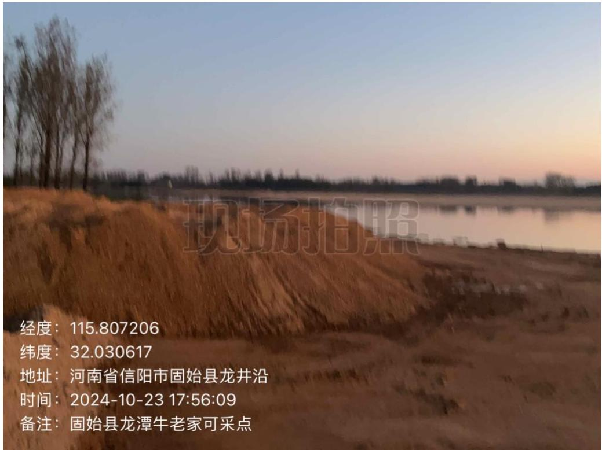
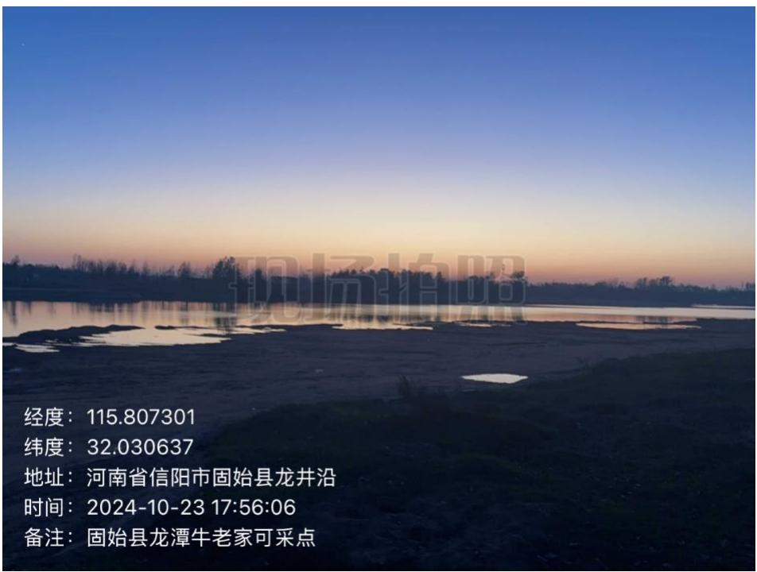
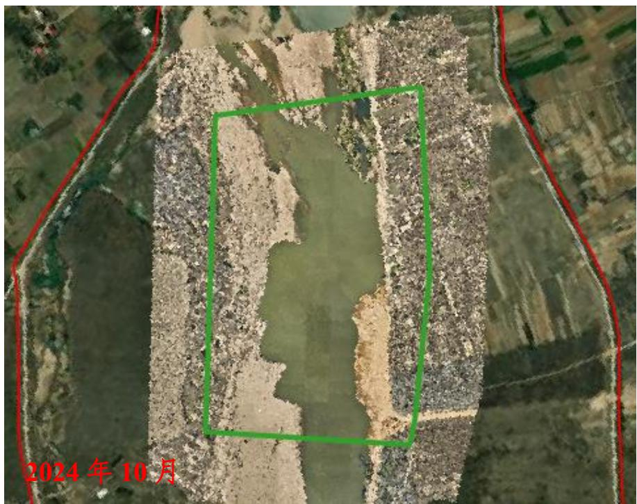
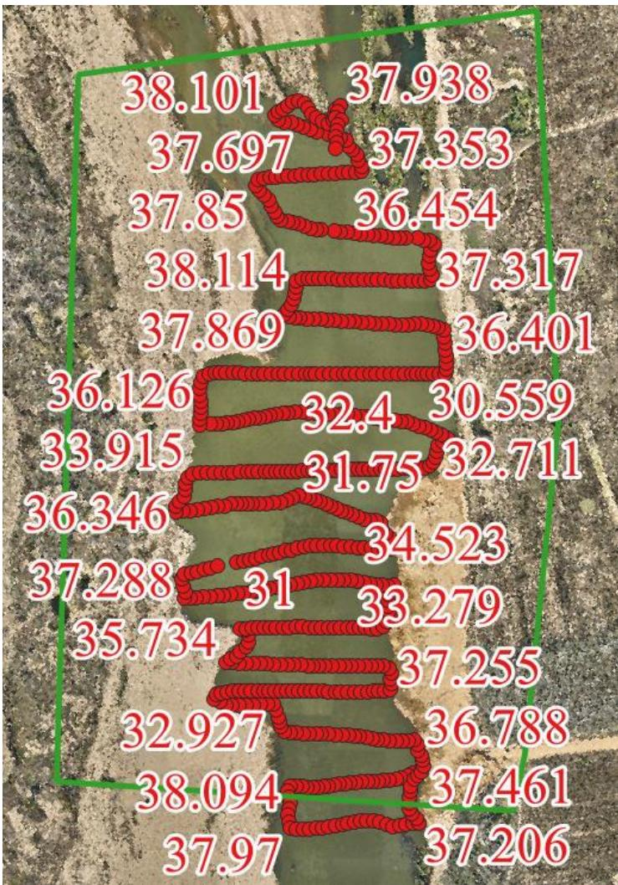

（1）现场监测 通过实地查看，采区内临时堆砂已转运，场地基本修复平整，较汛前有了很大改善提升，小规模河石未转运。  图 5.6-47 采区现场照片  图 5.6-48 采区靠岸停放船只 # （2）无人机航测 采砂监管测量人员对牛老家-龙潭采区区域进行了无人机航空摄影测量，经评估分析，未发现超范围开采情况，开采区现场生态修复基本到位。  图 5.6-49 固始县牛老家-龙潭采区无人机正射影像 # （3）无人船水下测量 根据批复文件和2023年度实施方案，开采后控制高程为36.7-37.1m，通过无人船单波束声呐测量采区水下地形，测量成果显示开采大部分区域采后平均河底高程高于开采控制高程，开采深度符合年度实施方案要求,但存在部分提砂作业区修复不到位问题，需进一步加强管理。  图 5.6-50 固始县牛老家-龙潭采区无人船水下测量成果
