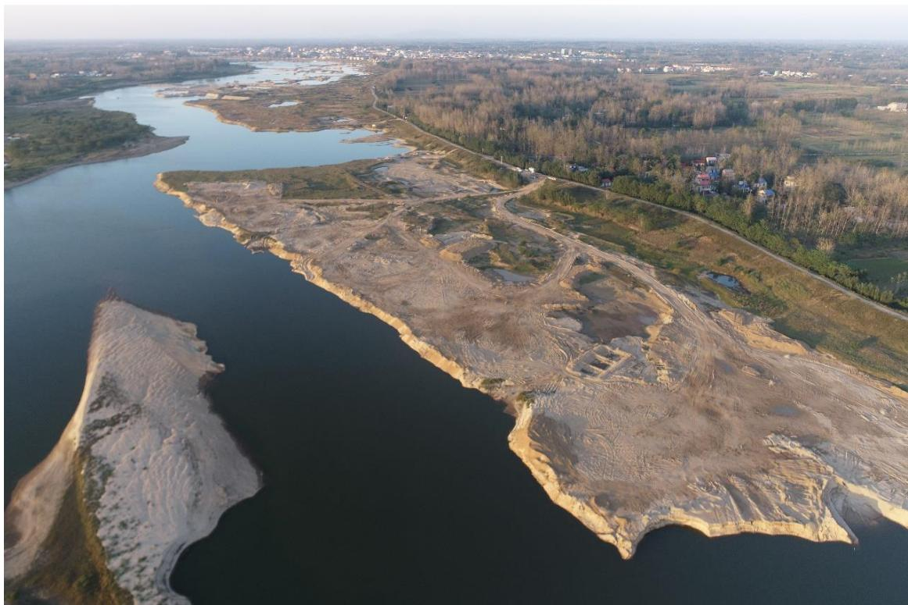
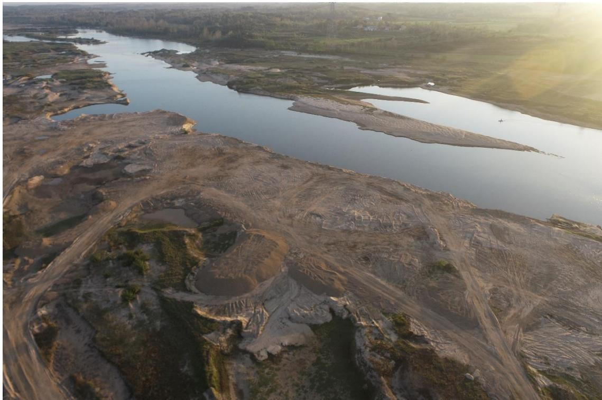
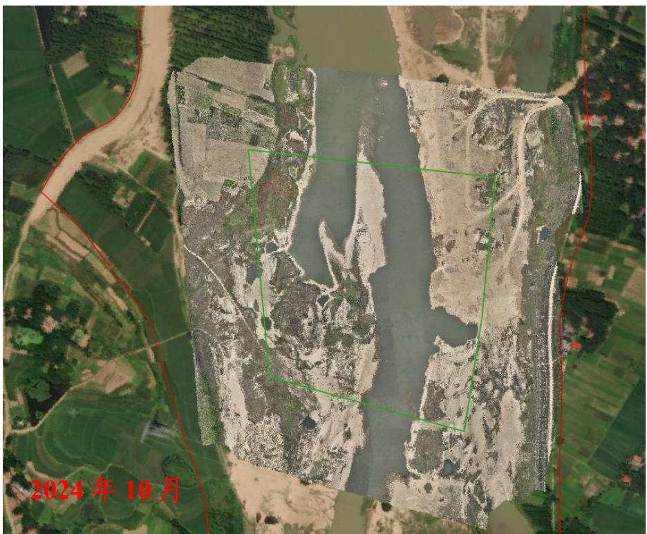
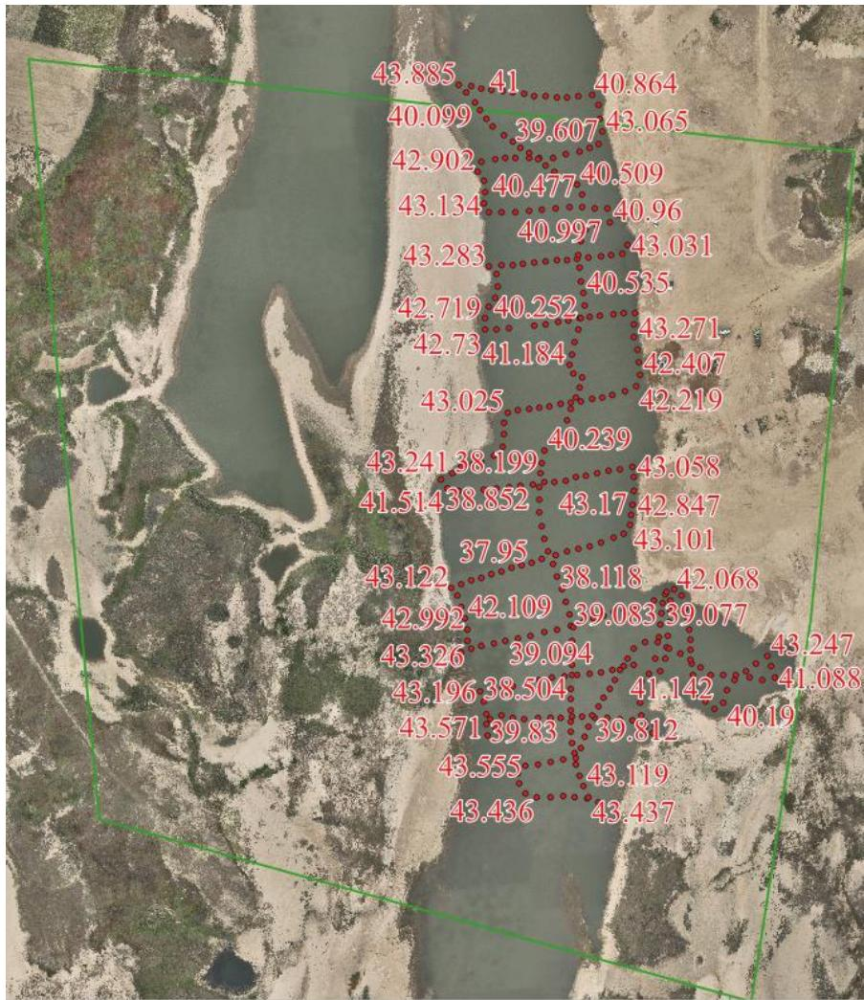

（1）现场监测 通过实地查看，临时堆砂场已完成清理，场地完成平整修复，问题整改较为彻底。  图 5.6-51 采区现场照片  图 5.6-52 采区现场照片 # （2）无人机航测 采砂监管测量人员对采区进行了无人机航空摄影测量，经评估分析，未发现超范围开采情况。现场生态修复情况基本良好。  图 5.6-53 固始县毕店可采区无人机正射影像 # （3）无人船水下测量 根据批复文件和2023年度实施方案，开采后控制高程为41.5-41.7m，通过无人船单波束声呐测量采区水下地形，测量成果显示开采大部分区域采后平均河底高程高于开采控制高程，开采深度符合年度实施方案要求。  图 5.6-54 固始县毕店可采区无人船水下测量成果
