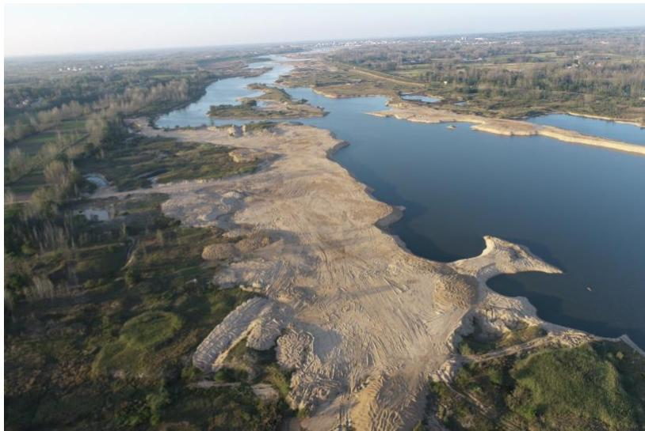
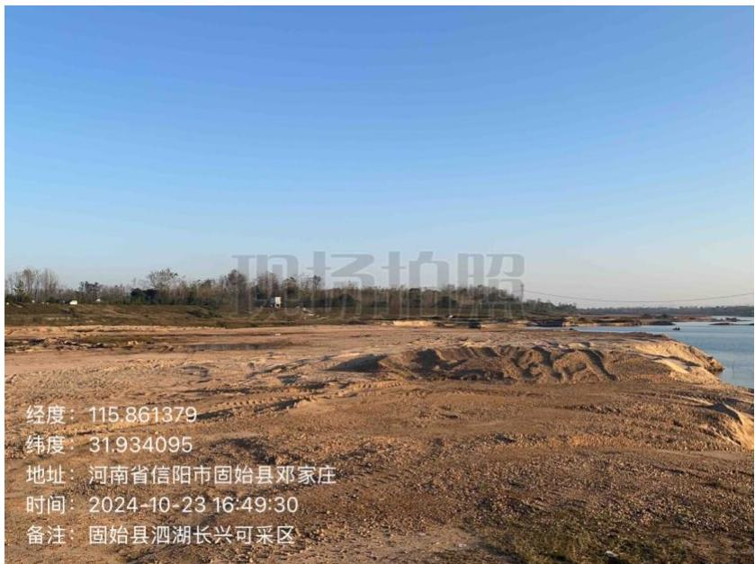
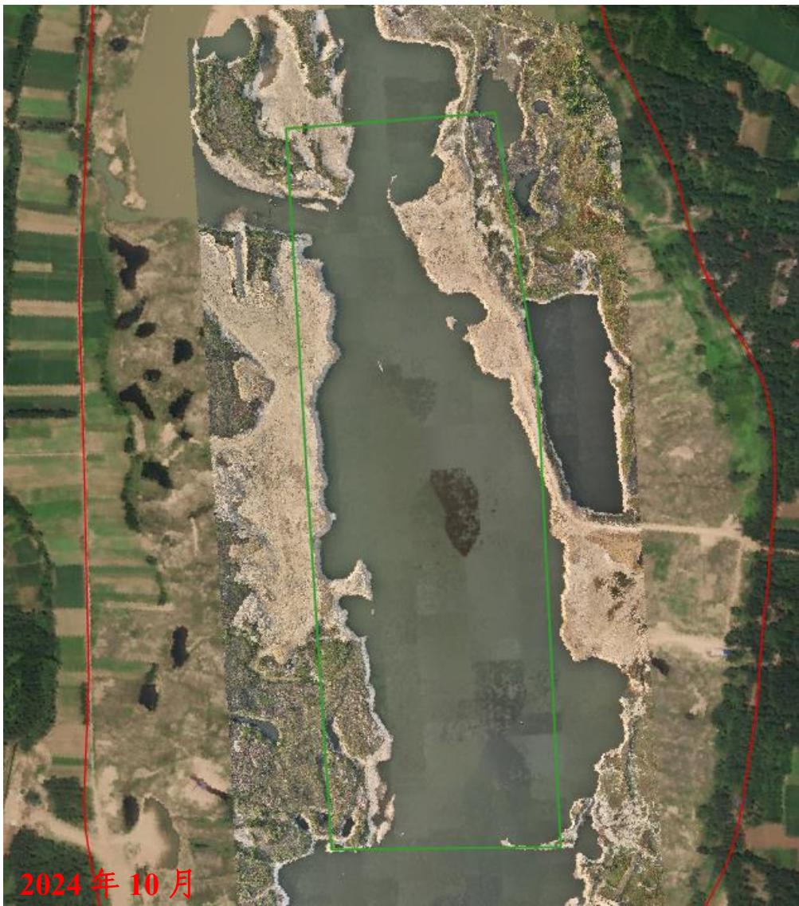
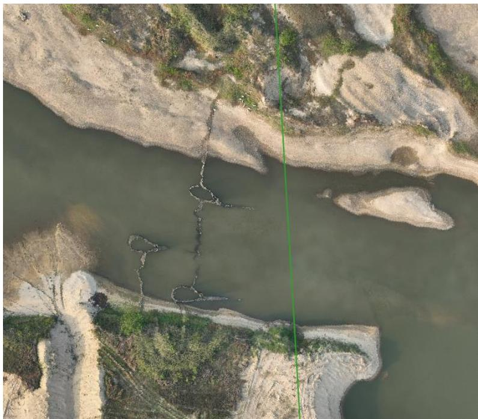
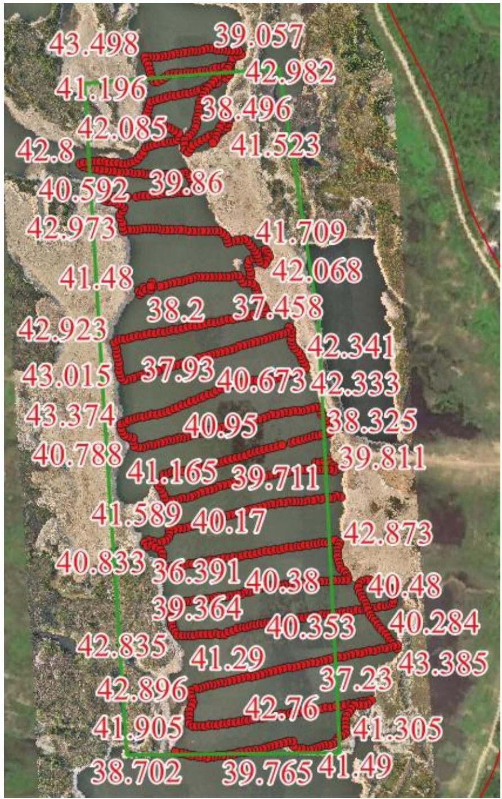

（1）现场监测 通过实地查看，临时堆砂场已完成清理，场地完成平整修复，问题完成整改。  图 5.6-55 采区现场照片  图 5.6-56 采区现场照片 # （2）无人机航测 采砂监管测量人员对固始县泗湖-长兴采区区域进行了无人机航空摄影测量，经评估分析，未发现超范围开采情况，生态修复有待进一步提升。采区上游有一处拦河渔网。  图 5.6-57 固始县泗湖-长兴采区无人机正射影像  图 5.6-58 上游拦河渔网 # （3）无人船水下测量 根据批复文件和2023年度实施方案，开采后控制高程为 $4 2 . 2 – 4 2 . 5 \mathrm { m }$ ，通过无人船单波束声呐测量采区水下地形，测量成果显示开采区域河道中心线附近的采后平均河底高程低于于开采控制高程，开采深度基本符合年度实施方案要求 ,但存在部分区域提砂码头生态修复不到位问题。主要位于提砂作业区附近，需进一步加强管理。  图 5.6-59 固始县泗湖-长兴采区无人船水下测量成果
